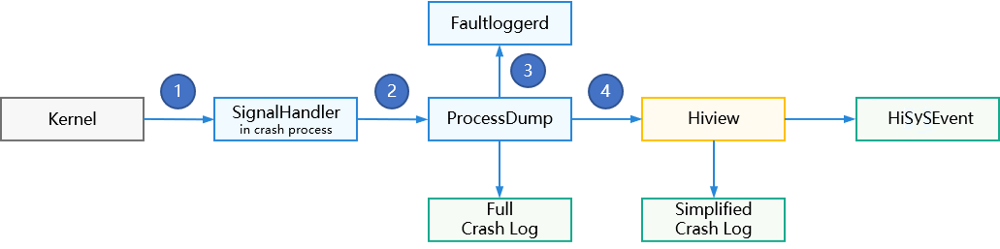

# FaultLogger Development


## Overview


### Function Introduction

FaultLogger is a maintenance and debugging log framework provided by OpenHarmony. It enables unified detection, log collection, log storage, and log reporting for application, ability, and system service process crashes. It is available for the standard system and the Linux kernel-based small system.

FaultLogger is responsible for fault recording of OpenHarmony. It runs on the following two components based on the service object:

- Hiview: serves functional modules at the application layer and native layer. It manages various fault information in the system and provides APIs for modules to query faults.

- Faultloggerd: serves the crash process. It collects information about the abnormal daemon process in C/C++ and obtains call stack information of the process.

The following figure shows the process of handling a process crash based on the FaultLogger service.

  **Figure 1** Process crash handling flowchart



1. After the signal processor is installed, SignalHandler uses the **DFX_SignalHandler** function to detect and respond to the process crash exception signal thrown by the kernel.

2. When detecting a process crash exception signal, SignalHandler forks a child process and runs ProcessDump to dump the stack information of the crashed process and thread.

3. ProcessDump applies to Faultloggerd for a file handle for storing fault logs. After reading the exception stack information, ProcessDump writes the information to the file to generate a complete crash log.

4. After collecting the complete crash log, ProcessDump reports the log to Hiview by using the **AddFaultLog()** API. Hiview generates a simplified crash log and reports a system event through HiSysEvent.

With this design, a small-system with limited resources can obtain logs for locating crash faults as long as Faultloggerd is deployed.


### Use Cases

Faultloggerd provides a lightweight approach for you to locate crash or suspension problems during development and testing.

The following table describes the application scenarios.

  **Table 1** Application scenarios of the Faultloggerd module

| Scenario| Tool| Usage|
| -------- | -------- | -------- |
| Understanding of the function call sequence| DumpCatcher API |  See [Using DumpCatcher APIs to Obtain Call Stack Information](#using-dumpcatcher-apis-to-obtain-call-stack-information).|
| Application suspension or high CPU usage| DumpCatcher Command Tool |  See [Using DumpCatcher Commands to Obtain Call Stack Information](#using-dumpcatcher-commands-to-obtain-call-stack-information).|
| Crash fault location| Crash log and addr2line tool| For details, see [Locating Faults Based on the Crash Log](#locating-faults-based-on-the-crash-log).|


## Using DumpCatcher APIs to Obtain Call Stack Information


### Available APIs

DumpCatcher can capture the call stack information of the specified process (thread) on OpenHarmony.

  **Table 2** DumpCatcher APIs

| Class| API| Description|
| -------- | -------- | -------- |
| DfxDumpCatcher | bool DumpCatch(const int pid, const int tid, std::string&amp; msg) |   Return value:<br>- **true**: Dumping of stack information is successful. Related information is stored in the msg string object.<br>- **false**: Dumping of stack information has failed.<br>  Input arguments:<br>- **pid**: target process ID.<br>- **tid**: target thread ID. If all threads in the process need to be back traced, set **tid** to **0**.<br>  Output arguments:<br>- **msg**: If back trace is successful, call stack information is returned through **msg**.|
| DfxDumpCatcher | bool DumpCatchMix(const int pid, const int tid, std::string&amp; msg) |   Return value:<br>- **true**: Dumping of stack information is successful. Related information is stored in the msg string object.<br>- **false**: Dumping of stack information has failed.<br>  Input arguments:<br>**pid**: target process ID.<br>- **tid**: target thread ID. If all threads in the process need to be back traced, set **tid** to **0**.<br>  Output arguments:<br>- **msg**: If back trace is successful, hybrid stack information is returned through **msg**.|
| DfxDumpCatcher | bool DumpCatchFd(const int pid, const int tid, std::string&amp; msg, int fd) |   Return value:<br>- **true**: Dumping of stack information is successful. Related information is stored in the msg string object.<br>- **false**: Dumping of stack information has failed.<br>  Input arguments:<br>**pid**: target process ID.<br>- **tid**: target thread ID. If all threads in the process need to be back traced, set **tid** to **0**.<br>- **fd**: handle of the file to be written.<br>  Output parameters:<br>- **msg**: If back trace is successful, call stack information is returned through **msg**.|
| DfxDumpCatcher | bool DumpCatchMultiPid(const std::vector\<int> pidV, std::string&amp; msg) |   Return value:<br>- **true**: Dumping of stack information is successful. Related information is stored in the msg string object.<br>- **false**: Dumping of stack information has failed.<br>  Input arguments:<br>- **pidV**: target process ID list.<br>  Output arguments:<br>- **msg**: If back trace is successful, call stack information is returned through **msg**.|

> **NOTE**
> If the PID that calls this API is different from the target PID, the caller must be the **system** or **root** user.


### How to Develop


You can use DumpCatcher to obtain call stack information for the specified process (thread) of an application. The following uses the **dumpcatcherdemo** module as an example to describe how to use the DumpCatcher APIs to obtain the call stack information.


1. Add the DumpCatcher dependency to the build file. Take /base/hiviewdfx/faultloggerd/example/BUILD.gn as an example. Add the **dump_catcher.h** file path to **include_dirs** and add the required **//base/hiviewdfx/faultloggerd/interfaces/innerkits/dump_catcher:lib_dfx_dump_catcher** module to **deps**.

   ```
   import("//base/hiviewdfx/faultloggerd/faultloggerd.gni")
   import("//build/ohos.gni")

   config("dumpcatcherdemo_config") {
     visibility = [ ":*" ]

     include_dirs = [
       ".",
       "//utils/native/base/include",
       "//base/hiviewdfx/faultloggerd/interfaces/innerkits/dump_catcher/include/",  # Add the path of the dump_catcher header file.
     ]
   }

   ohos_executable("dumpcatcherdemo") {
    sources = [ "dump_catcher_demo.cpp" ]
    configs = [ ":dumpcatcherdemo_config" ]
    deps = [
      "//base/hiviewdfx/faultloggerd/interfaces/innerkits/dump_catcher:lib_dfx_dump_catcher", # Add the DumpCatcher module dependency.
      "//utils/native/base:utils",
    ]
    external_deps = [ "hilog_native:libhilog" ]
    install_enable = true
    part_name = "faultloggerd"
    subsystem_name = "hiviewdfx"
   }
   ```

2. Define the header file. Take **/base/hiviewdfx/faultloggerd/example/dump_catcher_demo.h** as an example. In the sample code, the function of the stack depth test is called to construct a call stack with a specified depth.

   ```
   #ifndef DUMP_CATCHER_DEMO_H
   #define DUMP_CATCHER_DEMO_H

   #include <inttypes.h>

   #define NOINLINE __attribute__((noinline))

   // Define the macro function to automatically generate a function call chain.
   #define GEN_TEST_FUNCTION(FuncNumA, FuncNumB)          \
       __attribute__((noinline)) int TestFunc##FuncNumA() \
       {                                                  \
           return TestFunc##FuncNumB();                   \
       }

   // Call the function of the stack depth test.
   int TestFunc0(void);
   int TestFunc1(void);
   int TestFunc2(void);
   int TestFunc3(void);
   int TestFunc4(void);
   int TestFunc5(void);
   int TestFunc6(void);
   int TestFunc7(void);
   int TestFunc8(void);
   int TestFunc9(void);
   int TestFunc10(void);

   #endif // DUMP_CATCHER_DEMO_H
   ```

3. Call the **DumpCatch** API in the source file. Take **/base/hiviewdfx/faultloggerd/example/dump_catcher_demo.cpp** as an example. Include the **dfx_dump_catcher.h** file, declare the **DfxDumpCatcher** object, use the macro function to construct a function call chain, call the **DumpCatch** method, and pass the required process ID and thread ID of the call stack into this method.

   ```
   #include "dump_catcher_demo.h"

   #include <iostream>
   #include <string>
   #include <unistd.h>
   // Include the dfx_dump_catcher.h file.
   #include "dfx_dump_catcher.h"
   using namespace std;

   NOINLINE int TestFunc10(void)
   {
       OHOS::HiviewDFX::DfxDumpCatcher dumplog;
       string msg = "";
       bool ret = dumplog.DumpCatch(getpid(), gettid(), msg);  // Call the DumpCatch API to obtain the call stack information.
       if (ret) {
           cout << msg << endl;
       }
       return 0;
   }

   // Use the macro function to automatically generate a function call chain.
   GEN_TEST_FUNCTION(0, 1)
   GEN_TEST_FUNCTION(1, 2)
   GEN_TEST_FUNCTION(2, 3)
   GEN_TEST_FUNCTION(3, 4)
   GEN_TEST_FUNCTION(4, 5)
   GEN_TEST_FUNCTION(5, 6)
   GEN_TEST_FUNCTION(6, 7)
   GEN_TEST_FUNCTION(7, 8)
   GEN_TEST_FUNCTION(8, 9)
   GEN_TEST_FUNCTION(9, 10)

   int main(int argc, char *argv[])
   {
       TestFunc0();
       return 0;
   }
   ```


## Using DumpCatcher Commands to Obtain Call Stack Information


### Tool Description

DumpCatcher Command Tool is a command line interface (CLI)-based tool for capturing call stack information on OpenHarmony. It uses the **-p** and **-t** parameters to specify the process and thread. After the command is executed, the thread stack information of the specified process is displayed in the CLI window. By specifying the **-m** parameter, you can also capture the JS and Native hybrid stack information of an application process.

  **Table 3** Usage of the DumpCatcher Command Tool

| Tool| Path| Command| Description|
| -------- | -------- | -------- | -------- |
| dumpcatcher | /system/bin | - dumpcatcher -p [pid]<br>- dumpcatcher -p [pid] -t [tid]<br>- dumpcatcher -m -p [pid]<br>- dumpcatcher -m -p [pid] -t [tid]<br>| **Description:**<br>- **-p [pid]**: prints all thread stack information of the specified process.<br>- **-p [pid] -t [tid]**: prints stack information for the specified thread of the specified process.<br>- **-m -p [pid]**: prints hybrid stack information for all threads of the specified process.<br>- **-m -p [pid] -t [tid]**: prints hybrid stack information for the specified thread of the specified process.<br>**Return value:**<br>If the stack information is parsed successfully, the information is displayed in the standard output. If the stack information fails to be parsed, error information is displayed.|


### Development Example

Print call stack information of the **hiview** process.


```
# ps -ef |grep hiview
hiview         240     1 0 17:01:49 ?     00:00:14 hiview
root          1822  1560 7 20:56:36 pts/0 00:00:00 grep hiview
# dumpcatcher -p 240 -t 240
Result: 0 ( no error )
Timestamp:2017-08-05 20:56:43.000
Pid:240
Uid:1201
Process name:/system/bin/hiview
Tid:240, Name:hiview
#00 pc 00098f8c /system/lib/ld-musl-arm.so.1(ioctl+68)
#01 pc 0000e2a1 /system/lib/chipset-pub-sdk/libipc_single.z.so
#02 pc 0000ed59 /system/lib/chipset-pub-sdk/libipc_single.z.so
#03 pc 0000ee1f /system/lib/chipset-pub-sdk/libipc_single.z.so
#04 pc 0000f745 /system/lib/chipset-pub-sdk/libipc_single.z.so
#05 pc 00037577 /system/bin/hiview
#06 pc 00025973 /system/bin/hiview
#07 pc 000db210 /system/lib/ld-musl-arm.so.1
#08 pc 000258d8 /system/bin/hiview
#09 pc 0002587c /system/bin/hiview
```


## Locating Faults Based on the Crash Log

You can locate faults based on the crash stack logs generated by Faultloggerd. This section describes how to use the addr2line tool to locate a crash fault.

1. Find a program crash or construct a crash.
   For example, insert the following code into your code to trigger an invalid memory access fault (SIGSEGV).


   ```
   NOINLINE int TriggerSegmentFaultException()
   {
       printf("test TriggerSegmentFaultException \n");
       // Forcibly convert the type to construct a crash.
       int *a = (int *)(&RaiseAbort);
       *a = SIGSEGV;
       return 0;
   }
   ```

2. Obtain the crash function call stack log.
   The process generates a temporary log file in the** /data/log/faultlog/temp** directory due to an exception that is not handled. The naming rule of the temporary log file is as follows:


   ```
   cppcrash-pid-time
   ```

   The generated call stack information is as follows:


   ```
   Timestamp:2017-08-05 17:35:03.000
   Pid:816
   Uid:0
   Process name:./crasher_c
   Reason:Signal:SIGSEGV(SEGV_ACCERR)@0x0042d33d
   Fault thread Info:
   Tid:816, Name:crasher
   #00 pc 0000332c /data/crasher(TriggerSegmentFaultException+15)(8bc37ceb8d6169e919d178fdc7f5449e)
   #01 pc 000035c7 /data/crasher(ParseAndDoCrash+277)(8bc37ceb8d6169e919d178fdc7f5449e)
   #02 pc 00003689 /data/crasher(main+39)(8bc37ceb8d6169e919d178fdc7f5449e)
   #03 pc 000c3b08 /system/lib/ld-musl-arm.so.1(__libc_start_main+116)
   #04 pc 000032f8 /data/crasher(_start_c+112)(8bc37ceb8d6169e919d178fdc7f5449e)
   #05 pc 00003284 /data/crasher(_start+32)(8bc37ceb8d6169e919d178fdc7f5449e)
   Registers:
   r0:0042d33d r1:0000000b r2:1725d4c4 r3:b6f9fa84
   r4:bec97e69 r5:b6fc0268 r6:0042d661 r7:bec97d60
   r8:00000000 r9:00000000 r10:00000000
   fp:bec97d20 ip:00000020 sp:bec97cd0 lr:b6f9fae4 pc:0042d32c
   ```

3. Use the addr2line tool to analyze the call stack information.
   Then, parse the line number based on the offset address.


   ```
   root:~/OpenHarmony/out/hi3516dv300/exe.unstripped/hiviewdfx/faultloggerd$ addr2line -e crasher 0000332c
   base/hiviewdfx/faultloggerd/tools/crasher/dfx_crasher.c:57
   ```

   The crash is caused by assigning a value to an unwritable area. It is in code line 57 in the **dfx_crasher.c** file. You can modify it to avoid the crash.
