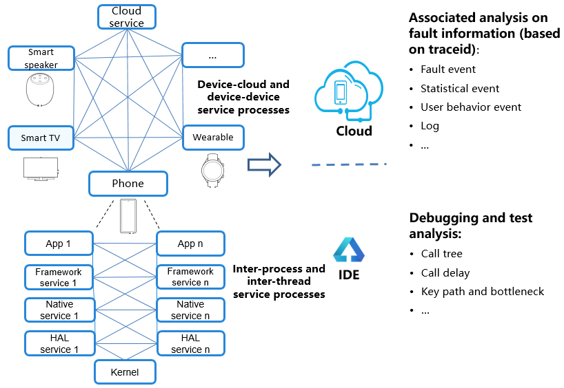

# HiTraceChain Development

## Overview

HiTraceChain tracks the call chain with the same  **traceid**  throughout the inter-device, inter-process, and inter-thread service processes. It associates and displays the call relationship and various output information during the entire process, helping you analyze and locate faults and optimize the system.

## Use Cases

HiTraceChain can be used for the following purposes:

- Associates and reports service process information \(such as logs and events\) on the device.

- Displays and analyzes reported information on the cloud to facilitate fault location.

-   Works with the IDE to debug the detailed service process and time consumption distribution for system optimization.

    **Figure  1**  Use cases of HiTraceChain
    
    


### Usage Example

**Figure  2**  Service calling process \(inter-device and inter-process synchronous call\) 

.png "service-calling-process-(inter-device-and-inter-process-synchronous-call)")

1. Display the call relationship in the service process, analyze key paths and function dependency, and determine the time consumption and call frequency at each call point to detect performance bottlenecks.

   **Figure  3**  Service calling process

   

   **Figure  4**  Time delay in the service calling process

   

2.  Add  **traceid**  to logs and events automatically to facilitate comprehensive analysis and quick fault location.

## Available APIs

HiTraceChain provides C++ and C APIs. The upper-layer services mainly use HiTraceChain to start and stop call chain tracing.

HiTraceChain is implemented at layer C. It works by transferring  **traceid**  throughout the service calling process. Before service processing, HiTraceChain sets  **traceid**  in the thread local storage \(TLS\) of the calling thread. During service processing, HiTraceChain obtains  **traceid**  from the contextual TLS of the calling thread and automatically adds it to the log and event information. After service processing is complete, HiTraceChain clears  **traceid**  from the TLS of the calling thread.

### Java, C++, and C APIs

**Table  1**  Description of C++ and C APIs

<a name="table0218014155811"></a>
<table><thead align="left"><tr id="row3218171455817"><th class="cellrowborder" valign="top" width="12.540000000000001%" id="mcps1.2.4.1.1">&nbsp;&nbsp;</th>
<th class="cellrowborder" valign="top" width="41.42%" id="mcps1.2.4.1.2"><p id="p17257112417232"><a name="p17257112417232"></a><a name="p17257112417232"></a><strong id="b7257324122319"><a name="b7257324122319"></a><a name="b7257324122319"></a>C++</strong></p>
</th>
<th class="cellrowborder" valign="top" width="46.04%" id="mcps1.2.4.1.3"><p id="p13218151413588"><a name="p13218151413588"></a><a name="p13218151413588"></a><strong id="b5218181416588"><a name="b5218181416588"></a><a name="b5218181416588"></a>C</strong></p>
</th>
</tr>
</thead>
<tbody><tr id="row1218714155816"><td class="cellrowborder" valign="top" width="12.540000000000001%" headers="mcps1.2.4.1.1 "><p id="p10218121475811"><a name="p10218121475811"></a><a name="p10218121475811"></a><strong id="b9680556"><a name="b9680556"></a><a name="b9680556"></a>Class</strong></p>
</td>
<td class="cellrowborder" valign="top" width="41.42%" headers="mcps1.2.4.1.2 "><p id="p112189146582"><a name="p112189146582"></a><a name="p112189146582"></a><strong id="b134318387"><a name="b134318387"></a><a name="b134318387"></a>API</strong></p>
</td>
<td class="cellrowborder" valign="top" width="46.04%" headers="mcps1.2.4.1.3 "><p id="p19219151413589"><a name="p19219151413589"></a><a name="p19219151413589"></a><strong id="b989888034"><a name="b989888034"></a><a name="b989888034"></a>API</strong></p>
</td>
</tr>
<tr id="row1219111415585"><td class="cellrowborder" rowspan="8" valign="top" width="12.540000000000001%" headers="mcps1.2.4.1.1 "><p id="p15219101455812"><a name="p15219101455812"></a><a name="p15219101455812"></a>HiTraceChain</p>
<p id="p1945616211310"><a name="p1945616211310"></a><a name="p1945616211310"></a></p>
<p id="p1645619231317"><a name="p1645619231317"></a><a name="p1645619231317"></a></p>
<p id="p94562024134"><a name="p94562024134"></a><a name="p94562024134"></a></p>
<p id="p745619221317"><a name="p745619221317"></a><a name="p745619221317"></a></p>
<p id="p184562212136"><a name="p184562212136"></a><a name="p184562212136"></a></p>
<p id="p2045613210139"><a name="p2045613210139"></a><a name="p2045613210139"></a></p>
<p id="p12456192161319"><a name="p12456192161319"></a><a name="p12456192161319"></a></p>
</td>
<td class="cellrowborder" valign="top" width="41.42%" headers="mcps1.2.4.1.2 "><p id="p821971495820"><a name="p821971495820"></a><a name="p821971495820"></a>HiTraceId Begin(const std::string&amp; name, int flags)</p>
</td>
<td class="cellrowborder" valign="top" width="46.04%" headers="mcps1.2.4.1.3 "><p id="p2219914195817"><a name="p2219914195817"></a><a name="p2219914195817"></a>HiTraceIdStruct HiTraceChainBegin(const char* name, int flags)</p>
</td>
</tr>
<tr id="row16219171417584"><td class="cellrowborder" valign="top" headers="mcps1.2.4.1.1 "><p id="p021971414588"><a name="p021971414588"></a><a name="p021971414588"></a>void End(const HiTraceId&amp; id)</p>
</td>
<td class="cellrowborder" valign="top" headers="mcps1.2.4.1.2 "><p id="p16219191435814"><a name="p16219191435814"></a><a name="p16219191435814"></a>void HiTraceChainEnd(const HiTraceIdStruct* pId)</p>
</td>
</tr>
<tr id="row02191414115819"><td class="cellrowborder" valign="top" headers="mcps1.2.4.1.1 "><p id="p42191143585"><a name="p42191143585"></a><a name="p42191143585"></a>HiTraceId GetId();</p>
</td>
<td class="cellrowborder" valign="top" headers="mcps1.2.4.1.2 "><p id="p1221901419588"><a name="p1221901419588"></a><a name="p1221901419588"></a>HiTraceIdStruct HiTraceChainGetId()</p>
</td>
</tr>
<tr id="row11219131415582"><td class="cellrowborder" valign="top" headers="mcps1.2.4.1.1 "><p id="p6219111415812"><a name="p6219111415812"></a><a name="p6219111415812"></a>void SetId(const HiTraceId&amp; id)</p>
</td>
<td class="cellrowborder" valign="top" headers="mcps1.2.4.1.2 "><p id="p221971465818"><a name="p221971465818"></a><a name="p221971465818"></a>void HiTraceChainSetId(const HiTraceIdStruct* pId)</p>
</td>
</tr>
<tr id="row162191814105815"><td class="cellrowborder" valign="top" headers="mcps1.2.4.1.1 "><p id="p12191147586"><a name="p12191147586"></a><a name="p12191147586"></a>void ClearId()</p>
</td>
<td class="cellrowborder" valign="top" headers="mcps1.2.4.1.2 "><p id="p18219181445813"><a name="p18219181445813"></a><a name="p18219181445813"></a>void HiTraceChainClearId()</p>
</td>
</tr>
<tr id="row12219151475812"><td class="cellrowborder" valign="top" headers="mcps1.2.4.1.1 "><p id="p1721981418580"><a name="p1721981418580"></a><a name="p1721981418580"></a>HiTraceId CreateSpan()</p>
</td>
<td class="cellrowborder" valign="top" headers="mcps1.2.4.1.2 "><p id="p1121981420584"><a name="p1121981420584"></a><a name="p1121981420584"></a>HiTraceIdStruct HiTraceChainCreateSpan()</p>
</td>
</tr>
<tr id="row1721911140582"><td class="cellrowborder" valign="top" headers="mcps1.2.4.1.1 "><p id="p18219514195814"><a name="p18219514195814"></a><a name="p18219514195814"></a>void Tracepoint(HiTraceTracepointType type, const HiTraceId&amp; id, const char* fmt, ...)</p>
</td>
<td class="cellrowborder" valign="top" headers="mcps1.2.4.1.2 "><p id="p3219914175813"><a name="p3219914175813"></a><a name="p3219914175813"></a>void HiTraceChainTracepoint(HiTraceTracepointType type, const HiTraceIdStruct* pId, const char* fmt, ...)</p>
</td>
</tr>
<tr id="row521911410582"><td class="cellrowborder" valign="top" headers="mcps1.2.4.1.1 "><p id="p2219101415814"><a name="p2219101415814"></a><a name="p2219101415814"></a>void Tracepoint(HiTraceCommunicationMode mode, HiTraceTracepointType type, const HiTraceId&amp; id, const char* fmt, ...)</p>
</td>
<td class="cellrowborder" valign="top" headers="mcps1.2.4.1.2 "><p id="p2220141413584"><a name="p2220141413584"></a><a name="p2220141413584"></a>void HiTraceChainTracepointEx(HiTraceCommunicationMode mode, HiTraceTracepointType type, const HiTraceIdStruct* pId, const char* fmt, ...)</p>
</td>
</tr>
<tr id="row8220181411586"><td class="cellrowborder" rowspan="14" valign="top" width="12.540000000000001%" headers="mcps1.2.4.1.1 "><p id="p522018149588"><a name="p522018149588"></a><a name="p522018149588"></a>HiTraceId</p>
<p id="p14704748133"><a name="p14704748133"></a><a name="p14704748133"></a></p>
<p id="p147041042134"><a name="p147041042134"></a><a name="p147041042134"></a></p>
<p id="p2070415431318"><a name="p2070415431318"></a><a name="p2070415431318"></a></p>
<p id="p870404101319"><a name="p870404101319"></a><a name="p870404101319"></a></p>
<p id="p27049417138"><a name="p27049417138"></a><a name="p27049417138"></a></p>
<p id="p870534121314"><a name="p870534121314"></a><a name="p870534121314"></a></p>
<p id="p370512420136"><a name="p370512420136"></a><a name="p370512420136"></a></p>
<p id="p197055481320"><a name="p197055481320"></a><a name="p197055481320"></a></p>
<p id="p970512471317"><a name="p970512471317"></a><a name="p970512471317"></a></p>
<p id="p1170554191318"><a name="p1170554191318"></a><a name="p1170554191318"></a></p>
<p id="p770564191312"><a name="p770564191312"></a><a name="p770564191312"></a></p>
<p id="p87057421315"><a name="p87057421315"></a><a name="p87057421315"></a></p>
<p id="p570518416139"><a name="p570518416139"></a><a name="p570518416139"></a></p>
</td>
<td class="cellrowborder" valign="top" width="41.42%" headers="mcps1.2.4.1.2 "><p id="p102201914105811"><a name="p102201914105811"></a><a name="p102201914105811"></a>HiTraceId();</p>
</td>
<td class="cellrowborder" valign="top" width="46.04%" headers="mcps1.2.4.1.3 "><p id="p16220161419581"><a name="p16220161419581"></a><a name="p16220161419581"></a>void HiTraceChainInitId(HiTraceIdStruct* pId)</p>
</td>
</tr>
<tr id="row8220191405817"><td class="cellrowborder" valign="top" headers="mcps1.2.4.1.1 "><p id="p162201314155813"><a name="p162201314155813"></a><a name="p162201314155813"></a>HiTraceId(const uint8_t* pIdArray, int len)</p>
</td>
<td class="cellrowborder" valign="top" headers="mcps1.2.4.1.2 "><p id="p122011425814"><a name="p122011425814"></a><a name="p122011425814"></a>HiTraceIdStruct HiTraceChainBytesToId(const uint8_t* pIdArray, int len)</p>
</td>
</tr>
<tr id="row1522041435820"><td class="cellrowborder" valign="top" headers="mcps1.2.4.1.1 "><p id="p1422012146587"><a name="p1422012146587"></a><a name="p1422012146587"></a>bool IsValid()</p>
</td>
<td class="cellrowborder" valign="top" headers="mcps1.2.4.1.2 "><p id="p1322016149586"><a name="p1322016149586"></a><a name="p1322016149586"></a>int HiTraceChainIsValid(const HiTraceIdStruct* pId)</p>
</td>
</tr>
<tr id="row8220714155810"><td class="cellrowborder" valign="top" headers="mcps1.2.4.1.1 "><p id="p322021485814"><a name="p322021485814"></a><a name="p322021485814"></a>bool IsFlagEnabled(HiTraceFlag flag)</p>
</td>
<td class="cellrowborder" valign="top" headers="mcps1.2.4.1.2 "><p id="p922010148583"><a name="p922010148583"></a><a name="p922010148583"></a>int HiTraceChainIsFlagEnabled(const HiTraceIdStruct* pId, HiTraceFlag flag)</p>
</td>
</tr>
<tr id="row12220161485814"><td class="cellrowborder" valign="top" headers="mcps1.2.4.1.1 "><p id="p1122011140588"><a name="p1122011140588"></a><a name="p1122011140588"></a>void EnableFlag(HiTraceFlag flag)</p>
</td>
<td class="cellrowborder" valign="top" headers="mcps1.2.4.1.2 "><p id="p152201146583"><a name="p152201146583"></a><a name="p152201146583"></a>void HiTraceChainEnableFlag(HiTraceIdStruct* pId, HiTraceFlag flag)</p>
</td>
</tr>
<tr id="row922061411589"><td class="cellrowborder" valign="top" headers="mcps1.2.4.1.1 "><p id="p202208143588"><a name="p202208143588"></a><a name="p202208143588"></a>int GetFlags()</p>
</td>
<td class="cellrowborder" valign="top" headers="mcps1.2.4.1.2 "><p id="p182206142587"><a name="p182206142587"></a><a name="p182206142587"></a>int HiTraceChainGetFlags(const HiTraceIdStruct* pId)</p>
</td>
</tr>
<tr id="row82204145589"><td class="cellrowborder" valign="top" headers="mcps1.2.4.1.1 "><p id="p12201414205815"><a name="p12201414205815"></a><a name="p12201414205815"></a>void SetFlags(int flags)</p>
</td>
<td class="cellrowborder" valign="top" headers="mcps1.2.4.1.2 "><p id="p162201514175813"><a name="p162201514175813"></a><a name="p162201514175813"></a>void HiTraceChainSetFlags(HiTraceIdStruct* pId, int flags)</p>
</td>
</tr>
<tr id="row152204143585"><td class="cellrowborder" valign="top" headers="mcps1.2.4.1.1 "><p id="p722113147580"><a name="p722113147580"></a><a name="p722113147580"></a>uint64_t GetChainId()</p>
</td>
<td class="cellrowborder" valign="top" headers="mcps1.2.4.1.2 "><p id="p322119149584"><a name="p322119149584"></a><a name="p322119149584"></a>uint64_t HiTraceChainGetChainId(const HiTraceIdStruct* pId)</p>
</td>
</tr>
<tr id="row1221214175815"><td class="cellrowborder" valign="top" headers="mcps1.2.4.1.1 "><p id="p922131445815"><a name="p922131445815"></a><a name="p922131445815"></a>void SetChainId(uint64_t chainId)</p>
</td>
<td class="cellrowborder" valign="top" headers="mcps1.2.4.1.2 "><p id="p922101411588"><a name="p922101411588"></a><a name="p922101411588"></a>void HiTraceChainSetChainId(HiTraceIdStruct* pId, uint64_t chainId)</p>
</td>
</tr>
<tr id="row1922115142588"><td class="cellrowborder" valign="top" headers="mcps1.2.4.1.1 "><p id="p1122141414588"><a name="p1122141414588"></a><a name="p1122141414588"></a>uint64_t GetSpanId()</p>
</td>
<td class="cellrowborder" valign="top" headers="mcps1.2.4.1.2 "><p id="p32211145584"><a name="p32211145584"></a><a name="p32211145584"></a>uint64_t HiTraceChainGetSpanId(const HiTraceIdStruct* pId)</p>
</td>
</tr>
<tr id="row4221171414587"><td class="cellrowborder" valign="top" headers="mcps1.2.4.1.1 "><p id="p10221191412588"><a name="p10221191412588"></a><a name="p10221191412588"></a>void SetSpanId(uint64_t spanId)</p>
</td>
<td class="cellrowborder" valign="top" headers="mcps1.2.4.1.2 "><p id="p42211614105810"><a name="p42211614105810"></a><a name="p42211614105810"></a>void HiTraceChainSetSpanId(HiTraceIdStruct* pId, uint64_t spanId)</p>
</td>
</tr>
<tr id="row322171425818"><td class="cellrowborder" valign="top" headers="mcps1.2.4.1.1 "><p id="p1722111418582"><a name="p1722111418582"></a><a name="p1722111418582"></a>uint64_t GetParentSpanId()</p>
</td>
<td class="cellrowborder" valign="top" headers="mcps1.2.4.1.2 "><p id="p8221314195817"><a name="p8221314195817"></a><a name="p8221314195817"></a>uint64_t HiTraceChainGetParentSpanId(const HiTraceIdStruct* pId)</p>
</td>
</tr>
<tr id="row622114147589"><td class="cellrowborder" valign="top" headers="mcps1.2.4.1.1 "><p id="p92219145589"><a name="p92219145589"></a><a name="p92219145589"></a>void SetParentSpanId(uint64_t parentSpanId)</p>
</td>
<td class="cellrowborder" valign="top" headers="mcps1.2.4.1.2 "><p id="p922191435813"><a name="p922191435813"></a><a name="p922191435813"></a>void HiTraceChainSetParentSpanId(HiTraceIdStruct* pId, uint64_t parentSpanId)</p>
</td>
</tr>
<tr id="row5221614135814"><td class="cellrowborder" valign="top" headers="mcps1.2.4.1.1 "><p id="p11221121435820"><a name="p11221121435820"></a><a name="p11221121435820"></a>int ToBytes(uint8_t* pIdArray, int len)</p>
</td>
<td class="cellrowborder" valign="top" headers="mcps1.2.4.1.2 "><p id="p1122131415814"><a name="p1122131415814"></a><a name="p1122131415814"></a>int HiTraceChainIdToBytes(const HiTraceIdStruct* pId, uint8_t* pIdArray, int len)</p>
</td>
</tr>
</tbody>
</table>

### Parameters of C++ APIs

**Table  2**  Parameters of C++ APIs

<a name="table19597131833715"></a>
<table><thead align="left"><tr id="row7839141817375"><th class="cellrowborder" valign="top" width="9.8%" id="mcps1.2.4.1.1"><p id="p383919182379"><a name="p383919182379"></a><a name="p383919182379"></a><strong id="b18963437162313"><a name="b18963437162313"></a><a name="b18963437162313"></a>Class</strong></p>
</th>
<th class="cellrowborder" valign="top" width="31.430000000000003%" id="mcps1.2.4.1.2"><p id="p168392018203711"><a name="p168392018203711"></a><a name="p168392018203711"></a><strong id="b1368417396233"><a name="b1368417396233"></a><a name="b1368417396233"></a>API</strong></p>
</th>
<th class="cellrowborder" valign="top" width="58.77%" id="mcps1.2.4.1.3"><p id="p168391618193717"><a name="p168391618193717"></a><a name="p168391618193717"></a><strong id="b1137714428236"><a name="b1137714428236"></a><a name="b1137714428236"></a>Description</strong></p>
</th>
</tr>
</thead>
<tbody><tr id="row383911183378"><td class="cellrowborder" rowspan="8" valign="top" width="9.8%" headers="mcps1.2.4.1.1 "><p id="p10839318133713"><a name="p10839318133713"></a><a name="p10839318133713"></a>HiTraceChain</p>
<p id="p1544019164131"><a name="p1544019164131"></a><a name="p1544019164131"></a></p>
<p id="p14440191615134"><a name="p14440191615134"></a><a name="p14440191615134"></a></p>
<p id="p6440161631310"><a name="p6440161631310"></a><a name="p6440161631310"></a></p>
<p id="p174411167135"><a name="p174411167135"></a><a name="p174411167135"></a></p>
<p id="p2441141651310"><a name="p2441141651310"></a><a name="p2441141651310"></a></p>
<p id="p1944151618133"><a name="p1944151618133"></a><a name="p1944151618133"></a></p>
<p id="p1744121610131"><a name="p1744121610131"></a><a name="p1744121610131"></a></p>
</td>
<td class="cellrowborder" valign="top" width="31.430000000000003%" headers="mcps1.2.4.1.2 "><p id="p198391118193717"><a name="p198391118193717"></a><a name="p198391118193717"></a>HiTraceId Begin(const std::string&amp; name, int flags)</p>
</td>
<td class="cellrowborder" valign="top" width="58.77%" headers="mcps1.2.4.1.3 "><p id="p684013182375"><a name="p684013182375"></a><a name="p684013182375"></a>Starts HiTraceChain, generates a <strong id="b2063619462230"><a name="b2063619462230"></a><a name="b2063619462230"></a>HiTraceId</strong> object, and sets it in the TLS of the calling thread.</p>
<p id="p1384081812377"><a name="p1384081812377"></a><a name="p1384081812377"></a>Input arguments:</p>
<a name="ul1537854218177"></a><a name="ul1537854218177"></a><ul id="ul1537854218177"><li><strong id="b1566312131676"><a name="b1566312131676"></a><a name="b1566312131676"></a>name</strong>: Indicates the name of the service process.</li><li><strong id="b75512128711"><a name="b75512128711"></a><a name="b75512128711"></a>flags</strong>: Indicates tracing flags, which can be used in combination. <a name="ul18842248101915"></a><a name="ul18842248101915"></a><ul id="ul18842248101915"><li>HITRACE_FLAG_INCLUDE_ASYNC: Traces both synchronous and asynchronous calls. By default, only synchronous calls are traced.</li><li><strong id="b724616241477"><a name="b724616241477"></a><a name="b724616241477"></a>HITRACE_FLAG_DONOT_CREATE_SPAN</strong>: Do not create a span. By default, a span is created.</li><li><strong id="b136181926479"><a name="b136181926479"></a><a name="b136181926479"></a>HITRACE_FLAG_TP_INFO</strong>: Outputs the tracepoint information. By default, the information is not output.</li><li><strong id="b358818291777"><a name="b358818291777"></a><a name="b358818291777"></a>HITRACE_FLAG_NO_BE_INFO</strong>: Do not output the start and end information. By default, the information is output.</li><li><strong id="b38571331974"><a name="b38571331974"></a><a name="b38571331974"></a>HITRACE_FLAG_DONOT_ENABLE_LOG</strong>: Do not associate logs for output. By default, logs are associated for output.</li><li><strong id="b17320371870"><a name="b17320371870"></a><a name="b17320371870"></a>HITRACE_FLAG_FAULT_TRIGGER</strong>: Triggers tracing by fault. By default, tracing is triggered normally.</li><li><strong id="b876915381711"><a name="b876915381711"></a><a name="b876915381711"></a>HITRACE_FLAG_D2D_TP_INFO</strong>: Outputs the device-to-device tracepoint information. By default, the information is not output.</li><li><strong id="b66510421776"><a name="b66510421776"></a><a name="b66510421776"></a>HITRCE_FLAG_DEFAULT</strong>: Indicates the default flag.</li></ul>
</li><li>Output arguments: none</li><li>Return value: Returns a valid <strong id="b7411101522917"><a name="b7411101522917"></a><a name="b7411101522917"></a>HiTraceId</strong> object if call chain tracing is triggered successfully; returns an invalid object otherwise.</li></ul>
<p id="p188401918203713"><a name="p188401918203713"></a><a name="p188401918203713"></a>Note: In nested tracing mode, an invalid object will be returned if tracing is started at the nested layer.</p>
</td>
</tr>
<tr id="row16840101803720"><td class="cellrowborder" valign="top" headers="mcps1.2.4.1.1 "><p id="p13840191893718"><a name="p13840191893718"></a><a name="p13840191893718"></a>void End(const HiTraceId&amp; id)</p>
</td>
<td class="cellrowborder" valign="top" headers="mcps1.2.4.1.2 "><p id="p3840181820372"><a name="p3840181820372"></a><a name="p3840181820372"></a>Stops HiTraceChain based on the <strong id="b1605239122415"><a name="b1605239122415"></a><a name="b1605239122415"></a>HiTraceId</strong> object returned by the <strong id="b7610183992419"><a name="b7610183992419"></a><a name="b7610183992419"></a>Begin</strong> API, and clears the <strong id="b1610173918241"><a name="b1610173918241"></a><a name="b1610173918241"></a>HiTraceId</strong> object in the TLS of the calling thread.</p>
<p id="p9840718103720"><a name="p9840718103720"></a><a name="p9840718103720"></a>Input arguments:</p>
<a name="ul2917140133015"></a><a name="ul2917140133015"></a><ul id="ul2917140133015"><li><strong id="b8201185118711"><a name="b8201185118711"></a><a name="b8201185118711"></a>id</strong>: Indicates the <strong id="b2071183114331"><a name="b2071183114331"></a><a name="b2071183114331"></a>HiTraceId</strong> object.</li></ul>
<p id="p14840151803718"><a name="p14840151803718"></a><a name="p14840151803718"></a>Output arguments: none</p>
<p id="p2840201893719"><a name="p2840201893719"></a><a name="p2840201893719"></a>Return value: none</p>
</td>
</tr>
<tr id="row198401818193712"><td class="cellrowborder" valign="top" headers="mcps1.2.4.1.1 "><p id="p20840191893718"><a name="p20840191893718"></a><a name="p20840191893718"></a>HiTraceId GetId();</p>
</td>
<td class="cellrowborder" valign="top" headers="mcps1.2.4.1.2 "><p id="p98401818123720"><a name="p98401818123720"></a><a name="p98401818123720"></a>Obtains the <strong id="b98371719256"><a name="b98371719256"></a><a name="b98371719256"></a>HiTraceId</strong> object from the TLS of the calling thread.</p>
<p id="p984001893712"><a name="p984001893712"></a><a name="p984001893712"></a>Input arguments: none</p>
<p id="p2084021817379"><a name="p2084021817379"></a><a name="p2084021817379"></a>Output arguments: none</p>
<p id="p9840418133716"><a name="p9840418133716"></a><a name="p9840418133716"></a>Return value: Returns the <strong id="b73911122162613"><a name="b73911122162613"></a><a name="b73911122162613"></a>HiTraceId</strong> object in the contextual TLS of the calling thread.</p>
</td>
</tr>
<tr id="row118401118203714"><td class="cellrowborder" valign="top" headers="mcps1.2.4.1.1 "><p id="p1840151843715"><a name="p1840151843715"></a><a name="p1840151843715"></a>void SetId(const HiTraceId&amp; id)</p>
</td>
<td class="cellrowborder" valign="top" headers="mcps1.2.4.1.2 "><p id="p384061893715"><a name="p384061893715"></a><a name="p384061893715"></a>Purpose: Sets the <strong id="b7405852152614"><a name="b7405852152614"></a><a name="b7405852152614"></a>HiTraceId</strong> object in the TLS of the calling thread.</p>
<p id="p16840718153717"><a name="p16840718153717"></a><a name="p16840718153717"></a>Input arguments:</p>
<a name="ul1355016467304"></a><a name="ul1355016467304"></a><ul id="ul1355016467304"><li><strong id="b648307174"><a name="b648307174"></a><a name="b648307174"></a>id</strong>: Indicates the <strong id="b492669584"><a name="b492669584"></a><a name="b492669584"></a>HiTraceId</strong> object.</li></ul>
<p id="p684051817376"><a name="p684051817376"></a><a name="p684051817376"></a>Output arguments: none</p>
<p id="p884091812374"><a name="p884091812374"></a><a name="p884091812374"></a>Return value: none</p>
</td>
</tr>
<tr id="row3840171813374"><td class="cellrowborder" valign="top" headers="mcps1.2.4.1.1 "><p id="p18840131873717"><a name="p18840131873717"></a><a name="p18840131873717"></a>void ClearId()</p>
</td>
<td class="cellrowborder" valign="top" headers="mcps1.2.4.1.2 "><p id="p584019184379"><a name="p584019184379"></a><a name="p584019184379"></a>Clears the <strong id="b8445182151511"><a name="b8445182151511"></a><a name="b8445182151511"></a>HiTraceId</strong> object in the TLS of the current thread.</p>
<p id="p108401718173714"><a name="p108401718173714"></a><a name="p108401718173714"></a>Input arguments: none </p>
<p id="p1784014183377"><a name="p1784014183377"></a><a name="p1784014183377"></a>Output arguments: none</p>
<p id="p2084041811377"><a name="p2084041811377"></a><a name="p2084041811377"></a>Return value: none</p>
</td>
</tr>
<tr id="row6840818193716"><td class="cellrowborder" valign="top" headers="mcps1.2.4.1.1 "><p id="p16840171823719"><a name="p16840171823719"></a><a name="p16840171823719"></a>HiTraceId CreateSpan()</p>
</td>
<td class="cellrowborder" valign="top" headers="mcps1.2.4.1.2 "><p id="p984031812378"><a name="p984031812378"></a><a name="p984031812378"></a>Obtains the span ID from the current <strong id="b186741420142718"><a name="b186741420142718"></a><a name="b186741420142718"></a>HiTraceId</strong> object.</p>
<p id="p5840101814371"><a name="p5840101814371"></a><a name="p5840101814371"></a>Input arguments: none</p>
<p id="p20840111843718"><a name="p20840111843718"></a><a name="p20840111843718"></a>Output arguments: none</p>
<p id="p88401218193710"><a name="p88401218193710"></a><a name="p88401218193710"></a>Return value: Returns the current span ID.</p>
</td>
</tr>
<tr id="row198401118123714"><td class="cellrowborder" valign="top" headers="mcps1.2.4.1.1 "><p id="p178411618183711"><a name="p178411618183711"></a><a name="p178411618183711"></a>void Tracepoint(HiTraceTracepointType type, const HiTraceId&amp; id, const char* fmt, ...)</p>
</td>
<td class="cellrowborder" valign="top" headers="mcps1.2.4.1.2 "><p id="p88419184373"><a name="p88419184373"></a><a name="p88419184373"></a>Outputs HiTraceChain call chain information based on the information type. The information includes the timestamp and <strong id="b185817437323"><a name="b185817437323"></a><a name="b185817437323"></a>HiTraceId</strong> object information of the span.</p>
<p id="p1984116184376"><a name="p1984116184376"></a><a name="p1984116184376"></a>Input arguments:</p>
<a name="ul18619103153812"></a><a name="ul18619103153812"></a><ul id="ul18619103153812"><li><strong id="b7818831083"><a name="b7818831083"></a><a name="b7818831083"></a>type</strong>: Indicates the information type. The options are as follows:<a name="ul1941510328297"></a><a name="ul1941510328297"></a><ul id="ul1941510328297"><li><strong id="b18809161180"><a name="b18809161180"></a><a name="b18809161180"></a>HITRACE_TP_CS</strong>: Client Send, which indicates the messages sent by the synchronous/asynchronous communication client.</li><li><strong id="b327281271319"><a name="b327281271319"></a><a name="b327281271319"></a>HITRACE_TP_SR</strong>: Server Receive, which indicates the messages received by the server in synchronous/asynchronous communication.</li><li><strong id="b10154742682"><a name="b10154742682"></a><a name="b10154742682"></a>HITRACE_TP_SS</strong>: Server Send, which indicates the response messages sent by the server in synchronous communication.</li><li><strong id="b152598127810"><a name="b152598127810"></a><a name="b152598127810"></a>HITRACE_TP_CR</strong>: Client Receive, which indicates the response messages received by the synchronous communication client.</li><li><strong id="b82631512817"><a name="b82631512817"></a><a name="b82631512817"></a>HITRACE_TP_GENERAL</strong>: Indicates the common output information.</li></ul>
</li><li><strong id="b117401716584"><a name="b117401716584"></a><a name="b117401716584"></a>id</strong>: Indicates the ID of the current span.</li><li><strong id="b392172019813"><a name="b392172019813"></a><a name="b392172019813"></a>fmt</strong>: Indicates the string describing the format variable parameter.</li><li><strong id="b986771717818"><a name="b986771717818"></a><a name="b986771717818"></a>args</strong>: Indicates the variable parameter.</li></ul>
<p id="p11841121863717"><a name="p11841121863717"></a><a name="p11841121863717"></a>Output arguments: none</p>
<p id="p16841161816376"><a name="p16841161816376"></a><a name="p16841161816376"></a>Return value: none</p>
</td>
</tr>
<tr id="row11841191811379"><td class="cellrowborder" valign="top" headers="mcps1.2.4.1.1 "><p id="p08411318163716"><a name="p08411318163716"></a><a name="p08411318163716"></a>void Tracepoint(HiTraceCommunicationMode mode, HiTraceTracepointType type, const HiTraceId&amp; id, const char* fmt, ...)</p>
</td>
<td class="cellrowborder" valign="top" headers="mcps1.2.4.1.2 "><p id="p68411618153713"><a name="p68411618153713"></a><a name="p68411618153713"></a>Outputs HiTraceChain call chain information based on the communication mode and information type. The information includes the timestamp and <strong id="b8151210123912"><a name="b8151210123912"></a><a name="b8151210123912"></a>HiTraceId</strong> object information of the span.</p>
<p id="p98418189375"><a name="p98418189375"></a><a name="p98418189375"></a>Input arguments:</p>
<a name="ul914264413811"></a><a name="ul914264413811"></a><ul id="ul914264413811"><li><strong id="b76471824183"><a name="b76471824183"></a><a name="b76471824183"></a>mode</strong>: Indicates the communication mode. The options are as follows:<a name="ul137382469451"></a><a name="ul137382469451"></a><ul id="ul137382469451"><li><strong id="b13732297812"><a name="b13732297812"></a><a name="b13732297812"></a>HITRACE_CM_DEFAULT</strong>: default communication mode used when no communication mode is specified</li><li><strong id="b1820115271789"><a name="b1820115271789"></a><a name="b1820115271789"></a>HITRACE_CM_THREAD</strong>: inter-thread communication</li><li><strong id="b27781831488"><a name="b27781831488"></a><a name="b27781831488"></a>HITRACE_CM_PROCESS</strong>: inter-process communication</li><li><strong id="b15657113313819"><a name="b15657113313819"></a><a name="b15657113313819"></a>HITRACE_CM_DEVICE</strong>: inter-device communication</li></ul>
</li><li><strong id="b172723513812"><a name="b172723513812"></a><a name="b172723513812"></a>type</strong>: Indicates the information type. The options are as follows:<a name="ul19648426458"></a><a name="ul19648426458"></a><ul id="ul19648426458"><li><strong id="b26421037382"><a name="b26421037382"></a><a name="b26421037382"></a>HITRACE_TP_CS</strong>: Client Send, which indicates the messages sent by the synchronous/asynchronous communication client.</li><li><strong id="b66504018818"><a name="b66504018818"></a><a name="b66504018818"></a>HITRACE_TP_SR</strong>: Server Receive, which indicates the messages received by the server in synchronous/asynchronous communication.</li><li><strong id="b285283761"><a name="b285283761"></a><a name="b285283761"></a>HITRACE_TP_SS</strong>: Server Send, which indicates the response messages sent by the server in synchronous communication.</li><li><strong id="b148684447814"><a name="b148684447814"></a><a name="b148684447814"></a>HITRACE_TP_CR</strong>: Client Receive, which indicates the response messages received by the synchronous communication client.</li><li><strong id="b17875164618816"><a name="b17875164618816"></a><a name="b17875164618816"></a>HITRACE_TP_GENERAL</strong>: Indicates the common output information.</li></ul>
</li><li><strong id="b1216749882"><a name="b1216749882"></a><a name="b1216749882"></a>id</strong>: Indicates the ID of the current span.</li><li><strong id="b82757501383"><a name="b82757501383"></a><a name="b82757501383"></a>fmt</strong>: Indicates the string describing the format variable parameter.</li><li><strong id="b15518145114817"><a name="b15518145114817"></a><a name="b15518145114817"></a>args</strong>: Indicates the variable parameter.</li></ul>
<p id="p784111810377"><a name="p784111810377"></a><a name="p784111810377"></a>Output arguments: none</p>
<p id="p1984181810374"><a name="p1984181810374"></a><a name="p1984181810374"></a>Return value: none</p>
</td>
</tr>
<tr id="row15841191813371"><td class="cellrowborder" rowspan="14" valign="top" width="9.8%" headers="mcps1.2.4.1.1 "><p id="p28411718143712"><a name="p28411718143712"></a><a name="p28411718143712"></a>HiTraceId</p>
<p id="p8337626151312"><a name="p8337626151312"></a><a name="p8337626151312"></a></p>
<p id="p16337182615134"><a name="p16337182615134"></a><a name="p16337182615134"></a></p>
<p id="p333712613136"><a name="p333712613136"></a><a name="p333712613136"></a></p>
<p id="p1337192616133"><a name="p1337192616133"></a><a name="p1337192616133"></a></p>
<p id="p203373267134"><a name="p203373267134"></a><a name="p203373267134"></a></p>
<p id="p23371265134"><a name="p23371265134"></a><a name="p23371265134"></a></p>
<p id="p173372267139"><a name="p173372267139"></a><a name="p173372267139"></a></p>
<p id="p143377266138"><a name="p143377266138"></a><a name="p143377266138"></a></p>
<p id="p13374265133"><a name="p13374265133"></a><a name="p13374265133"></a></p>
<p id="p18337162610137"><a name="p18337162610137"></a><a name="p18337162610137"></a></p>
<p id="p1833742613131"><a name="p1833742613131"></a><a name="p1833742613131"></a></p>
<p id="p93371026101319"><a name="p93371026101319"></a><a name="p93371026101319"></a></p>
<p id="p13337426121311"><a name="p13337426121311"></a><a name="p13337426121311"></a></p>
</td>
<td class="cellrowborder" valign="top" width="31.430000000000003%" headers="mcps1.2.4.1.2 "><p id="p158414182379"><a name="p158414182379"></a><a name="p158414182379"></a>HiTraceId();</p>
</td>
<td class="cellrowborder" valign="top" width="58.77%" headers="mcps1.2.4.1.3 "><p id="p48419181372"><a name="p48419181372"></a><a name="p48419181372"></a>Represents the default constructor used to generate an invalid <strong id="b1235325844115"><a name="b1235325844115"></a><a name="b1235325844115"></a>HiTraceId</strong> object. </p>
<p id="p16841121815372"><a name="p16841121815372"></a><a name="p16841121815372"></a>Input arguments: none</p>
<p id="p17841161803713"><a name="p17841161803713"></a><a name="p17841161803713"></a>Output arguments: none</p>
<p id="p1884121818375"><a name="p1884121818375"></a><a name="p1884121818375"></a>Return value: none</p>
</td>
</tr>
<tr id="row138418186374"><td class="cellrowborder" valign="top" headers="mcps1.2.4.1.1 "><p id="p19841111813712"><a name="p19841111813712"></a><a name="p19841111813712"></a>HiTraceId(const uint8_t* pIdArray, int len)</p>
</td>
<td class="cellrowborder" valign="top" headers="mcps1.2.4.1.2 "><p id="p684110183377"><a name="p684110183377"></a><a name="p684110183377"></a>Represents the constructor used to create a <strong id="b1488144194216"><a name="b1488144194216"></a><a name="b1488144194216"></a>HiTraceId</strong> object based on the specified byte array. </p>
<div class="p" id="p9841151833711"><a name="p9841151833711"></a><a name="p9841151833711"></a>Input arguments:<a name="ul783818256482"></a><a name="ul783818256482"></a><ul id="ul783818256482"><li><strong id="b1725445715818"><a name="b1725445715818"></a><a name="b1725445715818"></a>pIdArray</strong>: Indicates the pointer to a byte array.</li><li><strong id="b3437458486"><a name="b3437458486"></a><a name="b3437458486"></a>len</strong>: Indicates the length of the byte array.</li></ul>
</div>
<p id="p484121893716"><a name="p484121893716"></a><a name="p484121893716"></a>Output arguments: none</p>
<p id="p984161813376"><a name="p984161813376"></a><a name="p984161813376"></a>Return value: none</p>
</td>
</tr>
<tr id="row2084112189377"><td class="cellrowborder" valign="top" headers="mcps1.2.4.1.1 "><p id="p1184271814377"><a name="p1184271814377"></a><a name="p1184271814377"></a>bool IsValid()</p>
</td>
<td class="cellrowborder" valign="top" headers="mcps1.2.4.1.2 "><p id="p1084251893713"><a name="p1084251893713"></a><a name="p1084251893713"></a>Checks whether the <strong id="b18546440145116"><a name="b18546440145116"></a><a name="b18546440145116"></a>HiTraceId</strong> object is valid.</p>
<p id="p1084231815374"><a name="p1084231815374"></a><a name="p1084231815374"></a>Input arguments: none</p>
<p id="p15842121815376"><a name="p15842121815376"></a><a name="p15842121815376"></a>Output arguments: none</p>
<p id="p884261893710"><a name="p884261893710"></a><a name="p884261893710"></a>Return value: Returns <strong id="b20386195514314"><a name="b20386195514314"></a><a name="b20386195514314"></a>true</strong> if the <strong id="b1899544174516"><a name="b1899544174516"></a><a name="b1899544174516"></a>HiTraceId</strong> object is valid; returns <strong id="b1273655294313"><a name="b1273655294313"></a><a name="b1273655294313"></a>false</strong> otherwise.</p>
</td>
</tr>
<tr id="row7842161873716"><td class="cellrowborder" valign="top" headers="mcps1.2.4.1.1 "><p id="p88422188379"><a name="p88422188379"></a><a name="p88422188379"></a>bool IsFlagEnabled(HiTraceFlag flag)</p>
</td>
<td class="cellrowborder" valign="top" headers="mcps1.2.4.1.2 "><p id="p128421518153712"><a name="p128421518153712"></a><a name="p128421518153712"></a>Checks whether the tracing flag of the <strong id="b1014619442447"><a name="b1014619442447"></a><a name="b1014619442447"></a>HiTraceId</strong> object is enabled.</p>
<p id="p12842518113714"><a name="p12842518113714"></a><a name="p12842518113714"></a>Input arguments:</p>
<a name="ul9760031103115"></a><a name="ul9760031103115"></a><ul id="ul9760031103115"><li><strong id="b136731441791"><a name="b136731441791"></a><a name="b136731441791"></a>flag</strong>: Indicates the tracing flag. For details, see the description in the <strong id="b186672319452"><a name="b186672319452"></a><a name="b186672319452"></a>Begin</strong> function.</li></ul>
<p id="p784217189379"><a name="p784217189379"></a><a name="p784217189379"></a>Output arguments: none</p>
<p id="p98421318143720"><a name="p98421318143720"></a><a name="p98421318143720"></a>Return value: Returns <strong id="b151944819455"><a name="b151944819455"></a><a name="b151944819455"></a>true</strong> if the tracing flag is enabled; returns <strong id="b1619204874513"><a name="b1619204874513"></a><a name="b1619204874513"></a>false</strong> otherwise.</p>
</td>
</tr>
<tr id="row4842318123713"><td class="cellrowborder" valign="top" headers="mcps1.2.4.1.1 "><p id="p8842818103712"><a name="p8842818103712"></a><a name="p8842818103712"></a>void EnableFlag(HiTraceFlag flag)</p>
</td>
<td class="cellrowborder" valign="top" headers="mcps1.2.4.1.2 "><p id="p1084221893717"><a name="p1084221893717"></a><a name="p1084221893717"></a>Enables the tracing flag of the <strong id="b118041135213"><a name="b118041135213"></a><a name="b118041135213"></a>HiTraceId</strong> object.</p>
<p id="p484241853710"><a name="p484241853710"></a><a name="p484241853710"></a>Input arguments:</p>
<a name="ul144862816319"></a><a name="ul144862816319"></a><ul id="ul144862816319"><li><strong id="b430319434"><a name="b430319434"></a><a name="b430319434"></a>flag</strong>: Indicates the tracing flag. For details, see the description in the <strong id="b1067701187"><a name="b1067701187"></a><a name="b1067701187"></a>Begin</strong> function.</li></ul>
<p id="p18421018153710"><a name="p18421018153710"></a><a name="p18421018153710"></a>Output arguments: none</p>
<p id="p138421618163715"><a name="p138421618163715"></a><a name="p138421618163715"></a>Return value: none</p>
</td>
</tr>
<tr id="row128421918153717"><td class="cellrowborder" valign="top" headers="mcps1.2.4.1.1 "><p id="p4842218193714"><a name="p4842218193714"></a><a name="p4842218193714"></a>int GetFlags()</p>
</td>
<td class="cellrowborder" valign="top" headers="mcps1.2.4.1.2 "><p id="p12842151803718"><a name="p12842151803718"></a><a name="p12842151803718"></a>Obtains the tracing flag set in the <strong id="b36515674811"><a name="b36515674811"></a><a name="b36515674811"></a>HiTraceId</strong> object.</p>
<p id="p108421018193716"><a name="p108421018193716"></a><a name="p108421018193716"></a>Input arguments: none</p>
<p id="p284271843715"><a name="p284271843715"></a><a name="p284271843715"></a>Output arguments: none</p>
<p id="p19842101853716"><a name="p19842101853716"></a><a name="p19842101853716"></a>Return value: Returns the combination of tracing flags. For details, see the description in the <strong id="b12693139144817"><a name="b12693139144817"></a><a name="b12693139144817"></a>Begin</strong> function.</p>
</td>
</tr>
<tr id="row18842181863712"><td class="cellrowborder" valign="top" headers="mcps1.2.4.1.1 "><p id="p13842718153717"><a name="p13842718153717"></a><a name="p13842718153717"></a>void SetFlags(int flags)</p>
</td>
<td class="cellrowborder" valign="top" headers="mcps1.2.4.1.2 "><p id="p7842141823718"><a name="p7842141823718"></a><a name="p7842141823718"></a>Sets a tracing flag in the <strong id="b9174314814"><a name="b9174314814"></a><a name="b9174314814"></a>HiTraceId</strong> object.</p>
<p id="p784214187374"><a name="p784214187374"></a><a name="p784214187374"></a>Input arguments:</p>
<a name="ul6490121183115"></a><a name="ul6490121183115"></a><ul id="ul6490121183115"><li><strong id="b1556719154919"><a name="b1556719154919"></a><a name="b1556719154919"></a>flags</strong>: Indicates the combination of tracing flags. For details, see the description in the <strong id="b469312329341"><a name="b469312329341"></a><a name="b469312329341"></a>Begin</strong> function.</li></ul>
<p id="p17842141833710"><a name="p17842141833710"></a><a name="p17842141833710"></a>Output arguments: none</p>
<p id="p1842718203716"><a name="p1842718203716"></a><a name="p1842718203716"></a>Return value: none</p>
</td>
</tr>
<tr id="row68421418163715"><td class="cellrowborder" valign="top" headers="mcps1.2.4.1.1 "><p id="p484221810371"><a name="p484221810371"></a><a name="p484221810371"></a>uint64_t GetChainId()</p>
</td>
<td class="cellrowborder" valign="top" headers="mcps1.2.4.1.2 "><p id="p1784231833713"><a name="p1784231833713"></a><a name="p1784231833713"></a>Obtains the call chain ID.</p>
<p id="p48428188373"><a name="p48428188373"></a><a name="p48428188373"></a>Input arguments: none</p>
<p id="p158421418163710"><a name="p158421418163710"></a><a name="p158421418163710"></a>Output arguments: none</p>
<p id="p1484217183376"><a name="p1484217183376"></a><a name="p1484217183376"></a>Return value: Returns the call chain ID.</p>
</td>
</tr>
<tr id="row2842818153719"><td class="cellrowborder" valign="top" headers="mcps1.2.4.1.1 "><p id="p158422182376"><a name="p158422182376"></a><a name="p158422182376"></a>void SetChainId(uint64_t chainId)</p>
</td>
<td class="cellrowborder" valign="top" headers="mcps1.2.4.1.2 "><p id="p784271815372"><a name="p784271815372"></a><a name="p784271815372"></a>Sets the call chain ID in the <strong id="b1319041125416"><a name="b1319041125416"></a><a name="b1319041125416"></a>HiTraceId</strong> object.</p>
<p id="p3842131883718"><a name="p3842131883718"></a><a name="p3842131883718"></a>Input arguments:</p>
<a name="ul45791717103118"></a><a name="ul45791717103118"></a><ul id="ul45791717103118"><li><strong id="b492411164116"><a name="b492411164116"></a><a name="b492411164116"></a>chainId</strong>: Indicates the call chain ID.</li></ul>
<p id="p9842171818371"><a name="p9842171818371"></a><a name="p9842171818371"></a>Output arguments: none</p>
<p id="p2842141853718"><a name="p2842141853718"></a><a name="p2842141853718"></a>Return value: none</p>
</td>
</tr>
<tr id="row1484217185372"><td class="cellrowborder" valign="top" headers="mcps1.2.4.1.1 "><p id="p12843161817378"><a name="p12843161817378"></a><a name="p12843161817378"></a>uint64_t GetSpanId()</p>
</td>
<td class="cellrowborder" valign="top" headers="mcps1.2.4.1.2 "><p id="p1484351820374"><a name="p1484351820374"></a><a name="p1484351820374"></a>Obtains the span ID from the current <strong id="b8123101515516"><a name="b8123101515516"></a><a name="b8123101515516"></a>HiTraceId</strong> object.</p>
<p id="p584391823715"><a name="p584391823715"></a><a name="p584391823715"></a>Input arguments: none</p>
<p id="p198431418153714"><a name="p198431418153714"></a><a name="p198431418153714"></a>Output arguments: none</p>
<p id="p19843161833719"><a name="p19843161833719"></a><a name="p19843161833719"></a>Return value: Returns the current span ID.</p>
</td>
</tr>
<tr id="row48438182378"><td class="cellrowborder" valign="top" headers="mcps1.2.4.1.1 "><p id="p184361810373"><a name="p184361810373"></a><a name="p184361810373"></a>void SetSpanId(uint64_t spanId)</p>
</td>
<td class="cellrowborder" valign="top" headers="mcps1.2.4.1.2 "><p id="p14843171816375"><a name="p14843171816375"></a><a name="p14843171816375"></a>Sets the span ID in the <strong id="b13643024185512"><a name="b13643024185512"></a><a name="b13643024185512"></a>HiTraceId</strong> object.</p>
<p id="p1684381811375"><a name="p1684381811375"></a><a name="p1684381811375"></a>Input arguments:</p>
<a name="ul1799516134316"></a><a name="ul1799516134316"></a><ul id="ul1799516134316"><li><strong id="b43891187116"><a name="b43891187116"></a><a name="b43891187116"></a>spanId</strong>: Indicates the span ID.</li></ul>
<p id="p6843181820372"><a name="p6843181820372"></a><a name="p6843181820372"></a>Output arguments: none</p>
<p id="p8843518113714"><a name="p8843518113714"></a><a name="p8843518113714"></a>Return value: none</p>
</td>
</tr>
<tr id="row178435181375"><td class="cellrowborder" valign="top" headers="mcps1.2.4.1.1 "><p id="p10843141816371"><a name="p10843141816371"></a><a name="p10843141816371"></a>uint64_t GetParentSpanId()</p>
</td>
<td class="cellrowborder" valign="top" headers="mcps1.2.4.1.2 "><p id="p884381819373"><a name="p884381819373"></a><a name="p884381819373"></a>Obtains the parent span ID from the current <strong id="b5851839615"><a name="b5851839615"></a><a name="b5851839615"></a>HiTraceId</strong> object.</p>
<p id="p1684321812371"><a name="p1684321812371"></a><a name="p1684321812371"></a>Input arguments: none</p>
<p id="p8843131803711"><a name="p8843131803711"></a><a name="p8843131803711"></a>Output arguments: none</p>
<p id="p1584371833710"><a name="p1584371833710"></a><a name="p1584371833710"></a>Return value: Returns the parent span ID.</p>
</td>
</tr>
<tr id="row18843161893718"><td class="cellrowborder" valign="top" headers="mcps1.2.4.1.1 "><p id="p6843151819377"><a name="p6843151819377"></a><a name="p6843151819377"></a>void SetParentSpanId(uint64_t parentSpanId)</p>
</td>
<td class="cellrowborder" valign="top" headers="mcps1.2.4.1.2 "><p id="p1884361803719"><a name="p1884361803719"></a><a name="p1884361803719"></a>Sets the parent span ID in the <strong id="b1660960324"><a name="b1660960324"></a><a name="b1660960324"></a>HiTraceId</strong> object.</p>
<p id="p0843318113715"><a name="p0843318113715"></a><a name="p0843318113715"></a>Input arguments:</p>
<a name="ul1393128173120"></a><a name="ul1393128173120"></a><ul id="ul1393128173120"><li><strong id="b1923980171114"><a name="b1923980171114"></a><a name="b1923980171114"></a>parentSpanId</strong>: Indicates the parent span ID.</li></ul>
<p id="p138431518153712"><a name="p138431518153712"></a><a name="p138431518153712"></a>Output arguments: none</p>
<p id="p108431418163710"><a name="p108431418163710"></a><a name="p108431418163710"></a>Return value: none</p>
</td>
</tr>
<tr id="row128435182379"><td class="cellrowborder" valign="top" headers="mcps1.2.4.1.1 "><p id="p5843181816371"><a name="p5843181816371"></a><a name="p5843181816371"></a>int ToBytes(uint8_t* pIdArray, int len)</p>
</td>
<td class="cellrowborder" valign="top" headers="mcps1.2.4.1.2 "><p id="p8843171818378"><a name="p8843171818378"></a><a name="p8843171818378"></a>Converts the <strong id="b68851225439"><a name="b68851225439"></a><a name="b68851225439"></a>HiTraceId</strong> object into a byte array to facilitate caching or communication transfer.</p>
<p id="p1884391819376"><a name="p1884391819376"></a><a name="p1884391819376"></a>Input arguments:</p>
<a name="ul169461002314"></a><a name="ul169461002314"></a><ul id="ul169461002314"><li><strong id="b960934311010"><a name="b960934311010"></a><a name="b960934311010"></a>pIdArray</strong>: Indicates the pointer to a byte array. The minimum length of the byte array is <strong id="b96124430106"><a name="b96124430106"></a><a name="b96124430106"></a>HITRACE_ID_LEN</strong>.</li><li><strong id="b13672164941019"><a name="b13672164941019"></a><a name="b13672164941019"></a>len</strong>: Indicates the length of the byte array.</li></ul>
<p id="p8843101819379"><a name="p8843101819379"></a><a name="p8843101819379"></a>Output arguments</p>
<a name="ul116274319312"></a><a name="ul116274319312"></a><ul id="ul116274319312"><li><strong id="b12376938695"><a name="b12376938695"></a><a name="b12376938695"></a>pIdArray</strong>: Indicates the pointer to a byte array. If the object is valid, the object data after conversion is stored.</li></ul>
<p id="p8843618143720"><a name="p8843618143720"></a><a name="p8843618143720"></a>Return value: Returns a value greater than 0 (indicating a valid array of object data) if the conversion is successful; returns <strong id="b2156170234"><a name="b2156170234"></a><a name="b2156170234"></a>0</strong> otherwise.</p>
</td>
</tr>
</tbody>
</table>

## Call Chain Processing

Inter-device, inter-process, and inter-thread calls are implemented through the communication mechanism.  **HiTraceChain**  requires transfer of  **traceid**  in the communication mechanism.

Some built-in communication mechanisms \(such as ZIDL\) of OpenHarmony already support the transfer of  **traceid**.

The following figure shows the process of transferring  **traceid**  in synchronous call. The process of transferring  **traceid**  in asynchronous call is similar.

Extended communication mechanisms can also follow this implementation.

**Figure  5**  Call chain tracing in synchronous communication


The process is as follows:

1.  The service module on the client calls the  **begin\(\)**  function to start call chain tracing.
2.  The service module on the client synchronously calls the  **transact**  function to the communication component on the client.
3.  The communication component on the client performs the following:
    1.  Obtains  **traceid**  from the TLS of the calling thread.
    2.  Generates child  **traceid**.
    3.  Writes child  **traceid**  into the transaction data \(synchronous communication data\).
    4.  Performs Client Send \(CS\) tracing.
    5.  Sends communication data to the communication component on the server.

4.  On receiving the communication data, the communication component on the server performs the following:
    1.  Obtains  **traceid**  from the data message package.
    2.  Sets  **traceid**  in the TLS of the calling thread.
    3.  Performs Server Receive \(SR\) tracing.
    4.  Synchronously call the  **onTransact**  callback to the service module on the server.

5.  The service module on the server processes the service and sends the transact reply message carrying the processing result to the communication component.
6.  The communication component on the server performs the following:
    1.  Performs Server Send \(SS\) tracing.
    2.  Sends communication data to the communication component on the client.
    3.  Clears  **traceid**  from the TLS of the calling thread.

7.  On receiving the communication data, the communication component on the client performs the following:
    1.  Performs Client Receive \(CR\) tracing.
    2.  Sends a transact reply response to the service module on the client.

8.  The service module on the client processes the transact reply response.
9.  When the process ends, the service module on the client calls the  **end\(\)**  function to stop call chain tracing.

## How to Develop

### C++

1.  Develop the source code.

    Include the  **hitracechain**  header file in the class definition header file or class implementation source file. For example:

    ```
    #include "hitrace/tracechain.h"
    ```

    Add the code to start and stop call chain tracing in the class implementation source file.

    ```
    using namespace OHOS::HiviewDFX;
    auto traceId = HiTraceChain::Begin("MyServiceFlow", HITRACE_FLAG_DEFAULT);
    ...
    HiTraceChain::End(traceId);
    ```

2.  Configure compilation information. Specifically, add the subsystem SDK dependency to  **BUILD.gn**.

    ```
    external_deps = [ "hiviewdfx:libhitracechain" ]
    ```


### C

1.  Develop the source code.

    Include the  **hitracechain**  header file in the source file.

    ```
    #include "hitrace/tracechain.h"
    ```

    Add the code to start and stop call chain tracing in the class implementation source file.

    ```
    HiTraceIdStruct traceId = HiTraceChainBegin("MyServiceFlow", HITRACE_FLAG_DEFAULT);
    ...
    HiTraceChainEnd(traceId);
    ```

2.  Configure compilation information. Specifically, add the subsystem SDK dependency to  **BUILD.gn**.

    ```
    external_deps = [ "hiviewdfx:libhitracechain" ]
    ```


