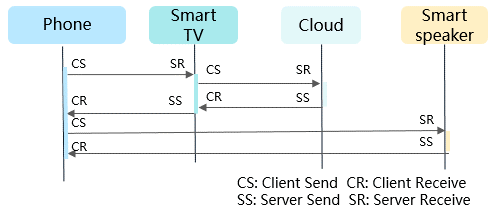
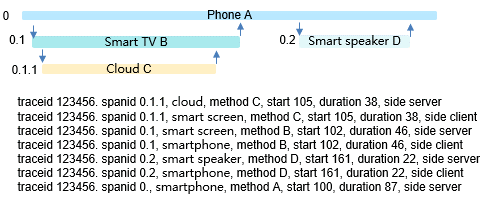

# HiTraceChain Development

## Overview

HiTraceChain tracks the call chain with the same **traceid** throughout the inter-device, inter-process, and inter-thread service processes. It associates and displays the call relationship and various output information during the entire process, helping you analyze and locate faults and optimize the system.


## When to Use

HiTraceChain can be used for the following purposes:

- Associates and reports service process information (such as logs and events) on the device.

- Displays and analyzes reported information on the cloud to facilitate fault location.

- Works with the IDE to debug the detailed service process and time consumption distribution for system optimization.

    **Figure 1** Use cases of HiTraceChain
    


### Usage Example

  **Figure 2** Service calling process \(inter-device and inter-process synchronous call\) 

  .png "service-calling-process-(inter-device-and-inter-process-synchronous-call)")

1. Display the call relationship in the service process, analyze key paths and function dependency, and determine the time consumption and call frequency at each call point to detect performance bottlenecks.

     **Figure 3** Service calling process
     


     **Figure 4** Time delay in the service calling process
     

2. Add **traceid** to logs and events automatically to facilitate comprehensive analysis and quick fault location.


## Available APIs

HiTraceChain provides C++ and C APIs. The upper-layer services mainly use HiTraceChain to start and stop call chain trace.

HiTraceChain is implemented at layer C. It works by transferring **traceid** throughout the service calling process. Before service processing, HiTrace sets **traceid** in the thread local storage (TLS) of the calling thread. During service processing, HiTrace obtains **traceid** from the contextual TLS of the calling thread and automatically adds it to the log and event information. After service processing is complete, HiTrace clears **traceid** from the TLS of the calling thread.


### Java, C++, and C APIs

  **Table 1** Description of C++ and C APIs

|  | **C++** | **C** |
| -------- | -------- | -------- |
| **Class**| **Function**| **Function**|
| HiTraceChain | HiTraceId Begin(const std::string&amp; name, int flags) | HiTraceIdStruct HiTraceChainBegin(const char* name, int flags) |
|  | void End(const HiTraceId&amp; id) | void HiTraceChainEnd(const HiTraceIdStruct* pId) |
|  | HiTraceId GetId(); | HiTraceIdStruct HiTraceChainGetId() |
|  | void SetId(const HiTraceId&amp; id) | void HiTraceChainSetId(const HiTraceIdStruct* pId) |
|  | void ClearId() | void HiTraceChainClearId() |
|  | HiTraceId CreateSpan() | HiTraceIdStruct HiTraceChainCreateSpan() |
|  | void Tracepoint(HiTraceTracepointType type, const HiTraceId&amp; id, const char* fmt, ...) | void HiTraceChainTracepoint(HiTraceTracepointType type, const HiTraceIdStruct* pId, const char* fmt, ...) |
|  | void Tracepoint(HiTraceCommunicationMode mode, HiTraceTracepointType type, const HiTraceId&amp; id, const char* fmt, ...) | void HiTraceChainTracepointEx(HiTraceCommunicationMode mode, HiTraceTracepointType type, const HiTraceIdStruct* pId, const char* fmt, ...) |
| HiTraceId | HiTraceId(); | void HiTraceChainInitId(HiTraceIdStruct* pId) |
|  | HiTraceId(const uint8_t* pIdArray, int len) | HiTraceIdStruct HiTraceChainBytesToId(const uint8_t* pIdArray, int len) |
|  | bool IsValid() | int HiTraceChainIsValid(const HiTraceIdStruct* pId) |
|  | bool IsFlagEnabled(HiTraceFlag flag) | int HiTraceChainIsFlagEnabled(const HiTraceIdStruct* pId, HiTraceFlag flag) |
|  | void EnableFlag(HiTraceFlag flag) | void HiTraceChainEnableFlag(HiTraceIdStruct* pId, HiTraceFlag flag) |
|  | int GetFlags() | int HiTraceChainGetFlags(const HiTraceIdStruct* pId) |
|  | void SetFlags(int flags) | void HiTraceChainSetFlags(HiTraceIdStruct* pId, int flags) |
|  | uint64_t GetChainId() | uint64_t HiTraceChainGetChainId(const HiTraceIdStruct* pId) |
|  | void SetChainId(uint64_t chainId) | void HiTraceChainSetChainId(HiTraceIdStruct* pId, uint64_t chainId) |
|  | uint64_t GetSpanId() | uint64_t HiTraceChainGetSpanId(const HiTraceIdStruct* pId) |
|  | void SetSpanId(uint64_t spanId) | void HiTraceChainSetSpanId(HiTraceIdStruct* pId, uint64_t spanId) |
|  | uint64_t GetParentSpanId() | uint64_t HiTraceChainGetParentSpanId(const HiTraceIdStruct* pId) |
|  | void SetParentSpanId(uint64_t parentSpanId) | void HiTraceChainSetParentSpanId(HiTraceIdStruct* pId, uint64_t parentSpanId) |
|  | int ToBytes(uint8_t* pIdArray, int len) | int HiTraceChainIdToBytes(const HiTraceIdStruct_ pId, uint8_t* pIdArray, int len) |


### Parameters of C++ APIs

  **Table 2** Trace flag combination types

| **Name**| **Value**| **Description**|
| -------- | -------- | -------- |
| HITRACE_FLAG_DEFAULT           | 0      | Default flag.      |
| HITRACE_FLAG_INCLUDE_ASYNC | 1      | Asynchronous call flag. By default, only synchronous calls are traced. If this flag is set, both synchronous and asynchronous calls will be traced.  |
| HITRACE_FLAG_DONOT_CREATE_SPAN | 1 << 1 | No span flag. By default, spans are created within a trace of synchronous and asynchronous service calls. If this flag is set, no spans are created.    |
| HITRACE_FLAG_TP_INFO           | 1 << 2 | Trace point flag. By default, no trace point is added when trace is enabled. This flag is used for debugging. If this flag is set, trace points will be automatically added on the TX and RX sides of synchronous and asynchronous calls to output trace point and timestamp information. Trace points are classified into four types: client send (CS), server receive (SR), server send (SS), and client receive (CR). For a synchronous call, the output trace points are CS, SR, SS, and CR; for an asynchronous call, the output trace points are CS, SR, and SS.      |
| HITRACE_FLAG_NO_BE_INFO        | 1 << 3 | No begin/end flag. By default, information about the start and end of the trace task is printed. If this flag is set, information about the start and end of the trace task will not be printed.|
| HITRACE_FLAG_DONOT_ENABLE_LOG       | 1 << 4 | Log association flag. If this flag is set, information about the trace task will not be printed. |
| HITRACE_FLAG_FAULT_TRIGGER   | 1 << 5 | Failure trigger flag. This flag is reserved for future use. |
| HITRACE_FLAG_D2D_TP_INFO       | 1 << 6 | Device-to-device trace point flag. It is a subset of **TP_INFO**. If this flag is set, trace points are added only for call chain trace between devices.|

  **Table 3** Trace point types

| **Name**| **Value**| **Description**|
| -------- | -------- | -------- |
| HITRACE_TP_CS       | 0 | CS trace point.       |
| HITRACE_TP_CR       | 1 | CR trace point.       |
| HITRACE_TP_SS       | 2 | SS trace point.       |
| HITRACE_TP_SR       | 3 | SR trace point.       |
| HITRACE_TP_GENERAL  | 4 | General trace points except CS, CR, SS, and SR.|

  **Table 4** Communication modes

| **Name**| **Value**| **Description**|
| -------- | -------- | -------- |
| HITRACE_CM_DEFAULT  | 0 | Default communication mode.   |
| HITRACE_CM_THREAD   | 1 | Inter-thread communication. |
| HITRACE_CM_PROCESS  | 2 | Inter-process communication. |
| HITRACE_CM_DEVICE   | 3 | Inter-device communication. |

  **Table 5** Description of C++ APIs

| **Class**| **API**| **Description**|
| -------- | -------- | -------- |
| HiTraceChain | HiTraceId Begin(const std::string&amp; name, int flags) | Starts HiTraceChain, generates a **HiTraceId** object, and sets it in the TLS of the calling thread.<br>Input arguments:<br>- **name**: name of the service process.<br>- **flags**: trace flags, which can be used in combination. For details, see Table 2.<br>Output arguments: none<br>Return value: a valid **HiTraceId** object if call chain trace is triggered successfully; returns an invalid object otherwise.<br>Note: In nested trace mode, an invalid object will be returned if trace is started at the nested layer.|
|  | void End(const HiTraceId&amp; id) | Stops HiTraceChain based on the **HiTraceId** object returned by the **Begin** API, and clears the **HiTraceId** object in the TLS of the calling thread.<br>Input arguments:<br>- **id**: **HiTraceId** object.<br>Output arguments: none<br>Return value: none|
|  | HiTraceId GetId(); | Obtains the **HiTraceId** object from the TLS of the calling thread.<br>Input arguments: none<br>Output arguments: none<br>Return value: **HiTraceId** object in the contextual TLS of the calling thread.|
|  | void SetId(const HiTraceId&amp; id) | Purpose: Sets the **HiTraceId** object in the TLS of the calling thread.<br>Input arguments:<br>- **id**: **HiTraceId** object.<br>Output arguments: none<br>Return value: none|
|  | void ClearId() | Clears the **HiTraceId** object in the TLS of the calling thread.<br>Input arguments: none<br>Output arguments: none<br>Return value: none|
|  | HiTraceId CreateSpan() | Obtains the span ID from the current **HiTraceId** object.<br>Input arguments: none<br>Output arguments: none<br>Return value: current span ID.|
|  | void Tracepoint(HiTraceTracepointType type, const HiTraceId&amp; id, const char* fmt, ...) | Outputs HiTraceChain trace point information based on the information type. The information includes the timestamp and **HiTraceId** object of the span.<br>Input arguments:<br>- **type**: trace point type. For details, see Table 3.<br>- **id**: ID of the current span.<br>- **fmt**: string describing the format variable parameter.<br>- **args**: variable parameter.<br>Output arguments: none<br>Return value: none|
|  | void Tracepoint(HiTraceCommunicationMode mode, HiTraceTracepointType type, const HiTraceId&amp; id, const char* fmt, ...) | Outputs HiTraceChain trace point information based on the communication mode and information type. The information includes the timestamp and **HiTraceId** object of the span.<br>Input arguments:<br>- **mode**: communication mode. For details, see Table 4.<br>- **type**: trace point type. For details, see Table 3.<br>- **id**: ID of the current span.<br>- **fmt**: string describing the format variable parameter.<br>- **args**: variable parameter.<br>Output arguments: none<br>Return value: none|
| HiTraceId | HiTraceId(); | Represents the default constructor used to generate an invalid **HiTraceId** object. <br>Input arguments: none<br>Output arguments: none<br>Return value: none|
|  | HiTraceId(const uint8_t* pIdArray, int len) | Represents the constructor used to create a **HiTraceId** object based on the specified byte array. <br>Input arguments:<br>- **pIdArray**: pointer to a byte array.<br>- **len**: length of the byte array.<br>Output arguments: none<br>Return value: none|
|  | bool IsValid() | Checks whether the **HiTraceId** object is valid.<br>Input arguments: none<br>Output arguments: none<br>Return value: **true** if the **HiTraceId** object is valid; **false** otherwise.|
|  | bool IsFlagEnabled(HiTraceFlag flag) | Checks whether the trace flag of the **HiTraceId** object is enabled.<br>Input arguments:<br>- **flag**: trace flag. For details, see the description in the **Begin** function.<br>Output arguments: none<br>Return value: **true** if the trace flag is enabled; **false** otherwise.|
|  | void EnableFlag(HiTraceFlag flag) | Enables the trace flag of the **HiTraceId** object.<br>Input arguments:<br>- **flag**: trace flag. For details, see the description in the **Begin** function.<br>Output arguments: none<br>Return value: none|
|  | int GetFlags() | Obtains the trace flag set in the **HiTraceId** object.<br>Input arguments: none<br>Output arguments: none<br>Return value: Returns the combination of trace flags. For details, see the description in the **Begin** function.|
|  | void SetFlags(int flags) | Sets a trace flag in the **HiTraceId** object.<br>Input arguments:<br>- **flags**: combination of trace flags. For details, see the description in the **Begin** function.<br>Output arguments: none<br>Return value: none|
|  | uint64_t GetChainId() | Obtains the call chain ID.<br>Input arguments: none<br>Output arguments: none<br>Return value: call chain ID.|
|  | void SetChainId(uint64_t chainId) | Sets the call chain ID in the **HiTraceId** object.<br>Input arguments:<br>- **chainId**: call chain ID.<br>Output arguments: none<br>Return value: none|
|  | uint64_t GetSpanId() | Obtains the span ID from the current **HiTraceId** object.<br>Input arguments: none<br>Output arguments: none<br>Return value: current span ID.|
|  | void SetSpanId(uint64_t spanId) | Sets the span ID in the **HiTraceId** object.<br>Input arguments:<br>- **spanId**: span ID.<br>Output arguments: none<br>Return value: none|
|  | uint64_t GetParentSpanId() | Obtains the parent span ID from the current **HiTraceId** object.<br>Input arguments: none<br>Output arguments: none<br>Return value: parent span ID.|
|  | void SetParentSpanId(uint64_t parentSpanId) | Sets the parent span ID in the **HiTraceId** object.<br>Input arguments:<br>- **parentSpanId**: parent span ID.<br>Output arguments: none<br>Return value: none|
|  | int ToBytes(uint8_t* pIdArray, int len) | Converts the **HiTraceId** object into a byte array to facilitate caching or communication transfer.<br>Input arguments:<br>- **pIdArray**: pointer to a byte array. The minimum length of the byte array is **HITRACE_ID_LEN**.<br>- **len**: length of the byte array.<br>Output parameters:<br>- **pIdArray**: pointer to a byte array. If the object is valid, the object data after conversion is stored.<br>Return value: a value greater than **0** (indicating a valid array of object data) if the conversion is successful; **0** otherwise.|


### Call Chain Processing

Inter-device, inter-process, and inter-thread calls are implemented through the communication mechanism. HiTraceChain requires transfer of **traceid** in the communication mechanism.

Some built-in communication mechanisms (such as ZIDL) of OpenHarmony already support the transfer of **traceid**.

The following figure shows the process of transferring **traceid** in synchronous call. The process of transferring **traceid** in asynchronous call is similar.

  Extended communication mechanisms can also follow this implementation.
  **Figure 5** Call chain trace in synchronous communication
  

The process is as follows:

1. The service module on the client calls the **begin()** function to start call chain trace.

2. The service module on the client synchronously calls the **transact** function to the communication component on the client.

3. The communication component on the client performs the following:
   1. Obtains **traceid** from the TLS of the calling thread.
   2. Generates child **traceid**.
   3. Writes child **traceid** into the transaction data (synchronous communication data).
   4. Performs CS trace.
   5. Sends communication data to the communication component on the server.

4. On receiving the communication data, the communication component on the server performs the following:
   1. Obtains **traceid** from the data message package.
   2. Sets **traceid** in the TLS of the calling thread.
   3. Performs SR trace.
   4. Synchronously calls the **onTransact** callback to the service module on the server.

5. The service module on the server processes the service and sends the transact reply message carrying the processing result to the communication component.

6. The communication component on the server performs the following:
   1. Performs SS trace.
   2. Sends communication data to the communication component on the client.
   3. Clears **traceid** from the TLS of the calling thread.

7. On receiving the communication data, the communication component on the client performs the following:
   1. Performs CR trace.
   2. Sends a transact reply response to the service module on the client.

8. The service module on the client processes the transact reply response.

9. When the process ends, the service module on the client calls the **end()** function to stop call chain trace.


## How to Develop


### **C++**

1. Develop the source code.
     Include the **hitracechain** header file in the class definition header file or class implementation source file. For example:
     
   ```
   #include "hitrace/tracechain.h"
   ```

     Add the code to start and stop call chain trace in the class implementation source file.
   
   ```
   using namespace OHOS::HiviewDFX;
   auto traceId = HiTraceChain::Begin("MyServiceFlow", HITRACE_FLAG_DEFAULT);
   ......
   HiTraceChain::End(traceId);
   ```

2. Configure compilation information. Specifically, add the subsystem SDK dependency to **BUILD.gn**.
   
   ```
   external_deps = [ "hitrace:libhitracechain" ]
   ```


### **C**

1. Develop the source code.
     Include the **hitracechain** header file in the source file.
     
   ```
   #include "hitrace/tracechain.h"
   ```

     Add the code to start and stop call chain trace in the class implementation source file.
   
   ```
   HiTraceIdStruct traceId = HiTraceChainBegin("MyServiceFlow", HITRACE_FLAG_DEFAULT);
   ......
   HiTraceChainEnd(traceId);
   ```

2. Configure compilation information. Specifically, add the subsystem SDK dependency to **BUILD.gn**.
   
   ```
   external_deps = [ "hitrace:libhitracechain" ]
   ```
