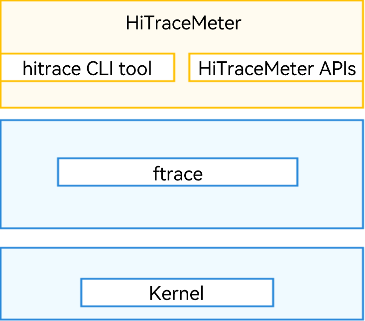

# HiTraceMeter

## Introduction

HiTraceMeter is the OpenHarmony subsystem that provides APIs to implement call chain trace throughout a service process. With HiTraceMeter, you can quickly obtain the run log specific to the call chain of a service process and locate faults in inter-device, inter-process, or inter-thread communications. HiTraceMeter supports event logging in user mode and can collect trace data in user mode and kernel mode for performance trace and analysis.

## Basic Concepts

The HiTraceMeter subsystem consists of three parts:

- JS/C++ HiTraceMeter APIs for application logging
- hitrace CLI tool for data collection
- smartperf tool for graphical data analysis 

Wherein, HiTraceMeter APIs and the hitrace CLI tool run on the device side, and the smartperf tool runs on the PC side. HiTraceMeter APIs are provided in C++ and JS for event logging, which aims to generate the trace data necessary for performance trace and analysis during the development process.

The hitrace CLI tool is used to collect trace data. It captures trace data flows and saves the data as a text file.

The smartperf tool allows you to perform data analysis manually or use the analysis script for automated data analysis. If you want to get the data analysis done automatically, you need to supply the data file generated by the hitrace CLI tool as the input for the smartperf tool.

  Traces data is classified by trace tag or trace category. Generally, one device subsystem corresponds to one tag. The tag is passed as the **Tag** parameter to event logging APIs. When you use the hitrace CLI tool to collect trace data, only the trace data specified by the **Tag** parameter is collected. Trace data of applications is fixedly labeled as **APP Tag**, and therefore, no **Tag** parameter needs to be passed to JS APIs. The following is a list of trace tags supported by HiTraceMeter. You can view the tags in [hitrace_meter.h](https://gitee.com/openharmony/hiviewdfx_hitrace/blob/master/interfaces/native/innerkits/include/hitrace_meter/hitrace_meter.h).

```cpp
constexpr uint64_t HITRACE_TAG_NEVER = 0; // This tag is never enabled.
constexpr uint64_t HITRACE_TAG_ALWAYS = (1ULL << 0); // This tag is always enabled.
constexpr uint64_t HITRACE_TAG_DLP_CREDENTIAL = (1ULL << 21); // This tag is dlp credential service.
constexpr uint64_t HITRACE_TAG_ACCESS_CONTROL = (1ULL << 22); // This tag is access control tag.
constexpr uint64_t HITRACE_TAG_NET = (1ULL << 23); // Net tag.
constexpr uint64_t HITRACE_TAG_NWEB = (1ULL << 24); // NWeb tag.
constexpr uint64_t HITRACE_TAG_HUKS = (1ULL << 25); // This tag is huks.
constexpr uint64_t HITRACE_TAG_USERIAM = (1ULL << 26); // This tag is useriam.
constexpr uint64_t HITRACE_TAG_DISTRIBUTED_AUDIO = (1ULL << 27); // Distributed audio tag.
constexpr uint64_t HITRACE_TAG_DLSM = (1ULL << 28); // device security level tag.
constexpr uint64_t HITRACE_TAG_FILEMANAGEMENT = (1ULL << 29); // filemanagement tag.
constexpr uint64_t HITRACE_TAG_OHOS = (1ULL << 30); // OHOS generic tag.
constexpr uint64_t HITRACE_TAG_ABILITY_MANAGER = (1ULL << 31); // Ability Manager tag.
constexpr uint64_t HITRACE_TAG_ZCAMERA = (1ULL << 32); // Camera module tag.
constexpr uint64_t HITRACE_TAG_ZMEDIA = (1ULL << 33); // Media module tag.
constexpr uint64_t HITRACE_TAG_ZIMAGE = (1ULL << 34); // Image module tag.
constexpr uint64_t HITRACE_TAG_ZAUDIO = (1ULL << 35); // Audio module tag.
constexpr uint64_t HITRACE_TAG_DISTRIBUTEDDATA = (1ULL << 36); // Distributeddata manager module tag.
constexpr uint64_t HITRACE_TAG_MDFS = (1ULL << 37); // Mobile distributed file system tag.
constexpr uint64_t HITRACE_TAG_GRAPHIC_AGP = (1ULL << 38); // Graphic module tag.
constexpr uint64_t HITRACE_TAG_ACE = (1ULL << 39); // ACE development framework tag.
constexpr uint64_t HITRACE_TAG_NOTIFICATION = (1ULL << 40); // Notification module tag.
constexpr uint64_t HITRACE_TAG_MISC = (1ULL << 41); // Notification module tag.
constexpr uint64_t HITRACE_TAG_MULTIMODALINPUT = (1ULL << 42); // Multi modal module tag.
constexpr uint64_t HITRACE_TAG_SENSORS = (1ULL << 43); // Sensors mudule tag.
constexpr uint64_t HITRACE_TAG_MSDP = (1ULL << 44); // Multimodal Sensor Data Platform module tag.
constexpr uint64_t HITRACE_TAG_DSOFTBUS = (1ULL << 45); // Distributed Softbus tag.
constexpr uint64_t HITRACE_TAG_RPC = (1ULL << 46); // RPC and IPC tag.
constexpr uint64_t HITRACE_TAG_ARK = (1ULL << 47); // ARK tag.
constexpr uint64_t HITRACE_TAG_WINDOW_MANAGER = (1ULL << 48); // window manager tag.
constexpr uint64_t HITRACE_TAG_ACCOUNT_MANAGER = (1ULL << 49); // account manager tag.
constexpr uint64_t HITRACE_TAG_DISTRIBUTED_SCREEN = (1ULL << 50); // Distributed screen tag.
constexpr uint64_t HITRACE_TAG_DISTRIBUTED_CAMERA = (1ULL << 51); // Distributed camera tag.
constexpr uint64_t HITRACE_TAG_DISTRIBUTED_HARDWARE_FWK = (1ULL << 52); // Distributed hardware fwk tag.
constexpr uint64_t HITRACE_TAG_GLOBAL_RESMGR = (1ULL << 53); // Global resource manager tag.
constexpr uint64_t HITRACE_TAG_DEVICE_MANAGER = (1ULL << 54); // Distributed hardware devicemanager tag.
constexpr uint64_t HITRACE_TAG_SAMGR = (1ULL << 55); // SA tag.
constexpr uint64_t HITRACE_TAG_POWER = (1ULL << 56); // power manager tag.
constexpr uint64_t HITRACE_TAG_DISTRIBUTED_SCHEDULE = (1ULL << 57); // Distributed schedule tag.
constexpr uint64_t HITRACE_TAG_DEVICE_PROFILE = (1ULL << 58); // device profile tag.
constexpr uint64_t HITRACE_TAG_DISTRIBUTED_INPUT = (1ULL << 59); // Distributed input tag.
constexpr uint64_t HITRACE_TAG_BLUETOOTH = (1ULL << 60); // bluetooth tag.
constexpr uint64_t HITRACE_TAG_ACCESSIBILITY_MANAGER = (1ULL << 61); // accessibility manager tag.
constexpr uint64_t HITRACE_TAG_APP = (1ULL << 62); // App tag.

constexpr uint64_t HITRACE_TAG_LAST = HITRACE_TAG_APP;
constexpr uint64_t HITRACE_TAG_NOT_READY = (1ULL << 63); // Reserved for initialization.
constexpr uint64_t HITRACE_TAG_VALID_MASK = ((HITRACE_TAG_LAST - 1) | HITRACE_TAG_LAST);
```

## Implementation Principles

HiTraceMeter provides the hitrace CLI tool for capturing trace data in user mode and kernel mode, and provides C++ (innerkits) and JS (kits) APIs for event logging in user mode. Through extending kernel's ftrace functionality, HiTraceMeter can use the trace_marker node of ftrace to write the data, which is written into the user space by event logging APIs, to the kernel buffer. The following figure shows the basic HiTraceMeter architecture.





## Constraints

- The implementation of HiTraceMeter functions and APIs depends on the ftrace functionality, a framework provided by the kernel. It enables developers to add more trace functions via plug-ins. Therefore, make sure that ftrace is enabled before you use HiTraceMeter.
  For most Linux kernels, ftrace is enabled by default. For details, see the ftrace documentation you may obtain.
- HiTraceMeter is available only for the mini system and standard system.
  
  

# HiTraceMeter Development

HiTraceMeter development focuses on two parts: JS/C++ event logging APIs and the hitrace CLI tool.


## When to Use

You may encounter unexpected issues like app freezing during app development or need to view the code's call chain during code debugging. With the APIs provided by HiTraceMeter, you'll be able to trace the application delay and call chain to identify performance problems.

## Available APIs

Only C++ APIs are now open for system developers. If you're developing a JS app, skip this section. The following table describes the APIs applicable to the standard system. You can find the APIs in [hitrace_meter.h](https://gitee.com/openharmony/hiviewdfx_hitrace/blob/master/interfaces/native/innerkits/include/hitrace_meter/hitrace_meter.h).

**Table 1** Sync APIs

| Sync trace                                                                   | Function     | Parameter Description                                                                 |
|:---------------------------------------------------------------------------- | --------- | --------------------------------------------------------------------- |
| void StartTrace(uint64_t label, const std::string& value, float limit = -1); | Starts a synchronous trace.| **label**: trace category.<br>**value**: trace data that indicates the specific status, such as the memory size and queue length.|
| void FinishTrace(uint64_t label);                                            | Stops a synchronous trace.| **label**: trace category.                                               |

**StartTrace** and **FinishTrace** must be used in pairs, and **FinishTrace** matches the latest **StartTrace**. The two APIs can be used in nested mode. The stack data structure is used for matching during trace data parsing. The **limit** parameter is used for flow control, and you are advised to use the default value.

**Table 2** Async APIs

| Async trace                                                                                       | Function     | Parameter Description                                                                                                |
| ------------------------------------------------------------------------------------------------- | --------- | ---------------------------------------------------------------------------------------------------- |
| void StartAsyncTrace(uint64_t label, const std::string& value, int32_t taskId, float limit = -1); | Starts an asynchronous trace.| **label**: trace category.<br>**value**: trace data that indicates the specific status, such as the memory size and queue length.<br>**taskId**: ID used to indicate the association of APIs in an asynchronous trace.|
| void FinishAsyncTrace(uint64_t label, const std::string& value, int32_t taskId);                  | Stops an asynchronous trace.| **label**: trace category.<br>**value**: trace data that indicates the specific status, such as the memory size and queue length.<br>**taskId**: ID used to indicate the association of APIs in an asynchronous trace.|


The trace data of **StartAsyncTrace** and **FinishAsyncTrace** is matched based on **value** and **taskId**, and therefore, the two APIs can be used without a strict sequence. In C++ applications, asynchronous traces are seldom used.

**Table 3** Counter APIs

| Counter Trace                                                      | Function   | Parameter Description                                                          |
| ------------------------------------------------------------------ | ------- | -------------------------------------------------------------- |
| void CountTrace(uint64_t label, const std::string& name, int64_t); | Count trace.| **label**: trace category.<br>**name**: trace name displayed in the IDE.|

## How to Develop

1. Add the build dependencies to the build configuration file **base\hiviewdfx\hitrace\cmd\BUILD.gn**.
   
   ```
   external_deps = [ "hitrace:hitrace_meter"]
   ```

2. Add the header file dependencies.
   
   ```cpp
   #include "hitrace_meter.h"// Header file for defining APIs
   ```

3. When calling an API, pass the trace value as an input parameter. The trace tags currently supported are listed in **hitrace_meter.h**. Assume that the trace tag is **OHOS** and trace data of **func1** and **func2** needs to be captured. After the hitrace command is executed in the shell, the trace data is automatically captured. The captured data includes the function call process and the memory and time consumed during this process. You can use the data to analyze the call process to identify performance problems.
   
   ```cpp
   #include "hitrace_meter.h" // Include hitrace_meter.h
   using namespace std;
   
   int main()
   {
      uint64_t label = BYTRACE_TAG_OHOS;
      sleep(1);
      CountTrace(label, "count number", 2000);  // Integer trace
   
      StartTrace(label, "func1Trace", -1); // Trace start point of func1Start
      sleep(1);
      StartTrace(label, "func2Trace", -1);   // Trace start point of func2Start
      sleep(2);
      FinishTrace (label); // Trace end point of func2Trace
      sleep(1);
      FinishTrace(label);   // Trace end point of func1Trace
   
      StartAsyncTrace(label, "asyncTrace1", 1234); // Trace start point of asyncTrace1  
      FinishAsyncTrace(label, "asyncTrace1", 1234); // Trace end point of asyncTrace1
   
      return 0;
   } 
   ```

4. On completion of HiTraceMeter building and deployment, start a trace. After you run the application in the shell on the device, trace data will be captured automatically.
   
   ```
   hdc_std shell hitrace -t 10 ohos > .\myapp_demo.ftrace
   ```
   
   You can open the captured data by clicking **Open trace file** in the smartperf tool or dragging the data to the graphics area. For details, see [smartperf](https://toscode.gitee.com/openharmony-sig/smartperf).

## Verification

The following is a demo debugging process, where the **StartTrace** and **FinishTrace** APIs are used in synchronization mode.

1. Write the test code file [hitrace_example.cpp](https://gitee.com/openharmony/hiviewdfx_hitrace/blob/master/cmd/example/hitrace_example.cpp) by adding the **StartTrace** and **FinishTrace** APIs to the code.
   
   ```cpp
   int main()
   {
       thread t1(ThreadFunc1);
       t1.join();
   
       StartTrace(LABEL, "testStart");
       sleep(SLEEP_ONE_SECOND);
   
       StartTrace(LABEL, "funcAStart", SLEEP_ONE_SECOND); // Trace start point
       FuncA();
       FinishTrace(LABEL);
       sleep(SLEEP_TWO_SECOND);
   
       thread t2(ThreadFunc2);
       t2.join();
   
       StartTrace(LABEL, "funcBStart", SLEEP_TWO_SECOND);
       FuncB();
       FinishTrace(LABEL);// Trace end point
       sleep(SLEEP_TWO_SECOND);
   
       sleep(SLEEP_ONE_SECOND);
       FinishTrace(LABEL);
       FuncC();
   
       return 0;
   }
   ```

2. Modify the **base\hiviewdfx\hitrace\cmd\BUILD.gn** file, and start building.
   
   ```
   ohos_executable("hitrace_example") {
     sources = [ "example/hitrace_example.cpp" ]
   
     external_deps = [ "hitrace:hitrace_meter" ]
   
     subsystem_name = "hiviewdfx"
     part_name = "hitrace_native"
   }
   
   group("hitrace_target") {
     deps = [
       ":hitrace",
       ":hitrace_example",
     ]
   }
   ```

3. Place the **hitrace_example** executable file in the **/system/bin** directory of the device, and run the following commands in sequence in the shell:
   
   ```shell
   hitrace --trace_begin ohos
   hitrace_exampe
   hitrace --trace_dump
   ```
   
    If the expected trace value is present in the trace data, the capture of trace data is successful. For example:
   
   ```
   <...>-1651    (-------) [002] ....   327.194136: tracing_mark_write: S|1650|H:testAsync 111
   <...>-1650    (-------) [001] ....   332.197640: tracing_mark_write: B|1650|H:testStart
   <...>-1650    (-------) [001] ....   333.198018: tracing_mark_write: B|1650|H:funcAStart
   <...>-1650    (-------) [001] ....   334.198507: tracing_mark_write: E|1650|
   <...>-1654    (-------) [003] ....   341.201673: tracing_mark_write: F|1650|H:testAsync 111
   <...>-1650    (-------) [001] ....   341.202168: tracing_mark_write: B|1650|H:funcBStart
   <...>-1650    (-------) [001] ....   343.202557: tracing_mark_write: E|1650|
   <...>-1650    (-------) [001] ....   346.203178: tracing_mark_write: E|1650|
   <...>-1650    (-------) [001] ....   346.203457: tracing_mark_write: C|1650|H:count number 1
   <...>-1650    (-------) [001] ....   347.203818: tracing_mark_write: C|1650|H:count number 2
   <...>-1650    (-------) [001] ....   348.204207: tracing_mark_write: C|1650|H:count number 3
   <...>-1650    (-------) [001] ....   349.204473: tracing_mark_write: C|1650|H:count number 4
   <...>-1650    (-------) [001] ....   350.204851: tracing_mark_write: C|1650|H:count number 5
   <...>-1655    (-------) [001] ....   365.944658: tracing_mark_write: trace_event_clock_sync: realtime_ts=1502021460925
   <...>-1655    (-------) [001] ....   365.944686: tracing_mark_write: trace_event_clock_sync: parent_ts=365.944641
   ```
   
   

# Using the hitrace CLI Tool

The hitrace CLI tool is an executable binary program. On an OpenHarmony-powered device, you can run the following commands in the shell to capture kernel's running data.

**Table 4** Command list

| Option                        | Description                                              |
| ----------------------------- | -------------------------------------------------------- |
| -h, --help                    | Views the help Information.                                              |
| -b *n*, --buffer_size *n*         | Sets the buffer size for trace data in KB. The default value is **2048**.                         |
| -t *n*, --time *n*                | Sets the trace uptime in seconds, which depends on the time required for analysis.                       |
| --trace_clock clock           | Sets the type of the clock for adding a timestamp to a trace. The value can be **boot** (default), **global**, **mono**, **uptime**, or **perf**.|
| --trace_begin                 | Starts capturing trace data.                                                |
| --trace_dump                  | Dumps trace data to the specified position. The default position is the console.                                       |
| --trace_finish                | Stops capturing trace data and dumps trace data to the specified position. The default position is the console.                             |
| --trace_finish_nodump         | Stops capturing trace packets and dumping trace data.                                |
| -l, --list_categories         | Lists the trace categories supported by the device.                                         |
| --overwrite                   | Sets the action to take when the buffer is full. If this option is used, the latest trace data is discarded. If this option is not used, the earliest trace data is discarded (default).                           |
| -o *filename*, --output *filename*| Outputs trace data to the specified file.                                             |
| -z                            | Compresses the trace data.                                            |

Examples:

- Query supported labels.
  
  ```
  
  hitrace -l
  
  ```
  
  Alternatively, run the following command:
  
  ```
  
  hitrace --list_categories
  
  ```

- Trace ability information for 10 seconds and store the trace data in a buffer of 4 MB.
  
  ```
  
  hitrace -b 4096 -t 10 --overwrite ability > /data/log/mytrace.ftrace
  
  ```

- Set the clock type to **mono**.
  
  ```
  
  hitrace --trace_clock mono  -b 4096 -t 10 --overwrite ability > /data/log/mytrace.ftrace
  
  ```

- Compress the trace data.
  
  ```
  
  hitrace -z  -b 4096 -t 10 --overwrite ability > /data/log/mytrace.ftrace
  
  ```
  
  

# FAQs

### Incomplete or Empty Data Captured by hitrace

#### Symptom

The data captured by running the hitrace command is incomplete or no data is captured.

#### **Root Cause**

The value of **-t** or **-b** buffer is too small, leading to data loss.

#### Solution

You can set **-t** to **60** and **-b** to **204800** to increase the trace time and buffer size.


# Reference

For details about HiTraceMeter, see [hiviewdfx_hitrace: Lightweight Distributed Trace](https://gitee.com/openharmony/hiviewdfx_hitrace).
