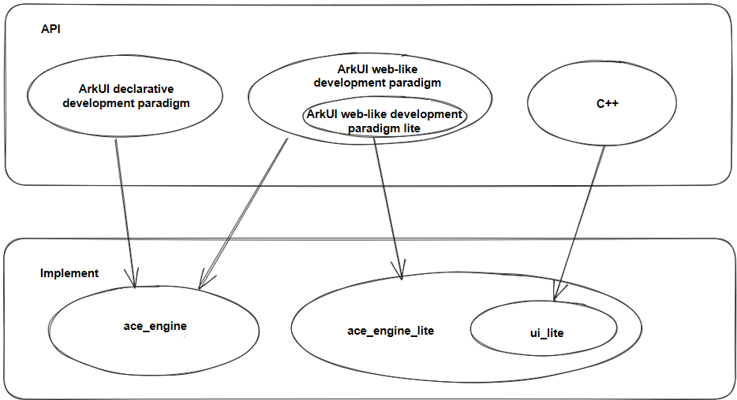
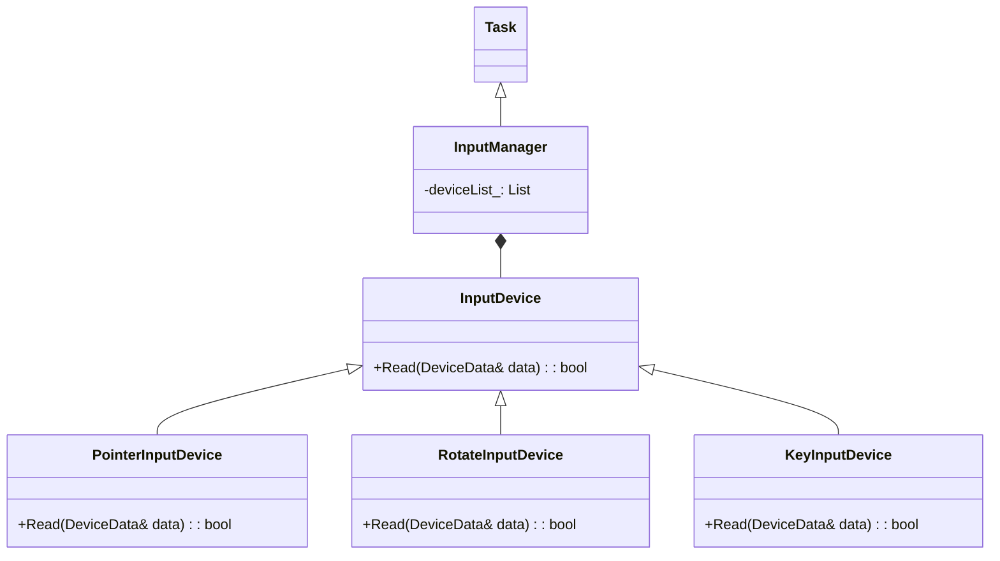
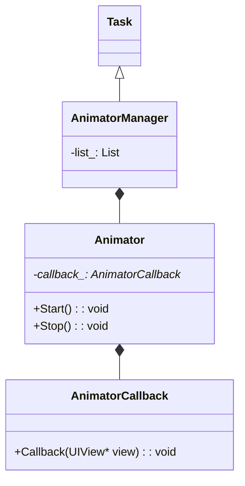
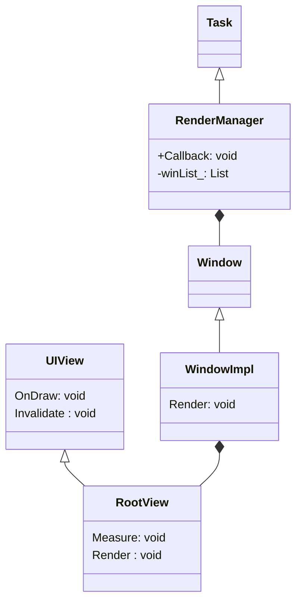

# Overview of Small-System Graphics

## Overview
The small-system graphics framework, a lightweight graphics framework, includes lightweight UI components, animations, events, 2D graphics libraries, font layout engines, multi-backend rendering, and window manager modules. It is mainly used for UI display on small-system devices with screens, such as sports watches and smart home devices.

### Relationship Between UIs in OpenHarmony
You may have learned different development paradigms of OpenHarmony. What is the relationship between them and the small-system graphics framework?

Currently, the [ace_engine repository](https://gitee.com/openharmony/arkui_ace_engine) implements two development frameworks: ArkUI declarative development paradigm and ArkUI web-like development paradigm. For details about their differences, see [ArkUI Overview](../../application-dev/ui/arkui-overview.md). Based on the characteristics of the small system, the [ace_engine_lite repository](https://gitee.com/openharmony/arkui_ace_engine_lite) implements the lightweight ArkUI web-like development paradigm, which is named ArkUI web-like development paradigm lite. Its capabilities are a subset of the ArkUI web-like development paradigm.

OpenHarmony supports the following development modes by system type:
- Standard system:
  - ArkUI declarative development paradigm (recommended)
  - ArkUI web-like development paradigm
- Small system:
  - ArkUI web-like development paradigm lite
  - C++ development (for system applications)

The figure below shows the code implementation relationship between [ui_lite](https://gitee.com/openharmony/arkui_ui_lite), [ace_engine_lite](https://gitee.com/openharmony/arkui_ace_engine_lite), and [ace_engine](https://gitee.com/openharmony/arkui_ace_engine) in the small-system graphics framework.

When determining the API suite used for your application development, preferentially select the ArkUI declarative development paradigm for the standard system and the ArkUI web-like development paradigm lite for the small system. When developing a system application on devices with low configurations, you can use C++ APIs for higher performance and better flexibility.

### UI Components
The small-system graphics framework implements basic components, such as button, text, and progress bar.

It also provides complex components such as list, swiper, and image sequence frame.

### Layouts
The framework implements grid layout and flexible layout (such as centered, left-aligned, and right-aligned).

As each layout is a one-off, the positions of components in a specific layout are calculated each time related functions are called on the layout. However, if the position of a component changes with an operation (dragging for example), the positions of other associated components do not automatically change.

### Animations
The framework supports custom animations. All animations are managed by AnimatorManager. Based on the screen refresh event, AnimatorManager periodically calls the callback functions to process attribute changes and then triggers component re-rendering to achieve the animation effect.

You can call related functions to start, stop, pause, resume, create, and destroy an animation.

### Events
Input events include touchscreen and physical key input events. Each time the GUI engine runs, InputManager reads the input of all registered hardware devices and converts the input into various events for UI components to use.

### Rendering
2D graphics rendering: Draws lines, rectangles, triangles, and arcs.

Image rendering: Draws images of various types, such as RGB565, RGB888, ARGB8888, PNG, and JPG.

Font rendering: Draws vector fonts in real time.

## Implementation Principles

In the small-system graphics framework, the task queue is driven by the screen refresh signal. The task queue stores every task. A periodic screen refresh signal triggers a periodic callback to cyclically drive the execution of a task in the task queue. Operations such as input events, animations, and rendering are executed as independent tasks.

### Event Interaction

The small-system graphics framework supports the touch event (PointerInputDevice), key event (KeyInputDevice), and crown rotation event (RotateInputDevice).

The figure above shows the input event classes. Each type of input event overrides the **Read** function of the **InputDevice** base class based on its own features, reads input data, generates an event based on the input data, and distributes the event to the corresponding UI component. For example, **PointerInputDevice** reads the touch coordinates, searches for the component corresponding to the coordinates from the component tree, generates a touch, touch and hold, or drag event, and distributes the event to that component.

### Animation Framework

To implement a custom animation, you need to inherit from the **Animator** class and implement the callback function of **AnimatorCallback**. All animations are managed by **AnimatorManager** in a unified manner. The input parameter of the callback function is **view** (component) of the current animation. You can modify the component attributes to generate the animation effect, such as the coordinate change, color change, and zoom effect.

### Rendering Framework

 - Each window has a **RootView**.
 - **RootView** is the root node of a window. All components in a window can be displayed only after being mounted to **RootView**.
 - **UIView** is the base class of all components. Each component implements its own **OnDraw** function.
 - When the display of a component changes, the **Invalidate** function is called to mark the current area as a dirty area.
 - **RootView** manages information about all dirty areas in a window.
 - Each time a screen refresh signal is triggered, all windows are traversed and rendered. For each window, the **Measure** function is called for layout from **RootView**, and then the **Render** function is called to render the components in all the dirty areas.
