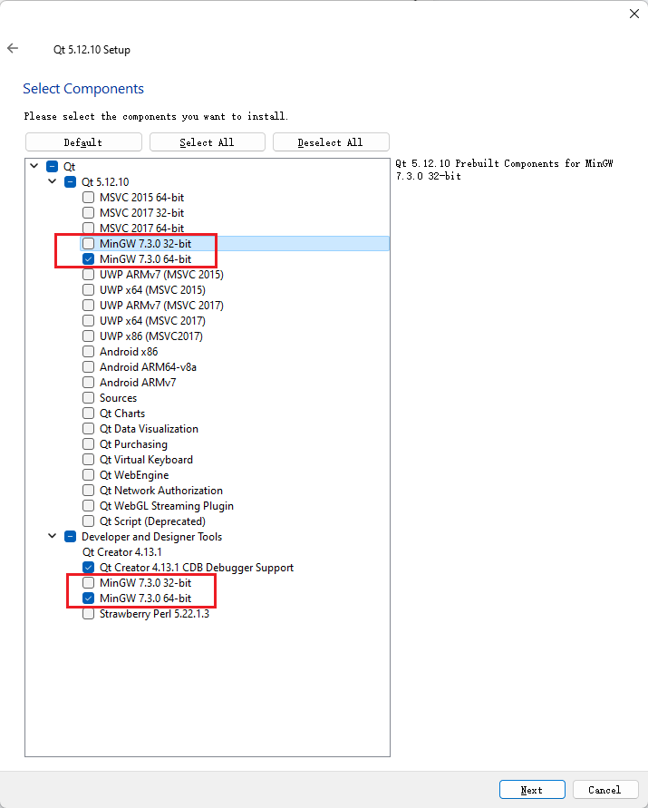
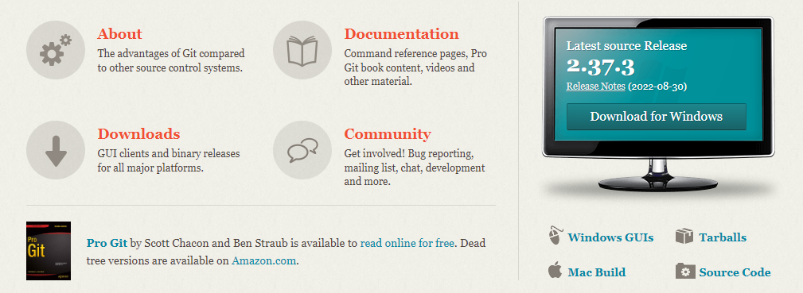
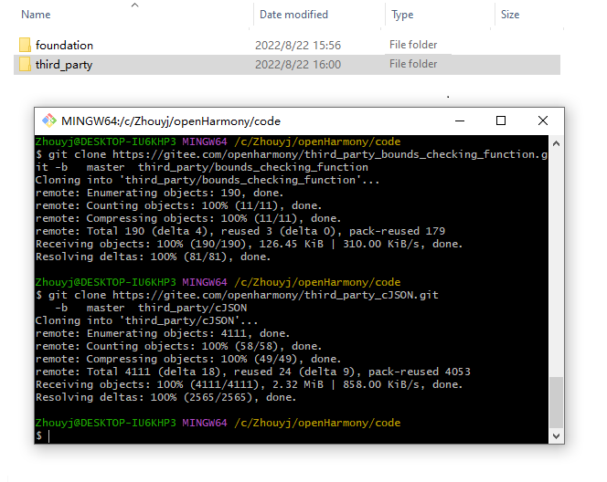
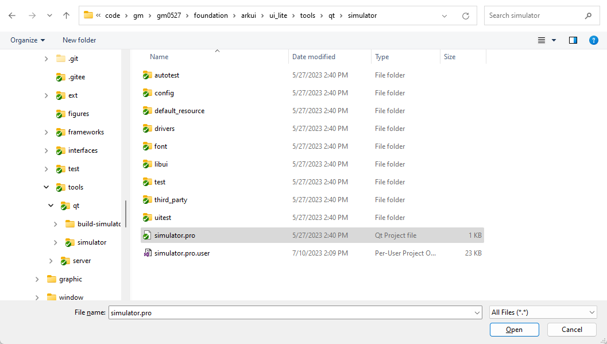
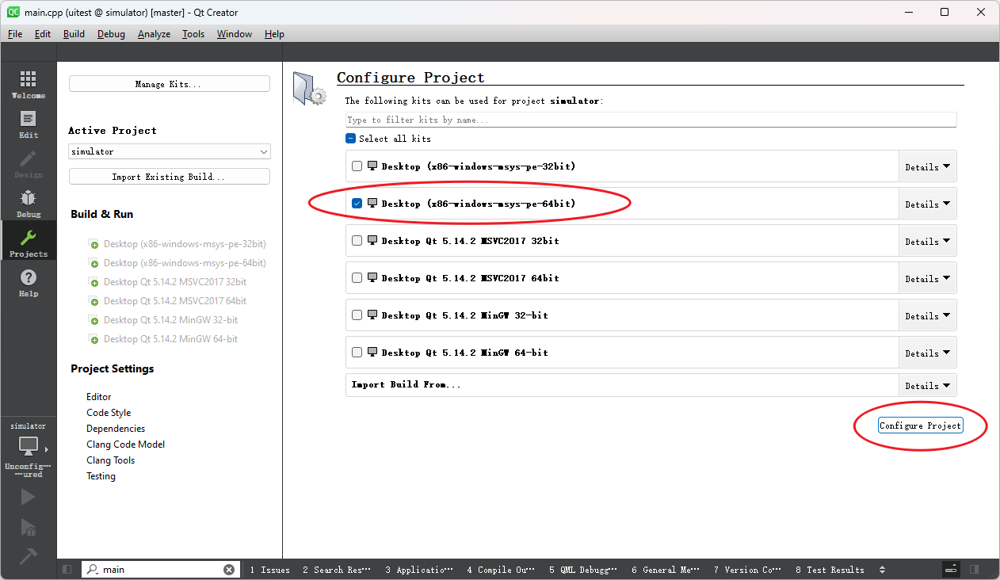
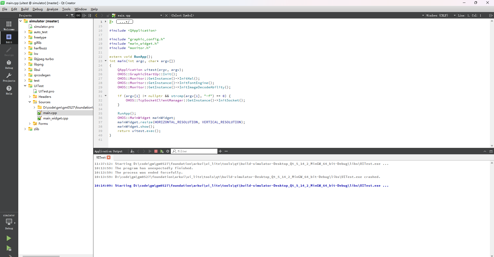
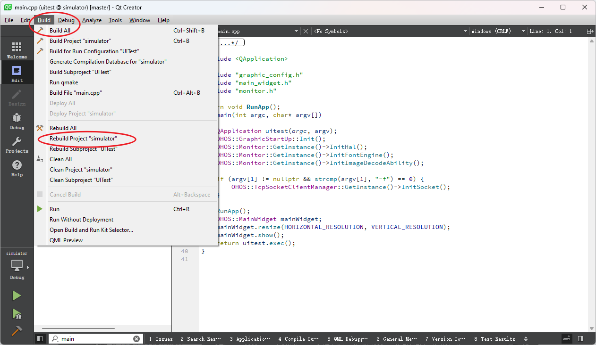
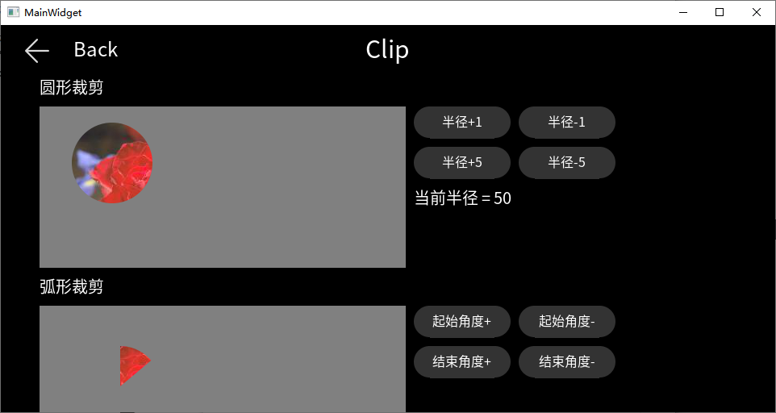

# Using Qt Creator on Windows

Qt Creator is a cross-platform integrated development environment that enables you to get started and perform application development operations efficiently and easily. The graphics framework provides a Qt Creator project for you to quickly get familiar with the graphics framework.

This topic describes how to install Qt Creator and Git on the Windows PC, obtain the minimum code repository of the UI simulator, and build and run the project.

## Software Installation

You need to download and install QT Creator and Git.

### Installing Qt Creator
Download Qt from the official website [https://www.qt.io/offline-installers](https://www.qt.io/offline-installers).

Select the following three components during the installation:



### Installing and Configuring Git
Download Git from the [official website](https://git-scm.com/).



Double-click the downloaded installation program and complete the installation as prompted.

## Obtaining the Minimum Code Repository of the UI Simulator

### Source Code Acquisition

Run the following git commands to pull the minimum code repository of the UI simulator.

```git
git clone https://gitee.com/openharmony/arkui_ui_lite.git                        -b   master  foundation/arkui/ui_lite
git clone https://gitee.com/openharmony/graphic_graphic_utils_lite.git           -b   master  foundation/graphic/graphic_utils_lite

git clone https://gitee.com/openharmony/graphic_surface_lite.git                 -b   master  foundation/graphic/surface_lite
git clone https://gitee.com/openharmony/window_window_manager_lite.git           -b   master  foundation/window/window_window_manager_lite

git clone https://gitee.com/openharmony/third_party_zlib.git                     -b   master  third_party/zlib
git clone https://gitee.com/openharmony/third_party_qrcodegen.git                -b   master  third_party/qrcodegen
git clone https://gitee.com/openharmony/third_party_libpng.git                   -b   master  third_party/libpng
git clone https://gitee.com/openharmony/third_party_libjpeg.git                  -b   master  third_party/libjpeg
git clone https://gitee.com/openharmony/third_party_icu.git                      -b   master  third_party/icu
git clone https://gitee.com/openharmony/third_party_harfbuzz.git                 -b   master  third_party/harfbuzz
git clone https://gitee.com/openharmony/third_party_freetype.git                 -b   master  third_party/freetype
git clone https://gitee.com/openharmony/third_party_bounds_checking_function.git -b   master  third_party/bounds_checking_function
git clone https://gitee.com/openharmony/third_party_cJSON.git                    -b   master  third_party/cJSON
git clone https://gitee.com/openharmony/third_party_giflib.git                   -b   master  third_party/giflib
git clone https://gitee.com/openharmony/third_party_libjpeg-turbo.git            -b   master  third_party/libjpeg-turbo
```

1. Create a source code project directory.
2. Right-click the new directory and choose **Git Bash Here**.
3. Copy and paste the preceding commands to the terminal, press **Enter**, and wait until the download is complete. Alternatively, create a **clone.bat** file in the directory, copy and save the preceding commands, double-click **clone.bat**, and wait until the download is complete.

  

### Opening Qt Creator

1. Choose **File > Open File or Project**.
2. Select the project in the displayed dialog box.

The path of the source code is as follows:
```bash
foundation/arkui/ui_lite/tools/qt/simulator/simulator.pro
```

Note: When you open the project for the first time, select only **minGW** in the **kits** list on the **Configure Project** page.



3. Click **Configure Project** to load the project.



### UI Test Application Running Entry

Expand the project tree.

```
simulator
  |-UITest
    |-Sources
      |-main.cpp
```


### Build

Choose **Build > Build Project "simulator"**, or right-click the project tree and choose **Rebuild**.



### Debugging

Click the running triangle in the lower left corner to run the code, and click the debugging button to start debugging.



