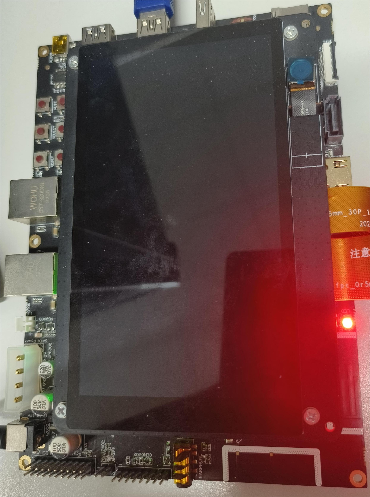
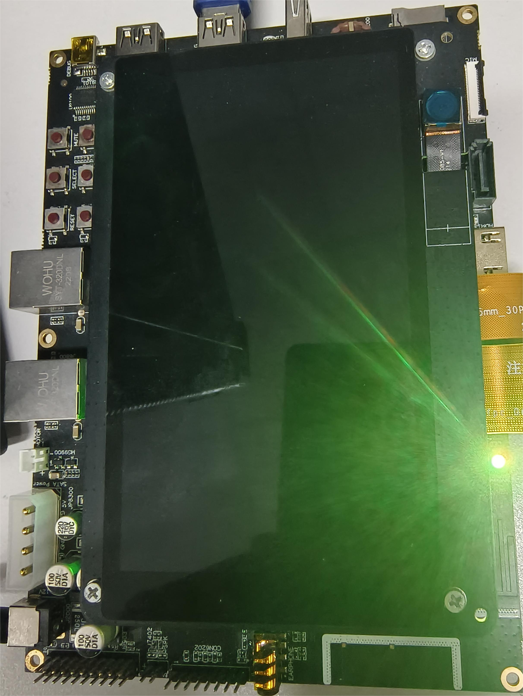
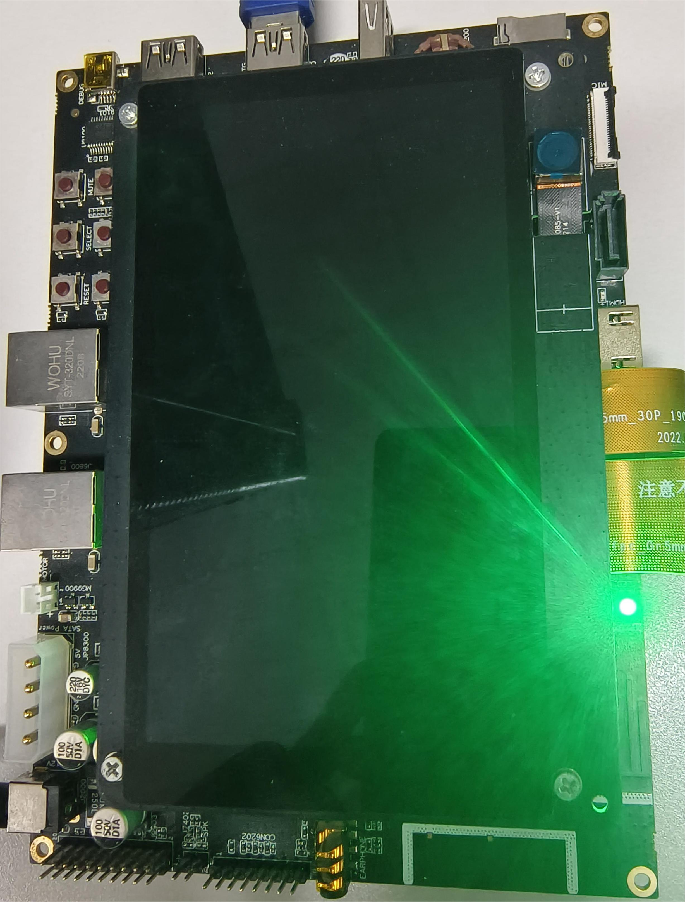
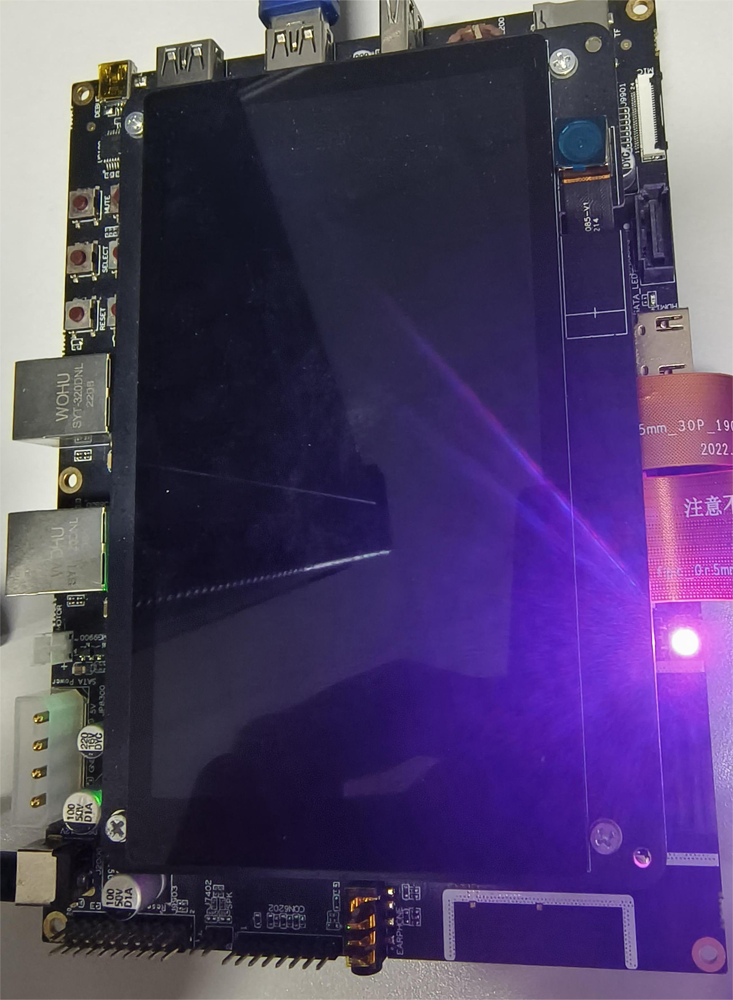
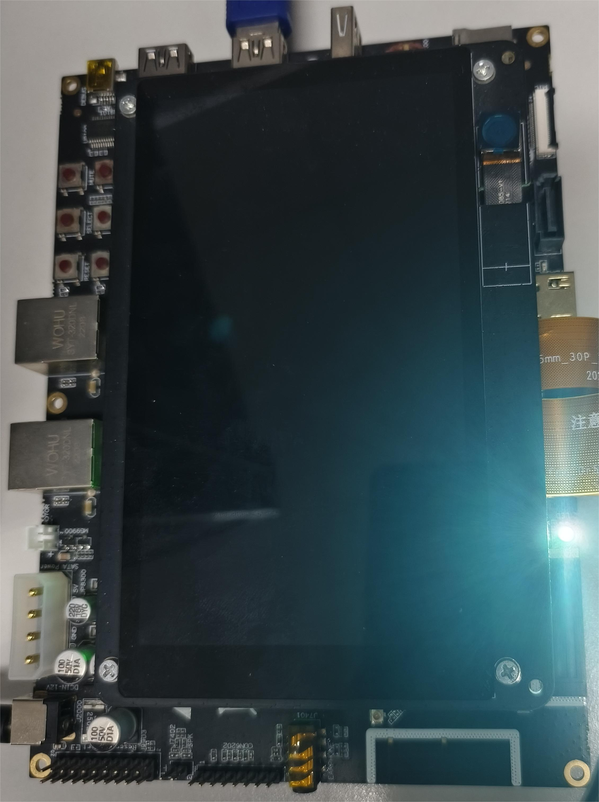

# Battery Level and LED Color Mapping Customization

## Overview

### Introduction

OpenHarmony provides the battery level and LED color mapping by default. Some products, tablets for example, may use LED colors to display the battery level during charging. For example, green indicates a high battery level is high, yellow indicates a low battery level, and red indicates an extremely low battery level. The battery level and LED color mapping varies according to products. To address this issue, OpenHarmony provides the function of customizing the battery level and LED color mapping.

### Constraints

 
The configuration path for battery level customization is subject to the [configuration policy](https://gitee.com/openharmony/customization_config_policy). In this development guide, `/vendor` is used as an example of the configuration path. During actual development, you need to modify the customization path based on the product configuration policy.

## How to Develop

### Setting Up the Environment

**Hardware requirements:**

Development board running the standard system, for example, the DAYU200 or Hi3516D V300 open source suite.

**Environment requirements:**

For details about the requirements on the Linux environment, see [Quick Start](../quick-start/quickstart-overview.md).

### Getting Started with Development

The following uses [DAYU200](https://gitee.com/openharmony/vendor_hihope/tree/master/rk3568) as an example to illustrate customization of the battery level and LED color mapping.

1. Create the `battery` folder in the product directory [/vendor/hihope/rk3568](https://gitee.com/openharmony/vendor_hihope/tree/master/rk3568).

2. Create a target folder by referring to the [default folder of battery level and LED color mapping configuration](https://gitee.com/openharmony/powermgr_battery_manager/tree/master/services/native/profile), and install it in `//vendor/hihope/rk3568/battery`. The content is as follows:

    ```text
    profile
    ├── BUILD.gn
    ├── battery_config.json
    ```

3. Write the custom `battery_config.json` file by referring to the [battery_config.json](https://gitee.com/openharmony/powermgr_battery_manager/blob/master/services/native/profile/battery_config.json) file in the default folder of battery level and LED color mapping configuration. For example:

    ```json
    {
        "light": {
            "low": {
                "soc": [0, 20],
                "rgb": [255, 192, 203]
            },
            "normal": {
                "soc": [20, 95],
                "rgb": [255, 0, 255]
            },
            "high": {
                "soc": [95, 100],
                "rgb": [0, 0, 255]
            }
        }
    }
    ```

    **Table 1** Description of battery levels

    | Battery Level| Description|
    | -------- | -------- |
    | low | Low battery level|
    | normal | Normal battery level|
    | high | High battery level|

    **Table 2** Configuration items for the battery level range and LED color

    | Configuration Item| Description|
    | -------- | -------- |
    | soc | Battery level range|
    | rgb | LED RGB combination|


4. Write the `BUILD.gn` file by referring to the [BUILD.gn](https://gitee.com/openharmony/powermgr_battery_manager/blob/master/services/native/profile/BUILD.gn) file in the default folder of battery level and LED color mapping configuration to pack the `battery_config.json` file to the `//vendor/etc/battery` directory. The configuration is as follows:

    ```shell
    import("//build/ohos.gni")                # Reference build/ohos.gni.

    ohos_prebuilt_etc("battery_config") {
        source = "battery_config.json"
        relative_install_dir = "battery"
        install_images = [ chipset_base_dir ] # Required configuration for installing the battery_config.json file in the vendor directory.
        part_name = "product_rk3568"          # Set part_name to product_rk3568 for subsequent build.
    }
    ```

5. Add the build target to `module_list` in [ohos.build](https://gitee.com/openharmony/vendor_hihope/blob/master/rk3568/ohos.build) in the `/vendor/hihope/rk3568` directory. For example:

    ```json
    {
    "parts": {
        "product_rk3568": {
        "module_list": [
            "//vendor/hihope/rk3568/default_app_config:default_app_config",
            "//vendor/hihope/rk3568/image_conf:custom_image_conf",
            "//vendor/hihope/rk3568/preinstall-config:preinstall-config",
            "//vendor/hihope/rk3568/resourceschedule:resourceschedule",
            "//vendor/hihope/rk3568/etc:product_etc_conf",
            "//vendor/hihope/rk3568/battery/profile:battery_config" # Add the configuration for building of battery_config.
        ]
        }
    },
    "subsystem": "product_hihope"
    }
    ```
    In the preceding code, //vendor/hihope/rk3568/battery/ is the folder path, profile is the folder name, and battery_config is the build target.

6. Build the customized version by referring to [Quick Start](../quick-start/quickstart-overview.md).

    ```shell
    ./build.sh --product-name rk3568 --ccache
    ```

7. Burn the customized version to the DAYU200 development board.

### Debugging and Verification

1. After startup, run the following command to launch the shell command line:
    ```
    hdc shell
    ```

2. Go to the custom battery level configuration directory. The path of DAYU200 is used as an example.
    ```
    cd /data/service/el0/battery/battery
    ```

3. Modify the charging status, simulate reporting of the battery power change, and check whether the LED color is correct. The following uses the default battery level and LED color mapping configuration as an example.
    
    1. Modify the battery power.
    ```
    echo 5 > capacity
    ```
    2. Report the battery power change to trigger the LED mapping.
    ```
    hidumper -s 3302 -a -r
    ```
    
    
    3. Modify the battery power.
    ```
    echo 50 > capacity
    ```
    4. Report the battery power change to trigger the LED mapping.
    ```
    hidumper -s 3302 -a -r
    ```
    
    
    5. Modify the battery power.
    ```
    echo 100 > capacity
    ```
    6. Report the battery power change to trigger the LED mapping.
    ```
    hidumper -s 3302 -a -r
    ```
    

4. Customize the battery level and LED color mapping configuration. For example:
    ```json
    {
        "light": {
            "low": {
                "soc": [0, 20],
                "rgb": [255, 192, 203]
            },
            "normal": {
                "soc": [20, 95],
                "rgb": [255, 0, 255]
            },
            "high": {
                "soc": [95, 100],
                "rgb": [0, 0, 255]
            }
        }
    }
    ```

    1. Modify the battery power.
    ```
    echo 15 > capacity
    ```
    2. Report the battery power change to trigger the LED mapping.
    ```
    hidumper -s 3302 -a -r
    ```
    

    3. Modify the battery power.
    ```
    echo 95 > capacity
    ```
    4. Report the battery power change to trigger the LED mapping.
    ```
    hidumper -s 3302 -a -r
    ```
    

    5. Modify the battery power.
    ```
    echo 99 > capacity
    ```
    6. Report the battery power change to trigger the LED mapping.
    ```
    hidumper -s 3302 -a -r
    ```
    

## Reference
During development, you can refer to the [default battery level and LED color mapping configuration](https://gitee.com/openharmony/powermgr_battery_manager/blob/master/services/native/profile/battery_config.json), as shown below:

 

```json 
{
    "light": {
        "low": {
            "soc": [0, 10],
            "rgb": [255, 0, 0]
        },
        "normal": {
            "soc": [10, 90],
            "rgb": [255, 255, 0]
        },
        "high": {
            "soc": [90, 100],
            "rgb": [0, 255, 0]
        }
    }
}
``` 

Packing path: /system/etc/battery
