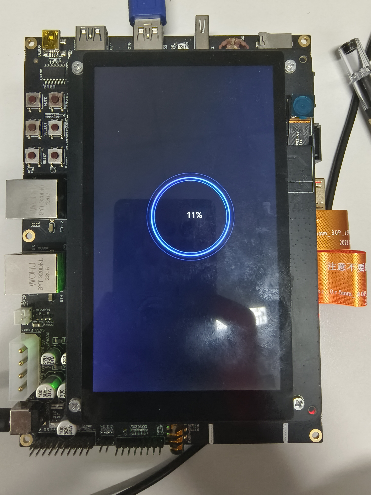
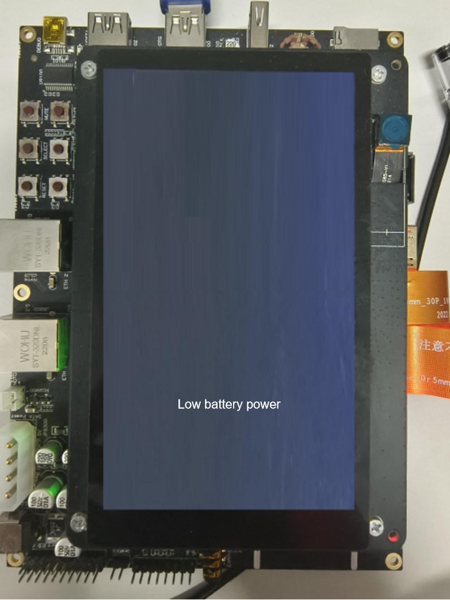
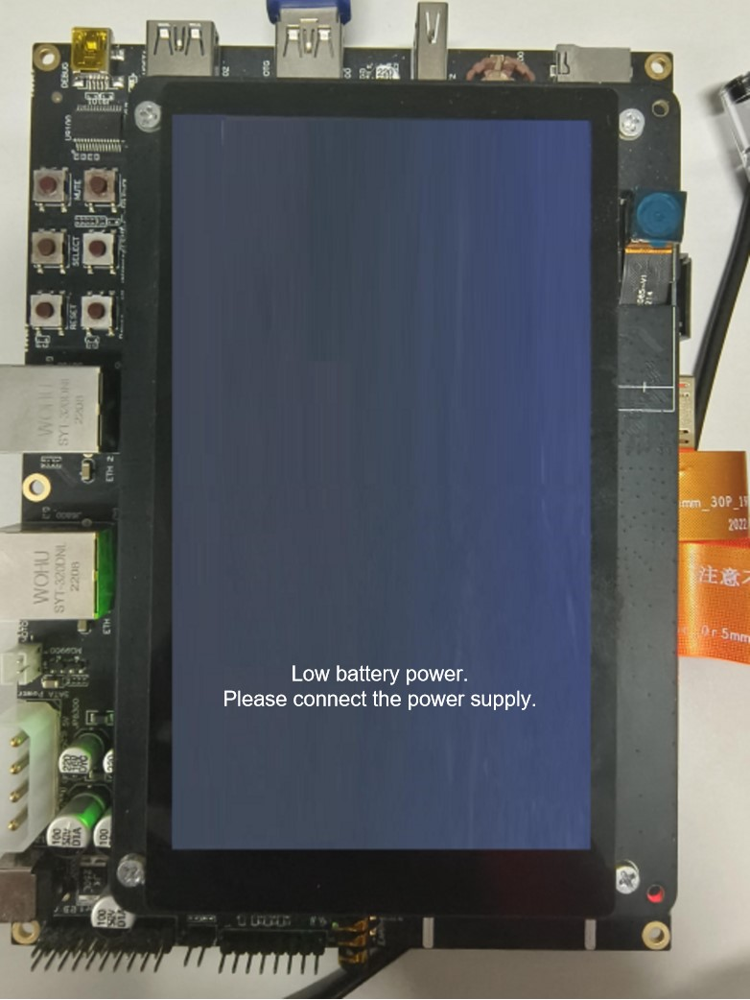
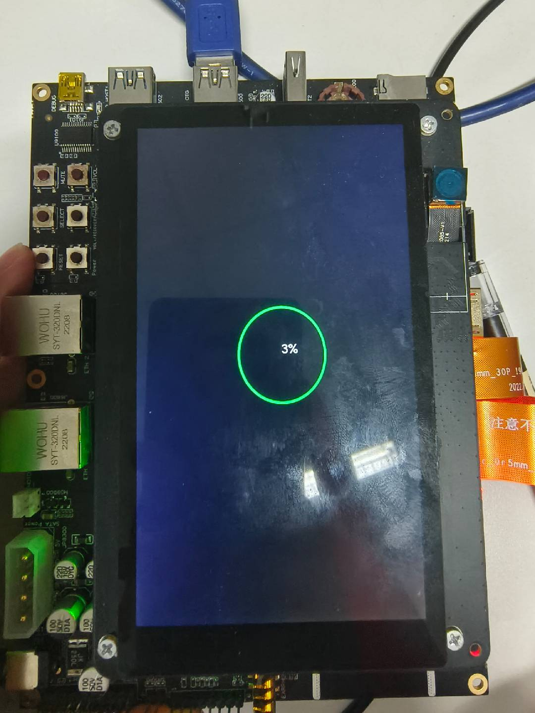

# Power-off Charging Animation Customization

## Overview

### Introduction

By default, the OpenHarmony provides the animation that displays information such as the battery level during power-off charging. However, some vendors may expect to use custom power-off charging animations for their products. To address this requirement, OpenHarmony provides the function of customizing power-off charging animations.

### Constraints

The configuration path for battery level customization is subject to the [configuration policy](https://gitee.com/openharmony/customization_config_policy). In this development guide, `/vendor` is used as an example of the configuration path. During actual development, you need to modify the customization path based on the product configuration policy.

## How to Develop

### Setting Up the Environment

**Hardware requirements:**

Development board running the standard system, for example, the DAYU200 or Hi3516D V300 open source suite.

**Environment requirements:**

For details about the requirements on the Linux environment, see [Quick Start](../quick-start/quickstart-overview.md).

### Getting Started with Development

The following uses [DAYU200](https://gitee.com/openharmony/vendor_hihope/tree/master/rk3568) as an example to illustrate power-off charging animation customization.

1. Create the `animation` folder in the product directory [/vendor/hihope/rk3568](https://gitee.com/openharmony/vendor_hihope/tree/master/rk3568).

2. Create a target folder by referring to the [default folder of power-off charging animation configuration](https://gitee.com/openharmony/powermgr_battery_manager/tree/master/charger/sa_profile), and install it in `//vendor/hihope/rk3568/animation`. The content is as follows:

    ```text
    profile
    ├── BUILD.gn
    ├── animation.json
    ```

3. Create the `resources` folder by referring to [default folder of power-off charging animation image resources](https://gitee.com/openharmony/powermgr_battery_manager/tree/master/charger/resources) to store the images that form the animation, and install the folder in `//vendor/hihope/rk3568/animation`. The content is as follows:

    ```text
    animation
    ├── resources
    ├── profile
    ```

4. Write the `BUILD.gn` file by referring to the `BUILD.gn` in the default folder of power-off charging animation configuration, and put it to the `//vendor/hihope/rk3568/animation/resource` directory. The configuration is as follows:
    ```shell
    import("//build/ohos.gni")

    ohos_prebuilt_etc("resources_config0") {
        source = "loop00000.png"                                        # Image resource
        relative_install_dir = "poweroff_charger_animation/resources"
        install_images = [ chipset_base_dir ]                           # Required configuration for installing the resources folder in the vendor directory.
        part_name = "product_rk3568"
    }

5. Write the custom `animation.json` file by referring to the `animation.json` file in the default folder of power-off charging animation image resources. For example:

    ```json
    {
        "id": "Charger",
        "screenWidth": 720,
        "screenHeight": 1280,
        "dir": "/vendor/etc/charger/resources",
        "bgColor": "#000000ff",
        "subpages": [
            {
                "id": "Animation",
                "coms": [
                    "Charging_Animation_Image",
                    "Charging_Percent_Label"
                ],
                "bgColor": "#000000ff"
            },
            {
                "id": "Lackpower_Charging_Prompt",
                "coms": [
                    "LackPower_Charging_Label"
                ],
                "bgColor": "#000000ff"
            },
            {
                "id": "Lackpower_Not_Charging_Prompt",
                "coms": [
                    "LackPower_Not_Charging_Label"
                ],
                "bgColor": "#000000ff"
            }
        ],
        "default": {
            "Common": {
                "visible": false
            },
            "UILabel": {
                "bgColor": "#00000000",
                "fontColor": "#ffffffe6",
                "align": "center"
            },
            "UIImageView": {
                "imgCnt": 1,
                "updInterval": 0,
                "filePrefix": ""
            }
        },
        "coms": [
            {
                "type": "UIImageView",
                "id": "Charging_Animation_Image",
                "x": 180,
                "y": 410,
                "w": 400,
                "h": 400,
                "resPath": "/vendor/etc/charger/resources/",
                "imgCnt": 62,
                "updInterval": 60,
                "filePrefix": "loop"
            },
            {
                "type": "UILabel",
                "id": "Charging_Percent_Label",
                "text": "",
                "x": 365,
                "y": 580,
                "w": 65,
                "h": 43,
                "fontSize": 32
            },
            {
                "type": "UILabel",
                "id": "LackPower_Charging_Label",
                "text": "Low battery level",
                "x": 229,
                "y": 1037,
                "w": 250,
                "h": 45,
                "fontSize": 42,
                "fontColor": "#ff0000ff"
            },
            {
                "type": "UILabel",
                "id": "LackPower_Not_Charging_Label",
                "text": "Low battery level. Please connect the power supply.",
                "x": 110,
                "y": 1037,
                "w": 500,
                "h": 45,
                "fontSize": 42,
                "fontColor": "#ff0000ff"
            }
        ]
    }
    ``` 

    **Table 1** Description of the power-off charging animation configuration
    | Item| Description|
    | -------- | -------- |
    | id | Unique ID of the charging screen.|
    | screenWidth | Width of the charging screen, in pixels.|
    | screenHeight | Height of the charging screen, in pixels.|
    | dir | Resource path.|
    | bgColor | Background color of the charging screen.|
    | subpages | Subpage of the charging screen.|
    | coms | All components on the charging screen.|
    | visible | Whether elements are visible.|
    | text | Text content of a component.|
    | x | X coordinate of the component.|
    | y | Y coordinate of the component.|
    | w | Component width, in pixels.|
    | h | Component height, in pixels.|
    | fontSize | Font size of the component.|
    | fontColor | Font color of the text.|
    | align | Text alignment mode.|
    | imgCnt | Number of images.|
    | updInterval | Image updating interval, in ms.|
    | filePrefix | Prefix of an image file name.|
    | type | Component type.|
    | resPath | Resource file path of the component.|


6. Write the `BUILD.gn` file by referring to the `BUILD.gn` in the default folder of power-off charging animation configuration to pack the `animation_config.json` file to the `//vendor/etc/charger` directory. The configuration is as follows:

    ```shell
    import("//build/ohos.gni")

    ohos_prebuilt_etc("animation_config") {
        source = "animation.json"             # Reference build/ohos.gni.
        relative_install_dir = "animation/resources"
        install_images = [ chipset_base_dir ] # Required configuration for installing the battery_config.json file in the vendor directory.
        part_name = "product_rk3568"          # Set part_name to product_rk3568 for subsequent build.
    }
    ```

7. Add the build target to `module_list` in [ohos.build](https://gitee.com/openharmony/vendor_hihope/blob/master/rk3568/ohos.build) in the `/vendor/hihope/rk3568` directory. For example:

    ```json
    {
    "parts": {
        "product_rk3568": {
        "module_list": [
            "//vendor/hihope/rk3568/default_app_config:default_app_config",
            "//vendor/hihope/rk3568/image_conf:custom_image_conf",
            "//vendor/hihope/rk3568/preinstall-config:preinstall-config",
            "//vendor/hihope/rk3568/resourceschedule:resourceschedule",
            "//vendor/hihope/rk3568/etc:product_etc_conf",
            "//vendor/hihope/rk3568/battery/profile:battery_config",
            "//vendor/hihope/rk3568/animation/profile:animation_config",   # Add the configuration for building of animation_config.
            "//vendor/hihope/rk3568/animation/resource/resources_config" # Add the configuration for building of image resources.
        ]
        }
    },
    "subsystem": "product_hihope"
    }
    ```
    In the preceding code, `//vendor/hihope/rk3568/animation/` is the folder path, `profile` is the folder name, and `animation_config` is the build target.

8. Build the customized version by referring to [Quick Start](../quick-start/quickstart-overview.md).

    ```shell
    ./build.sh --product-name rk3568 --ccache
    ``` 

9. Burn the customized version to the DAYU200 development board.

### Debugging and Verification

1. Modify the code configuration.

    Code path: `base/startup/init/services/init/init_config.c`

    Function: `ReadConfig`
    ```
    After modification:
    void ReadConfig(void)
    {
        // parse cfg
        char buffer[32] = {0}; // 32 reason max leb
        uint32_t len = sizeof(buffer);
        SystemReadParam("ohos.boot.reboot_reason", buffer, &len);
        INIT_LOGV("ohos.boot.reboot_reason %s", buffer);
        ParseInitCfg(INIT_CONFIGURATION_FILE, NULL);                   // New code
        ReadFileInDir(OTHER_CHARGE_PATH, ".cfg", ParseInitCfg, NULL);  // New code
        if (strcmp(buffer, "poweroff_charge") == 0) {
            ParseInitCfg(INIT_CONFIGURATION_FILE, NULL);
            ReadFileInDir(OTHER_CHARGE_PATH, ".cfg", ParseInitCfg, NULL);
        } else if (InUpdaterMode() == 0) {
            ParseInitCfg(INIT_CONFIGURATION_FILE, NULL);
            ParseInitCfgByPriority();
        } else {
            ReadFileInDir("/etc", ".cfg", ParseInitCfg, NULL);
        }
    }
    ```

2. Use the hdc tool to run the following commands to force the development board to enter the power-off charging state.
    ```
    hdc shell
    reboot charger
    ```

    

3. Go to the custom battery level configuration directory. The path of DAYU200 is used as an example.
    ```
    cd /data/service/el0/battery/battery
    ```

4. Change the battery power, and observe the number change on the charging animation.
    ```
    cat capacity
    ```
    Change the current battery power to **3**.
    ```
    echo 3 > capacity
    ```
    

5. Change the charging status when the battery level is extremely low (1% by default). This can trigger the mapping animation or device shutdown.
    
    1. Go to the custom battery level configuration directory.
    ```
    cd /data/service/el0/battery/battery
    ```
    ```
    cat capacity
    ```
    2. Change the current battery power to **1**.
    ```
    echo 1 > capacity
    ```
    3. Check the charging status.
    ```
    cat status
    ```
    The current status is **Charging**.

    

    4. Change to the **Not charging** state.
    ```
    echo Not charging > status
    ```
    

    5. Change to the **Discharging** state. The system enters the power-off state.
    ```
    echo Discharging > status
    ```

6. Test the power-off animation customization function by changing related images. The procedure is the same as that described above.

    1. Initial state

    

    2. 3% battery power

    

    3. 1% battery power, **Charging** state

    

    4. 1% battery power, **Not charging** state

    

    5. 1% battery power, **Discharging** state

    The device is powered off.


## Reference
During development, you can refer to the [default power-off animation configuration](https://gitee.com/openharmony/powermgr_battery_manager/blob/master/charger/sa_profile/animation.json), as shown below:

```json
    {
        "id": "Charger",
        "screenWidth": 720,
        "screenHeight": 1280,
        "dir": "/vendor/etc/charger/resources",
        "bgColor": "#000000ff",
        "subpages": [
            {
                "id": "Animation",
                "coms": [
                    "Charging_Animation_Image",
                    "Charging_Percent_Label"
                ],
                "bgColor": "#000000ff"
            },
            {
                "id": "Lackpower_Charging_Prompt",
                "coms": [
                    "LackPower_Charging_Label"
                ],
                "bgColor": "#000000ff"
            },
            {
                "id": "Lackpower_Not_Charging_Prompt",
                "coms": [
                    "LackPower_Not_Charging_Label"
                ],
                "bgColor": "#000000ff"
            }
        ],
        "default": {
            "Common": {
                "visible": false
            },
            "UILabel": {
                "bgColor": "#00000000",
                "fontColor": "#ffffffe6",
                "align": "center"
            },
            "UIImageView": {
                "imgCnt": 1,
                "updInterval": 0,
                "filePrefix": ""
            }
        },
        "coms": [
            {
                "type": "UIImageView",
                "id": "Charging_Animation_Image",
                "x": 180,
                "y": 410,
                "w": 400,
                "h": 400,
                "resPath": "/vendor/etc/charger/resources/",
                "imgCnt": 62,
                "updInterval": 60,
                "filePrefix": "loop"
            },
            {
                "type": "UILabel",
                "id": "Charging_Percent_Label",
                "text": "",
                "x": 365,
                "y": 580,
                "w": 65,
                "h": 43,
                "fontSize": 32
            },
            {
                "type": "UILabel",
                "id": "LackPower_Charging_Label",
                "text": "Low battery level",
                "x": 229,
                "y": 1037,
                "w": 250,
                "h": 45,
                "fontSize": 42,
                "fontColor": "#ff0000ff"
            },
            {
                "type": "UILabel",
                "id": "LackPower_Not_Charging_Label",
                "text": "Low battery level. Please connect the power supply.",
                "x": 110,
                "y": 1037,
                "w": 500,
                "h": 45,
                "fontSize": 42,
                "fontColor": "#ff0000ff"
            }
        ]
    }
``` 

Packing path: `/system/etc/charger/resource`
