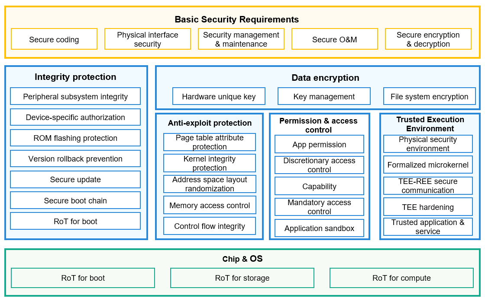

# Development on Device Security Level Management

## Overview

### DSLM

The OpenHarmony distributed technology can converge resources from different devices to form a Super Device. Poor security capabilities of any device may threaten the security of the Super Device.

The Device Security Level Management (DSLM) module is introduced to manage the security levels of OpenHarmony devices. When different types of user data are hopped or processed in OpenHarmony distributed services, the DSLM APIs can be called to obtain the security levels of related devices for subsequent processing.

### Basic Concepts

- Device security level

  The security level of an OpenHarmony device depends on the system security capabilities of the device. The OpenHarmony system security capabilities are based on the root of trust (RoT) for boot, RoT for storage, and RoT for compute on the hardware. Security technologies and capabilities focus on device integrity protection, data confidentiality protection, and vulnerability defense.

  The following figure shows the OpenHarmony security architecture.

  

  The above figure shows the typical security architecture for a single device. The architecture may vary depending on the risk level as well as the software and hardware resources of the device. The security capabilities of OpenHarmony devices are classified into five levels from SL1 to SL5, based on the industry standard security classification model and actual OpenHarmony service scenarios and device types. In the OpenHarmony ecosystem, higher security levels include all the capabilities of lower security levels by default. The figure below shows the security levels of OpenHarmony devices.

  

  - SL1: SL1 is the lowest security level of OpenHarmony devices. Usually equipped with a lightweight operating system and low-end microprocessors, such devices implement simple services and do not need to process sensitive data. SL1 devices are required to support software integrity protection and eliminate common errors. Devices that cannot meet the requirements of SL1 can only be controlled by OpenHarmony devices. They cannot control OpenHarmony devices for more complex service collaboration.

  - SL2: OpenHarmony devices of SL2 can label their own data and define access control rules to implement discretionary access control (DAC). These devices must have basic anti-penetration capabilities. Devices of this level support a lightweight, secure, and isolated environment for deploying a small number of necessary security services.

  - SL3: OpenHarmony devices of SL3 have comprehensive security protection capabilities, and their operating systems have relatively complete security semantics and support mandatory access control (MAC). The system data can be structured as critical elements and non-critical elements. The critical elements are protected by a well-defined security policy model. Devices of this level must have certain anti-penetration capabilities to defend against common vulnerability exploits.

  - SL4: OpenHarmony devices of SL4 must have simplified trusted computing base (TCB) and come with anti-tampering capabilities. The implementation of SL4 should be concise and secure enough. Adequate authentication and arbitration are required for any access to critical elements. Devices of this level have considerable anti-penetration capabilities and can defend against most software attacks.

  - SL5: SL5 indicates the highest security protection capabilities for OpenHarmony devices. The system core software modules must have passed formal verification. Key hardware modules, such as the RoT and cryptographic computing engine, must be able to defend against physical attacks and attacks simulated in labs. Devices at this level must have high-security units, such as dedicated security chips, to enhance the boot, storage, and running of the root of trust (RoT).

- DSLM

  DSLM is a module to manage the security levels of OpenHarmony devices. It verifies and updates device security level information for OpenHarmony devices in collaboration. It also provides an interface for querying the security level of each device.

### Working Principles

The security level of each device in a Super Device provides the decision-making criteria for processing or hopping various user data. For example, the distributed file storage service does not allow sensitive data to be stored on devices with security level lower than SL3.

### Constraints

The default security level of OpenHarmony devices is SL1. Device manufacturers can customize a higher security level based on service requirements. For details, see [Customizing Device Security Levels](#customizing-device-security-levels).

If data processing or hopping fails because the device security level is low during debugging of distributed services, you can temporarily increase the security level of related devices. For details, see [Tool](#tool).

## Development Guidelines

### When to Use

When processing or hopping various user data, a subsystem can invoke the APIs provided by the DSLM module to obtain the security level information of related devices. Then, the subsystems determine the subsequent processing based on the security level and data to be processed.

### Available APIs

All the APIs are native C interfaces for implementing underlying capabilities and are not open to apps. The APIs are described as follows:
| API                                                      | Description                                        |
| :----------------------------------------------------------- | :------------------------------------------- |
| int32_t RequestDeviceSecurityInfo(const DeviceIdentify \*identify, const RequestOption \*option, DeviceSecurityInfo \*\*info); | Requests the security level information of a device synchronously.|
| int32_t RequestDeviceSecurityInfoAsync(const DeviceIdentify \*identify, const RequestOption \*option, DeviceSecurityInfoCallback callback); | Requests the security level information of a device asynchronously.|
| void FreeDeviceSecurityInfo(DeviceSecurityInfo \*info);       | Releases the device security level information.|
| int32\_t GetDeviceSecurityLevelValue(const DeviceSecurityInfo \*info, int32_t \*level); | Obtains the device security level from the security level information.|

### How to Develop

1. Add the dependencies for compilation.

    ```undefined
    external_deps += [ "device_security_level:dslm_sdk" ]
    ```

2. Add the header files of dependencies.

    ```cpp
    #include "device_security_defines.h" // Header file for defining critical data structures.
    #include "device_security_info.h" // Header file for defining APIs.
    ```

3. Call APIs.

    ```cpp
    // Obtain the unique device identifier (UDID) of the device of which the security level is to be queried.
    const DeviceIdentify *device = GetDestDeviceUdid();

    // Obtain the RequestOption.
    const RequestOption *option = DEFAULT_OPTION;

    // Define a pointer to the device security level obtained.
    DeviceSecurityInfo *info = NULL;

    // Call RequestDeviceSecurityInfo to obtain the device security level information of the peer device.
    int32_t ret = RequestDeviceSecurityInfo(device, DEFAULT_OPTION, &info);

    int32_t level = 0;
    // Obtain the device security level from the device security level information.
    ret = GetDeviceSecurityLevelValue(info, &level);
    if (ret == SUCCESS) {
        // The device security level is obtained.
        FreeDeviceSecurityInfo(info);
        return;
    }
    // Release the memory before the processing is complete.
    FreeDeviceSecurityInfo(info);
    ```

### Development Example

A service with the file sharing function needs to be developed. To prevent sensitive files from being shared unintentionally, the following judgments must be performed before any file is sent:

- If the security level of the destination device is SL3 or higher, the service sends the file.
- If the security level of the destination device is lower than SL3, the service denies the file transfer and display a dialog box to notify the user.

**Example of synchronously obtaining the device security level**

```cpp
void CheckDestDeviceSecurityLevel(const DeviceIdentify *device, RequestOption *option)
{
    // Pointer to the device security level information.
    DeviceSecurityInfo *info = NULL;
    // Obtain the security level information of the device.
    int32_t ret = RequestDeviceSecurityInfo(device, option, &info);
    if (ret != SUCCESS) {
        // Failed to obtain the information. You can develop a retry process as required.
        return;
    }
    int32_t level = 0;
    // Obtain the device security level from the device security level information.
    ret = GetDeviceSecurityLevelValue(info, &level);
    if (ret != SUCCESS) {
        // Failed to obtain the security level. You can develop a retry process as required.
        FreeDeviceSecurityInfo(info);
        return;
    }
    // After the device security level is successfully obtained, check the lowest security level required for the current operation.
    // The lowest device security level required for the current operation is 3.
    if (level >= 3) {
        // The security level of the target device meets the requirements. Services are processed properly. 
    } else {
        // The security level of the target device does not meet the requirements. An alert or dialog box is displayed as required.
    }
    // Release the memory before the processing is complete.
    FreeDeviceSecurityInfo(info);
}
```

**Example of asynchronously obtaining the device security level**

```cpp
// Callback
void DeviceSecurityInfoCallback(const DeviceIdentify *identify, struct DeviceSecurityInfo *info)
{
    int32_t level = 0;
    // Obtain the device security level from the device security level information.
    int32_t ret = GetDeviceSecurityLevelValue(info, &level);
    if (ret != SUCCESS) {
        // Failed to obtain the information. You can develop a retry process as required.
        FreeDeviceSecurityInfo(info);
        return;
    }
    // After the device security level is successfully obtained, check the lowest security level required for the current operation.
    // The lowest device security level required for the current operation is 3.
    if (level >= 3) {
        // The security level of the target device meets the requirements. Services are processed properly. 
    } else {
        // The security level of the target device does not meet the requirements. An alert or dialog box is displayed as required.
    }
    // Release the memory before the processing is complete.
    FreeDeviceSecurityInfo(info);
}

void CheckDestDeviceSecurityLevelAsync(const DeviceIdentify *device, RequestOption *option)
{
    // Invoke the asynchronous callback to return the device security level obtained.
    int ret = RequestDeviceSecurityInfoAsync(device, option, DeviceSecurityInfoCallback);
    if (ret != SUCCESS) {
        // Failed to obtain the security level. You can develop a retry process as required.
        // In this case, the callback will not be invoked.
        return;
    }
    // The callback is invoked. Wait for the callback to return the device security level.
}
```

## Customizing Device Security Levels

### Device Security Level Credential

To ensure its integrity and non-repudiation, the security level information must be encapsulated in a "device security level credential" (credential for short) file for transmission between devices. In addition to the security level information of the device, the credential may include device attributes, such as the device model and version. Moreover, the credential must be signed using the public key infrastructure (PKI) technology. Other basic security capabilities of OpenHarmony, such as [Device Authentication](https://gitee.com/openharmony/security_device_auth) and [HUKS](https://gitee.com/openharmony/security_huks), are used to ensure secure transmission of credentials.

### Default Implementation

The DSLM module provides default implementation of security level information synchronization and verification. It is assumed that the security level of all OpenHarmony devices is SL1, and a loose verification scheme is used. For details, see the [source code](https://gitee.com/openharmony/security_device_security_level/tree/master/oem_property/ohos).

You can change the device security level as required. For details about the OpenHarmony device security levels, see [Basic Concepts](#basic-concepts). You can also use more severe verification schemes, including but are not limited to using device-specific credential, periodically downloading updated credentials from a server and strictly authenticating the issuer and validity period of the credentials, and using Trusted Execution Environment (TEE) or even Secure Element (SE) to sign credential files.

### Generating a Credential File

The credential file consists of four Base64-encoded strings, separated by periods (.). The following is an example:

```undefined
<base64-header>.<base64-payload>.<base64-signature>.<base64-attestation>
```

#### 1. Construct the `header`.

The header is a fixed JSON string in the following format:

``` json
{
    "typ": "DSL"
}
```

Encode the header string to Base64 format to obtain `<base64-header>`.

```undefined
eyJ0eXAiOiAiRFNMIn0=
```

#### 2. Construct the `payload`.

Construct the payload in a JSON string. The following is an example:

``` json
{
    "type": "debug",
    "manufacture": "ohos",
    "brand": "rk3568",
    "model": "rk3568",
    "softwareVersion": "3.2.2",
    "securityLevel": "SL1",
    "signTime": "20220209150259",
    "version": "1.0.1"
}
```

Encode the payload string to Base64 format to obtain `<base64-payload>`.

```undefined
eyJ0eXBlIjogImRlYnVnIiwgIm1hbnVmYWN0dXJlIjogIm9ob3MiLCAiYnJhbmQiOiAicmszNTY4IiwgIm1vZGVsIjogInJrMzU2OCIsICJzb2Z0d2FyZVZlcnNpb24iOiAiMy4yLjIiLCAic2VjdXJpdHlMZXZlbCI6ICJTTDEiLCAic2lnblRpbWUiOiAiMjAyMjAyMDkxNTAyNTkiLCAidmVyc2lvbiI6ICIxLjAuMSJ9
```

The fields in the `payload` are described as follows:

|     Field     |      Description     | Mandatory|       Value Range       |
| :-------------: | :----------------: | :----------: | :-------------------: |
|      type       |    Credential type.   |      Yes     |    [debug release]    |
|   manufacture   |   Device manufacturer information.  |      Yes     |    string [0..128]    |
|      brand      |    Device brand.   |      Yes     |    string [0..128]    |
|      model      |    Device model.   |      Yes     |    string [0..128]    |
| softwareVersion | Device software version.|      Yes     |    string [0..128]    |
|  securityLevel  |  Device security level. |      Yes     | [SL1 SL2 SL3 SL4 SL5] |
|    signTime     |   Time when the credential was signed.  |      Yes     |    string [0..128]    |
|     version     |    Credential version.   |      Yes     |    string [0..32]     |
|       sn        |    Device SN.   |      No     |    string [0..128]    |
|      udid       |   Device UDID.  |      No     |    string [0..128]    |

#### 3. Construct the `signature`.

Construct the signature of the header and payload.

##### 3.1 Construct the raw data to be signed.

Combine the Base64-encoded header and payload with a period (.) in between to obtain `<base64-head>.<base64-payload>`.
Example:

```undefined
eyJ0eXAiOiAiRFNMIn0=.eyJ0eXBlIjogImRlYnVnIiwgIm1hbnVmYWN0dXJlIjogIm9ob3MiLCAiYnJhbmQiOiAicmszNTY4IiwgIm1vZGVsIjogInJrMzU2OCIsICJzb2Z0d2FyZVZlcnNpb24iOiAiMy4yLjIiLCAic2VjdXJpdHlMZXZlbCI6ICJTTDEiLCAic2lnblRpbWUiOiAiMjAyMjAyMDkxNTAyNTkiLCAidmVyc2lvbiI6ICIxLjAuMSJ9
```

##### 3.2 Generate a private key for signing data.

The Elliptic Curve Digital Signature algorithm (ECDSA) is used to sign the raw data in the credential file. Generate an ECDSA key pair `<ecc-l3-pk>` and `<ecc-l3-sk>` first.

> **NOTICE**
>
> This step must be performed in a secure and reliable environment, for example, a cryptographic machine that meets related security requirements, to ensure that the key generated is not disclosed.

##### 3.3 Sign the raw data.

Use the ECC private key `<ecc-l3-sk>` to sign `<base64-head>.<base64-payload>`, and encode the signature to Base64 format to obtain `<base64-signature>`.

```undefined
MGUCMDb9xoiFzTWVkHDU3VWSVQ59gLyw4TchZ0+eQ3vUfQsLt3Hkg0r7a/PmhkNr3X/mTgIxAIywIRE6vRTRs0xk6xKp8A0XwMMiIyjZlujPJfasCvFonpsvXLAqCAIYbe1J0k4Zfg==
```

#### 4. Construct the `attestation`.

> **NOTICE**
>
> This step must be performed in a secure and reliable environment, for example, a cryptographic machine that meets related security requirements, to ensure that the key used for signature is not disclosed.
> The key pairs involved in this step do not need to be generated each time. Secure key pairs can be reused.

##### 4.1 Generate verification information for an end-entity certificate signature.

1. Generate an ECDSA key pair `<ecc-l2-pk>` and `<ecc-l2-sk>` for an intermediate CA certificate signature.
2. Use `<ecc-l2-sk>` to sign `<ecc-l3-pk>` (generated in step 3.2) to obtain `<ecc-l3-pk-signature>`.
3. Combine `<ecc-l3-pk>` and `<ecc-l3-pk-signature>` into a JSON string. The following is an example:

``` json
{
    "userPublicKey": "<ecc-l3-pk>",
    "signature": "<ecc-l3-pk-signature>"
}
```

##### 4.2 Generate verification information for an intermediate CA certificate signature.

1. Generate an ECDSA key pair `<ecc-root-pk>` and `<ecc-root-sk>` for a root certificate signature.
2. Use `<ecc-root-sk>` to sign `<ecc-l2-pk>` (generated in step 4.1) to obtain `<ecc-l2-pk-signature>`.
3. Combine `<ecc-l3-pk>` and `<ecc-l3-pk-signature>` into a JSON string. 
The following is an example:

``` json
{
    "userPublicKey": "<ecc-l2-pk>",
    "signature": "<ecc-l2-pk-signature>"
}
```

##### 4.3 Generate root signature verification information.

1. Use `<ecc-root-sk>` to sign the `<ecc-root-pk>` (generated in step 4.2) to obtain `<ecc-root-pk-self-signature>` (a self-signature).
2. Combine `<ecc-root-pk>` and `<ecc-root-pk-self-signature>` into a JSON string. The following is an example: 

``` json
{
    "userPublicKey": "<ecc-root-pk>",
    "signature": "<ecc-root-pk-self-signature>"
}
```

##### 4.4 Generate the `attestation`.

1. Combine the preceding three pieces of signature information into a JSON array.

    ```json
    [
        {
            "userPublicKey": "<ecc-l3-pk>",
            "signature": "<ecc-l3-pk-signature>"
        },
        {
            "userPublicKey": "<ecc-l2-pk>",
            "signature": "<ecc-l2-pk-signature>"
        },
        {
            "userPublicKey": "<ecc-root-pk>",
            "signature": "<ecc-root-pk-self-signature>"
        }
    ]
    ```

2. Encode the JSON array to Base64 format to obtain `<base64-attestation>`.

    ```undefined
    W3sidXNlclB1YmxpY0tleSI6ICJNSG93RkFZSEtvWkl6ajBDQVFZSkt5UURBd0lJQVFFTEEySUFCREdOMU9xYWZrWFc2a0l1SEZrMVQ0TS84RVJUY3p0eWRDaGtramFROEkzNEc2Q3E1aTNJcnczVnRhQS9KTTF2a0lHOUZDVWRUaHZFUlJFUTFUdG9xemdxZW9SUzVwQW1EYUUyalEwYzdDem8rOHVUWTRIYW1weXZ1TENtenlYUXFnPT0iLCAic2lnbmF0dXJlIjogIk1HTUNMeHVjUnoyZndKZ092QkxyU1U3K1hlVTA3R0EyVXhZbDFMbEJLUnVIUS9wZlNWVHBEd0ZHSTNTb3h5ODR3NThIQWpBeGRtNEY3b3YvYUtEL0NFZi9QZlZDWHVlbE1mQys1L3pkUExXUUJEVnlGdWQrNVdYL3g4U083VXM5UGFhRW1mZz0ifSwgeyJ1c2VyUHVibGljS2V5IjogIk1Ib3dGQVlIS29aSXpqMENBUVlKS3lRREF3SUlBUUVMQTJJQUJHMWU3TDJVd1AyWWxTajB2RWViUGJpNVpLMDh5NS9UeHRWb3VrRFpIUGtSNlRtb2JoVGpyMVRVNzZpUkU4bDlWQlhuU1h1QVB6cjBuSHdKVkdVZVJMdmp4MVh0YUZReE9QNjhjNlIvRTdFWkZ2STdRUFg1N0tvRkhYdkEvVlJaNnc9PSIsICJzaWduYXR1cmUiOiAiTUdRQ01FUVdFNnk0Rm42SFg1ekFvTzNkYzl5cG1Sd2lBclplc2o5aVBROTZEaEhuNXJkRTdNaGFMdWNRZ0MvaXhjSWJsZ0l3QkN5aFBvRUg2RjFITFlwM2xqbWVncVlZQ1E5NHEyZm1kbDB6dHhrWEVTOVpPOVRNSUZQRVpKYlpmUnU5ZHcyOSJ9LCB7InVzZXJQdWJsaWNLZXkiOiAiTUhvd0ZBWUhLb1pJemowQ0FRWUpLeVFEQXdJSUFRRUxBMklBQkZRUUlDWmpWUTV4bkE0c2RMbUJzUmVaMzRJeWdkSmZhanA3SnRReFBzU2RwWTJXV0FneXp6Rm40OFFRRWhoU1BtdzhJYUU3VlJKRENBT3FYRnhGektJbFBFTDFvcFJDUmhhWmJrRzc5Y3ZrWC9HVVhlaFVYc2V2ZGhyb2VRVERFdz09IiwgInNpZ25hdHVyZSI6ICJNR1FDTUdQRndvSDJLbHhwbVZhWXRWV1ViMHpDSUJxYXFXY2F6czFqOVp4YklLUmVkR2tJY0VJdHN0UFoxdnVTanYvNDJnSXdSeGZPcTRoQTdNMHlGV2ZPSndqRTlTc2JsYXhvRDNiRTZCYzN2QjUyMmsyQ0ZJNWJqelpkeUFTVW04d2J2TW5WIn1d
    ```

#### 5. Construct a complete credential.

Put the four pieces of data together with a period (.) in between to obtain `<base64-header>.<base64-payload>.<base64-signature>.<base64-attestation>`. The following is an example:

```undefined
eyJ0eXAiOiAiRFNMIn0=.eyJ0eXBlIjogImRlYnVnIiwgIm1hbnVmYWN0dXJlIjogIm9ob3MiLCAiYnJhbmQiOiAicmszNTY4IiwgIm1vZGVsIjogInJrMzU2OCIsICJzb2Z0d2FyZVZlcnNpb24iOiAiMy4yLjIiLCAic2VjdXJpdHlMZXZlbCI6ICJTTDEiLCAic2lnblRpbWUiOiAiMjAyMjAyMDkxNTAyNTkiLCAidmVyc2lvbiI6ICIxLjAuMSJ9.MGUCMDb9xoiFzTWVkHDU3VWSVQ59gLyw4TchZ0+eQ3vUfQsLt3Hkg0r7a/PmhkNr3X/mTgIxAIywIRE6vRTRs0xk6xKp8A0XwMMiIyjZlujPJfasCvFonpsvXLAqCAIYbe1J0k4Zfg==.W3sidXNlclB1YmxpY0tleSI6ICJNSG93RkFZSEtvWkl6ajBDQVFZSkt5UURBd0lJQVFFTEEySUFCREdOMU9xYWZrWFc2a0l1SEZrMVQ0TS84RVJUY3p0eWRDaGtramFROEkzNEc2Q3E1aTNJcnczVnRhQS9KTTF2a0lHOUZDVWRUaHZFUlJFUTFUdG9xemdxZW9SUzVwQW1EYUUyalEwYzdDem8rOHVUWTRIYW1weXZ1TENtenlYUXFnPT0iLCAic2lnbmF0dXJlIjogIk1HTUNMeHVjUnoyZndKZ092QkxyU1U3K1hlVTA3R0EyVXhZbDFMbEJLUnVIUS9wZlNWVHBEd0ZHSTNTb3h5ODR3NThIQWpBeGRtNEY3b3YvYUtEL0NFZi9QZlZDWHVlbE1mQys1L3pkUExXUUJEVnlGdWQrNVdYL3g4U083VXM5UGFhRW1mZz0ifSwgeyJ1c2VyUHVibGljS2V5IjogIk1Ib3dGQVlIS29aSXpqMENBUVlKS3lRREF3SUlBUUVMQTJJQUJHMWU3TDJVd1AyWWxTajB2RWViUGJpNVpLMDh5NS9UeHRWb3VrRFpIUGtSNlRtb2JoVGpyMVRVNzZpUkU4bDlWQlhuU1h1QVB6cjBuSHdKVkdVZVJMdmp4MVh0YUZReE9QNjhjNlIvRTdFWkZ2STdRUFg1N0tvRkhYdkEvVlJaNnc9PSIsICJzaWduYXR1cmUiOiAiTUdRQ01FUVdFNnk0Rm42SFg1ekFvTzNkYzl5cG1Sd2lBclplc2o5aVBROTZEaEhuNXJkRTdNaGFMdWNRZ0MvaXhjSWJsZ0l3QkN5aFBvRUg2RjFITFlwM2xqbWVncVlZQ1E5NHEyZm1kbDB6dHhrWEVTOVpPOVRNSUZQRVpKYlpmUnU5ZHcyOSJ9LCB7InVzZXJQdWJsaWNLZXkiOiAiTUhvd0ZBWUhLb1pJemowQ0FRWUpLeVFEQXdJSUFRRUxBMklBQkZRUUlDWmpWUTV4bkE0c2RMbUJzUmVaMzRJeWdkSmZhanA3SnRReFBzU2RwWTJXV0FneXp6Rm40OFFRRWhoU1BtdzhJYUU3VlJKRENBT3FYRnhGektJbFBFTDFvcFJDUmhhWmJrRzc5Y3ZrWC9HVVhlaFVYc2V2ZGhyb2VRVERFdz09IiwgInNpZ25hdHVyZSI6ICJNR1FDTUdQRndvSDJLbHhwbVZhWXRWV1ViMHpDSUJxYXFXY2F6czFqOVp4YklLUmVkR2tJY0VJdHN0UFoxdnVTanYvNDJnSXdSeGZPcTRoQTdNMHlGV2ZPSndqRTlTc2JsYXhvRDNiRTZCYzN2QjUyMmsyQ0ZJNWJqelpkeUFTVW04d2J2TW5WIn1d
```

### Credential Exchange Protocol

When detecting a device goes online, the DSLM module requests the device security level credential from the device through the channel provided by [DSoftBus](https://gitee.com/openharmony/communication_dsoftbus).

The packet for requesting the credential is in the following format:

``` json
{
    "message": 1,
    "payload": {
        "version": 196608,
        "challenge": "0102030405060708",
        "support": [
            300
        ]
    }
}
```

The fields in the request message are described as follows:

|  Field  |               Description               |
| :-------: | :-----------------------------------: |
|  message  | Message header. The value **1** indicates a request for the device security level credential.|
|  payload  |      Message payload, which is the specific request information.|
|  version  |           Version of the protocol used by the requester.|
| challenge |       Challenge value corresponding to this request.|
|  support  |       List of credential formats supported by the requester.|

After receiving the request, the peer device returns a response in the following format:

``` json
{
    "message": 2,
    "payload": {
        "version": 196608,
        "type": 300,
        "challenge": "0102030405060708",
        "info": "YWJjZAEDBQcJ..."
    }
}
```

The fields in the response message are described as follows:
|  Field  |                          Description                         |
| :-------: | :--------------------------------------------------------: |
|  message  |           Message header. The value **2** indicates a response to the request for the device security level credential.|
|  payload  |                Message payload, which is the specific response information.|
|  version  |                      Version of the protocol used by the responder. |
|   type    |     Format of the credential returned, which describes how to parse the **info** field.|
| challenge |                  Challenge value corresponding to this response message.|
|   info    | Signed credential information, which also includes the device information and challenge value verification information.|

### Tool

The DSLM module provides a [credential tool](https://gitee.com/openharmony/security_device_security_level/blob/master/oem_property/ohos/standard/dslm_cred_tool.py) to help you better understand the issuing and verification of credentials. This tool is a Python script encapsulated with OpenSSL commands.
You can use the tool as follows:

1. Initialize the signature key.

    ``` undefined
    ./dslm_cred_tool.py init
    ```

2. Generate a credential.

    For example, to generate a credential file **cred.txt** with the device model of **rk3568**, device version of **3.0.0**, and device security level of **SL3**, run the following command:

    ``` undefined
    ./dslm_cred_tool.py create --field-manufacture OHOS --field-brand rk3568  --field-model rk3568 --field-software-version 3.0.0 --field-security-level SL3 --cred-file cred.txt
    ```

    A credential file is generated as follows:

    ``` undefined
    cat cred.txt
    eyJ0eXAiOiAiRFNMIn0=.eyJ0eXBlIjogImRlYnVnIiwgIm1hbnVmYWN0dXJlIjogIk9IT1MiLCAiYnJhbmQiOiAicmszNTY4IiwgIm1vZGVsIjogInJrMzU2OCIsICJzb2Z0d2FyZVZlcnNpb24iOiAiMy4wLjAiLCAic2VjdXJpdHlMZXZlbCI6ICJTTDMiLCAic2lnblRpbWUiOiAiMjAyMjAyMDkxNTUzMDMiLCAidmVyc2lvbiI6ICIxLjAuMSJ9.MGQCMEqZy/snsRyjMupnEvTpQfhQn+IcdCc5Q3NGxllNQVhoZX8PNyw6ATTgyx+26ghmtQIwVH5KwQ4/VejxckeHmtkBVhofhgmRapzvyVnyiB3PdsU7nvHk8A/zC7PFy1CWBG3z.W3sidXNlclB1YmxpY0tleSI6ICJNSG93RkFZSEtvWkl6ajBDQVFZSkt5UURBd0lJQVFFTEEySUFCQzFXRUxSVlU1NGp1U1ZXWlUrT29CM3hacFd5MWg3QW5uSFdKWm5QbTB3S2l0ZlJZelJKZ3FiUGQyZ3ltVXBUWVl1cmhyRDQxbFdPbUNzcmt0VWdaNTFXdGNCTmc5SG1GODkzc2ZHVFM5eUJNS0JoMGcxSHZaSVFSN1k0S3FXaWpnPT0iLCAic2lnbmF0dXJlIjogIk1HUUNNRFVicTZ2Z2R1YVF0bFVwOTR0azd4VjRJcEx2WVZWY3Y4aFNOTkw0azdPRHhmbEVGTHJFaUdPRWhwMUcweGFGYlFJd1pUbTk1cWx4OTBFZnptV3VIOGlEY2ZWYVlQS2N5SEYwR2ZFcEUzb1NESzQwZEFOZ0FJMWVQY09rTzBPOTdnTFAifSwgeyJ1c2VyUHVibGljS2V5IjogIk1Ib3dGQVlIS29aSXpqMENBUVlKS3lRREF3SUlBUUVMQTJJQUJGKzY1a0lSYTM2dkE4QVZWNXFrcUozYXpXTkdGQy9oaVdPL0tFNHR0S1pMOUsyNlhzQ2hQbjVNc3BlT2F3b1dqSU02bTVLOFZTcU1DYlZNN0svY0VRU0tYdDJTeVJGZERVZU9TaFZmQm9YVmxqaXRUU2puN0V5Q2pERVZiWjFRNEE9PSIsICJzaWduYXR1cmUiOiAiTUdRQ01HanF2cnZ5VW1YNVZLVVc1UkFkUTNkZ2hBYmNBazBRQnppQlFWMVFZUTNQMVFPSzdMckM1b0RObXh6T2Y0QUtmd0l3SzVWU2x3ZG5JSUR6Zm9PUXBEUVAycGhTVGgxSGVjbXJRK1F4VGxWelo0aHJsdnJyd2xCNnp0T3pWRFdNblRELyJ9LCB7InVzZXJQdWJsaWNLZXkiOiAiTUhvd0ZBWUhLb1pJemowQ0FRWUpLeVFEQXdJSUFRRUxBMklBQkZCa2FDNE9mc2VTREt2cW8vbU5VaUtXQ3JtK1VDNGFQcjVsODRNM2tMVCtDdkd3OWhqOGJ6d2I1MzNtVVlFZVhWWWtUdFlRYWRURkRJZXV1dGIzNU1QZDlEKytNMFRFWnZvcTY4NFhoYTVQMzBUbVRhK0ZvOG02UWliZWc3TmFQdz09IiwgInNpZ25hdHVyZSI6ICJNR1FDTURJcmpNYzhvODVPRHFZT0R4c05PcmpYdUhvWjM5endpZlhVTkdDc0lkN2xjU2FWcnhCVlNqRjRyaWg5Y1R6T3dRSXdWQXA3RUF5c1pucEI5REJWVWczQzlMeGQ3eTQxWEMwYVVPcGZUKzI3REVvWmM1WVVldDFGa1FwdmFQckduaFhVIn1d
    ```

3. Verify a credential.

    ``` undefined
    ./dslm_cred_tool.py verify --cred-file cred.txt
    ```

    The command output is as follows:

    ``` undefined
    head:
    {
      "typ": "DSL"
    }
    payload:
    {
      "type": "debug",
      "manufacture": "OHOS",
      "brand": "rk3568",
      "model": "rk3568",
      "softwareVersion": "3.0.0",
      "securityLevel": "SL3",
      "signTime": "20220209155303",
      "version": "1.0.1"
    }
    verify success!
    ```

4. Send the generated credential file to the target device and make it take effect.
   
   Temporarily disable write protection.
   ``` undefined
   hdc_std target mount
   hdc_std shell "setenforce 0"
   ```

   Send the generated credential file to the device.
   ``` undefined
   hdc_std file send cred.txt  /system/etc/dslm_finger.cfg
   ```

   Restart the device to make the new credential file take effect.
   ``` undefined
   hdc_std reboot
   ```

## FAQs

- Q: How can I use the credential tool in a production environment?

    A: The credential tool cannot be directly used in the production environment. It is used to demonstrate the format and generation process of credentials. In the production environment, you are advised to generate credentials and save related keys in a cryptographic machine that meets related security requirements.

- Q: How do I verify a credential in a production environment?

    A: You are advised to use a properly kept private key to sign the credential and use more severe signature verification process instead of the default verification process provided by the DSLM module. For example, allow only the credentials issued by trusted certification authorities (CAs), and bind the credential and device ID to enhance the security.

- Q: The default security level of OpenHarmony devices is SL1. How do I do if the distributed service (distributed file system) fails to process sensitive data due to insufficient permission? 

    A: You can solve the problem by temporarily increasing the security level of the related devices. For details, see [Tool](#tool).
