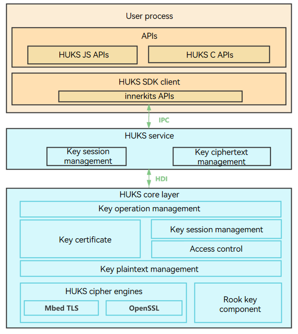
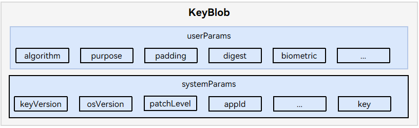

# HUKS Development

## Overview

### HUKS

OpenHarmony Universal KeyStore (HUKS) provides lifecycle key management capabilities, including generating, storing, and destroying keys, and provides attestation for the keys stored in the HUKS. In the HUKS hierarchical architecture, the HUKS core layer (HUKS Core) at the bottom implements key management functions and runs in a secure hardware environment, such as a Trusted Execution Environment (TEE) or secure chipset. The implementation of the HUKS core layer varies depending on the secure hardware environment of the vendor. To ensure consistency of the architecture and interfaces between the service layer and application layer, the HUKS core layer defines a set of Hardware Device Interface (HDI) APIs. 

This document describes how to develop the HUKS core layer functions using the HUKS HDI APIs.

The HUKS core layer is supposed to support the following functions:

- Generation of keys.

- Import of keys.

- Key operations, including encryption and decryption, signing and signature verification, key derivation, key agreement, and generation of message authentication codes (MACs).

- Key access control.

- Key attestation.

- Export of the public key from a chipset.

### Basic Concepts

- HUKS Core
  
  HUKS Core is a core component that implements functions, including cryptographic calculation of keys, encryption and decryption, and key access control. Generally, it runs in a secure environment (such as a TEE or secure chipset) of a device to ensure that the keys in plaintext are never exposed outside the HUKS Core.

- Key session

  A key session holds the key information, including the key operation data, key properties, and access control attributes, when a key is used. You need to pass in a key alias to create a session for the key. The HUKS generates a globally unique handle for each session. A general key operation involves creating a session, passing in data and parameters, and finishing the session (or aborting the session).


- TEE

  A TEE is a secure area created by isolating software and hardware resources to protect the applications and data in the secure area from unauthorized access. This isolation mechanism yields two execution environments: TEE and Rich Execution Environment (REE). Each execution environment has independent internal data path and memory, protecting the data inside the TEE from being disclosed. The applications in an REE cannot access resources in a TEE. The applications in a TEE cannot access resources in another TEE without authorization.


## Working Principles

The HUKS is divided into the following layers:
- Application layer: provides APIs for applications.
- Service layer: processes key management requests from applications and performs key ciphertext management, identity verification, and key session management.
- Core layer: implements core functions, such as key generation, key operations, key access control, and key attestation.

**Figure 1** HUKS architecture



## Constraints

 - Keys in a secure environment in lifecycle

   In the lifecycle of a key, the plaintext will never be exposed outside the HUKS Core. For the devices with a TEE or secure chipset, the HUKS Core runs in the TEE or secure chipset. This prevents the key plaintext from being disclosed even if the REE is cracked. That is why the key materials used in all HUKS passthrough HDI APIs are in ciphertext.

- Encrypted keys for storage

  The service keys are encrypted based on the device root key. If supported by the device, certain keys can be further protected by a password.

- Strict access control over keys

  Only authorized services can access keys. For security-critical services, user identity authentication can be enabled for key access.
- Key attestation

  The HUKS provides attestation for hardware-backed key storage. It proves that the key has not been tampered with, is stored in the hardware-backed HUKS Core, and has correct key properties.

- Key material format
  
  When a key (key pair, public key, or private key) is imported or exported, the key material format must meet HUKS requirements. For details, see [Key Material Formats](../../application-dev/security/huks-appendix.md#key-material-formats).

- Certificate chain format

  The certificate chain returned by **AttestKey()** must be assembled in the sequence of the application certificate, device certificate, CA certificate, and root certificate, with the certificate length added before each certificate. The certificate chain and its length are in the binary large object (BLOB) format. If you want to define the certificate format, the format must be the same as that parsed by the server.

  

- KeyBlob
The key returned by the APIs must be assembled into a **KeyBlob** based on the key storage status. For details about the APIs that must comply with this constraint, see [Available APIs](#available-apis).

  

## How to Develop

### When to Use

The HUKS Core provides KeyStore capabilities for applications, including key management and cryptographic operations. If you want to replace the HUKS Core with your own implementation, you need to implement the following APIs.

### Available APIs

**Table 1** Available APIs

| API                                                      | Description                                 | Constraints                    | JS API                                       |
| ------------------------------------------------------------ | ---------------------------------------- | ----------------------------- | ------------------------------------------------------------ |
| [ModuleInit()](#moduleinit)                   | Initializes the HUKS Core.                           |  N/A                          | N/A|
| [ModuleDestroy()](#moduledestroy)                   | Destroys the HUKS Core.                           |  N/A                          | N/A|
| [GenerateKey()](#generatekey)                  | Generates a key based on the cryptographic algorithm parameters.                               |  The key output must be in the **KeyBlob** format.         |generateKey(keyAlias: string, options: HuksOptions)|
| [ImportKey()](#importkey)                     | Imports a key in plaintext.                           |  The key output must be in the **KeyBlob** format.          | importKey(keyAlias: string, options: HuksOptions)|
| [ImportWrappedKey()](#importwrappedkey)        |Imports a wrapped (encrypted) key.                             |  The key output must be in the **KeyBlob** format.         | importWrappedKey(keyAlias: string, wrappingKeyAlias: string, options: HuksOptions)|
| [ExportPublicKey()](#exportpublickey)         | Exports the public key of a key pair.                                |N/A                            | exportKey(keyAlias: string, options: HuksOptions) |
| [Init()](#init)                              | Initializes a key session. This API returns a key session handle and an authentication token (optional).                      |N/A                             | init(keyAlias: string, options: HuksOptions) |
| [Update()](#update)                           | Updates key operation data.                    |The input parameters for signature verification must be the raw data.         | update(handle: number, token?: Uint8Array, options: HuksOptions) |
| [Finish()](#finish)                           | Finishes a key session.                    |The input parameter for signature verification must be the signed data.       | finish(handle: number, options: HuksOptions) |
| [Abort()](#abort)                         | Aborts a key session.                              |N/A                            | abort(handle: number, options: HuksOptions) |
| [CheckKeyValidity()](#checkkeyvalidity)        | Checks the key material (ciphertext) validity.                             |N/A                           | N/A|
| [AttestKey()](#attestkey)        | Attests a key.                             |The output parameter must be in the certificate chain format.                     | attestKey(keyAlias: string, options: HuksOptions)|
| [ExportChipsetPlatformPublicKey()](#exportchipsetplatformpublickey)        | Exports the public key of a chipset key pair.    | The output parameters are the raw data of ECC P-256 x-axis and y-axis values, each of which are of 32 bytes.                     | N/A|
| [UpgradeKey()](#upgradekey)        | Updates the key file.    | N/A                     | N/A|
| [GenerateRandom()](#generaterandom)        | Generates a random number.    | N/A                     | N/A|
| [Encrypt()](#encrypt)        | Encrypts data.    | N/A                     | N/A|
| [Decrypt()](#decrypt)        | Decrypts data.    | N/A                     | N/A|
| [Sign()](#sign)        | Signs data.    | N/A                     | N/A|
| [Verify()](#verify)        | Verifies a signature.    | N/A                     | N/A|
| [AgreeKey()](#agreekey)        | Performs key agreement.    | N/A                     | N/A|
| [DeriveKey()](#derivekey)        | Derives a key.    | N/A                     | N/A|
| [Mac()](#mac)        | Generates a MAC.    | N/A                     | N/A|

- - -

#### ModuleInit

**API Description**

Initializes the HUKS Core. You can use this API to initialize global variables, such as the global thread locks, algorithm library, and the AuthToken key and root key used for access control.

**Prototype**
<pre><code>int32_t ModuleInit(struct IHuks *self);</code></pre>
<details>
  <summary><strong>Parameters</strong></summary>
  <pre>
  <strong>struct IHuks *self</strong>
  Pointer to the HUKS HDI struct.
  </pre>
</details>

<details>
  <summary><strong>Return Value</strong></summary>

  - **HKS_SUCCESS** (the value is **0**): The operation is successful.

  - Other values (negative number): The operation fails. For details, see <a href="https://gitee.com/openharmony/security_huks/blob/master/interfaces/inner_api/huks_standard/main/include/hks_type.h">HksErrorCode</a>.
</details>

- - -


#### ModuleDestroy

**API Description**

Destroys the HUKS Core. You can use this API to release global variables including the locks and destroy the AuthToken key and root key in the memory.

**Prototype**
<pre><code>int32_t ModuleDestroy(struct IHuks *self);</code></pre>
<details>
  <summary><strong>Parameters</strong></summary>
  <pre>
  <strong>struct IHuks *self</strong>
  Pointer to the HUKS HDI struct.
  </pre>
</details>

<details>
  <summary><strong>Return Value</strong></summary>

  - **HKS_SUCCESS**: The operation is successful.

  - Other values: The operation fails.
</details>

- - -

#### GenerateKey

**API Description**

Generate a key based on the **paramSet**.

**Prototype**
<pre><code>int32_t GenerateKey(struct IHuks *self, const struct HuksBlob *keyAlias, const struct HuksParamSet *paramSet,
    const struct HuksBlob *keyIn, struct HuksBlob *encKeyOut);</code></pre>

<details>
  <summary><strong>Parameters</strong></summary>
  <pre>
  <strong>struct IHuks *self</strong>
  Pointer to the HUKS HDI struct.
  <br></br>
  <strong>const struct HuksBlob *keyAlias</strong>
  Pointer to the alias of the key to generate. The value must meet the following requirements:
  1. keyAlias != null
  2. keyAlias -> data != null
  3. keyAlias -> dataLen != 0
  <br></br>
  <strong>const struct HuksParamSet *paramSet</strong>
  Pointer to the parameters for generating the key.
  <br></br>
  <strong>const struct HuksBlob *keyIn</strong>
  Pointer to the original key material to be passed in if the key is generated through key agreement or key derivation. This parameter is optional.
  <br></br>
  <strong>struct HuksBlob *encKeyOut</strong>
  Pointer to the key generated in ciphertext. It holds the **paramSet** and the key ciphertext in the KeyBlob format.
  </pre>
</details>
<br></br>

<details>
  <summary><strong>Constraints</strong></summary>

  1. Check parameters in the API. For example, check for null pointers and whether the key algorithm is supported.

  2. **keyOut** must be in the **KeyBlob** format.

</details>
<br></br>

<details>
  <summary><strong>Return Value</strong></summary>

  - **HKS_SUCCESS**: The operation is successful.

  - Other values: The operation fails.
</details>

- - -

#### ImportKey

**API Description**

Imports a key in plaintext.

**Prototype**
<pre><code>int32_t ImportKey(struct IHuks *self, const struct HuksBlob *keyAlias, const struct HuksBlob *key,
    const struct HuksParamSet *paramSet, struct HuksBlob *encKeyOut);</code></pre>

<details>
  <summary><strong>Parameters</strong></summary>
  <pre>
  <strong>struct IHuks *self</strong>
  Pointer to the HUKS HDI struct.
  <br></br>
  <strong>const struct HuksBlob *keyAlias</strong>
  Pointer to the alias of the key to import. The alias must meet the following requirements:
  1. keyAlias != null
  2. keyAlias -> data != null
  3. keyAlias -> dataLen != 0
  <br></br>
  <strong>const struct HuksBlob *key</strong>
  Pointer to the plaintext key material to import. For details about the key material format, see <a href="../application-dev/security/huks-appendix.md#key-material-formats">Key Material Formats</a>. The value must meet the following requirements:
  1. key != null
  2. key -> data != null
  3. key -> dataLen != 0
  <br></br>
  <strong>const struct HuksParamSet *paramSet</strong>
  Pointer to the parameters of the key to import.
  <br></br>
  <strong>struct HuksBlob *encKeyOut</strong>
  Pointer to the imported key in ciphertext. It holds the **paramSet** and the imported key ciphertext in the KeyBlob format.
  </pre>
</details>
<br></br>

<details>
  <summary><strong>Constraints</strong></summary>

  1. Check parameters in the API. For example, check for null pointers and whether the key algorithm is supported.

  2. Check that **encKeyOut** is in the KeyBlob format.

</details>
<br></br>

<details>
  <summary><strong>Return Value</strong></summary>

  - **HKS_SUCCESS**: The operation is successful.

  - Other values: The operation fails.
</details>

- - -

#### ImportWrappedKey

**API Description**

Imports a wrapped key.

**Prototype**
<pre><code>int32_t ImportWrappedKey(struct IHuks *self, const struct HuksBlob *wrappingKeyAlias,
    const struct HuksBlob *wrappingEncKey, const struct HuksBlob *wrappedKeyData, const struct HuksParamSet *paramSet,
    struct HuksBlob *encKeyOut);</code></pre>

<details>
  <summary><strong>Parameters</strong></summary>
  <pre>
  <strong>struct IHuks *self</strong>
  Pointer to the HUKS HDI struct.
  <br></br>
  <strong>const struct HuksBlob *wrappingKeyAlias</strong>
  Pointer to the alias of the key used to encrypt the key to import (it is not the alias of the key to import). The value must meet the following requirements:
  1. wrappingKeyAlias != null
  2. wrappingKeyAlias -> data != null
  3. wrappingKeyAlias -> dataLen != 0
  <br></br>
  <strong>const struct HuksBlob *wrappingEncKey</strong>
  Pointer to the key used to encrypt the key to import. The value must meet the following requirements:
  1. wrappingEncKey != null
  2. wrappingEncKey -> data != null
  3. wrappingEncKey -> dataLen != 0
  <br></br>
  <strong>const struct HuksBlob *wrappedKeyData</strong>
  Pointer to the key material of the key to import. For details abut the key material format, see <a href="../../application-dev/security/huks-guidelines.md#importing-a-key-securely">Importing a Key Securely</a>. The value must meet the following requirements:
  1. wrappedKeyData != null
  2. wrappedKeyData -> data != null
  3. wrappedKeyData -> dataLen != 0
  <br></br>
  <strong>const struct HuksParamSet *paramSet</strong>
  Pointer to the properties of the key to import.
  <br></br>
  <strong>struct HuksBlob *encKeyOut</strong>
  Pointer to the imported key material (ciphertext) in the KeyBlob format.
  </pre>
</details>
<br></br>

<details>
  <summary><strong>Constraints</strong></summary>

  1. Check parameters in the API. For example, check for null pointers and whether the key algorithm is supported.

  2. Check that **encKeyOut** is in the KeyBlob format.

</details>
<br></br>

<details>
  <summary><strong>Return Value</strong></summary>

  - **HKS_SUCCESS**: The operation is successful.

  - Other values: The operation fails.
</details>

- - -

#### ExportPublicKey

**API Description**

Exports the public key of a key pair.

**Prototype**
<pre><code>int32_t ExportPublicKey(struct IHuks *self, const struct HuksBlob *encKey,
    const struct HuksParamSet *paramSet, struct HuksBlob *keyOut);</code></pre>

<details>
  <summary><strong>Parameters</strong></summary>
  <pre>
  <strong>struct IHuks *self</strong>
  Pointer to the HUKS HDI struct.
  <br></br>
  <strong>const struct HuksBlob *encKey</strong>
  Pointer to the key pair material. The value must meet the following requirements:
  1. encKey != null
  2. encKey -> data != null
  3. encKey -> dataLen != 0
  <br></br>
  <strong>const struct HuksParamSet *paramSet</strong>
  Pointer to the parameters for exporting the public key. By default, this parameter is left blank.
  <br></br>
  <strong>struct HuksBlob *keyOut</strong>
  Pointer to the public key exported.
  </pre>
</details>
<br></br>

<details>
  <summary><strong>Return Value</strong></summary>

  - **HKS_SUCCESS**: The operation is successful.

  - Other values: The operation fails.
</details>

- - -

#### Init

**API Description**

Initializes a key session. You need to pass in the key material in ciphertext. The HUKS Core decrypts the ciphertext and generates a key session handle and an authentication token (if required).

**Prototype**
<pre><code>int32_t Init(struct IHuks *self, const struct HuksBlob *encKey, const struct HuksParamSet *paramSet,
    struct HuksBlob *handle, struct HuksBlob *token);</code></pre>

<details>
  <summary><strong>Parameters</strong></summary>
  <pre>
  <strong>struct IHuks *self</strong>
  Pointer to the HUKS HDI struct.
  <br></br>
  <strong>const struct HuksBlob *encKey</strong>
  Pointer to the ciphertext material of the key to be operated. The value must meet the following requirements:
  1. encKey != null
  2. encKey -> data != null
  3. encKey -> dataLen != 0
  <br></br>
  <strong>const struct HuksParamSet *paramSet</strong>
  Pointer to the parameters for initializing the key session.
  <br></br>
  <strong>struct HuksBlob *handle</strong>
  Pointer to the key session handle generated, which identifies the key session in Update(), Finish(), and Abort().
  <br></br>
  <strong>struct HuksBlob *token</strong>
  Pointer to the authentication token generated for key access control (if required).
  </pre>
</details>
<br></br>

<details>
  <summary><strong>Constraints</strong></summary>

This API must be used with **Update()**, **Finish()**, and **Abort()** together.

</details>
<br></br>

<details>
  <summary><strong>Return Value</strong></summary>

  - **HKS_SUCCESS**: The operation is successful.

  - Other values: The operation fails.
</details>

- - -

#### Update

**API Description**

Updates data for the key operation by segment according to the cryptographic algorithm requirements.

**Prototype**
<pre><code>int32_t Update(struct IHuks *self, const struct HuksBlob *handle, const struct HuksParamSet *paramSet,
    const struct HuksBlob *inData, struct HuksBlob *outData);</code></pre>

<details>
  <summary><strong>Parameters</strong></summary>
  <pre>
  <strong>struct IHuks *self</strong>
  Pointer to the HUKS HDI struct.
  <br></br>
  <strong>const struct HuksBlob *handle</strong>
  Pointer to the handle of the key session.
  <br></br>
  <strong> const struct HuksParamSet *paramSet</strong>
  Pointer to the parameters for the update operation.
  <br></br>
  <strong> const struct HuksBlob *inData</strong>
  Pointer to the data to be passed in.
  <br></br>
  <strong> struct HuksBlob *outData</strong>
  Pointer to the result of the update operation.
  </pre>
</details>
<br></br>

<details>
  <summary><strong>Constraints</strong></summary>

  1. This API must be used with **Init()**, **Finish()**, and **Abort()** together.

  2. **inData** must pass in the raw data when signature verification is performed.

</details>
<br></br>

<details>
  <summary><strong>Return Value</strong></summary>

  - **HKS_SUCCESS**: The operation is successful.

  - Other values: The operation fails.
</details>

- - -

#### Finish

**API Description**

Finishes the key session.

**Prototype**
<pre><code>int32_t Finish(struct IHuks *self, const struct HuksBlob *handle, const struct HuksParamSet *paramSet,
    const struct HuksBlob *inData, struct HuksBlob *outData);</code></pre>

<details>
  <summary><strong>Parameters</strong></summary>
  <pre>
  <strong>struct IHuks *self</strong>
  Pointer to the HUKS HDI struct.
  <br></br>
  <strong>const struct HuksBlob *handle</strong>
  Pointer to the handle of the key session.
  <br></br>
  <strong>const struct HuksParamSet *paramSet</strong>
  Pointer to the parameters for the last operation.
  <br></br>
  <strong>const struct HuksBlob *inData</strong>
  Pointer to the last data to be passed in.
  <br></br>
  <strong>struct HuksBlob *outData</strong>
  Pointer to the result of the key operation.
  </pre>
</details>
<br></br>

<details>
  <summary><strong>Constraints</strong></summary>

  1. This API must be used with **Init()**, **Update()**, and **Abort()** together.

  2. In signature verification, **inData** must pass in the signature data to be verified. The return value indicates whether the signature has passed the verification.

</details>
<br></br>

<details>
  <summary><strong>Return Value</strong></summary>

  - **HKS_SUCCESS**: The operation is successful.

  - Other values: The operation fails.
</details>

- - -

#### Abort

**API Description**

Aborts the key session. When an error occurs in any of the **Init**, **Update**, and **Finish** operations, call this API to terminate the key session.

**Prototype**
<pre><code>int32_t Abort(struct IHuks *self, const struct HuksBlob *handle, const struct HuksParamSet *paramSet);</code></pre>
<details>
  <summary><strong>Parameters</strong></summary>
  <pre>
  <strong>struct IHuks *self</strong>
  Pointer to the HUKS HDI struct.
  <br></br>
  <strong>const struct HuksBlob *handle</strong>
  Pointer to the handle of the key session.
  <br></br>
  <strong>const struct HuksParamSet *paramSet</strong>
  Pointer to the parameters of the **Abort** operation.
  </pre>
</details>
<br></br>

<details>
  <summary><strong>Constraints</strong></summary>

This API must be used with **Init()**, **Update()**, and **Finish()** together.

</details>
<br></br>

<details>
  <summary><strong>Return Value</strong></summary>

  - **HKS_SUCCESS**: The operation is successful.

  - Other values: The operation fails.
</details>

- - -

#### CheckKeyValidity

**API Description**

Checks key validity.

**Prototype**
<pre><code>int32_t CheckKeyValidity(struct IHuks *self, const struct HuksParamSet *paramSet,
    const struct HuksBlob *encKey);</code></pre>

<details>
  <summary><strong>Parameters</strong></summary>
  <pre>
  <strong>struct IHuks *self</strong>
  Pointer to the HUKS HDI struct.
  <br></br>
  <strong>const struct HuksParamSet *paramSet</strong>
  Pointer to the parameters for checking the key integrity. By default, this parameter is left empty.
  <br></br>
  <strong>const struct HuksBlob *encKey</strong>
  Pointer to the key material (ciphertext) to be checked.
  </pre>
</details>
<br></br>

<details>
  <summary><strong>Return Value</strong></summary>

  - **HKS_SUCCESS**: The operation is successful.

  - Other values: The operation fails.
</details>

- - -

#### AttestKey

**API Description**

Attests a key.

**Prototype**
<pre><code>int32_t AttestKey(struct IHuks *self, const struct HuksBlob *encKey, const struct HuksParamSet *paramSet,
    struct HuksBlob *certChain);</code></pre>

<details>
  <summary><strong>Parameters</strong></summary>
  <pre>
  <strong>struct IHuks *self</strong>
  Pointer to the HUKS HDI struct.
  <br></br>
  <strong>const struct HuksBlob *encKey</strong>
  Pointer to the key pair material in ciphertext.
  <br></br>
  <strong>const struct HuksParamSet *paramSet</strong>
  Pointer to the parameters (such as the challenge) for obtaining the key certificate chain.
  <br></br>
  <strong>struct HuksBlob *certChain</strong>
  Pointer to the certificate chain obtained.
  </pre>
</details>
<br></br>

<details>
  <summary><strong>Constraints</strong></summary>

**certChain** must comply with the certificate chain described in [Constraints](#constraints).

</details>
<br></br>

<details>
  <summary><strong>Return Value</strong></summary>

  - **HKS_SUCCESS**: The operation is successful.

  - Other values: The operation fails.
</details>

- - -

#### ExportChipsetPlatformPublicKey

**API Description**

Exports the public key of a chipset key pair.

**Prototype**
<pre><code>int32_t ExportChipsetPlatformPublicKey(struct IHuks *self, const struct HuksBlob *salt,
    enum HuksChipsetPlatformDecryptScene scene, struct HuksBlob *publicKey);</code></pre>

<details>
  <summary><strong>Parameters</strong></summary>
  <pre>
  <strong>struct IHuks *self</strong>
  Pointer to the HUKS HDI struct.
  <br></br>
  <strong>const struct HuksBlob *salt</strong>
  Pointer to the factor used to derive the chipset key pair.
  <br></br>
  <strong>enum HuksChipsetPlatformDecryptScene scene</strong>
  Expected chipset decryption scenario.
  <br></br>
  <strong>struct HuksBlob *publicKey</strong>
  Pointer to the raw data of ECC P-256 x-axis and y-axis values, each of which are of 32 bytes.
  </pre>
</details>
<br></br>

<details>
  <summary><strong>Constraints</strong></summary>

The input parameter **salt** must be of 16 bytes, and the content of the last byte will be ignored and filled by HUKS based on **scene**.
Currently, the chipset key pairs of HUKS are implemented by software. An ECC P-256 key pair is hard-coded, and the **salt** value is ignored. That is, the derived keys are the same regardless of the **salt**. In the hardware-based implementation of chipset key pairs, **salt** is a factor used to derive the key. That is, the key pair derived varies with the **salt** value.

</details>
<br></br>

<details>
  <summary><strong>Return Value</strong></summary>

  - **HKS_SUCCESS**: The operation is successful.

  - Other values: The operation fails.
</details>

- - -

#### UpgradeKey

**API Description**

Updates the key file when the key file version is earlier than the latest version.

**Prototype**
<pre><code>int32_t UpgradeKey(struct IHuks *self, const struct HuksBlob *encOldKey, const struct HuksParamSet *paramSet,
    struct HuksBlob *encNewKey);</code></pre>

<details>
  <summary><strong>Parameters</strong></summary>
  <pre>
  <strong>struct IHuks *self</strong>
  Pointer to the HUKS HDI struct.
  <br></br>
  <strong>const struct HuksBlob *encOldKey</strong>
  Pointer to the key file data to update.
  <br></br>
  <strong>const struct HuksParamSet *paramSet</strong>
  Pointer to the parameters for updating the key file data.
  <br></br>
  <strong>struct HuksBlob *newKey</strong>
  Pointer to the new key file data.
  </pre>
</details>
<br></br>

<details>
  <summary><strong>Return Value</strong></summary>

  - **HKS_SUCCESS**: The operation is successful.

  - Other values: The operation fails.
</details>

- - -

#### GenerateRandom

**API Description**

Generates a random number.

**Prototype**
<pre><code>int32_t GenerateRandom(struct IHuks *self, const struct HuksParamSet *paramSet, struct HuksBlob *random);</code></pre>
<details>
  <summary><strong>Parameters</strong></summary>
  <pre>
  <strong>struct IHuks *self</strong>
  Pointer to the HUKS HDI struct.
  <br></br>
  <strong>const struct HuksParamSet *paramSet</strong>
  Pointer to the parameters of the random number to generate, such as the length.
  <br></br>
  <strong>struct HuksBlob *random</strong>
  Pointer to the random number generated.
  </pre>
</details>
<br></br>

<details>
  <summary><strong>Return Value</strong></summary>

  - **HKS_SUCCESS**: The operation is successful.

  - Other values: The operation fails.
</details>

- - -

#### Sign

**API Description**

Signs data.

**Prototype**
<pre><code>int32_t Sign(struct IHuks *self, const struct HuksBlob *encKey, const struct HuksParamSet *paramSet,
    const struct HuksBlob *srcData, struct HuksBlob *signature);</code></pre>

<details>
  <summary><strong>Parameters</strong></summary>
  <pre>
  <strong>struct IHuks *self</strong>
  Pointer to the HUKS HDI struct.
  <br></br>
  <strong>const struct HuksBlob *encKey</strong>
  Pointer to the key pair material (ciphertext) used for signing.
  <br></br>
  <strong>const struct HuksParamSet *paramSet</strong>
  Pointer to the parameters used for signing, such as the digest mode.
  <br></br>
  <strong>const struct HuksBlob *srcData</strong>
  Pointer to the data to be signed.
  <br></br>
  <strong>struct HuksBlob *signature</strong>
  Pointer to the signature generated.
  </pre>
</details>
<br></br>

<details>
  <summary><strong>Return Value</strong></summary>

  - **HKS_SUCCESS**: The operation is successful.

  - Other values: The operation fails.
</details>

- - -

#### Verify

**API Description**

Verifies a digital signature.

**Prototype**
<pre><code>int32_t Verify(struct IHuks *self, const struct HuksBlob *encKey, const struct HuksParamSet *paramSet,
    const struct HuksBlob *srcData, const struct HuksBlob *signature);</code></pre>

<details>
  <summary><strong>Parameters</strong></summary>
  <pre>
  <strong>struct IHuks *self</strong>
  Pointer to the HUKS HDI struct.
  <br></br>
  <strong>const struct HuksBlob *encKey</strong>
  Pointer to the key pair material (ciphertext) used for signature verification.
  <br></br>
  <strong>const struct HuksParamSet *paramSet</strong>
  Pointer to the parameters for signature verification, such as the digest mode.
  <br></br>
  <strong>const struct HuksBlob *srcData</strong>
  Pointer to the data with the signature to be verified.
  <br></br>
  <strong>const struct HuksBlob *signature</strong>
  Pointer to the signature to verify.
  </pre>
</details>
<br></br>

<details>
  <summary><strong>Return Value</strong></summary>

  - **HKS_SUCCESS**: The operation is successful.

  - Other values: The operation fails.
</details>

- - -

#### Encrypt

**API Description**

Encrypts data. Different from the key session APIs that must be used together, this API completes data encryption in a single call.

**Prototype**
<pre><code>int32_t Encrypt(struct IHuks *self, const struct HuksBlob *encKey, const struct HuksParamSet *paramSet,
     const struct HuksBlob *plainText, struct HuksBlob *cipherText);</code></pre>

<details>
  <summary><strong>Parameters</strong></summary>
  <pre>
  <strong>struct IHuks *self</strong>
  Pointer to the HUKS HDI struct.
  <br></br>
  <strong>const struct HuksBlob *encKey</strong>
  Pointer to the key material (ciphertext) used for encryption.
  <br></br>
  <strong>const struct HuksParamSet *paramSet</strong>
  Pointer to the key parameters for encryption, such as the key working mode and padding mode.
  <br></br>
  <strong>const struct HuksBlob *plainText</strong>
  Pointer to the plaintext data to encrypt.
  <br></br>
  <strong>const struct HuksBlob *cipherText</strong>
  Pointer to the encrypted data (data in ciphertext).
  </pre>
</details>
<br></br>

<details>
  <summary><strong>Return Value</strong></summary>

  - **HKS_SUCCESS**: The operation is successful.

  - Other values: The operation fails.
</details>

- - -

#### Decrypt

**API Description**

Decrypts data. Different from the key session APIs that must be used together, this API completes data decryption in a single call.

**Prototype**
<pre><code>int32_t Decrypt(struct IHuks *self, const struct HuksBlob *encKey, const struct HuksParamSet *paramSet,
    const struct HuksBlob *cipherText, struct HuksBlob *plainText);</code></pre>

<details>
  <summary><strong>Parameters</strong></summary>
  <pre>
  <strong>struct IHuks *self</strong>
  Pointer to the HUKS HDI struct.
  <br></br>
  <strong>const struct HuksBlob *encKey</strong>
  Pointer to the key material (ciphertext) used for decryption.
  <br></br>
  <strong>const struct HuksParamSet *paramSet</strong>
  Pointer to the key parameters for decryption, such as the key working mode and padding mode.
  <br></br>
  <strong>const struct HuksBlob *cipherText</strong>
  Pointer to the data to decrypt.
  <br></br>
  <strong>const struct HuksBlob *plainText</strong>
  Pointer to the encrypted data in plaintext.
  </pre>
</details>
<br></br>

<details>
  <summary><strong>Return Value</strong></summary>

  - **HKS_SUCCESS**: The operation is successful.

  - Other values: The operation fails.
</details>

- - -

#### AgreeKey

**API Description**

Performs key agreement. Different from the key session APIs that must be used together, this API returns an agreed key in a single call.

**Prototype**
<pre><code>int32_t AgreeKey(struct IHuks *self, const struct HuksParamSet *paramSet,
    const struct HuksBlob *encPrivateKey, const struct HuksBlob *peerPublicKey, struct HuksBlob *agreedKey);</code></pre>

<details>
  <summary><strong>Parameters</strong></summary>
  <pre>
  <strong>struct IHuks *self</strong>
  Pointer to the HUKS HDI struct.
  <br></br>
  <strong>const struct HuksParamSet *paramSet</strong>
  Pointer to the parameters for key agreement, such as the length of the agreed key.
  <br></br>
  <strong>const struct HuksBlob *encPrivateKey</strong>
  Pointer to the private key material (ciphertext) used for key agreement.
  <br></br>
  <strong>const struct HuksBlob *peerPublicKey</strong>
  Pointer to the public key (plaintext) used for key agreement.
  <br></br>
  <strong>struct HuksBlob *agreedKey</strong>
  Pointer to the agreed key in plaintext.
  </pre>
</details>
<br></br>

<details>
  <summary><strong>Return Value</strong></summary>

  - **HKS_SUCCESS**: The operation is successful.

  - Other values: The operation fails.
</details>

- - -

#### DeriveKey

**API Description**

Derives a key. Different from the key session APIs that must be used together, this API derives a key in a single call.

**Prototype**
<pre><code>int32_t DeriveKey(struct IHuks *self, const struct HuksParamSet *paramSet, const struct HuksBlob *encKdfKey,
     struct HuksBlob *derivedKey);</code></pre>

<details>
  <summary><strong>Parameters</strong></summary>
  <pre>
  <strong>struct IHuks *self</strong>
  Pointer to the HUKS HDI struct.
  <br></br>
  <strong>const struct HuksParamSet *paramSet</strong>
  Pointer to the parameters for key derivation, such as the length of the derived key.
  <br></br>
  <strong>const struct HuksBlob *encKdfKey</strong>
  Pointer to the key material (ciphertext) used for deriving a key.
  <br></br>
  <strong>struct HuksBlob *derivedKey</strong>
  Pointer to the derived key in plaintext.
  </pre>
</details>
<br></br>

<details>
  <summary><strong>Return Value</strong></summary>

  - **HKS_SUCCESS**: The operation is successful.

  - Other values: The operation fails.
</details>

- - -

#### Mac

**API Description**

Generates a MAC based on the given key.

**Prototype**
<pre><code>int32_t Mac(struct IHuks *self, const struct HuksBlob *encKey, const struct HuksParamSet *paramSet,
     const struct HuksBlob *srcData, struct HuksBlob *mac);</code></pre>

<details>
  <summary><strong>Parameters</strong></summary>
  <pre>
  <strong>struct IHuks *self</strong>
  Pointer to the HUKS HDI struct.
  <br></br>
  <strong>const struct HuksBlob *encKey</strong>
  Pointer to the key material (ciphertext) used to generate the MAC.
  <br></br>
  <strong>const struct HuksParamSet *paramSet</strong>
  Pointer to the parameters for generating the MAC.
  <br></br>
  <strong>const struct HuksBlob *srcData</strong>
  Pointre to the source data for which the MAC is to be generated.
  <br></br>
  <strong>struct HuksBlob *mac</strong>
  Pointer to the MAC generated.
  </pre>
</details>
<br></br>

<details>
  <summary><strong>Return Value</strong></summary>

  - **HKS_SUCCESS**: The operation is successful.

  - Other values: The operation fails.
</details>

- - -
### Development Procedure

#### Directory Structure

The code for HDI adaptation is in the following directory.

```undefined
//drivers_peripheral/huks
├── BUILD.gn                           # Build script.
├── hdi_service                        # Dependency loaded from libhuks_engine_core_standard.z.so (software implementation of the HUKS Core for reference only) by using dlopen().
    ├── huks_sa_type.h                 # Defines the data structs used in the HUKS service layer.
    ├── huks_sa_hdi_struct.h           # Defines the function pointer structs in libhuks_engine_core_standard.z.so.
    ├── huks_hdi_template.h            # Defines the conversion between the data structs of the HUKS service layer and the HDI.
    ├── huks_hdi_service.c             # Implementation of the HUKS passthrough HDI APIs.
    └── huks_hdi_passthrough_adapter.c # Adaptation of HUKS passthrough HDI APIs to the HUKS Core.
└── test                               # Test code for the HUKS HDI APIs. 
    ├── BUILD.gn                       # Build script.
    ├── fuzztest                       # Fuzz test.
    └── unittest                       # Unit test.
```

The code of the HUKS Core software implementation is in the following directory.

```undefined
//base/security/huks/services/huks_standard/huks_engine
├── BUILD.gn                       # Build script.
├── core_dependency                # HUKS Core dependency.
└── core                           # Software implementation of the HUKS Core.
    ├── BUILD.gn                   # Build script.
    ├── include 
    └── src
        ├── hks_core_interfaces.c  # Adaptation of the HDI to the HUKS Core.
        └── hks_core_service.c     # HUKS Core implementation.
        └── ...                    # Code of other functions.
```
**CAUTION**

<summary><strong>The software implementation of the HUKS Core contains hard-coded sensitive data, including the root key, AuthToken key for access control, key used to encrypt AuthToken, and certificate. You need to replace these code with your own implementation. /summary>

  - Root key

    The root key is used to encrypt the HUKS service key and is generally derived from the device root key. It is hard-coded in the HUKS Core software implementation. For details, see <a href="https://gitee.com/openharmony/security_huks/blob/master/frameworks/huks_standard/main/crypto_engine/openssl/src/hks_openssl_get_main_key.c">hks_openssl_get_main_key.c</a>.

 - Key for generating an HMAC on AuthToken

   The key is used to generate an HMAC on AuthToken by the UserIAM for access control. The value is **huks_default_user_auth_token_key** and hard-coded in the HUKS Core software implementation. For details about the code, see <a href="https://gitee.com/openharmony/security_huks/blob/master/services/huks_standard/huks_engine/main/core/src/hks_keyblob.c">hks_keyblob.c</a>.

 - Key for encrypting sensitive fields of AuthToken

   The key is used to encrypt sensitive fields of AuthToken in access control. The value is **huks_default_user_auth_token_key** and hard-coded in the HUKS Core software implementation. For details about the code, see <a href="https://gitee.com/openharmony/security_huks/blob/master/services/huks_standard/huks_engine/main/core/src/hks_keyblob.c">hks_keyblob.c</a>.

  - Root certificate, device CA, and device certificate

    The root certificate, device CA, and device certificate are used for key attestation and preset in the secure storage of the hardware device by the device certificate management module. These certificates are hard-coded in the HUKS Core software implementation. For details about the code, see <a href="https://gitee.com/openharmony/security_huks/blob/master/services/huks_standard/huks_engine/main/device_cert_manager/include/dcm_certs_and_key.h">dcm_certs_and_key.h</a>.

#### Example

The following uses the adaptation of the key session APIs **Init**, **Update**, and **Finish** in the HUKS Core as an example. The sample code is for reference only and cannot be used directly. For details about the executable code, see [HUKS source code](https://gitee.com/openharmony/security_huks).

1. Create a handle to identify information about key operations in a session. With this handle, multiple operations on the same key can be performed.

   ```c

   // Initialize the key session.

   int32_t HksCoreInit(const struct  HuksBlob *key, const struct HuksParamSet *paramSet, struct HuksBlob *handle,
    struct HuksBlob *token)
   {
       HKS_LOG_D("HksCoreInit in Core start");
       uint32_t pur = 0;
       uint32_t alg = 0;
       // Check parameters.
       if (key == NULL || paramSet == NULL || handle == NULL || token == NULL) {
           HKS_LOG_E("the pointer param entered is invalid");
           return HKS_FAILURE;
        }

        if (handle->size < sizeof(uint64_t)) {
            HKS_LOG_E("handle size is too small, size : %u", handle->size);
            return HKS_ERROR_INSUFFICIENT_MEMORY;
        }
        // Decrypt the key file.
        struct HuksKeyNode *keyNode = HksCreateKeyNode(key, paramSet);
        if (keyNode == NULL || handle == NULL) {
            HKS_LOG_E("the pointer param entered is invalid");
            return HKS_ERROR_BAD_STATE;
        }
        // Store information in a session based on the handle. The information stored can be used for the Update() and Finish() operations on the key.
        handle->size = sizeof(uint64_t);
        (void)memcpy_s(handle->data, handle->size, &(keyNode->handle), handle->size);
        // Obtain the algorithm from the parameters.
        int32_t ret = GetPurposeAndAlgorithm(paramSet, &pur, &alg);
        if (ret != HKS_SUCCESS) {
            HksDeleteKeyNode(keyNode->handle);
            return ret;
        }
        // Check key parameters.
        ret = HksCoreSecureAccessInitParams(keyNode, paramSet, token);
        if (ret != HKS_SUCCESS) {
            HKS_LOG_E("init secure access params failed");
            HksDeleteKeyNode(keyNode->handle);
            return ret;
        }
        // Obtain the initialization handler from the algorithm library based on the key purpose. 
        uint32_t i;
        uint32_t size = HKS_ARRAY_SIZE(g_hksCoreInitHandler);
        for (i = 0; i < size; i++) {
           if (g_hksCoreInitHandler[i].pur == pur) {
               HKS_LOG_E("Core HksCoreInit [pur] = %d, pur = %d", g_hksCoreInitHandler[i].pur, pur);
               ret = g_hksCoreInitHandler[i].handler(keyNode, paramSet, alg);
               break;
        }
        }
        // Check exception results.
        if (ret != HKS_SUCCESS) {
            HksDeleteKeyNode(keyNode->handle);
            HKS_LOG_E("CoreInit failed, ret : %d", ret);
            return ret;
        }
    
        if (i == size) {
            HksDeleteKeyNode(keyNode->handle);
            HKS_LOG_E("don't found purpose, pur : %u", pur);
            return HKS_FAILURE;
        }
    
        HKS_LOG_D("HksCoreInit in Core end");
        return ret;
    }
   ```

2. Obtain the context based on the handle, and pass in data by segment to obtain the operation result or append data.
   
    ```c
    // Update data by segment.
    int32_t HksCoreUpdate(const struct HuksBlob *handle, const struct HuksParamSet *paramSet, const struct HuksBlob *inData,
        struct HuksBlob *outData)
    {
        HKS_LOG_D("HksCoreUpdate in Core start");
        uint32_t pur = 0;
        uint32_t alg = 0;
        // Check parameters.
        if (handle == NULL || paramSet == NULL || inData == NULL) {
            HKS_LOG_E("the pointer param entered is invalid");
            return HKS_FAILURE;
        }
        
        uint64_t sessionId;
        struct HuksKeyNode *keyNode = NULL;
        // Obtain the context required for the key session operation based on the handle.
        int32_t ret = GetParamsForUpdateAndFinish(handle, &sessionId, &keyNode, &pur, &alg);
        if (ret != HKS_SUCCESS) {
            HKS_LOG_E("GetParamsForCoreUpdate failed");
            return ret;
        }
        // Verify key parameters.
        ret = HksCoreSecureAccessVerifyParams(keyNode, paramSet);
        if (ret != HKS_SUCCESS) {
            HksDeleteKeyNode(sessionId);
            HKS_LOG_E("HksCoreUpdate secure access verify failed");
            return ret;
        }
        // Call the key handler from the corresponding algorithm library.
        uint32_t i;
        uint32_t size = HKS_ARRAY_SIZE(g_hksCoreUpdateHandler);
        for (i = 0; i < size; i++) {
            if (g_hksCoreUpdateHandler[i].pur == pur) {
                struct HuksBlob appendInData = { 0, NULL };
                ret = HksCoreAppendAuthInfoBeforeUpdate(keyNode, pur, paramSet, inData, &appendInData);
                if (ret != HKS_SUCCESS) {
                    HKS_LOG_E("before update: append auth info failed");
                    break;
                }
                ret = g_hksCoreUpdateHandler[i].handler(keyNode, paramSet,
                     appendInData.data == NULL ? inData : &appendInData, outData, alg);
                if (appendInData.data != NULL) {
                    HKS_FREE_BLOB(appendInData);
                }
                break;
            }
        }
        // Check exception results.
        if (ret != HKS_SUCCESS) {
            HksDeleteKeyNode(keyNode->handle);
            HKS_LOG_E("CoreUpdate failed, ret : %d", ret);
            return ret;
        }
        
        if (i == size) {
            HksDeleteKeyNode(sessionId);
            HKS_LOG_E("don't found purpose, pur : %u", pur);
            return HKS_FAILURE;
        }
        return ret;
    }
    ```

3. Finish the key operation to obtain the result, and destroy the handle.

   ```c
   // Finish the key session operation.
   int32_t HksCoreFinish(const struct HuksBlob *handle, const struct HuksParamSet *paramSet, const struct HuksBlob *inData,
    struct HuksBlob *outData)
   {
       HKS_LOG_D("HksCoreFinish in Core start");
       uint32_t pur = 0;
       uint32_t alg = 0;
       // Check parameters.
       if (handle == NULL || paramSet == NULL || inData == NULL) {
           HKS_LOG_E("the pointer param entered is invalid");
           return HKS_FAILURE;
       }
    
       uint64_t sessionId;
       struct HuksKeyNode *keyNode = NULL;
       // Obtain the context required for the key session operation based on the handle.
       int32_t ret = GetParamsForUpdateAndFinish(handle, &sessionId, &keyNode, &pur, &alg);
       if (ret != HKS_SUCCESS) {
           HKS_LOG_E("GetParamsForCoreUpdate failed");
           return ret;
       }
       // Verify key parameters.
       ret = HksCoreSecureAccessVerifyParams(keyNode, paramSet);
       if (ret != HKS_SUCCESS) {
           HksDeleteKeyNode(sessionId);
           HKS_LOG_E("HksCoreFinish secure access verify failed");
           return ret;
       }
       // Call the key handler from the corresponding algorithm library.
       uint32_t i;
       uint32_t size = HKS_ARRAY_SIZE(g_hksCoreFinishHandler);
       for (i = 0; i < size; i++) {
           if (g_hksCoreFinishHandler[i].pur == pur) {
               uint32_t outDataBufferSize = (outData == NULL) ? 0 : outData->size;
               struct HuksBlob appendInData = { 0, NULL };
               ret = HksCoreAppendAuthInfoBeforeFinish(keyNode, pur, paramSet, inData, &appendInData);
               if (ret != HKS_SUCCESS) {
                   HKS_LOG_E("before finish: append auth info failed");
                   break;
               }
               ret = g_hksCoreFinishHandler[i].handler(keyNode, paramSet,
                   appendInData.data == NULL ? inData : &appendInData, outData, alg);
               if (appendInData.data != NULL) {
                   HKS_FREE_BLOB(appendInData);
               }
               if (ret != HKS_SUCCESS) {
                   break;
               }
               // Append the end label of the key operation.
               ret = HksCoreAppendAuthInfoAfterFinish(keyNode, pur, paramSet, outDataBufferSize, outData);
               break;
           }
       }
       if (i == size) {
           HKS_LOG_E("don't found purpose, pur : %d", pur);
           ret = HKS_FAILURE;
       }
       // Delete the session.
       HksDeleteKeyNode(sessionId);
       HKS_LOG_D("HksCoreFinish in Core end");
       return ret;
   }
   ```

### Debugging

Use [HUKS JS APIs](https://gitee.com/openharmony/security_huks/blob/master/interfaces/kits/js/@ohos.security.huks.d.ts) to develop a JavaScript application to verify HUKS capabilities.

The JS APIs corresponding to HDI APIs are provided in [Available APIs](#available-apis). You can use the JS APIs to verify the capabilities of the corresponding HDI APIs or perform complete key operations to verify the capabilities of the APIs.

The following JS test code is for reference only. If the entire process goes properly, the HDI APIs are functioning. For more key operation types and samples, see [huks-guidelines.md](../../application-dev/security/huks-guidelines.md).

**Generating an AES Key and Encrypting Data**

1. Import the HUKS module.

   ```ts
   import huks from '@ohos.security.huks'
   ```

2. Use **generateKey()** to generate a key.

   ```ts
    import { BusinessError } from '@ohos.base';
    let aesKeyAlias = 'test_aesKeyAlias';
    let handle = 0;
    let IV = '001122334455';

    class HuksProperties {
      tag: huks.HuksTag = huks.HuksTag.HUKS_TAG_ALGORITHM;
      value: huks.HuksKeyAlg | huks.HuksKeySize | huks.HuksKeyPurpose = huks.HuksKeyAlg.HUKS_ALG_ECC;
    }

    class HuksProperties1 {
      tag: huks.HuksTag = huks.HuksTag.HUKS_TAG_ALGORITHM;
      value: huks.HuksKeyAlg | huks.HuksKeySize | huks.HuksKeyPurpose | huks.HuksKeyPadding | huks.HuksCipherMode | Uint8Array = huks.HuksKeyAlg.HUKS_ALG_ECC;
    }

    function GetAesGenerateProperties() {
      let properties: HuksProperties[] = [
        {
          tag: huks.HuksTag.HUKS_TAG_ALGORITHM,
          value: huks.HuksKeyAlg.HUKS_ALG_AES
        },
        {
          tag: huks.HuksTag.HUKS_TAG_KEY_SIZE,
          value: huks.HuksKeySize.HUKS_AES_KEY_SIZE_128
        },
        {
          tag: huks.HuksTag.HUKS_TAG_PURPOSE,
          value: huks.HuksKeyPurpose.HUKS_KEY_PURPOSE_ENCRYPT |
          huks.HuksKeyPurpose.HUKS_KEY_PURPOSE_DECRYPT
        }
      ];
      return properties;
    }

    async function GenerateAesKey() {
      let genProperties = GetAesGenerateProperties();
      let options: huks.HuksOptions = {
        properties: genProperties
      }
      await huks.generateKeyItem(aesKeyAlias, options).then((data) => {
        console.log("generateKeyItem success");
      }).catch((error: BusinessError) => {
        console.log("generateKeyItem failed");
      })
    }
   ```

3. Use **huks.initSession** and **huks.finishSession** to encrypt data.

   ```ts
    let plainText = '123456';

    function StringToUint8Array(str: string) {
      let arr: number[] = [];
      for (let i = 0, j = str.length; i < j; ++i) {
        arr.push(str.charCodeAt(i));
      }
      return new Uint8Array(arr);
    }

    function GetAesEncryptProperties() {
      let properties: HuksProperties1[] = [
        {
          tag: huks.HuksTag.HUKS_TAG_ALGORITHM,
          value: huks.HuksKeyAlg.HUKS_ALG_AES
        },
        {
          tag: huks.HuksTag.HUKS_TAG_KEY_SIZE,
          value: huks.HuksKeySize.HUKS_AES_KEY_SIZE_128
        },
        {
          tag: huks.HuksTag.HUKS_TAG_PURPOSE,
          value: huks.HuksKeyPurpose.HUKS_KEY_PURPOSE_ENCRYPT
        },
        {
          tag: huks.HuksTag.HUKS_TAG_PADDING,
          value: huks.HuksKeyPadding.HUKS_PADDING_PKCS7
        },
        {
          tag: huks.HuksTag.HUKS_TAG_BLOCK_MODE,
          value: huks.HuksCipherMode.HUKS_MODE_CBC
        },
        {
          tag: huks.HuksTag.HUKS_TAG_IV,
          value: StringToUint8Array(IV)
        }
      ]
      return properties;
    }

    async function EncryptData() {
      let encryptProperties = GetAesEncryptProperties();
      let options: huks.HuksOptions = {
        properties: encryptProperties,
        inData: StringToUint8Array(plainText)
      }
      await huks.initSession(aesKeyAlias, options).then((data) => {
        handle = data.handle;
      }).catch((error: BusinessError) => {
        console.log("initSession failed");
      })
      await huks.finishSession(handle, options).then((data) => {
        console.log("finishSession success");
      }).catch((error: BusinessError) => {
        console.log("finishSession failed");
      })
    }

   ```
