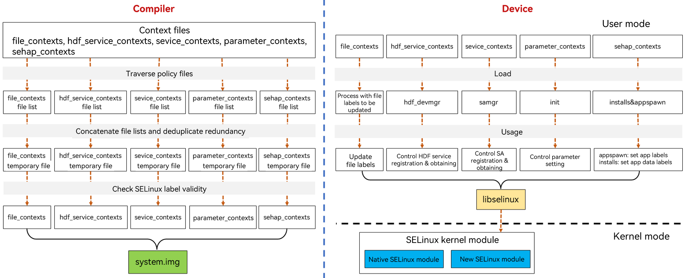

# Compiling and Loading OpenHarmony SELinux

## Compiling and Loading Policies

The OpenHarmony SELinux policies are compiled by the compiler, and loaded after the init process is started. The following figure shows the compilation and loading process.

**Figure 1** OpenHarmony SELinux compilation and loading process

### Compiling Policies
The OpenHarmony SELinux policy compilation process is as follows:
1. Traverse the **//base/security/selinux_adapter/sepolicy/** directory to obtain system-related policy files (files in **/system** and **/public**) and chipset-related policy files (files in **/vendor** and **/public**). Then, use m4 (a macro processor) to concatenate the system-related policy file lists into the **system.conf** file, and the chipset-related policy file lists into the **vendor.conf** file. You also need to determine whether to enable the macro to apply the policies here. 

   The **//base/security/selinux_adapter/sepolicy/** directory is traversed in the following sequence: 

   security_classes, initial_sids, access_vectors, glb_perm_def.spt, glb_never_def.spt, mls, policy_cap, glb_te_def.spt, attributes, .te, glb_roles.spt, users, initial_sid_contexts, fs_use, virtfs_contexts

2. Use checkpolicy (open-source software) to compile the **system.conf** and **vendor.conf** files into **system.cil** and **vendor.cil**, respectively.

3. Use secilc (open-source software) to combine **system.cil** and **vendor.cil** and compile them into a binary policy file. 

   During the compilation process, **neverallow** check is performed. If any **neverallow** violation is found, an error will be reported. For details about how to resolve the problem, see [OpenHarmony SELinux FAQs](subsys-security-selinux-faq.md).

4. Archive the binary policy file to **system.img** in **/system/etc/selinux/targeted/policy/policy.31**.

### Loading Policies 
The OpenHarmony SELinux policy loading process is as follows:
1. After started, the init process loads the SELinux binary policy file to the kernel by using the API provided by libselinux.

2. The SELinux running mode is set based on the value of the **SELINUX** field in the **/system/etc/selinux/config** file. 

   The running mode can be enforcing mode (where violations are denied and logged) or permissive mode (where violations are logged but allowed). Since OpenHarmony 3.2, OpenHarmony SELinux runs in enforcing mode by default.

## Compiling and Loading Contexts
OpenHarmony SELinux contexts include **file_contexts**, **hdf_service_contexts**, **sevice_contexts**, **parameter_contexts**, and **sehap_contexts**. Instead of being compiled with policies, these context files must be archived separately. The following figure shows the overall process.

**Figure 2** OpenHarmony SELinux context compilation and loading process

### Compiling Contexts
The OpenHarmony SELinux context compilation process is as follows:
1. Traverse the context files of each type to obtain a list of context files separately.
2. Combine and deduplicate the file lists to generate a temporary context file of each type.
3. Verify the SELinux labels in each context file and generate the final context files.
4. Archive the final context files to **system.img** in **/system/etc/selinux/targeted/contexts/**.

### Loading Contexts
The loading of OpenHarmony SELinux contexts varies with the context type.
| Context Type| Loaded By| Loaded To|
| -------- | -------- | -------- |
| file_contexts | Process that needs to update the file labels| Update file labels.|
| hdf_service_contexts | hdf_devmgr |Control HDF service registration and obtaining.|
| sevice_contexts | Samgr | Control SA registration and obtaining. |
| parameter_contexts | init | Control parameter setting.|
| sehap_contexts | appspawn installs | Set application labels. Set application data labels.|
