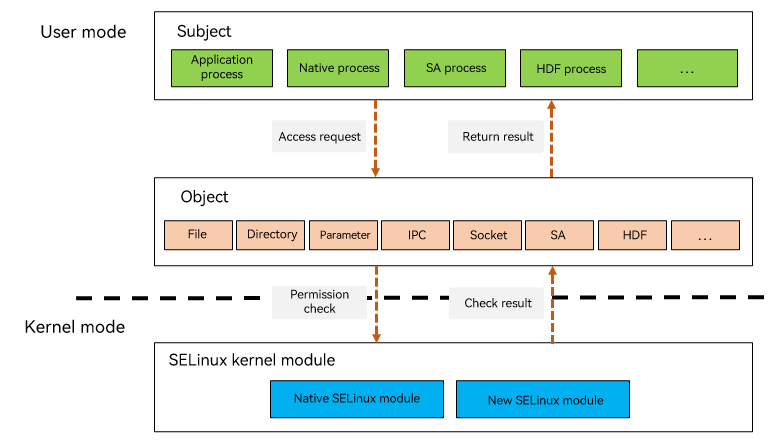

# OpenHarmony SELinux Overview

## Introduction

OpenHarmony Security-Enhanced Linux (SELinux) provides mandatory access control (MAC) capabilities for system resources, such as files, parameters, system abilities (SAs), and Hardware Driver Foundation (HDF) services, based on the system architecture characteristics and SELinux. This topic describes how to develop the OpenHarmony SELinux features based on the SELinux access control model.

OpenHarmony SELinux provides the following functionalities:

- Access control for parameters, SAs, and HDF services.
- Setting of application labels.
- Security policy compiling and loading.
- Security context compiling and loading.
- Policy validity check during compilation.

## Basic Concepts

- Security context

  Security contexts are also referred to as SELinux labels. An OpenHarmony SELinux context is in the **user:role:type:sensitivity[:category,...]- sensitivity [:category,...]** format, where:
  - **user**: user type. For example, **user u roles { r }** indicates the user **u** who is authorized for role **r**.
  - **role**: role identifier, which defines the types that can be accessed by a process. It is **object_r** for the user type of resources such as files, parameters, SA services, and HDF services, and **r** for the user type of processes.
  - **type**: SELinux type. In SELinux rule statements, **type** specifies the rule.
  - **sensitivity**: multi-level security (MLS) level. Different security levels are isolated. Currently, OpenHarmony SELinux supports only the security level **s0**.
  - **category**: category of a specific sensitivity. Currently, OpenHarmony SELinux has defined categories **c0** to **c1023**, which are not distinguished for SELinux policies.

- Subject

  A subject is an active entity that makes a request to access a resource (object). It can be a user, a process, a service, or an SELinux type. In OpenHarmony SELinux, process subjects are classified into native process, application process, SA process, and HDF process.

-  Object

  An object is the resource to access. It can be a file, directory, parameter, SA, or HDF service.

- SID

  Security ID (SID or sid) is a unique identifier of a process, a file, or an SELinux object.

- AVC

  Access Vector Cache (AVC) is used to trace and cache information about access control decisions to improve system performance and security.

- TE

  An SELinux policy consists of multiple type enforcement (TE) rules.

- Running mode

  OpenHarmony SELinux can run in either of the following modes:
  + Enforcing mode: Permission denials are both enforced and logged with an AVC alarm.
  + Permissive mode: Permission denials are logged with an AVC alarm but not enforced.

## Working Principles

OpenHarmony SELinux uses the security contexts of the subject and object to determine whether the subject can access the object and intercepts unauthorized behavior in kernel mode.

**Figure 1** OpenHarmony SELinux architecture

