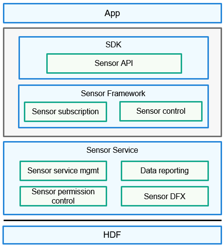

# Service Overview

## Introduction

The pan-sensor service subsystem provides a lightweight sensor service framework. You can call APIs offered by this framework to query the sensor list, enable or disable a sensor, and subscribe to or unsubscribe from sensor data. The following figure shows the architecture of the lightweight sensor framework.

  **Figure 1** Sensor service framework

  

- Sensor API: provides APIs for performing basic operations on sensors, including querying the sensor list, subscribing to or unsubscribing from sensor data, and executing control commands. This module makes application development simpler.

- Sensor Framework: manages sensor data subscription, creates and destroys data channels, and implements communication with the Sensor Service module.

- Sensor Service: interacts with the HDF module to receive, parse, and distribute data, manages sensors on hardware and sensor data reporting, and controls sensor permissions.

## Available APIs

  **Table 1** APIs of the sensor framework

| API| Description| Parameter|
| -------- | -------- | -------- |
| int32_t  **GetAllSensors**(   SensorInfo  \*\*sensorIn   fo,  int32_t  \*count) | Obtains information about all sensors in the system. **Return value**: Returns **0** if the information is obtained; returns a non-zero value otherwise.| **sensorInfo** (not NULL): information about all sensors in the system **count** (not NULL): total number of sensors in the system|
| int32_t  **SubscribeSensor**   (int32_t  sensorTypeId,     SensorUser  \*user) | Subscribes to sensor data. The system will report the obtained sensor data to the subscriber. **Return value**: Returns **0** if the subscription is successful; returns a non-zero value otherwise.| **sensorTypeId**: ID of a sensor type **user** (not NULL): sensor subscriber that requests sensor data. A subscriber can obtain data from only one sensor.|
| int32_t  **UnsubscribeSensor**   (int32_t  sensorTypeId,  SensorUser  \*user) | Unsubscribes from sensor data. The system will no longer report sensor data to the subscriber. **Return value**: Returns **0** if the sensor data reporting mode is successfully set; returns a non-zero value otherwise.| **sensorTypeId**: ID of a sensor type **user** (not NULL): sensor subscriber that requests sensor data. A subscriber can obtain data from only one sensor.|
| int32_t  **SetBatch**(int32_t  sensorTypeId,  SensorUser     \*user,  int64_t  samplingInterval,  int64_t  reportInterval) | Sets the data sampling interval and data reporting interval for the specified sensor. **Return value**: Returns **0** if the sensor data reporting mode is successfully set; returns a non-zero value otherwise.| **sensorTypeId**: ID of a sensor type **user** (not NULL): sensor subscriber that requests sensor data. A subscriber can obtain data from only one sensor. **samplingInterval**: sensor data sampling interval, in nanoseconds **reportInterval**: sensor data reporting interval, in nanoseconds|
| int32_t  **ActivateSensor**(int32_t  sensorTypeId,     SensorUser  \*user) | Enables the specified sensor that has been subscribed to. **Return value**: Returns **0** if the sensor data reporting mode is successfully set; returns a non-zero value otherwise.| **sensorTypeId**: ID of a sensor type **user** (not NULL): sensor subscriber that requests sensor data. A subscriber can obtain data from only one sensor.|
| int32_t  **DeactivateSensor**(int32_t  sensor   TypeId,  SensorUser  \*user) | Disables an enabled sensor. **Return value**: Returns **0** if the sensor data reporting mode is successfully set; returns a non-zero value otherwise.| **sensorTypeId**: ID of a sensor type **user** (not NULL): sensor subscriber that requests sensor data. A subscriber can obtain data from only one sensor.|
| int32_t  **SetMode**(int32_t  sensorTypeId,     SensorUser  \*user,  int32_t  mode) | Sets the data reporting mode for the specified sensor. **Return value**: Returns **0** if the sensor data reporting mode is successfully set; returns a non-zero value otherwise.| **sensorTypeId**: ID of a sensor type **user** (not NULL): sensor subscriber that requests sensor data. A subscriber can obtain data from only one sensor. **mode**: data reporting mode of the sensor|
