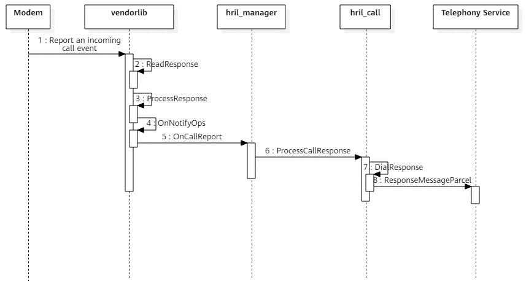

# Telephony Development<a name="EN-US_TOPIC_0000001167051994"></a>

## Initializing a Modem Vendor Library<a name="section211mcpsimp"></a>

### When to Use<a name="section213mcpsimp"></a>

Initializing a modem vendor library means to implement **const HRilOps \*RilInitOps\(const struct HRilReport \*reportOps\)** function in the vendor library. This function is mainly used to:

-   Receive function pointers to event callbacks of RIL Adapter. When a service event needs to be reported, the target pointer will be called to report the event to RIL Adapter.
-   Create a thread for reading modem nodes. In this thread, the data reported by the modem is read cyclically and parsed as a specific service event for reporting.
-   Return the function pointer of the service request API to RIL Adapter.

### Available APIs<a name="section811343241215"></a>

The following table describes the API for initializing a modem vendor library.

**Table  1** API for initializing a modem vendor library

| API | Description | 
| -------- | -------- |
| const&nbsp;HRilOps&nbsp;\*RilInitOps(const&nbsp;struct&nbsp;HRilReport&nbsp;\*&nbsp;reportOps) | Provides an entry for running a modem vendor library.<br>Input parameter:<br>**reportOps**: Specifies the pointer to the event callback function, which is passed by RIL Adapter.<br/>Return result: function pointer of the service request API. | 

### How to Develop<a name="section51031144122"></a>

1.  Set the event callback function pointers passed by RIL Adapter through **RilInitOps**.

    ```
    // Define the callback function pointers of the modem vendor library.
    static struct HRilReport g_reportOps = {
        OnCallReport, // Callback function for call services
        OnDataReport, // Callback function for cellular data services
        OnModemReport, // Callback function for modem services
        OnNetworkReport, // Callback function for network search services
        OnSimReport, // Callback function for SIM card services
        OnSmsReport // Callback function for SMS services
    };
    ```


1.  Create the **g\_reader** main thread to enable message looping.

    ```
    pthread_attr_t t;
    pthread_attr_init(&t);
    pthread_attr_setdetachstate(&t, PTHREAD_CREATE_DETACHED);
    ret = pthread_create(&g_reader, &t, ReaderLoop, &t); // Create the g_reader thread.
    ```


1.  In the **g\_eventListeners** thread, use **open\(\)** to open a modem node and then create the **g\_reader** thread to read and process messages reported by the modem.

    ```
    g_fd = open(g_devicePath, O_RDWR); // Open the device node specified by g_devicePath.
    pthread_attr_init(&attr);   
    pthread_attr_setdetachstate(&attr, PTHREAD_CREATE_DETACHED);   
    ret = pthread_create(&g_eventListeners, &attr, EventListeners, NULL);
    ```


1.  Return the function pointer of the service request API.

    ```
    // Structure for the service request API of the call module
    typedef struct {
        // Obtain the call list.
        void (*GetCallList)(ReqDataInfo *requestInfo, const void *data, size_t dataLen);
        // Make a call.
        void (*Dial)(ReqDataInfo *requestInfo, const void *data, size_t dataLen);
        // Disconnect a call.
        void (*Hangup)(ReqDataInfo *requestInfo, const void *data, size_t dataLen);
        // Reject a call.
        void (*Reject)(ReqDataInfo *requestInfo, const void *data, size_t dataLen);
        // Answer a call.
        void (*Answer)(ReqDataInfo *requestInfo, const void *data, size_t dataLen);
    } HRilCallReq;
    
    // Callback function pointers of the call module
    static const HRilCallReq g_callReqOps = { 
        .GetCallList = ReqGetCallList, // Obtain the call list.
        .Dial = ReqDial,               // Make a call.
        .Hangup = ReqHangup,           // Disconnect a call.
        .Reject = ReqReject,           // Reject a call.
        .Answer = ReqAnswer,           // Answer a call.
    };
    
    // Service request structure
    typedef struct { 
        const HRilCallReq *callOps;       // Pointer to the structure of call service requests
        const HRilSimReq *simOps;         // Pointer to the structure of SIM card service requests
        const HRilSmsReq *smsOps;         // Pointer to the structure of SMS and MMS service requests
        const HRilDataReq *dataOps;       // Pointer to the structure of cellular data service requests
        const HRilNetworkReq *networkOps; // Pointer to the structure of network search service requests
        const HRilModemReq *modemOps;     // Pointer to the structure of modem service requests
    } HRilOps;  
      
    // Service request APIs
    HRilOps g_hrilOps = {
        .callOps = &g_callReqOps,       // API for call service requests
        .simOps = &g_simReqOps,         // API for SIM card service requests
        .smsOps = &g_smsReqOps,         // API for SMS and MMS service requests
        .networkOps = &g_networkReqOps, // API for cellular data service requests
        .dataOps = &g_dataReqOps,       // API for network search service requests
        .modemOps = &g_modemReqOps,     // API for modem service requests
    };
    ```


### Debugging and Verification<a name="section5351151517132"></a>

1.  Use the [hdc\_std](../subsystems/subsys-toolchain-hdc-guide.md#preparations) tool to connect to a debugging device. Then, run the following command to send the generated **libril\_vendor.z.so** library file to the **/system/lib/** directory of the device. For details about how to integrate a library file, see  [Integrating Modem Vendor Libraries](#section590mcpsimp).

    ```
    hdc_std file send libril_vendor.z.so /system/lib/
    ```

2.  Reboot the debugging device.

    ```
    hdc_std shell sync
    hdc_std shell reboot
    ```

3.  Run the **hdc\_std shell hilog** command to view the debug log, and check whether the **RilInitOps\(\)** function is successfully executed. The following debug log is for reference:

    ```
    01-01 05:13:23.071   136  2319 D 00000/RilAdapterInit: [RilAdapterDispatch-(hril_hdf.c:55)] sbuf IPC obtain test success!
    01-01 05:13:23.071   136  2319 D 00000/RilAdapterInit: [LoadVendor-(hril_hdf.c:33)] RilInit rilInit start
    01-01 05:13:23.071   136  2319 D 00000/RilAdapterInit: [LoadVendor -(hril_hdf.c:45)] RilInit rilInit completed
    ```


## Responding to Modem Service Requests<a name="section295mcpsimp"></a>

### When to Use<a name="section297mcpsimp"></a>

After receiving a specific telephony service request, RIL Adapter calls the target function pointer obtained in modem vendor library initialization to send a specific service request to the vendor library. Then, the vendor library processes the request based on the request ID.

### Available APIs<a name="section9503155219134"></a>

The following table describes the APIs for responding to modem service requests, with the dial module as an example.

**Table  2** APIs for responding to modem service requests

| API | Description | 
| -------- | -------- |
| void&nbsp;ReqDial(ReqDataInfo&nbsp;\*requestInfo,&nbsp;const&nbsp;void&nbsp;\*data,&nbsp;size_t&nbsp;dataLen); | Processes number dial requests.<br>Input parameters:<br>**requestInfo**: request type<br/>**data**: called number<br/>**dataLen**: data length<br/>Return value: none | 
| void&nbsp;(\*OnCallReport)(struct&nbsp;ReportInfo&nbsp;reportInfo,&nbsp;const&nbsp;void&nbsp;\*data,&nbsp;size_t&nbsp;dataLen); | Reports the execution result of a service request to RIL Adapter.<br>Input parameters:<br>**reportInfo**: request type<br/>**data**: called number<br/>**dataLen**: data length<br/>Return value: none | 

### How to Develop<a name="section17190412101414"></a>

1.  Implement processing of dial requests in the **ReqDial\(\)** API.

    ```
    // Implement the API for processing dial requests.
    void ReqDial(ReqDataInfo *requestInfo, const void *data, size_t dataLen)
    {
        HRilDial *pDial = NULL;
        char cmd[MAX_BUFF_SIZE] = {0};
        const char *clir = NULL;
        int ret;
        int err = HRIL_ERR_SUCCESS;
        struct ReportInfo reportInfo = {};
        ResponseInfo *pResponse = NULL;
        if (data == NULL) {
            TELEPHONY_LOGE("data is null!!!");
            err = HRIL_ERR_INVALID_PARAMETER;
            reportInfo = CreateReportInfo(requestInfo, err, HRIL_RESPONSE, 0);
            OnCallReport(reportInfo, NULL, 0);
            return;
        }
        pDial = (HRilDial *)data;
        switch (pDial->clir) {
            case CALL_CLIR_INVOCATION:
                clir = "I";
                break; /* invocation */
            case CALL_CLIR_SUPPRESSION:
                clir = "i";
                break; /* suppression */
            case CALL_CLIR_SUBSCRIPTION_DEFUALT:
            default:
                clir = "";
                break; /* subscription default */
        }
        (void)sprintf_s(cmd, MAX_BUFF_SIZE, "ATD%s%s;", pDial->address, clir);
        ret = SendCommandLock(cmd, NULL, 0, &pResponse); // Send the AT command.
        ......
    }
    ```

2.  After the modem executes the dial command, report the execution result to RIL Adapter via **OnCallReport\(\)**.

    ```
    ret = SendCommandLock(cmd, NULL, 0, &pResponse);
    if (ret != 0 || (pResponse != NULL && pResponse->success == 0)) {
        TELEPHONY_LOGE("ATD send failed");
        err = HRIL_ERR_GENERIC_FAILURE;
    }
    reportInfo = CreateReportInfo(requestInfo, err, HRIL_RESPONSE, 0);
    OnCallReport(reportInfo, NULL, 0); // Invoke the callback function of the call service.
    ```


### Debugging and Verification<a name="section10207938171413"></a>

1.  Use the [hdc\_std](../subsystems/subsys-toolchain-hdc-guide.md#preparations) tool to connect to a debugging device. Then, run the following command to send the generated **libril\_vendor.z.so** library file to the **/system/lib/** directory of the device.

    ```
    hdc_std file send libril_vendor.z.so /system/lib/
    ```

2.  Reboot the debugging device.

    ```
    hdc_std shell sync
    hdc_std shell reboot
    ```

3.  Run the **hdc\_std shell** command. Then, run the **./system/bin/ril\_adapter\_test** command, type **1**, and enter the phone number as prompted to test the call function.

    ```
    hdc_std shell
    # ./system/bin/ril_adapter_test
    ----> Test Enter  --------->Call---------------------
     
    1----> RilUnitTest::OnRequestCallDialTest
    2----> RilUnitTest:: OnRequestCallHangupTest
    3----> RilUnitTest:: OnRequestCallAnswerTest
    4----> RilUnitTest::OnRequestCallGetCurrentCallsStatusTest
    5----> RilUnitTest::OnRequestRefusedCallTest
       
    1
    ```

4.  Open another terminal window, and run the **hdc\_std shell hilog** command. Then, view the log to check whether **ReqDial\(\)** is successfully executed. The following debug log is for reference:

    ```
    01-01 05:27:27.419   136   408 D 02b01/Rilvendor: [SendCommandLock-(at_support.c:210)] SendCommandLock enter, cmd: ATD17620373527
    01-01 05:27:27.419   136   408 D 02b01/Rilvendor: [SendCommandLock-(at_support.c:231)] SendCommandLock() command ATD17620373527
    01-01 05:27:27.419   136   408 D 02b01/Rilvendor: [WriteATCommand-(channel.c:115)] WriteATCommand enter, cmd:ATD17620373527
    01-01 05:27:27.421   136   187 D 02b01/Rilvendor: [ReadResponse-(channel.c:94)] g_bufferCur : 
    01-01 05:27:27.421   136   187 D 02b01/Rilvendor: OK
    01-01 05:27:27.422   136   187 D 02b01/Rilvendor: [ProcessResponse-(at_support.c:144)] processLine line = OK
    01-01 05:27:27.422   136   187 D 02b01/Rilvendor: [ReadResponse-(channel.c:81)] ReadResponse enter
    01-01 05:27:27.422   136   187 D 02b01/Rilvendor: [ProcessLastResponse-(channel.c:37)] last data more than one line , FindEndOfLine  g_bufferCur: 
    01-01 05:27:27.422   136   187 E 02b01/Rilvendor: [ProcessLastResponse-(channel.c:39)] g_bufferCur endLine is null
    01-01 05:27:27.422   136   187 E 02b01/Rilvendor:^ORIG:1,0
    01-01 05:27:27.422   136   408 E 02b01/Rilvendor: [SendCommandLock-(at_support.c:234)] processLine line = ^ORIG:1,0
    01-01 05:27:27.422 136 408 E 02b01/Rilvendor: [SendCommandLock-(vendor_report.c:234)] enter to [^ORIG:1,0]: (null)
    01-01 05:27:27.422   136   408 E 02b01/Rilvendor: [SendCommandLock-(at_support.c:264)] err = 0, cmd:ADT17620373527
    ```


## Reporting Modem Events<a name="section390mcpsimp"></a>

### When to Use<a name="section401mcpsimp"></a>

A modem node thread reads the messages reported by the modem cyclically, parses the messages into specific events, and then reports the events to RIL Adapter.

### Available APIs<a name="section191193791518"></a>

The following table describes the API for reporting modem events.

**Table  3** API for reporting modem events

| API | Description | 
| -------- | -------- |
| void&nbsp;OnNotifyOps(const&nbsp;char&nbsp;\*s,&nbsp;const&nbsp;char&nbsp;\*smsPdu) | Distributes the events reported by the modem.<br>Input parameters:<br/>**s**: AT command prefix<br/>**smsPdu**: PDU of the SMS message<br/>Return value: none | 

### How to Develop<a name="section16394112401512"></a>

1.  Call **OnNotifyOps\(\)** in the g\_reader thread of the modem device node to parse reported modem events. On determining the command type, call **OnXxxReport\(\)** to report the parsed module events to the hril layer.

    ```
    // Parse the data reported by the modem as events proactively reported by the corresponding module.
    void OnNotifyOps(const char *s, const char *smsPdu)
    {
        int ret = 0;
        struct ReportInfo reportInfo = {0};
        reportInfo.error = HRIL_ERR_SUCCESS;
        reportInfo.type = HRIL_NOTIFICATION;
        if (GetRadioState() == HRIL_RADIO_POWER_STATE_UNAVAILABLE) {
            return;
        }
        TELEPHONY_LOGD("enter to [%{public}s]:%{public}s", s, smsPdu);
        // Determine the type of the proactively reported events based on the AT command.
        if (ReportStrWith(s, "+CRING:") || ReportStrWith(s, "RING") || ReportStrWith(s, "IRING") ||
            ReportStrWith(s, "NO CARRIER") || ReportStrWith(s, "+CCWA") || ReportStrWith(s, "^CCALLSTATE") ||
            ReportStrWith(s, "^CEND") || ReportStrWith(s, "^CCWA")) {
            reportInfo.notifyId = HNOTI_CALL_STATE_UPDATED;
            OnCallReport(reportInfo, NULL, 0);
        } else if (ReportStrWith(s, "+CMT:")) {
            reportInfo.notifyId = HNOTI_SMS_NEW_SMS;
            OnSmsReport(reportInfo, (void *)smsPdu, strlen(smsPdu));
        }
        // Report the events of each module to the hril layer.
        ...
    }
    ```


1.  Distribute the reported events from the **hril** layer to the Telephony Service layer.

    ```
    // Report the call status proactively.
    int32_t HRilCall::CallStateUpdated(
        int32_t slotId, int32_t notifyType, const HRilErrno e, const void *response, size_t responseLen)
    {
        struct HdfSBuf *dataSbuf = HdfSBufTypedObtain(SBUF_IPC);
        if (serviceCallbackNotify_ == nullptr) {
            TELEPHONY_LOGE("RilAdapter serviceCallbackNotify_ is null");
            HdfSBufRecycle(dataSbuf);
            return HDF_FAILURE;
        }
        // Distribute events.
        int32_t ret = serviceCallbackNotify_->dispatcher->Dispatch(
            serviceCallbackNotify_, HNOTI_CALL_STATE_UPDATED, dataSbuf, nullptr);
        if (ret != HDF_SUCCESS) {
            HdfSBufRecycle(dataSbuf);
            return HDF_FAILURE;
        }
        HdfSBufRecycle(dataSbuf);
        return HDF_SUCCESS;
    }
    ```


### Debugging and Verification<a name="section16999174401516"></a>

1.  Use the [hdc\_std](../subsystems/subsys-toolchain-hdc-guide.md#preparations) tool to connect to a debugging device. Then, run the following command to send the generated **libril\_vendor.z.so** library file to the **/system/lib/** directory of the device.

    ```
    hdc_std file send libril_vendor.z.so /system/lib/
    ```

2.  Reboot the debugging device.

    ```
    hdc_std shell sync
    hdc_std shell reboot
    ```

3.  Run the **hdc\_std shell** command. Then, run the **./system/bin/ril\_adapter\_test** command, type **1**, and enter the phone number as prompted to test the call function.

    ```
    hdc_std shell
    # ./system/bin/ril_adapter_test
    ----> Test Enter  --------->Call---------------------
     
    1----> RilUnitTest::OnRequestCallDialTest
    2----> RilUnitTest:: OnRequestCallHangupTest
    3----> RilUnitTest:: OnRequestCallAnswerTest
    4----> RilUnitTest::OnRequestCallGetCurrentCallsStatusTest
    5----> RilUnitTest::OnRequestRefusedCallTest
       
    1
    ```

4.  Open another terminal window, and run the **hdc\_std shell hilog** command. Then, view the log to check whether **OnNotifyOps\(\)** is successfully executed. The following debug log is for reference:

    ```
    01-01 00:08:01.334   546   551 D 02b01/TelRilTest: [DialResponse-(tel_ril_call.cpp:280)] DialResponse --> radioResponseInfo->serial:2, radioResponseInfo->error:0
    01-01 00:08:01.334   546   557 D 02b01/TelRilTest: [ProcessEvent-(tel_ril_test.cpp:1262)] TelRilTest::DemoHandler::ProcessEvent --> eventId:101
    01-01 00:08:01.334   143   512 D 02b01/Rilvendor: [ReadResponse-(channel.c:93)] g_bufferCur : 
    01-01 00:08:01.334   143   512 D 02b01/Rilvendor: ^ORIG:1,0
    01-01 00:08:01.334   143   512 D 02b01/Rilvendor: [ReadResponse-(channel.c:108)] AT< ^ORIG:1,0
    01-01 00:08:01.334   143   512 D 02b01/Rilvendor: [ProcessResponse-(at_support.c:137)] processLine line = ^ORIG:1,0
    01-01 00:08:01.334   143   512 D 02b01/Rilvendor: [OnNotifyOps-(vendor_report.c:126)] enter to [^ORIG:1,0]:(null)
    01-01 00:08:01.335   143   512 W 02b01/Rilvendor: [OnNotifyOps-(vendor_report.c:167)] enter to  is unrecognized command: ^ORIG:1,0
    01-01 00:08:01.335   143   512 D 02b01/Rilvendor: [ProcessLastResponse-(channel.c:37)] last data more than one line , FindEndOfLine  g_bufferCur: 
    01-01 00:08:01.335   143   512 E 02b01/Rilvendor: [ProcessLastResponse-(channel.c:39)] g_bufferCur endLine is null
    01-01 00:08:01.336   143   512 D 02b01/Rilvendor: [ReadResponse-(channel.c:93)] g_bufferCur : 
    01-01 00:08:01.336   143   512 D 02b01/Rilvendor: ^CCALLSTATE: 1,0,1
    01-01 00:08:01.336   143   512 D 02b01/Rilvendor: [ReadResponse-(channel.c:108)] AT< ^CCALLSTATE: 1,0,1
    01-01 00:08:01.336   143   512 D 02b01/Rilvendor: [ProcessResponse-(at_support.c:137)] processLine line = ^CCALLSTATE: 1,0,1
    01-01 00:08:01.336   143   512 D 02b01/Rilvendor: [OnNotifyOps-(vendor_report.c:126)] enter to [^CCALLSTATE: 1,0,1]:(null)
    01-01 00:08:01.336   546   551 D 02b01/CoreService: [OnRemoteRequest-(tel_ril_manager.cpp:80)] RilManager OnRemoteRequest code:1001
    01-01 00:08:01.336   546   551 D 02b01/CoreService: [NotifyObserver-(observer_handler.cpp:76)] handler->SendEvent:8
    ```


### Development Examples<a name="section33444350167"></a>

-  **Outgoing Call**

    The following figure shows the API calling for an outgoing call.

   **Figure  1** Time sequence of API calling for an outgoing call<a name="fig494mcpsimp"></a>  
    

    

    When an application initiates an outgoing call, RIL Adapter receives a call request, and the **hril** layer invokes the **ReqDial\(\)** function. In **ReqDial\(\)**, the data passed by the Telephony Service is encapsulated as an AT command and sent to the modem. After executing the dial command, the modem reports the execution result to RIL Adapter through **OnCallReport\(\)**.

    ```
    // Callback function pointer of the call module
    static const HRilCallReq g_callReqOps = { 
        .GetCallList = ReqGetCallList, // Obtain the call list.
        .Dial = ReqDial,               // Make a call.
        .Hangup = ReqHangup,           // Disconnect a call.
        .Reject = ReqReject,           // Reject a call.
        .Answer = ReqAnswer,           // Answer a call.
    }; 
    
    // Service request APIs
    HRilOps g_hrilOps = {
        .callOps = &g_callReqOps,       // API for call service requests
        .simOps = &g_simReqOps,         // API for SIM card service requests
        .smsOps = &g_smsReqOps,         // API for SMS and MMS service requests
        .networkOps = &g_networkReqOps, // API for cellular data service requests
        .dataOps = &g_dataReqOps,       // API for network search service requests
        .modemOps = &g_modemReqOps,     // API for modem service requests
    };
    
    // Implement the API for processing dial requests.
    void ReqDial(ReqDataInfo *requestInfo, const void *data, size_t dataLen)
    {
        HRilDial *pDial = NULL;
        char cmd[MAX_BUFF_SIZE] = {0};
        const char *clir = NULL;
        int ret;
        int err = HRIL_ERR_SUCCESS;
        struct ReportInfo reportInfo = {};
        ResponseInfo *pResponse = NULL;
        if (data == NULL) {
            TELEPHONY_LOGE("data is null!!!");
            err = HRIL_ERR_INVALID_PARAMETER;
            reportInfo = CreateReportInfo(requestInfo, err, HRIL_RESPONSE, 0);
            OnCallReport(reportInfo, NULL, 0);
            return;
        }
        pDial = (HRilDial *)data;
        switch (pDial->clir) {
            case CALL_CLIR_INVOCATION:
                clir = "I";
                break; /* invocation */
            case CALL_CLIR_SUPPRESSION:
                clir = "i";
                break; /* suppression */
            case CALL_CLIR_SUBSCRIPTION_DEFUALT:
            default:
                clir = "";
                break; /* subscription default */
        }
        (void)sprintf_s(cmd, MAX_BUFF_SIZE, "ATD%s%s;", pDial->address, clir);
        ret = SendCommandLock(cmd, NULL, 0, &pResponse); // Send the AT command.
        if (ret != 0) {
            err = HRIL_ERR_CMD_SEND_FAILURE;
            TELEPHONY_LOGE("ATD send failed");
        } else {
            if (pResponse != NULL && pResponse->success == 0) {
                TELEPHONY_LOGE("ReqDial return ERROR");
                err = HRIL_ERR_CMD_NO_CARRIER;
            }
        }
        reportInfo = CreateReportInfo(requestInfo, err, HRIL_RESPONSE, 0);
        OnCallReport(reportInfo, NULL, 0); // Invoke the callback function of the call service.
        FreeResponseInfo(pResponse);
    }
    ```


-  **Incoming Call**

    The following figure shows the API calling of an incoming call.

   **Figure  2** Time sequence of API calling for an incoming call<a name="fig556mcpsimp"></a>  
    

    

    The **g\_reader** thread cyclically reads the messages reported by the modem. When the modem receives an incoming call event, it actively reports the information about the incoming call.

    The **g\_reader** thread calls **OnNotifyOps\(\)** to parse the reported information. If the parsed data reported by the modem starts with characters such as **+CRING** or **RING**, it indicates that an incoming call event exists. In this case, the event is reported to RIL Adapter through **OnCallReport\(reportInfo, NULL, 0\)**.

    ```
    // Parse the data reported by the modem as events proactively reported by the corresponding module.
    void OnNotifyOps(const char *s, const char *smsPdu)
    {
        int ret = 0;
        struct ReportInfo reportInfo = {0};
        reportInfo.error = HRIL_ERR_SUCCESS;
        reportInfo.type = HRIL_NOTIFICATION;
        if (GetRadioState() == HRIL_RADIO_POWER_STATE_UNAVAILABLE) {
            return;
        }
        TELEPHONY_LOGD("enter to [%{public}s]:%{public}s", s, smsPdu);
        // Determine the type of the proactively reported events based on the AT command.
        if (ReportStrWith(s, "+CRING:") || ReportStrWith(s, "RING") || ReportStrWith(s, "IRING") ||
            ReportStrWith(s, "NO CARRIER") || ReportStrWith(s, "+CCWA") || ReportStrWith(s, "^CCALLSTATE") ||
            ReportStrWith(s, "^CEND") || ReportStrWith(s, "^CCWA")) {
            reportInfo.notifyId = HNOTI_CALL_STATE_UPDATED;
            OnCallReport(reportInfo, NULL, 0);  // Invoke the callback function of the call service.
        } else if (ReportStrWith(s, "+CMT:")) {
            reportInfo.notifyId = HNOTI_SMS_NEW_SMS;
            OnSmsReport(reportInfo, (void *)smsPdu, strlen(smsPdu));
        } 
        // add your codes
        ......
    }
    ```


## Integrating Modem Vendor Libraries<a name="section590mcpsimp"></a>

### Configuring Compilation Information<a name="section592mcpsimp"></a>

Compile the modem vendor library into a dynamic library by using **BUILD.gn**. Upon startup, RIL Adapter loads the dynamic library to the system in dlopen mode and then initializes the library. For details about how to implement vendor library initialization, see  [Initializing a Modem Vendor Library](#section211mcpsimp). The following is an example of **BUILD.gn**:

```
import("//build/ohos.gni")
RIL_ADAPTER = "//base/telephony"
ohos_shared_library("ril_vendor") { // Modem vendor library
    sources = [ // Source files to compile
        "at_call.c",
        "at_data.c",
        "xxx.c",
    ]
    include_dirs = [ // Header files
        "$RIL_ADAPTER/ril_adapter/vendor/include",
        "$RIL_ADAPTER/ril_adapter/interfaces/innerkits",
        "include",
    ]
    deps = [ // Internal dependencies
        "//drivers/adapter/uhdf2/osal:libhdf_utils",
        "//base/telephony/core_service/utils:libtelephony_common",
    ]
    external_deps = [ "hilog:libhilog" ] // External dependencies

    part_name = "ril_adapter"  // Part name
    subsystem_name = "telephony" // Subsystem name
}
```

### Debugging and Verification<a name="section620mcpsimp"></a>

1.  Compile the code.
2.  Check whether **libril\_vendor.z.so** exists in the **/out/{device_name}/telephony/ril\_adapter** directory. If yes, the integration is successful. Otherwise, correct the error and perform debugging and verification again.

