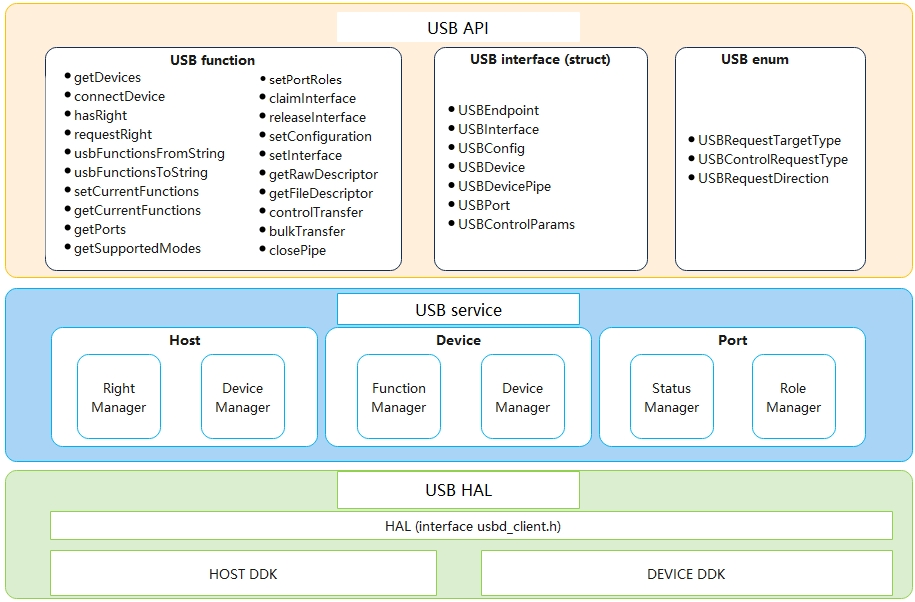

# USB Overview

## Introduction

USB devices are classified into two types: USB host and USB device. On OpenHarmony, you can use the port service to switch between the host mode and device mode. In host mode, you can obtain the list of connected USB devices, manage device access permissions, and perform bulk transfer or control transfer between the host and connected devices. In device mode, you can switch between functions including HDC (debugging), ACM (serial port), and ECM (Ethernet port).

  **Figure 1** USB service architecture
  

The USB service architecture consists of three layers:
- USB API: a layer that provides JS APIs for the upper layer through NAPI.

- USB service: a layer implemented by using the C++ programming language and logically divided into the Host, Device, and Port modules. HDI-based APIs provided by USB Service are mainly used to implement management of USB device list, USB functions, USB ports, and USB device access permissions.

- USB HAL: a layer implemented by using the C programming language. Based on the Host Driver Development Kit (SDK) and Device DDK, USB HAL encapsulates basic USB device operations, provides C++ APIs for the upper layer, and receives information from the kernel through the Hardware Driver Foundation (HDF) framework.

## Available APIs

- Host

| API                                                    | Description                                                    |
| ------------------------------------------------------------ | ------------------------------------------------------------ |
| int32_t OpenDevice(const UsbDevice &device, USBDevicePipe &pip); | Opens a USB device to set up a connection.                                       |
| bool HasRight(std::string deviceName);                       | Checks whether the application has the permission to access the device.                                        |
| int32_t RequestRight(std::string deviceName);                | Requests the temporary permission for a given application to access the USB device.                          |
| int32_t GetDevices(std::vector &deviceList);                 | Obtains the USB device list.                                             |
| int32_t ClaimInterface(USBDevicePipe &pip, const UsbInterface &interface, bool force); | Claims a USB interface exclusively. This must be done before data transfer.              |
| int32_t ReleaseInterface(USBDevicePipe &pip, const UsbInterface &interface); | Releases a USB interface. This is usually done after data transfer.              |
| int32_t BulkTransfer(USBDevicePipe &pip, const USBEndpoint &endpoint, std::vector &vdata, int32_t timeout); | Performs a bulk transfer on a specified endpoint. The data transfer direction is determined by the endpoint direction.|
| int32_t ControlTransfer(USBDevicePipe &pip, const UsbCtrlTransfer &ctrl, std::vector &vdata); | Performs control transfer for endpoint 0 of the device. The data transfer direction is determined by the request type.        |
| int32_t SetConfiguration(USBDevicePipe &pip, const USBConfig &config); | Sets the current configuration of the USB device.                  |
| int32_t SetInterface(USBDevicePipe &pipe, const UsbInterface &interface); | Sets the alternate settings for the specified USB interface. This allows you to switch between two interfaces with the same ID but different alternate settings.|
| int32_t GetRawDescriptors(std::vector &vdata);               | Obtains the raw USB descriptor.                                         |
| int32_t GetFileDescriptor();                                 | Obtains the file descriptor.                                              |
| bool Close(const USBDevicePipe &pip);                        | Closes a USB device to release all system resources related to the device.                      |
| int32_t PipeRequestWait(USBDevicePipe &pip, int64_t timeout, UsbRequest &req); | Obtains the isochronous transfer result.                                            |
| int32_t RequestInitialize(UsbRequest &request);              | Initializes the isochronous transfer request.                                   |
| int32_t RequestFree(UsbRequest &request);                    | Frees the isochronous transfer request.                                     |
| int32_t RequestAbort(UsbRequest &request);                   | Cancels the data transfer request to be processed.                                        |
| int32_t RequestQueue(UsbRequest &request);                   | Sends or receives requests for isochronous transfer on a specified endpoint. The data transfer direction is determined by the endpoint direction.|
| int32_t RegBulkCallback(USBDevicePipe &pip, const USBEndpoint &endpoint, const sptr<IRemoteObject> &cb); | Registers an asynchronous callback for bulk transfer.                                    |
| int32_t UnRegBulkCallback(USBDevicePipe &pip, const USBEndpoint &endpoint); | Unregisters the asynchronous callback for bulk transfer.                                      |
| int32_t BulkRead(USBDevicePipe &pip, const USBEndpoint &endpoint, sptr<Ashmem> &ashmem); | Reads data asynchronously during bulk transfer.                                          |
| int32_t BulkWrite(USBDevicePipe &pip, const USBEndpoint &endpoint, sptr<Ashmem> &ashmem); | Writes data asynchronously during bulk transfer.                                              |
| int32_t BulkCancel(USBDevicePipe &pip, const USBEndpoint &endpoint); | Cancels bulk transfer. The asynchronous read and write operations on the current USB interface will be cancelled.    |

- Device

| API                                          | Description                                              |
| -------------------------------------------------- | ------------------------------------------------------ |
| int32_t GetCurrentFunctions(int32_t &funcs);       | Obtains the numeric mask combination for the current USB function list in Device mode.         |
| int32_t SetCurrentFunctions(int32_t funcs);        | Sets the current USB function list in Device mode.                     |
| int32_t UsbFunctionsFromString(std::string funcs); | Converts the string descriptor of a given USB function list to a numeric mask combination.|
| std::string UsbFunctionsToString(int32_t funcs);   | Converts the numeric mask combination of a given USB function list to a string descriptor.|

- Port

| API                                                    | Description                                                |
| ------------------------------------------------------------ | -------------------------------------------------------- |
| int32_t GetSupportedModes(int32_t portId, int32_t &supportedModes); | Obtains the mask combination for the supported mode list of a given port.                  |
| int32_t SetPortRole(int32_t portId, int32_t powerRole, int32_t dataRole); | Sets the role types supported by a specified port, which can be **powerRole** (for charging) and **dataRole** (for data transfer).|
| int32_t GetPorts(std::vector &usbPorts);                     | Obtains the USB port descriptor list.                             | 
