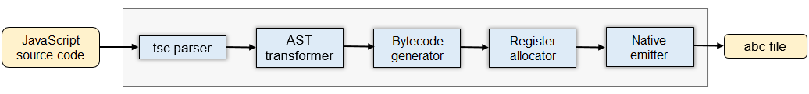
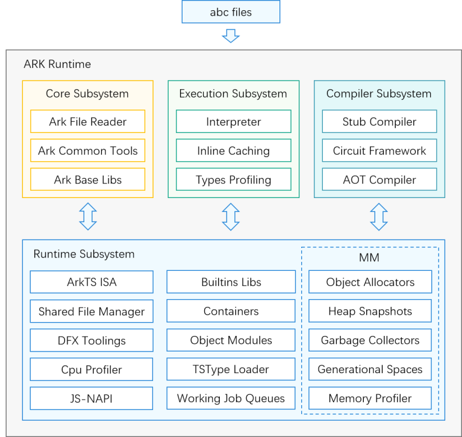

# ArkCompiler Runtime

## Introduction

ArkCompiler is a unified compilation and runtime platform that supports joint compilation and running across programming languages and chip platforms. It supports a variety of dynamic and static programming languages such as JS, TS, and ArkTS. It is the compilation and runtime base that enables OpenHarmony to run on multiple device forms such as mobile phones, PCs, tablets, TVs, automobiles, and wearables.

ArkCompiler consists of two parts: compiler toolchain and runtime.

**Figure 1** Architecture of the compiler toolchain


The compiler toolchain compiles ArkTS, TS, and JS source code into abc files, that is, ArkCompiler bytecode.

**Figure 2** Runtime architecture



The runtime runs the abc files to implement the corresponding semantic logic.

The ArkCompiler runtime consists of four subsystems:

-   Core subsystem

    The core subsystem consists of basic language-irrelevant runtime libraries, including File, Tooling, and Base. File provides bytecode. Tooling supports Debugger. Base implements system calls.

-   Execution subsystem

    The execution subsystem consists of the interpreter for executing bytecode, the inline caching, and the profiler for capturing runtime information.

-   Compiler subsystem

    The compiler subsystem consists of the stub compiler, circuit framework, and Ahead-of-Time (AOT) compiler.

-   Runtime subsystem

    The runtime subsystem contains modules related to the running of ArkTS, TS, and JS code.
    - Memory management: object allocator and garbage collector (CMS-GC and Partial-Compressing-GC for concurrent marking and partial memory compression)
    - Analysis tools: DFX tool and CPU and heap profiling tool
    - Concurrency management: abc file manager in the actor concurrency model
    - Standard library: standard library defined by ECMAScript, efficient container library, and object model
    - Others: asynchronous work queues, TypeScript (TS) type loading, and JS native APIs (JSNAPIs) for interacting with C++ interfaces

**Design features of ArkCompiler eTS Runtime**

- Native support for type information

   Currently, mainstream engines in the industry convert TS source code into JS source code and then run the JS source code to complete semantic logic. However, the ArkCompiler compiler toolchain analyzes and deduces the TS type information when compiling the TS source code and transfers the information to the runtime. The runtime uses the TS type information to pre-generate an inline cache before running, speeding up bytecode execution. The TS AOT compiler directly compiles and generates machine code based on the TS type information in the abc file, so that an application can directly run the optimized machine code, thereby greatly improving the running performance.

- Optimized concurrency model and concurrency APIs

  The ArkCompiler eTS runtime statically pre-compiles ArkTS programs into ArkCompiler bytecode (with static type information) to reduce the overhead caused by compilation and type information collection during runtime. To ensure security and performance, the ArkCompiler eTS runtime selects the code that supports strict but not eval.

- Native support for TS
  
  The ECMAScript specification does not include concurrency semantic representation. Engines in the industry, such as browser or Node.js, usually provide the Worker APIs for multi-thread development based on the Actor concurrency model. In this model, executors do not share data objects or communicate with each other using the messaging mechanism. The worker thread of the web engine or Node.js engine has defects such as slow startup and high memory usage.  To address these defects, the ArkCompiler runtime supports sharing of immutable objects (methods and bytecode) in Actor instances, greatly optimizing Actor startup performance and startup memory.
  In addition to the Worker APIs, the ArkCompiler runtime provides TaskPool, a task pool function library that supports priority-based scheduling and automatic scaling of worker threads. With TaskPool, you do not need to care about the lifecycle of concurrent instances or create or destroy concurrent instances upon task load changes. This greatly simplifies the development of high-performance multithreaded OpenHarmony applications.


- Security
  
  The ArkCompiler compiler toolchain statically precompiles ArkTS, TS, and JS code into ArkCompiler bytecode and enhances the multi-obfuscation capability, effectively improving the security of your code assets. For security purposes, ArkCompiler does not support JS code in sloppy mode or functions such as eval for running dynamic strings.

## Directory Structure

```
/arkcompiler
├── ets_runtime       # ArkTS runtime module
├── runtime_core      # Runtime core subsystem
├── ets_frontend      # ArkTS frontend tool
└── toolchain         # ArkTS toolchain
```

## Usage

[Ark Runtime User Guide](https://gitee.com/openharmony/arkcompiler_ets_runtime/blob/master/docs/README.md)

## Repositories Involved

[arkcompiler\_runtime\_core](https://gitee.com/openharmony/arkcompiler_runtime_core)

[arkcompiler\_ets\_runtime](https://gitee.com/openharmony/arkcompiler_ets_runtime)

[arkcompiler\_ets\_frontend](https://gitee.com/openharmony/arkcompiler_ets_frontend)

[arkcompiler\_toolchain](https://gitee.com/openharmony/arkcompiler_toolchain)
