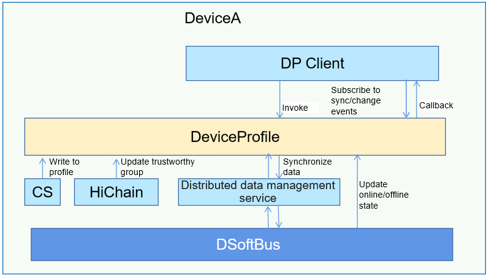

# DeviceProfile<a name="ZH-CN_TOPIC_0000001128264105"></a>

## Introduction<a name="section11660541593"></a>

DeviceProfile is used to manage device hardware capabilities and system software features. A typical device profile includes the device type, device name, OS type, and OS version.

By allowing quick access to local and remote device profiles, DeviceProfile lays the foundation for initiating distributed services. It provides the following features:

-   Querying, inserting, and deleting local device profile information
-   Querying remote device profile information
-   Synchronizing profile information across devices
-   Subscribing to remote device profile changes

Below is the architecture of the DeviceProfile subsystem.

## Architecture<a name="section13587185873516"></a>

**Figure 1** Architecture of the DeviceProfile subsystem<a name="fig4460722185514"></a>



## Directory Structure<a name="section1464106163817"></a>

The main code directory structure of DeviceProfile is as follows:

```
├── interfaces
│   └── innerkits
│       └── distributeddeviceprofile            // innerkits APIs
├── ohos.build
├── sa_profile                                  // SAID profile
│   ├── 6001.xml
│   └── BUILD.gn
└── services
    └── distributeddeviceprofile
        ├── BUILD.gn
        ├── include
        │   ├── authority                       // Permission verification
        │   ├── contentsensor                   // Header file for content sensor data collection
        │   ├── dbstorage                       // Header file for database operations
        │   ├── devicemanager                   // Header file for device management
        │   └── subscribemanager                // Header file for subscription management
        ├── src
        │   ├── authority                       // Permission verification
        │   ├── contentsensor                   // Implementation of content sensor data collection
        │   ├── dbstorage                       // Implementation of database operations
        │   ├── devicemanager                   // Implementation of device management
        │   └── subscribemanager                // Implementation of subscription management
        └── test                                // Test cases
```

## Constraints<a name="section1718733212019"></a>

-   The devices between which you want to set up a connection must be in the same LAN.
-   Before setting up a connection between two devices, you must bind the devices. For details about the binding process, see relevant descriptions in the Security subsystem readme file.

## Usage<a name="section10729231131110"></a>

### Querying Profile Information

* Parameters of GetDeviceProfile

| Name     | Type                         | Mandatory| Description                               |
| --------- | ---------------------------- | ---- | ----------------------------------- |
| deviceId  | std::string                  | Yes  | ID of the device whose profile is to be queried. A null value indicates the local device.|
| serviceId | std::string                  | Yes  | Service ID (ID of the service data record).   |
| profile   | ServiceCharacteristicProfile | Yes  | Return value.                              |

* Example

```c++
// Declare the return value.
ServiceCharacteristicProfile profile;
// Call GetDeviceProfile.
DistributedDeviceProfileClient::GetInstance().GetDeviceProfile(deviceId, serviceId, profile);
std::string jsonData = profile.GetCharacteristicProfileJson();
result.append("jsonData:" + jsonData + "\n");
```

### Inserting Profile Information

* Parameters of PutDeviceProfile

| Name     | Type                         | Mandatory| Description                               |
| --------- | ---------------------------- | ---- | ----------------------------------- |
| profile   | ServiceCharacteristicProfile | Yes  | Profile information to insert.               |

* Example

```c++
// Declare and fill in the data to insert.
ServiceCharacteristicProfile profile;
profile.SetServiceId(serviceId);
profile.SetServiceType(serviceType);
nlohmann::json j;
j["testVersion"] = "3.0.0";
j["testApiLevel"] = API_LEVEL;
profile.SetCharacteristicProfileJson(j.dump());
// Call PutDeviceProfile.
DistributedDeviceProfileClient::GetInstance().PutDeviceProfile(profile);
```

### Deleting Profile Information

* Parameters of DeleteDeviceProfile

| Name     | Type                         | Mandatory| Description                               |
| --------- | ---------------------------- | ---- | ----------------------------------- |
| serviceId | std::string                  | Yes  | ID of the service record to delete.             |

* Example

```c++
// Declare and fill in the data to delete.
std::string serviceId = "test";
// DeleteDeviceProfile
DistributedDeviceProfileClient::GetInstance().DeleteDeviceProfile(serviceId);
```

### Synchronizing Profile Information

* Parameters of SyncDeviceProfile

| Name     | Type                         | Mandatory| Description                               |
| --------- | ---------------------------- | ---- | ----------------------------------- |
| syncOption| SyncOption                   | Yes  | Synchronization mode and range.                   |
| syncCb    | IProfileEventCallback        | Yes  | Callback used to return the synchronization result.                        |

* Example

```c++
// Define the synchronization mode and range.
SyncOptions syncOption;
syncOption.SetSyncMode((OHOS::DistributedKv::SyncMode)atoi(mode.c_str()));
for (const auto& deviceId : deviceIds) {
    syncOption.AddDevice(deviceId);
}
// Call SyncDeviceProfile.
DistributedDeviceProfileClient::GetInstance().SyncDeviceProfile(syncOption,
    std::make_shared<ProfileEventCallback>());
```

### Subscribing to Profile Events (Synchronization and Change Events)

* Parameters of SubscribeProfileEvents

| Name          | Type                         | Mandatory| Description                               |
| -------------- | ---------------------------- | ---- | ----------------------------------- |
| subscribeInfos | SubscribeInfo                | Yes  | Type of the event to subscribe to.                   |
| eventCb        | IProfileEventCallback        | Yes  | Callback for the subscribed event.                        |
| failedEvents   | ProfileEvent                 | Yes  | Failure event.                            |

* Example

```c++
auto callback = std::make_shared<ProfileEventCallback>();
std::list<SubscribeInfo> subscribeInfos;
ExtraInfo extraInfo;
extraInfo["deviceId"] = deviceId;
extraInfo["serviceIds"] = serviceIds;

// Subscribe to the EVENT_PROFILE_CHANGED event.
SubscribeInfo info1;
info1.profileEvent = ProfileEvent::EVENT_PROFILE_CHANGED;
info1.extraInfo = std::move(extraInfo);
subscribeInfos.emplace_back(info1);

// Subscribe to the EVENT_SYNC_COMPLETED event.
SubscribeInfo info2;
info2.profileEvent = ProfileEvent::EVENT_SYNC_COMPLETED;
info2.extraInfo = std::move(extraInfo);
subscribeInfos.emplace_back(info2);

std::list<ProfileEvent> failedEvents;
// Call SubscribeProfileEvents.
DistributedDeviceProfileClient::GetInstance().SubscribeProfileEvents(subscribeInfos, callback, failedEvents);
sleep(SUBSCRIBE_SLEEP_TIME);
std::list<ProfileEvent> profileEvents;
profileEvents.emplace_back(ProfileEvent::EVENT_PROFILE_CHANGED);
failedEvents.clear();
// Cancel the subscription.
DistributedDeviceProfileClient::GetInstance().UnsubscribeProfileEvents(profileEvents, callback, failedEvents);
```

## Repositories Involved<a name="section176111311166"></a>

**DeviceProfile subsystem**

[device\_info\_manager](https://gitee.com/openharmony/deviceprofile_device_info_manager)
