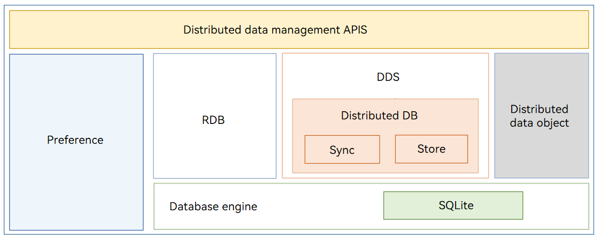

# DistributedDataManager Subsystem

## Introduction

The **DistributedDataManager** subsystem implements persistence of a variety of structured data on a single device and data sync and sharing across devices. It allows application data to be seamlessly processed across devices, ensuring consistent user experience for the same application across devices.

The following figure shows the architecture of the **DistributedDataManager** subsystem.

**Figure 1** Architecture



## Directory Structure

Level 1 and 2 directories of the **DistributedDataManager** subsystem:

```
distributeddatamgr/          # DistributedDataManager subsystem
├── data_object              # Distributed data object
└── data_share               # DataShare
└── datamgr_service          # Distributed data service (DDS)
└── kv_store                 # Key-value (KV) store
└── preferences              # Preferences
└── relational_store         # Relational Database (RDB) store
└── udmf                     # Unified Data Management Framework (UDMF)

third_party/                 # Open-source software
├── bounds_checking_function # bounds_checking_function code
└── cJSON                    # cJSON code
└── flatbuffers              # FlatBuffers code
└── googletest               # GoogleTest code
└── jsoncpp                  # JsonCpp code
└── icu                      # ICU code
└── libuv                    # libuv code
└── openssl                  # OpenSSL code
└── sqlite                   # SQLite code
└── zlib                     # zlib code
```

## Component Description

### Distributed Data Object

As an object-oriented in-memory data management framework, the distributed data object framework provides APIs for basic data object management, including creating, querying, deleting, modifying, and subscribing to in-memory objects. Moreover, it provides distributed capabilities to implement data object collaboration for the same application between multiple devices that form a Super Device.

JS APIs are provided to help you use distributed data objects like using local data objects. A variety of data types are supported, including basic data types such as number, string, and Boolean, as well as complex data types such as array and nested basic data types.

### DataShare

The **DataShare** module allows an application to share data with other applications. It allows data to be shared across different applications on the same device.

### DDS

The DDS implements database collaboration across devices for applications. Data of different devices is isolated based on a triplet of the account, application, and database. The DDS synchronizes data between trusted devices, delivering a consistent data access experience on different devices.

### KV Store

The distributed KV store provides distributed collaboration of KV stores across devices. By calling the APIs of **distributedKVStore**, applications can save data to distributed KV stores and perform operations, such as adding, deleting, modifying, querying, and synchronizing data in distributed KV stores.

The **distributedKVStore** module provides the following functions:

- [KVManager](../application-dev/reference/apis-arkdata/js-apis-distributedKVStore.md#kvmanager): provides a **KVManager** instance for obtaining KV store information.
- [KVStoreResultSet](../application-dev/reference/apis-arkdata/js-apis-distributedKVStore.md#kvstoreresultset): provides APIs for accessing the result obtained from a KV store.
- [Query](../application-dev/reference/apis-arkdata/js-apis-distributedKVStore.md#query): provides APIs for setting predicates for data query.
- [SingleKVStore](../application-dev/reference/apis-arkdata/js-apis-distributedKVStore.md#singlekvstore): provides APIs for querying and syncing data in single KV stores, which manage data without distinguishing devices.
- [DeviceKVStore](../application-dev/reference/apis-arkdata/js-apis-distributedKVStore.md#devicekvstore): provides APIs for querying and syncing data in device KV stores, which inherit from [SingleKVStore](../application-dev/reference/apis-arkdata/js-apis-distributedKVStore.md#singlekvstore) and manage data by device.

### Preferences

The **Preferences** module allows quick access to data in KV pairs and storage of a small amount of data for local applications. The data is stored in local files in KV pairs and loaded in memory, which allows for faster access and higher processing efficiency. **Preferences** provides non-relational data storage and is not suitable for storing a large amount of data.

1.  The **Preferences** module provides APIs for **preferences** operations.
2.  You can use **getPreferences()** to load the data of a file to a **Preferences** instance. Each file has only one **Preferences** instance. The system stores the instance data in memory through a static container until the application removes the instance from the memory or deletes the file.
3.  After obtaining a **Preferences** instance, the application can call **Preferences** APIs to read data from or write data to the **Preferences** instance, and call **flush()** to save the instance data to a file.

### RDB Store

The RDB store manages data based on relational models. The OpenHarmony RDB store provides a complete mechanism for managing a local database based on the underlying SQLite.

With the SQLite as the persistence engine, the RDB store supports all SQLite features, including transactions, indexes, views, triggers, foreign keys, parameterized queries, prepared SQL statements, and more.

### UDMF

The UDMF provides standard data channels for many-to-many data sharing across applications and provides standard APIs for data access. It also provides standard definitions for data types, such as text and image, to streamline data interaction between different applications and minimize the workload of data type adaptation.

## Repositories Involved

DistributedDataManager

[distributeddatamgr\_data_object](https://gitee.com/openharmony/distributeddatamgr_data_object)

[distributeddatamgr\_data_share](https://gitee.com/openharmony/distributeddatamgr_data_share)

[distributeddatamgr\_datamgr_service](https://gitee.com/openharmony/distributeddatamgr_datamgr_service)

[distributeddatamgr\_kv_store](https://gitee.com/openharmony/distributeddatamgr_kv_store)

[distributeddatamgr\_preferences](https://gitee.com/openharmony/distributeddatamgr_preferences)

[distributeddatamgr\_relational_store](https://gitee.com/openharmony/distributeddatamgr_relational_store)

[distributeddatamgr\_udmf](https://gitee.com/openharmony/distributeddatamgr_udmf)

[third\_party\_bounds_checking_function](https://gitee.com/openharmony/third_party_bounds_checking_function)

[third\_party\_cJSON](https://gitee.com/openharmony/third_party_cJSON)

[third\_party\_flatbuffers](https://gitee.com/openharmony/third_party_flatbuffers)

[third\_party\_googletest](https://gitee.com/openharmony/third_party_googletest)

[third\_party\_jsoncpp](https://gitee.com/openharmony/third_party_jsoncpp)

[third\_party\_icu](https://gitee.com/openharmony/third_party_icu)

[third\_party\_libuv](https://gitee.com/openharmony/third_party_libuv)

[third\_party\_openssl](https://gitee.com/openharmony/third_party_openssl)

[third\_party\_sqlite](https://gitee.com/openharmony/third_party_sqlite)

[third\_party\_zlib](https://gitee.com/openharmony/third_party_zlib)
