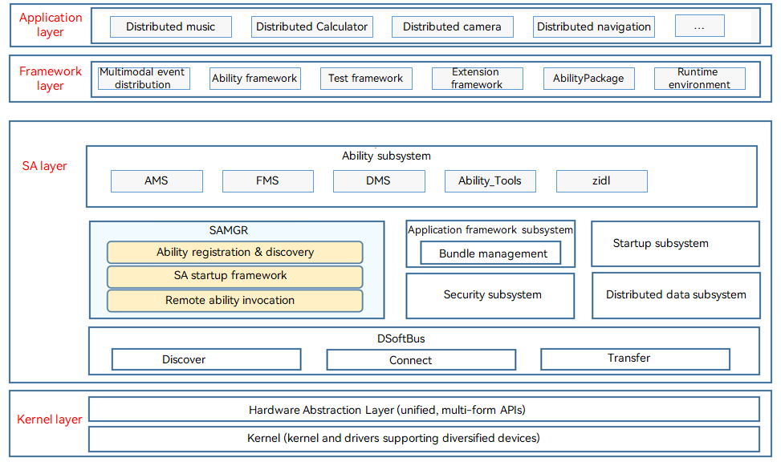

# System Ability Manager

## Introduction

The System Ability Manager (SAMGR) subsystem provides APIs for starting, registering, and querying system abilities, and querying distributed system abilities.

## System Architecture

The figure below shows the SAMGR architecture.

**Figure 1** SAMGR architecture




The SAMGR subsystem consists of the following modules:

- safwk
  
  The **safwk** module defines how to implement system abilities in OpenHarmony and provides APIs to start and register system abilities.

- samgr
  
  The **samgr** module provides APIs to start, register, and query OpenHarmony system abilities.

- safwk_lite
  
  The **safwk_lite** module implements the lightweight foundation process, which provides an empty process for running basic abilities.

- samgr_lite
  
  The **samgr_lite** module provides APIs for registering and discovering abilities of the mini system.

## Directory Structure

```
/foundation/systemabilitymgr
├── safwk                       # System ability framework
├── samgr                       # System ability manager
├── safwk_lite                  # Lightweight foundation process
├── samgr_lite                  # Lightweight system ability manager
```

## Repositories Involved

**SAMGR**

[systemabilitymgr\_safwk](https://gitee.com/openharmony/systemabilitymgr_safwk)

[systemabilitymgr\_samgr](https://gitee.com/openharmony/systemabilitymgr_samgr)

[systemabilitymgr\_safwk\_lite](https://gitee.com/openharmony/systemabilitymgr_safwk_lite)

[systemabilitymgr\_samgr\_lite](https://gitee.com/openharmony/systemabilitymgr_samgr_lite)
