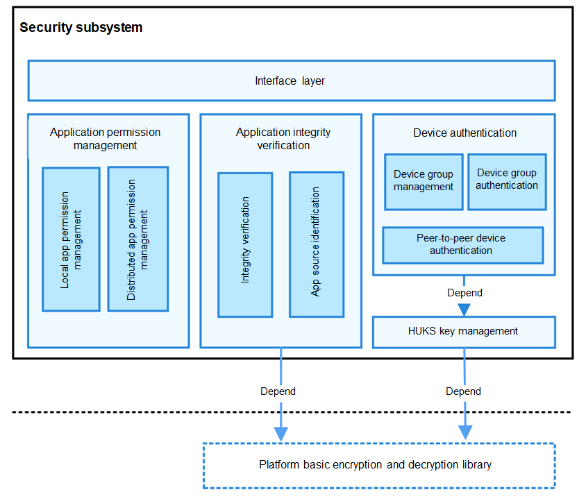

# Security


## Introduction

The security subsystem provides capabilities to protect the application and user data security of OpenHarmony. It implements application integrity verification, application permission management, device authentication, OpenHarmony Universal KeyStore (HUKS) management, and data transfer management.

## Architecture

**Figure 1** Security architecture 




- Interface layer: provides APIs, some of which are available only for system applications.
- Application permission management: provides permission management for the Application Framework subsystem and provides APIs for applications to apply for permissions and query the permission authorization status.
- Application integrity verification: provides capabilities to verify the code integrity before an application is installed or run.
- Device authentication: provides key agreement and trusted device management capabilities for the devices in a distributed network.

- HUKS management: provides key management for basic device authentication.

- Data transfer management: provides API definitions related to data transfer management and control.

## Directory Structure

```
/base/security
├── appverify                       # Application integrity verification
├── dataclassification              # Data transfer management
├── device_auth                     # Device authentication
├── huks                            # Key management
└── permission                      # Permission management
```

## Constraints

-   The current version provides local application permission management, but not distributed application permission management (which uses the stub mode for joint debugging of distributed services).
-   Device authentication includes authentication of devices with the same account and peer-to-peer device authentication. The current version supports only the peer-to-peer device authentication. The authentication of devices with the same account uses the stub mode for joint debugging of distributed services.
-   The certificates used for application integrity verification are specific to OpenHarmony. The corresponding public key certificate and private key are preset in the OpenHarmony code repositories to provide offline signing and   signature verification. The public key certificate and the corresponding private key must be replaced in OpenHarmony commercial versions.

## Usage

**Application Permission Management**

The applications and system services in OpenHarmony run in independent sandbox directory. Both processes and data are isolated from each other to ensure application data security. However, the services or applications also need to provide APIs to implement specific functionality. To access these APIs across processes, the applications in other sandbox directories need permissions.

Application permission management provides a mechanism for defining permissions, allowing permissions to be defined for sensitive APIs of a system service or application. Other applications cannot access the sensitive APIs without permission.

Application permission management also allows an application to request permissions that are defined by the system or other applications. Upon obtaining the permissions, the application can access the sensitive APIs.

In addition, application permission management allows users to view and manage the permission authorization status.

**Application Integrity Verification**

The security subsystem provides signing and signature verification for applications to be installed and applications in runtime to ensure that all applications running on OpenHarmony come from a known and approved source and have not been tampered with.

After developing an application and generating a package for installation, you must sign the installation package to prevent it from being tampered with after release. The OpenHarmony application integrity verification module provides a signing tool hapsigner, specifications for generating a signing certificate, and the public key certificate for you to sign your application package. A public key certificate and the corresponding private key are preset in OpenHarmony to easy your operation. Note that you must replace the public key certificate and private key in your commercial version of OpenHarmony.

The OpenHarmony Application Framework subsystem is responsible for application installation. Upon receiving an application installation package, the Application Framework subsystem parses the signature of the installation package, and verifies the signature using the application integrity verification APIs. The application can be installed only after the verification is successful. During the verification, the application integrity verification module uses the preset public key certificate to verify the signature.

The application integrity verification module also provides integrity check for applications in runtime, including the kernel-mode code signature verification and code integrity measurement. During application development, you can sign your code as required. When the application is installed, the OpenHarmony Application Framework subsystem calls the application integrity verification API to enable code signing for the application. Once code signing is enabled, the source, code owner, and code integrity of the application will be verified when the application is started to run.

**Device Authentication and HUKS**

A unified device binding and authentication solution that covers 1+8+N devices is available. Generally, device authentication is used in cross-device communication implemented by DSoftBus, rather than directly interacting with applications. Device authentication provides the following functionalities:

- Building and maintaining unified trust relationship for a group of devices using different accounts. Devices with different accounts can set up a local trust group after a trust relationship is built by certain means such as scanning a QR code. Services can call APIs to query the group information.

- Implementing unified device authentication. A unified authentication solution is provided to discover devices and perform connection authentication and key agreement for encrypted, end-to-end sessions through DSoftBus for the devices in a trust group.

- Providing credentials for device authentication and algorithms for key agreement via the HUKS.

**Data Transfer Management**

In OpenHarmony, the data transfer management module provides cross-device data transfer management and control policies for distributed services.

The data transfer management module provides APIs to offer cross-device data transfer policies and obtain the highest risk level of data to be sent to the peer device.

## Repositories Involved

Security subsystem

[security_dataclassification](https://gitee.com/openharmony/security_dataclassification)

[security_access_token](https://gitee.com/openharmony/security_access_token)

[security_huks](https://gitee.com/openharmony/security_huks)

[security_selinux](https://gitee.com/openharmony/security_selinux)

[security](https://gitee.com/openharmony/security)

[security_device_auth](https://gitee.com/openharmony/security_device_auth)

[security_permission_lite](https://gitee.com/openharmony/security_permission_lite)

[security_device_security_level](https://gitee.com/openharmony/security_device_security_level)

[security_appverify](https://gitee.com/openharmony/security_appverify)

[security_itrustee_ree_lite](https://gitee.com/openharmony/security_itrustee_ree_lite)

[security_code_signature](https://gitee.com/openharmony/security_code_signature)
