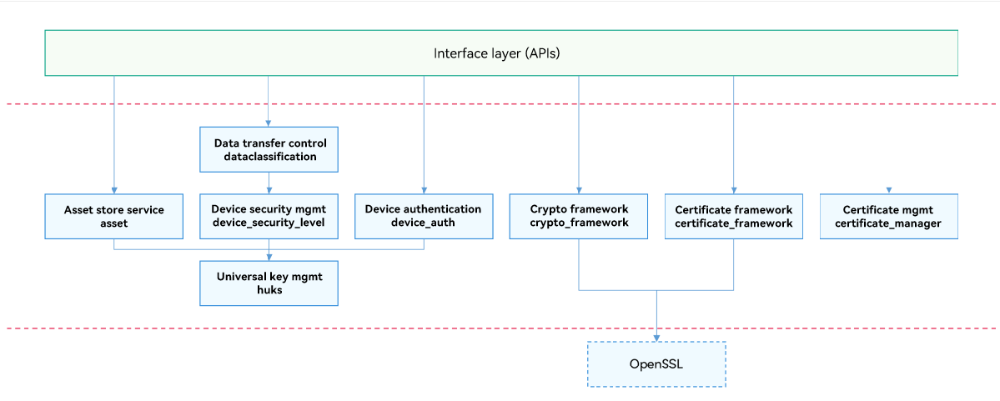

# Security

## Introduction

The security subsystem provides capabilities to protect the system security, data security, and application security of OpenHarmony.

The open security capabilities include application integrity verification, application permission management, device authentication, universal keystore, and data transfer management.

## System Architecture

**Figure 1** Security subsystem architecture



- **Interface layer**: provides APIs, some of which are available only for system applications.
- **Device authentication**: verifies devices in distributed scenarios and sets up secure connection channels between trusted devices for data transfer.

- **Universal keystore**: provides full lifecycle management of keys for upper-layer services, system applications, and system abilities. The universal keystore provides generation, use, storage, and destruction of keys.

- **Data transfer control**: controls data transfer between devices based on the data security level and device security level. During the cross-device migration for the services with distributed data management, data can be transferred only between the devices whose security levels match the security level of the data.

- **Crypto Framework**: provides unified APIs for cryptographic operations. The crypto framework shields the differences between the underlying hardware and encryption/decryption algorithm libraries and encapsulates algorithm libraries, making development a more enjoyable experience.

- **Certificate framework**: provides system-level certificates, CRL verification, parsing, and output capabilities, and certificate chain and CRL chain capabilities for services.

- **Certificate management**: provides full lifecycle management of CA root certificates and service certificates for upper-layer services and system applications or abilities on devices. The certificate management includes generation, storage, query and access, and deletion of certificates.

- **Device security management**: implements device management based on the device security level and provides APIs for querying the security levels of the local and peer devices.


## Directory Structure

```
/base/security
├── dataclassification              # Data transfer control
├── device_auth                     # Device authentication
├── huks                            # Key management
├── asset                           # Asset store service
├── certificate_framework           # Certificate framework
├── crypto_framework                # Crypto framework
├── certificate_manager             # Certificate management
├── device_security_level           # Device security management
```

## Constraints

- The current version provides local application permission management, but not distributed application permission management (which uses the stub mode for joint debugging of distributed services).
- Device authentication includes authentication of devices with the same account and peer-to-peer device authentication. The current version supports only the peer-to-peer device authentication. The authentication of devices with the same account uses the stub mode for joint debugging of distributed services.
- The certificates used for application integrity verification are specific to OpenHarmony. The corresponding public key certificate and private key are preset in the OpenHarmony code repositories to provide offline signing and signature verification. The public key certificate and the corresponding private key must be replaced in OpenHarmony commercial versions.

## Usage Guidelines

### Application Permission Management

The applications and system abilities in OpenHarmony run in independent sandboxes. Both processes and data are isolated from each other to ensure application data security. However, the abilities or applications also need to provide APIs to implement specific functionality. To access these APIs across processes, the applications in other sandbox directories need permissions.

Application permission management provides a mechanism for defining permissions, allowing permissions to be defined for sensitive APIs of a system ability or application. Other applications cannot access the sensitive APIs without permission.

Application permission management also allows an application to request permissions that are defined by the system or other applications. Upon obtaining the permissions, the application can access the sensitive APIs.

In addition, application permission management allows users to view and manage the permission authorization status.

### Application Integrity Verification

The security subsystem provides signing and signature verification for applications to be installed and applications in runtime to ensure that all applications running on OpenHarmony come from a known and approved source and have not been tampered with.

Application development: After developing an application and generating a package for installation, you must sign the installation package to prevent it from being tampered with after release. To sign the application package, you can use the signature tools and the public key certificates and follow the signing certificate generation specifications provided by the application integrity verification module. A public key certificate and the corresponding private key are preset in OpenHarmony to easy your operation. Note that you must replace the public key certificate and private key in your commercial version of OpenHarmony.

The OpenHarmony application framework subsystem is responsible for application installation. Upon receiving an application installation package, the application framework subsystem parses the signature of the installation package, and verifies the signature using the application integrity verification APIs. The application can be installed only after the verification is successful. During the verification, the application signature verification module uses the preset public key certificate to verify the signature.

The application integrity verification module also provides integrity check for applications in runtime, including the kernel-mode code signature verification and code integrity measurement. During application development, you can sign your code as required. When the application is installed, the OpenHarmony application framework subsystem calls the application integrity verification API to enable code signing for the application. Once code signing is enabled, the source, code owner, and code integrity of the application will be verified when the application is started to run.

### Device Authentication and Universal Keystore

A unified device binding and authentication solution that covers 1+8+N devices is provided. Generally, device authentication is used for cross-device communication implemented by DSoftBus, rather than directly interacting with applications. Device authentication provides the following functionalities:

- Building and maintaining unified trust relationship for a group of devices using different accounts. Devices with different accounts can set up a local trust group after a trust relationship is built by certain means such as scanning a QR code. Services can call APIs to query the group information.

- Implementing unified device authentication. A unified authentication solution is provided to discover devices and perform connection authentication and key agreement for encrypted, end-to-end sessions through DSoftBus for the devices in a trust group.

- Providing credentials for device authentication and algorithms for key agreement via the universal keystore.

### Data Transfer Control

In OpenHarmony, the data transfer control module provides cross-device data transfer management and control policies for distributed services. The module defines a sef of APIs to offer policies for cross-device data transfer and obtain the highest risk level of data to be sent to the peer device.

### Security Issue Response Team Work Charter

[security](https://gitee.com/openharmony/security)

## Repositories Involved

Security

[security_dataclassification](https://gitee.com/openharmony/security_dataclassification)

[security_huks](https://gitee.com/openharmony/security_huks)

[security_device_auth](https://gitee.com/openharmony/security_device_auth)

[security_device_security_level](https://gitee.com/openharmony/security_device_security_level)

[security_certificate_manager](https://gitee.com/openharmony/security_certificate_manager)

[security_crypto_framework](https://gitee.com/openharmony/security_crypto_framework)

[security_certificate_framework](https://gitee.com/openharmony/security_certificate_framework)

[security_asset](https://gitee.com/openharmony/security_asset)
