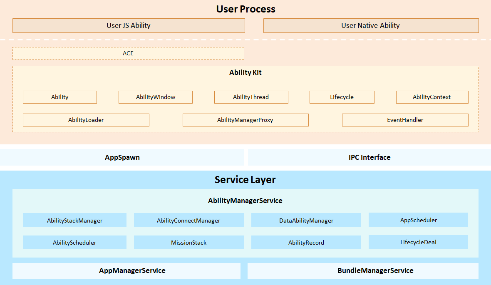
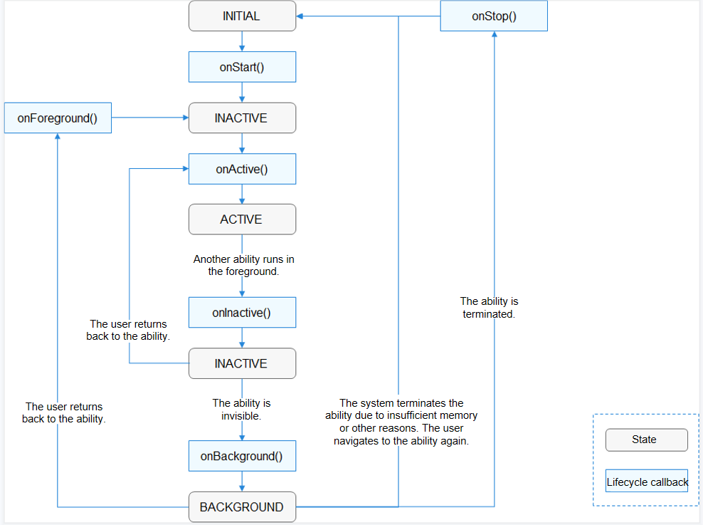
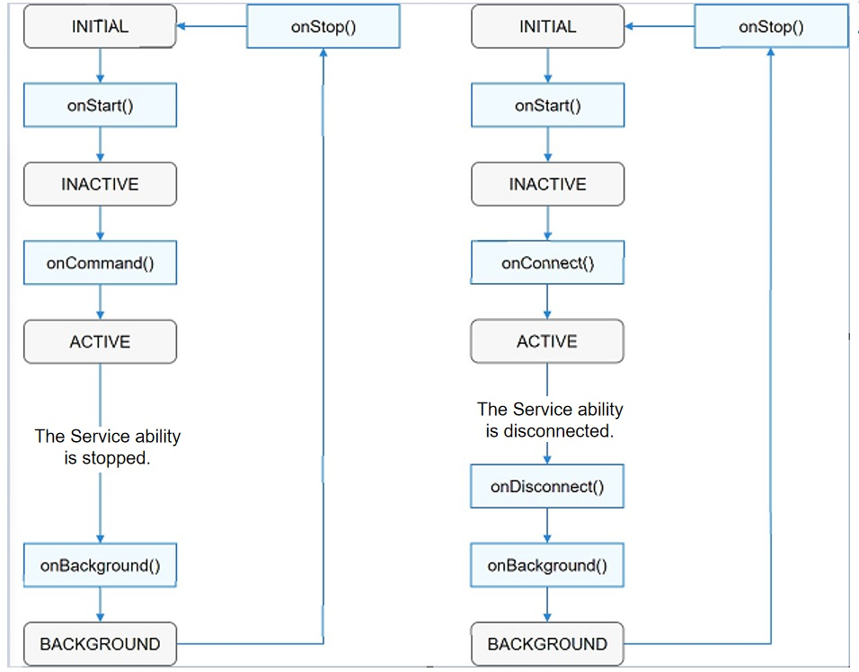

# Ability Framework

## Overview

The **ability framework** (also called the ability management framework) is used to centrally schedule and manage the running and lifecycle of abilities. An application process can support multiple abilities, and an ability can be called either within a process or across processes. The Ability Manager Service provided in the framework schedules and manages abilities in an application and manages the lifecycle changes of these abilities.



**Architecture Description**

- **Ability Kit** provides basic running environment for an ability to run. **Ability** is the minimum unit for the system to schedule an application. It is a component that can implement an independent functionality. An application can contain one or more **Ability** instances. There are two types of abilities: Feature Ability (FA) and Particle Ability (PA). FAs use the Page template, and PAs use the Service and Data templates. (The abilities implemented using the Page, Service, or Data template are referred to as the Page, Service, or Data abilities for short, respectively.)

- **AbilityManagerService** is a system service used to coordinate the running relationships and lifecycle states of **Ability** instances.
  - The AbilityStackManager sub-module maintains the presentation sequence of abilities in the stack.
  - The AbilityConnectManager sub-module manages connections to Service abilities.
  - The DataAbilityManager sub-module manages Data abilities.
  - The AppScheduler sub-module schedules and manages the App Manager Service.
  - The AbilityScheduler sub-module schedules and manages abilities.
  - The LifecycleDeal sub-module schedules and manages ability lifecycle events.

The **ability lifecycle** is a general term for all states of an ability (either a Page or a Service ability), such as **INACTIVE**, **ACTIVE**, and **BACKGROUND**.

  - The following figure shows the transitions between different states in a Page ability's lifecycle.


  - The following figure shows the transitions between different states in a Service ability's lifecycle.


**Description of ability lifecycle states:**

  - **UNINITIALIZED**: The ability is not initialized. This state is a temporary state. An ability changes directly to the **INITIAL** state upon its creation.

  - **INITIAL**: This state refers to the initial or stopped state. The ability in this state is not running. The ability enters the **INACTIVE** state after it is started.

  - **INACTIVE**: The ability is visible but does not gain focus. This state is the same as the **ACTIVE** state because the concept of window focus is not supported currently.

  - **ACTIVE**: The ability is in the foreground and has focus. The ability changes from the **ACTIVE** state to the **INACTIVE** state before returning to the background.

  - **BACKGROUND**: The ability returns to the background. After being re-activated, the ability enters the **ACTIVE** state. After being destroyed, the ability enters the **INITIAL** state.

The following figure shows the callbacks to be invoked during the transitions between different lifecycle states of a Page ability.




The following figure shows the callbacks to be invoked during the transitions between different lifecycle states of a Service ability.




## Directory Structure

```
foundation/
└──foundation/aafwk/standard
   ├── frameworks
   │   └── kits
   │       └── ability						# Core code for AbilityKit
   ├── interfaces
   │   └── innerkits
   │        └── want						# External APIs of the information carrier used for interaction between abilities
   └── services
       ├── abilitymgr						# Framework code of the Ability Manager Service
       ├── common							# Log component
       ├── test								# Testing
       └── tools							# aa command code
```

## Usage Guidelines

The application framework does not have the permission management capability.

In the current version, the JavaScript APIs of the following modules are provided only for the system applications Launcher, Settings, and SystemUI. Significant changes may be provided in later versions.

- @ohos.feature_ability.d.ts

- @ohos.napi_ability_manager.d.ts

- abilityinfo.d.ts

- abilitymissioninfo.d.ts

- applicationinfo.d.ts

- appprocessstate.ts

- common.d.ts

- elementname.d.ts

- moduleinfo.d.ts

- processinfo.d.ts

- want.d.ts

## **aa Commands**

**aa help**

| Command   | Description              |
| ------- | ------------------ |
| aa help | Displays the command help information.|

**aa start**

| Command                                                     | Description                    |
| --------------------------------------------------------- | ------------------------ |
| aa start [-d <device>] -a <ability-name> -b <bundle-name> | Starts an ability. The device ID can be empty.|

Example:
```
aa start -d 12345 -a com.ohos.app.MainAbility -b com.ohos.app
```

**aa dump**

| Command      | Description                 |
| ---------- | --------------------- |
| aa dump -a | Displays the ability information in the stack.|

## Repositories Involved
Ability framework

[ability_base](https://gitee.com/openharmony/ability_ability_base)

[ability_runtime](https://gitee.com/openharmony/ability_ability_runtime)

[form_fwk](https://gitee.com/openharmony/ability_form_fwk)
