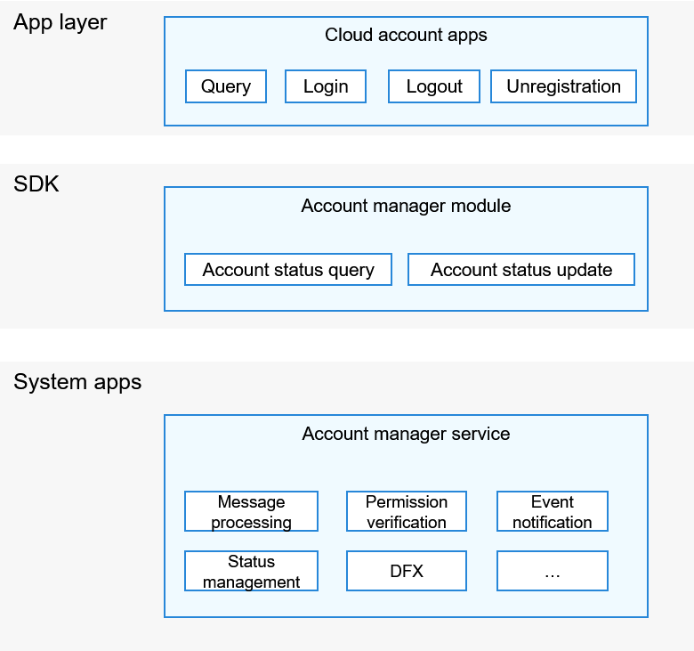

# Account<a name="EN-US_TOPIC_0000001078092678"></a>

## Introduction<a name="section11660541593"></a>

In a standard system, the Account subsystem supports login status management of distributed cloud accounts, interconnection with vendors' cloud account apps on the device side, and query and update of the cloud account login status.

## Architecture<a name="section1412183212132"></a>

**Figure  1**  Account subsystem architecture<a name="fig4460722185514"></a>




## Directory Structure<a name="section161941989596"></a>

```
/base/account
└── os_account              # OS account module
    ├── common              # Common basic code
    ├── interfaces          # APIs exposed externally
    ├── kits                # Development framework
    ├── sa_profile          # SA profile
    ├── services            # Service code
    └── test                # Test code
        └── resource        # Test resources
```

## Usage Guidelines<a name="section1312121216216"></a>

Using the available classes for managing distributed accounts, you can query and update the account login status, including login, logout, unregistration, and token expiration.

To query and update the login status of a distributed account, you must obtain the required system permission. These APIs are supported only by system apps.

## Repositories Involved<a name="section1371113476307"></a>

**Account subsystem**

[account_os_account](https://gitee.com/openharmony/account_os_account)

