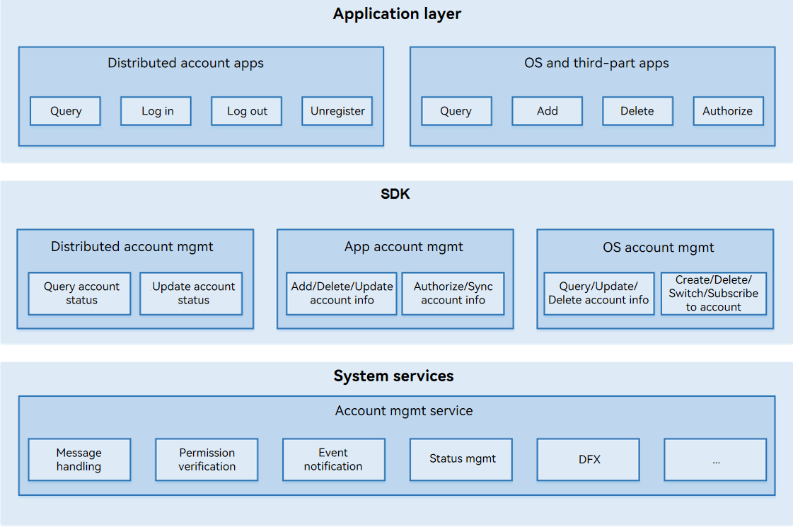

# Account

## Introduction

In the standard system, the Account subsystem provides basic capabilities such as OS account lifecycle management, distributed account login status management, and app account information management.

## Architecture

**Figure 1** Account subsystem architecture




## Directory Structure

```
/base/account/os_account
├── dfx                      
│   ├── hidumper_adapter     # Code of the adapter for exporting system service information         
│   ├── hisysevent_adapter   # Code of the system event logging adapter         
├── figures                  # Figures
├── frameworks               # Code of the account subsystem
│   ├── account_iam          # Internal API code for account identity authentication and access management
│   │   └── src              # Code for implementing internal APIs for account identity authentication and access management         
│   ├── appaccount           # Internal API code of the app account module
│   │   └── native           # Code for implementing the internal APIs of the app account module
│   ├── common               # Code of the common module
│   │   ├── account_error    # Error codes
│   │   ├── database         # Database code
│   │   ├── file_operator    # File operator code
│   │   ├── log              # Code for printing logs
│   │   ├── perf_stat        # Code for performance statistics
│   │   └── test             # Test code for the common module
│   ├── ohosaccount          # Internal API code of the distributed account module
│   │   ├── native           # Code for implementing the internal APIs of the distributed account module
│   │   └── test             # Test code for the distributed account internal APIs
│   └── osaccount            # Internal API code of the OS account module
│       ├── core             # OS account IPC
│       └── native           # Code for implementing the internal APIs of the OS account module
├── interfaces               # Account subsystem APIs exposed externally 
│   ├── innerkits            # Internal API header files
│   │   ├── account_iam      # Account identity authentication and access management
│   │   ├── appaccount       # Header files of the app account internal APIs
│   │   ├── ohosaccount      # Header files of the distributed account internal APIs
│   │   └── osaccount        # Header files of the OS account internal APIs
│   └── kits                 # Encapsulation of external APIs
│       └── napi             # External API encapsulation code of the account subsystem
├── sa_profile               # SA profile directory of the account subsystem
├── services                 # accountmgr service code
│   └── accountmgr           # Account subsystem service code
│       ├── include          # Service code header files
│       ├── src              # Source code of the account subsystem service code
│       └── test             # Test of the account subsystem service code
├── test                     # Test code
│   ├── fuzztest             # Fuzzy test code
│   ├── resource             # Test resource files
│   └── systemtest           # System test code
└── tools                    # Tool code
    ├── acm                  # acm tool code
    │   ├── include          # acm header files
    │   └── src              # acm source file
    └── test                 # acm test code
```

## Description

### Modules

| Module    | Description                                                        |
| ---------- | ------------------------------------------------------------ |
| OS account  | Provides APIs for adding, deleting, querying, modifying, and starting OS accounts and subscribing to OS account information.    |
| Distributed account| Provides APIs for managing distributed account login status, supports interactions with cloud account applications on devices, and provides capabilities for querying and updating cloud account login status.|
| App account  | Provides APIs for adding, deleting, querying, modifying, and authenticating app accounts.          |


### How to Use

- [OS Account Management](../application-dev/reference/apis/js-apis-osAccount.md)
- [Distributed Account Management](../application-dev/reference/apis/js-apis-distributed-account.md)
- [App Account Management](../application-dev/reference/apis/js-apis-appAccount.md)

## Repositories Involved

**Account Subsystem**

[account_os_account](https://gitee.com/openharmony/account_os_account)