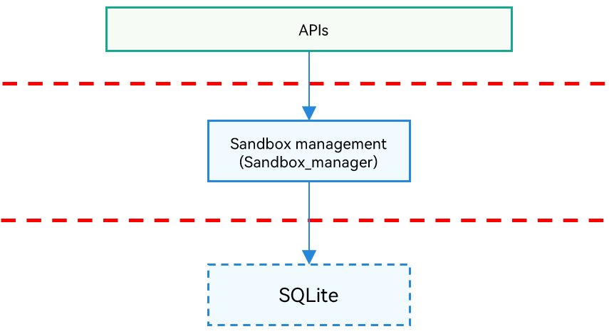

# Application Access Control

## Introduction

The application access control subsystem implements permission control and isolated access control in the system.

Open capabilities of the application access control subsystem include the sandbox management (**Sandbox_manager**) module.

## Architecture

**Figure 1** Application access control architecture



APIs: APIs exposed externally by the application access control subsystem. Some APIs are available only to system applications.

**Sandbox_manager** module: implements persistent management on rules for file sharing between sandboxes. Specifically, it provides system applications with the APIs for enabling temporary rules, adding, deleting, and querying persistence rules, and enabling/disabling persistence rules.

## Directory Structure
```
/base/accesscontrol
├── sandbox_manager              # Sandbox management module
```

## Constraints
The **sandbox_manager** module is still under development and cannot provide the function for enabling rules. This module depends on the mandatory access control (MAC) mechanism of the system kernel. Therefore, it can be developed only when the MAC mechanism is available.

## Usage

**Sandbox Management**

Each OpenHarmony application runs in an independent sandbox, which isolates application data from each other. The **sandbox_manager** module provides:
- APIs for adding, deleting, and querying persistence rules (available now).
- APIs for enabling and disabling persistent rules for system applications (to be available).

The **sandbox_manager** module provides only inner APIs for system applications. If you need to set persistence rules, use the APIs provided by [file\_app\_file\_service](https://gitee.com/openharmony/filemanagement_app_file_service/blob/master/README.md). If you want to share files by starting an application, perform related settings via [ability\_ability\_runtime](https://gitee.com/openharmony/ability_ability_runtime/blob/master/README.md).

## Repositories Involved

Application access control subsystem

[accesscontrol_sandbox_manager](https://gitee.com/openharmony/accesscontrol_sandbox_manager)

<!--no_check-->
