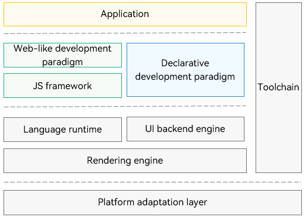

# ArkUI

## Introduction

ArkUI is a UI development framework that provides what you'll need to develop application UIs in OpenHarmony, including UI components, animations, drawing, interaction events, and JavaScript API extension mechanisms. ArkUI comes with two development paradigms: ArkTS-based declarative development paradigm (declarative development paradigm for short) and JavaScript-compatible web-like development paradigm (web-like development paradigm for short).

**Framework Structure**



As shown above, the two development paradigms share the UI backend engine and language runtime. The UI backend engine implements the six basic capabilities of ArkUI. The declarative development paradigm does not require the JS Framework for managing the page DOM. As such, it has more streamlined rendering and update links and less memory usage. This makes the declarative development paradigm a better choice for building application UIs.


## Directory Structure

The ArkUI source code is stored in **/foundation/arkui**. The following shows the directory structure.

```
/foundation/arkui
├── ace_engine                       # ArkUI
├── ace_engine_lite                  # Lite ArkUI
└── napi                             # JS APIs for extending the native development module
```

## Repositories Involved

**ArkUI**

[arkui\_ace\_engine](https://gitee.com/openharmony/arkui_ace_engine)

[arkui\_ace\_engine\_lite](https://gitee.com/openharmony/arkui_ace_engine_lite)

[arkui\_napi](https://gitee.com/openharmony/arkui_napi)
