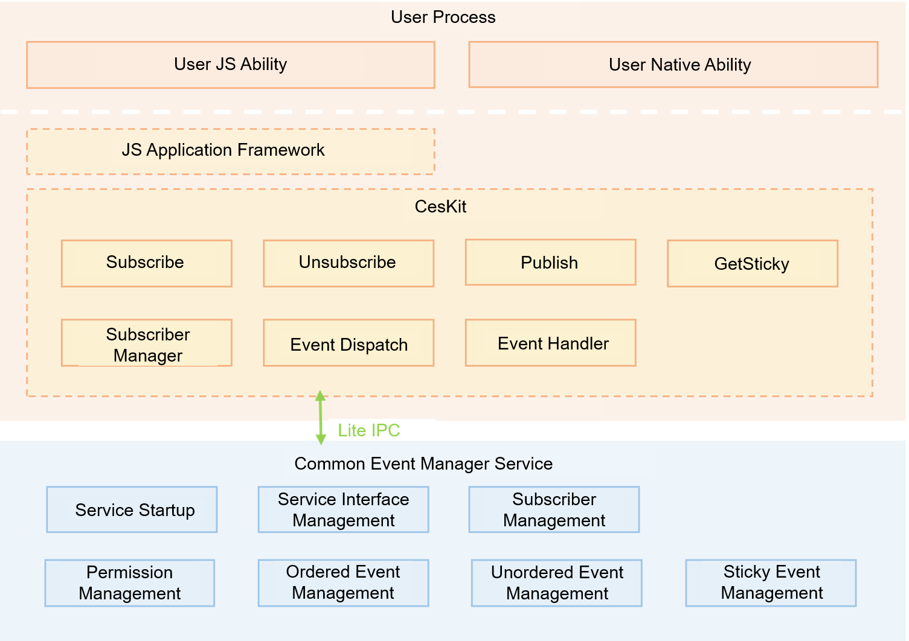

# Common Event and Notification

## Introduction

OpenHarmony provides a Common Event Service (CES) for applications to subscribe to, publish, and unsubscribe from common events.

Common events in OpenHarmony are classified into system common events and custom common events.

- System common event: sent by the system based on system policies to the applications that have subscribed to the event. This type of event is typically system events published by key system services, such as HAP installation, update, and uninstallation.

- Custom common events: customized by applications to implement cross-application event communication.

Each application can subscribe to common events as required. After your application subscribes to a common event, the system sends it to your application every time the event is published. Such an event may be published by the system, other applications, or your own application.

### Architecture



## Directory Structure

```
/base/notification/ces_standard/
│── frameworks      # Component directory
│   |── common/log  # Logs
│   |── core        # Internal implementation code of native APIs
│   ├── native      # Implementation code of native APIs
│── interface       # External APIs
|   |── innerkits   # Definition of native APIs
|   |── kits/napi   # NAPI implementation
├── sa_profile      # Service configuration profile
├── services        # Service implementation
├── tools           # Tools
│── ohos.build      # Build script

```

## How to Use

For details, see [Common Event Development](../application-dev/application-models/common-event-overview.md).

## Repositories Involved

Common Event and Notification

**notification_ces_standard**