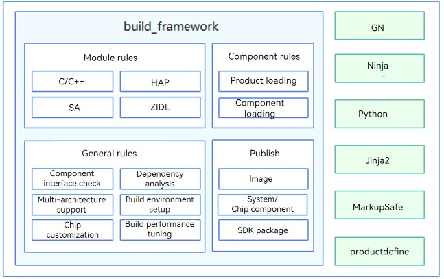

# Compilation and Building

The compilation and building subsystem provides a framework based on Generate Ninja (GN) and Ninja. This subsystem allows you to:

-   Build products based on different chipset platforms, for example, Hi3516D V300.

-   Package capabilities required by a product by assembling modules based on the product configuration.

## Introduction

It is considered best practice to learn the following basic concepts before you start building:

-   Platform

    A combination of development boards and kernels. Supported subsystems and components vary with the platform.

-   Subsystem

    OpenHarmony is designed with a layered architecture, which consists of the kernel layer, system service layer, framework layer, and application layer from the bottom up. System functions are developed by the level of system, subsystem, and component. In a multi-device deployment scenario, you can customize subsystems and components as required. A subsystem is a logical system consisting of components.

-   Component

    A component is a reusable software unit that contains source code, configuration files, resource files, and build scripts. A component can be built independently, integrated in binary mode, and then tested independently.

-   GN

    GN is a system used to generate build files for Ninja.

-   Ninja

    Ninja is a small high-speed build system.


## Directory Structure

```text
/build                          # Main directory

├── __pycache__                   
├── build_scripts/              # Python scripts for build
├── common/                       
├── config/                     # Build-related configuration
├── core
│   └── gn/                     # BUILD.gn configuration
│   └── build_scripts/            
├── docs                          
├── gn_helpers.py*                
├── lite/                       # hb and preloader entry                     
├── misc/                         
├── ohos                        # OpenHarmony building and packaging configuration
│   ├── kits                    # Kits build and packaging templates and processing
│   ├── ndk                     # NDK templates and processing
│   ├── notice                  # Notice templates and processing
│   ├── packages                # Distribution packaging templates and processing
│   ├── sa_profile              # SA profiles and processing
│   ├── sdk                     # SDK templates and processing, which contains the module configuration in the SDK
│   └── testfwk                 # Testing-related processing
├── ohos.gni*                   # Common .gni files (facilitating one-time import of each module)
├── ohos_system.prop              
├── ohos_var.gni*                 
├── prebuilts_download.sh*      # Prebuilt script
├── print_python_deps.py*         
├── scripts/                      
├── subsystem_config.json         
├── subsystem_config_example.json 
├── templates/                  # C/C++ build templates
├── test.gni*                     
├── toolchain                   # Build toolchain configuration
├── tools                       # Common tools
├── version.gni                   
├── zip.py*                       
```


**Figure 1** Architecture of the compilation and building subsystem



## Working Principles

The compilation and build process of OpenHarmony is as follows:

1. Parsing commands: Parse the name of the product to build and load related configurations.

2. Running GN: Configure the toolchain and global options based on the parsed product name and compilation type.

3. Running Ninja: Start building and generate a product distribution.

## Building a Mini or Small System

See [build\_lite](https://gitee.com/openharmony/build_lite/blob/master/README.md).

## Building a Standard System

See [build](https://gitee.com/openharmony/build).

## Repositories Involved

[build\_lite](https://gitee.com/openharmony/build_lite)

[build](https://gitee.com/openharmony/build)
