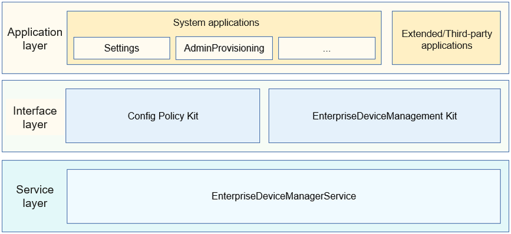

# Customization

## Introduction

When you develop OpenHarmony devices or applications for specific industries or regions, you may need to customize the system to meet the requirements of specific scenarios. This is where the customization subsystem comes into the picture. This subsystem provides enterprise device management and policy configuration.

|    Module Name   | Description                                                        |
| :--------------: | ------------------------------------------------------------ |
|     Config Policy Kit    | Provides APIs for service modules to obtain the configuration directory or configuration file path at different configuration levels.|
| EnterpriseDeviceManagement Kit| Provides the management application development framework, management mode setting, and enterprise device management capabilities for developing Mobile Device Management (MDM) applications. You can leverage the system-level management APIs for your applications in the enterprise context.|


## System Architecture

**Figure 1** Customization subsystem





-   Application layer

    System applications, extended applications, and third-party applications invoke interfaces at the interface layer to configure functions or obtain specific data.

-   Interface layer

    The EnterpriseDeviceManagement Kit provides system-level management APIs for applications in the enterprise context. The Config Policy Kit provides APIs for service modules to obtain the configuration directory or configuration file path at different configuration levels.
    
- Service layer

    EnterpriseDeviceManagerService provides specific implementation capabilities for EnterpriseDeviceManagement Kit at the interface layer to help ensure normal service running.

## Directory Structure

The source code of the Customization subsystem is stored in **/base/customization**. The directory structure is as follows:

```
/base/customization/
├── config_policy           		# Code repository of the Config Policy Kit
│   ├── frameworks          		# Core code of the Config Policy Kit
│   │   ├── config_policy   		# Module of the Config Policy Kit
│   │   │   └── src         		# Implementation code
│   ├── interfaces          		# Interfaces of the Config Policy Kit
│   │   ├── inner_api       		# Interfaces between Config Policy Kit subsystems
│   │   └── kits            		# JavaScript interfaces of the Config Policy Kit
│   └── test                		# Test code
├── enterprise_device_management    # Code repository of the EnterpriseDeviceManagement Kit
│   ├── common                   	# Common code
│   ├── etc                      	# Configuration files of the processes contained in the EnterpriseDeviceManagement Kit
│   ├── interfaces               	# EdmKits code
│   │   └── inner_api            	# Subsystem interfaces
│   │   └── kits                 	# Developer interfaces
│   ├── profile                  	# Configuration files of the system services contained in the EnterpriseDeviceManagement Kit
│   └── services                 	# Implement code of the EnterpriseDeviceManagement Kit
```

## Repositories Involved

**Customization**

[customization_config_policy](https://gitee.com/openharmony/customization_config_policy)

[customization_enterprise_device_management](https://gitee.com/openharmony/customization_enterprise_device_management)

[applications_admin_provisioning](https://gitee.com/openharmony/applications_admin_provisioning)
