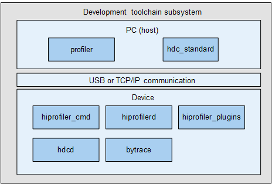

# Development Toolchain<a name="EN-US_TOPIC_0000001089932323"></a>


## Introduction<a name="section11660541593"></a>

The development toolchain subsystem provides debugging commands and tools for performance monitoring and tracing.

This subsystem provides the following tools:

-   bytrace: a tool for you to trace processes and monitor performance. It encapsulates and extends the ftrace inside the kernel and supports tracing in the user space.
-   hdc: a command line tool for debugging. With hdc, you can interact with real devices or simulators from Windows, Linux, or macOS.
-   profiler: a performance profiling platform for you to analyze memory and performance issues.

## Architecture<a name="section342962219551"></a>

The figure below shows the architecture of the development toolchain subsystem.

**Figure 1** Architecture of the development toolchain subsystem<a name="fig4460722185514"></a> 




## Directory Structure<a name="section71879353610"></a>

```
/developtools             # Development toolchain subsystem
├── bytrace_standard      # bytrace code
│   └── bin               # bytrace function implementation
│   └── innerkits         # Header files for internal subsystems
├── hdc_standard          # hdc code
│   └── src               # hdc function implementation
│   └── prebuilt          # Prebuilt code
├── profiler              # Profiler code
│   └── device            # Device code
│   └── host              # Host code
│   └── interfaces        # APIs between modules and external APIs
│   └── trace_analyzer    # bytrace analyzer code
│   └── protos            # proto files
```

## Usage<a name="section3199114314427"></a>

### bytrace

The table below lists the commands supported by bytrace.

**Table 1** Commands supported by bytrace

<a name="table16968161192218"></a>
<table><thead align="left"><tr id="row1796810110224"><th class="cellrowborder" valign="top" width="50%" id="mcps1.2.3.1.1"><p id="p19686142212"><a name="p19686142212"></a><a name="p19686142212"></a>Option</p>
</th>
<th class="cellrowborder" valign="top" width="50%" id="mcps1.2.3.1.2"><p id="p169681311225"><a name="p169681311225"></a><a name="p169681311225"></a>Description</p>
</th>
</tr>
</thead>
<tbody><tr id="row14968118227"><td class="cellrowborder" valign="top" width="50%" headers="mcps1.2.3.1.1 "><p id="p1696819114221"><a name="p1696819114221"></a><a name="p1696819114221"></a>-h, --help</p>
</td>
<td class="cellrowborder" valign="top" width="50%" headers="mcps1.2.3.1.2 "><p id="p1896813132220"><a name="p1896813132220"></a><a name="p1896813132220"></a>Displays help information.</p>
</td>
</tr>
<tr id="row1396816117229"><td class="cellrowborder" valign="top" width="50%" headers="mcps1.2.3.1.1 "><p id="p1496871152211"><a name="p1496871152211"></a><a name="p1496871152211"></a>-b <em id="i13968181112216"><a name="i13968181112216"></a><a name="i13968181112216"></a>n</em>, --buffer_size <em id="i896891152212"><a name="i896891152212"></a><a name="i896891152212"></a>n</em></p>
</td>
<td class="cellrowborder" valign="top" width="50%" headers="mcps1.2.3.1.2 "><p id="p139682017228"><a name="p139682017228"></a><a name="p139682017228"></a>Sets <em id="i496841112217"><a name="i496841112217"></a><a name="i496841112217"></a>n</em> KB of memory for storing trace logs. The default value is 2 MB.</p>
</td>
</tr>
<tr id="row196941152212"><td class="cellrowborder" valign="top" width="50%" headers="mcps1.2.3.1.1 "><p id="p29691917228"><a name="p29691917228"></a><a name="p29691917228"></a>-t <em id="i196931152213"><a name="i196931152213"></a><a name="i196931152213"></a>n</em>, --time <em id="i17969201142218"><a name="i17969201142218"></a><a name="i17969201142218"></a>n</em></p>
</td>
<td class="cellrowborder" valign="top" width="50%" headers="mcps1.2.3.1.2 "><p id="p1396913162213"><a name="p1396913162213"></a><a name="p1396913162213"></a>Sets the trace uptime, in seconds. The value varies depending on the time required for analysis.</p>
</td>
</tr>
<tr id="row6969211227"><td class="cellrowborder" valign="top" width="50%" headers="mcps1.2.3.1.1 "><p id="p5969141112217"><a name="p5969141112217"></a><a name="p5969141112217"></a>--trace_clock <em id="i1096917113223"><a name="i1096917113223"></a><a name="i1096917113223"></a>clock</em></p>
</td>
<td class="cellrowborder" valign="top" width="50%" headers="mcps1.2.3.1.2 "><p id="p39696116229"><a name="p39696116229"></a><a name="p39696116229"></a>Sets the type of the clock for adding a timestamp to a trace. The value can be <strong>boot</strong> (default), <strong>global</strong>, <strong>mono</strong>, <strong>uptime</strong>, or <strong>perf</strong>.</p>
</td>
</tr>
<tr id="row39691110223"><td class="cellrowborder" valign="top" width="50%" headers="mcps1.2.3.1.1 "><p id="p4969161112211"><a name="p4969161112211"></a><a name="p4969161112211"></a>--trace_begin</p>
</td>
<td class="cellrowborder" valign="top" width="50%" headers="mcps1.2.3.1.2 "><p id="p8969617229"><a name="p8969617229"></a><a name="p8969617229"></a>Starts trace.</p>
</td>
</tr>
<tr id="row129693111224"><td class="cellrowborder" valign="top" width="50%" headers="mcps1.2.3.1.1 "><p id="p19693132216"><a name="p19693132216"></a><a name="p19693132216"></a>--trace_dump</p>
</td>
<td class="cellrowborder" valign="top" width="50%" headers="mcps1.2.3.1.2 "><p id="p4969161122217"><a name="p4969161122217"></a><a name="p4969161122217"></a>Dumps traced data to a specified position (console by default).</p>
</td>
</tr>
<tr id="row1296920110224"><td class="cellrowborder" valign="top" width="50%" headers="mcps1.2.3.1.1 "><p id="p1296961202217"><a name="p1296961202217"></a><a name="p1296961202217"></a>--trace_finish</p>
</td>
<td class="cellrowborder" valign="top" width="50%" headers="mcps1.2.3.1.2 "><p id="p69691614229"><a name="p69691614229"></a><a name="p69691614229"></a>Stops trace and outputs data to the specified position (console by default).</p>
</td>
</tr>
<tr id="row15969813223"><td class="cellrowborder" valign="top" width="50%" headers="mcps1.2.3.1.1 "><p id="p10969181132217"><a name="p10969181132217"></a><a name="p10969181132217"></a>-l, --list_categories</p>
</td>
<td class="cellrowborder" valign="top" width="50%" headers="mcps1.2.3.1.2 "><p id="p20969516221"><a name="p20969516221"></a><a name="p20969516221"></a>Lists the bytrace categories supported by the device.</p>
</td>
</tr>
<tr id="row096921142218"><td class="cellrowborder" valign="top" width="50%" headers="mcps1.2.3.1.1 "><p id="p119691714221"><a name="p119691714221"></a><a name="p119691714221"></a>--overwrite</p>
</td>
<td class="cellrowborder" valign="top" width="50%" headers="mcps1.2.3.1.2 "><p id="p109693162215"><a name="p109693162215"></a><a name="p109693162215"></a>Overwrites the latest information when the buffer is full. By default, the earliest data is overwritten.</p>
</td>
</tr>
<tr id="row119698110224"><td class="cellrowborder" valign="top" width="50%" headers="mcps1.2.3.1.1 "><p id="p9970318228"><a name="p9970318228"></a><a name="p9970318228"></a>-o <em id="i10970113229"><a name="i10970113229"></a><a name="i10970113229"></a>filename</em>, --output <em id="i39705111227"><a name="i39705111227"></a><a name="i39705111227"></a>filename</em></p>
</td>
<td class="cellrowborder" valign="top" width="50%" headers="mcps1.2.3.1.2 "><p id="p697017110220"><a name="p697017110220"></a><a name="p697017110220"></a>Outputs traced data to a specified file.</p>
</td>
</tr>
<tr id="row16970412224"><td class="cellrowborder" valign="top" width="50%" headers="mcps1.2.3.1.1 "><p id="p397017114221"><a name="p397017114221"></a><a name="p397017114221"></a>-z</p>
</td>
<td class="cellrowborder" valign="top" width="50%" headers="mcps1.2.3.1.2 "><p id="p149704113226"><a name="p149704113226"></a><a name="p149704113226"></a>Compresses the traced data.</p>
</td>
</tr>
</tbody>
</table>

Examples:

-   Query supported labels.

    ```
    bytrace -l 
    Or
    bytrace --list_categories
    ```


-   Trace ability information for 10 seconds and store the traced data in a buffer of 4 MB.

    ```
    bytrace -b 4096 -t 10 --overwrite ability > /data/mytrace.ftrace
    ```


-   Set the clock type for traces to <strong>mono</strong>.

    ```
    bytrace --trace_clock mono  -b 4096 -t 10 --overwrite ability > /data/mytrace.ftrace
    ```


-   Compress the traced data.

    ```
    bytrace -z  -b 4096 -t 10 --overwrite ability > /data/mytrace.ftrace
    ```

### hdc

The table below lists the commands supported by hdc.

**Table 2** Commands supported by hdc

<a name="table12971913225"></a>
<table><thead align="left"><tr id="row129711413225"><th class="cellrowborder" valign="top" width="50%" id="mcps1.2.3.1.1"><p id="p20971914227"><a name="p20971914227"></a><a name="p20971914227"></a>Option</p>
</th>
<th class="cellrowborder" valign="top" width="50%" id="mcps1.2.3.1.2"><p id="p29716117225"><a name="p29716117225"></a><a name="p29716117225"></a>Description</p>
</th>
</tr>
</thead>
<tbody><tr id="row199713117228"><td class="cellrowborder" valign="top" width="50%" headers="mcps1.2.3.1.1 "><p id="p149713122214"><a name="p149713122214"></a><a name="p149713122214"></a>-t <em id="i89715114222"><a name="i89715114222"></a><a name="i89715114222"></a>key</em></p>
</td>
<td class="cellrowborder" valign="top" width="50%" headers="mcps1.2.3.1.2 "><p id="p29713110221"><a name="p29713110221"></a><a name="p29713110221"></a>Specifies the identifier of the device to connect.</p>
</td>
</tr>
<tr id="row19711111221"><td class="cellrowborder" valign="top" width="50%" headers="mcps1.2.3.1.1 "><p id="p199711819225"><a name="p199711819225"></a><a name="p199711819225"></a>-s <em id="i129711811227"><a name="i129711811227"></a><a name="i129711811227"></a>socket</em></p>
</td>
<td class="cellrowborder" valign="top" width="50%" headers="mcps1.2.3.1.2 "><p id="p1597101162218"><a name="p1597101162218"></a><a name="p1597101162218"></a>Specifies the listening socket.</p>
</td>
</tr>
<tr id="row6971191132217"><td class="cellrowborder" valign="top" width="50%" headers="mcps1.2.3.1.1 "><p id="p8971121112219"><a name="p8971121112219"></a><a name="p8971121112219"></a>-h/help -v/version</p>
</td>
The <td class="cellrowborder" valign="top" width="50%" headers="mcps1.2.3.1.2 "><p id="p697261142216"><a name="p697261142216"></a><a name="p697261142216"></a>Displays the hdc help and version information.</span></p>
</td>
</tr>
<tr id="row20972415226"><td class="cellrowborder" valign="top" width="50%" headers="mcps1.2.3.1.1 "><p id="p69722019226"><a name="p69722019226"></a><a name="p69722019226"></a>list targets[-v]</p>
</td>
<td class="cellrowborder" valign="top" width="50%" headers="mcps1.2.3.1.2 "><p id="p11972151152217"><a name="p11972151152217"></a><a name="p11972151152217"></a>Displays all connected devices.</p>
</td>
</tr>
<tr id="row2972181192217"><td class="cellrowborder" valign="top" width="50%" headers="mcps1.2.3.1.1 "><p id="p79729132213"><a name="p79729132213"></a><a name="p79729132213"></a>target mount</p>
</td>
<td class="cellrowborder" valign="top" width="50%" headers="mcps1.2.3.1.2 "><p id="p1197217117221"><a name="p1197217117221"></a><a name="p1197217117221"></a>Mounts the system partition in read/write mode.</p>
</td>
</tr>
<tr id="row1997213112229"><td class="cellrowborder" valign="top" width="50%" headers="mcps1.2.3.1.1 "><p id="p149728117225"><a name="p149728117225"></a><a name="p149728117225"></a>target boot [bootloader|recovery]</p>
</td>
<td class="cellrowborder" valign="top" width="50%" headers="mcps1.2.3.1.2 "><p id="p149721818223"><a name="p149721818223"></a><a name="p149721818223"></a>Restarts a target device. The system is started by default. The bootloader and recover modes are supported.</span></p>
</td>
</tr>
<tr id="row9972191202215"><td class="cellrowborder" valign="top" width="50%" headers="mcps1.2.3.1.1 "><p id="p179721518220"><a name="p179721518220"></a><a name="p179721518220"></a>smode [off]</p>
</td>
<td class="cellrowborder" valign="top" width="50%" headers="mcps1.2.3.1.2 "><p id="p1397216111225"><a name="p1397216111225"></a><a name="p1397216111225"></a>Grants the <strong>root</strong> permission to the background hdc service. You can use the <strong>off</strong> option to revoke the granted permissions.</p>
</td>
</tr>
<tr id="row159721418223"><td class="cellrowborder" valign="top" width="50%" headers="mcps1.2.3.1.1 "><p id="p697291172215"><a name="p697291172215"></a><a name="p697291172215"></a>kill</p>
</td>
<td class="cellrowborder" valign="top" width="50%" headers="mcps1.2.3.1.2 "><p id="p2097212117225"><a name="p2097212117225"></a><a name="p2097212117225"></a>Terminates the hdc service. </p>
</td>
</tr>
<tr id="row597211110226"><td class="cellrowborder" valign="top" width="50%" headers="mcps1.2.3.1.1 "><p id="p179728192214"><a name="p179728192214"></a><a name="p179728192214"></a>tconn <em id="i179731172210"><a name="i179731172210"></a><a name="i179731172210"></a>host</em>[:<em id="i15973111202216"><a name="i15973111202216"></a><a name="i15973111202216"></a>port</em>][-remove]</p>
</td>
<td class="cellrowborder" valign="top" width="50%" headers="mcps1.2.3.1.2 "><p id="p1497314112218"><a name="p1497314112218"></a><a name="p1497314112218"></a>Connects to the device with the specified IP address and port number.</p>
</td>
</tr>
<tr id="row129737118221"><td class="cellrowborder" valign="top" width="50%" headers="mcps1.2.3.1.1 "><p id="p1297311119225"><a name="p1297311119225"></a><a name="p1297311119225"></a>tmode usb</p>
</td>
<td class="cellrowborder" valign="top" width="50%" headers="mcps1.2.3.1.2 "><p id="p997319113226"><a name="p997319113226"></a><a name="p997319113226"></a><span>Restarts the daemon process of the device and connects to the device through USB preferentially.</p>
</td>
</tr>
<tr id="row1697331192218"><td class="cellrowborder" valign="top" width="50%" headers="mcps1.2.3.1.1 "><p id="p1973116220"><a name="p1973116220"></a><a name="p1973116220"></a>tmode port <em id="i159734192213"><a name="i159734192213"></a><a name="i159734192213"></a>port-number</em></p>
</td>
<td class="cellrowborder" valign="top" width="50%" headers="mcps1.2.3.1.2 "><p id="p197314122212"><a name="p197314122212"></a><a name="p197314122212"></a>Restarts the daemon process of the device and connects to the device over TCP preferentially. If the TCP connection fails, try a USB connection.</p>
</td>
</tr>
<tr id="row1597312118225"><td class="cellrowborder" valign="top" width="50%" headers="mcps1.2.3.1.1 "><p id="p897315112215"><a name="p897315112215"></a><a name="p897315112215"></a>fport <em id="i097410112211"><a name="i097410112211"></a><a name="i097410112211"></a>local remote</em> -b</p>
</td>
<td class="cellrowborder" valign="top" width="50%" headers="mcps1.2.3.1.2 "><p id="p169742111221"><a name="p169742111221"></a><a name="p169742111221"></a>Adds a port relay connection.</p>
</td>
</tr>
<tr id="row4974101182217"><td class="cellrowborder" valign="top" width="50%" headers="mcps1.2.3.1.1 "><p id="p997461132214"><a name="p997461132214"></a><a name="p997461132214"></a>fport list</p>
</td>
<td class="cellrowborder" valign="top" width="50%" headers="mcps1.2.3.1.2 "><p id="p159741142218"><a name="p159741142218"></a><a name="p159741142218"></a>Lists all relay connections.</p>
</td>
</tr>
<tr id="row18974310221"><td class="cellrowborder" valign="top" width="50%" headers="mcps1.2.3.1.1 "><p id="p15974418228"><a name="p15974418228"></a><a name="p15974418228"></a>fport rm <em id="i1797419132213"><a name="i1797419132213"></a><a name="i1797419132213"></a>local</em></p>
</td>
<td class="cellrowborder" valign="top" width="50%" headers="mcps1.2.3.1.2 "><p id="p179742115221"><a name="p179742115221"></a><a name="p179742115221"></a>Deletes the relayed local connection. If no parameter is specified, all connections will be deleted.</p>
</td>
</tr>
<tr id="row17974141142212"><td class="cellrowborder" valign="top" width="50%" headers="mcps1.2.3.1.1 "><p id="p1397481142212"><a name="p1397481142212"></a><a name="p1397481142212"></a>file send<em id="i797514162218"><a name="i797514162218"></a><a name="i797514162218"></a> </em><em id="i19975131192214"><a name="i19975131192214"></a><a name="i19975131192214"></a>local remote</em></p>
</td>
<td class="cellrowborder" valign="top" width="50%" headers="mcps1.2.3.1.2 "><p id="p1897531132216"><a name="p1897531132216"></a><a name="p1897531132216"></a>Sends a file to a remote device.</span></p>
</td>
</tr>
<tr id="row69758162213"><td class="cellrowborder" valign="top" width="50%" headers="mcps1.2.3.1.1 "><p id="p197519113224"><a name="p197519113224"></a><a name="p197519113224"></a>file recv [-a] <em id="i159759192217"><a name="i159759192217"></a><a name="i159759192217"></a>remote local</em></p>
</td>
<td class="cellrowborder" valign="top" width="50%" headers="mcps1.2.3.1.2 "><p id="p189754172214"><a name="p189754172214"></a><a name="p189754172214"></a>Sends a file from a remote device to the local device.</p>
</td>
</tr>
<tr id="row39752019225"><td class="cellrowborder" valign="top" width="50%" headers="mcps1.2.3.1.1 "><p id="p89758162216"><a name="p89758162216"></a><a name="p89758162216"></a>app install<em id="i1397515112211"><a name="i1397515112211"></a><a name="i1397515112211"></a> </em>[-r/-d/-g]<em id="i1497514114225"><a name="i1497514114225"></a><a name="i1497514114225"></a> </em><em id="i1697517172212"><a name="i1697517172212"></a><a name="i1697517172212"></a>package</em></p>
</td>
<td class="cellrowborder" valign="top" width="50%" headers="mcps1.2.3.1.2 "><p id="p8975181132218"><a name="p8975181132218"></a><a name="p8975181132218"></a>Installs an OpenHarmony app.</p>
</td>
</tr>
<tr id="row179764152210"><td class="cellrowborder" valign="top" width="50%" headers="mcps1.2.3.1.1 "><p id="p13976116221"><a name="p13976116221"></a><a name="p13976116221"></a>app install-multiple [-rdg] --hap <em id="i1497631152216"><a name="i1497631152216"></a><a name="i1497631152216"></a>path</em></p>
</td>
<td class="cellrowborder" valign="top" width="50%" headers="mcps1.2.3.1.2 "><p id="p1897681192216"><a name="p1897681192216"></a><a name="p1897681192216"></a>Installs all OpenHarmony apps in the specified directory.</p>
</td>
</tr>
<tr id="row29769172213"><td class="cellrowborder" valign="top" width="50%" headers="mcps1.2.3.1.1 "><p id="p1897651182210"><a name="p1897651182210"></a><a name="p1897651182210"></a>app uninstall [-k] <em id="i179761617224"><a name="i179761617224"></a><a name="i179761617224"></a>package</em></p>
</td>
<td class="cellrowborder" valign="top" width="50%" headers="mcps1.2.3.1.2 "><p id="p1297610142217"><a name="p1297610142217"></a><a name="p1297610142217"></a>Uninstalls the specified OpenHarmony app.</p>
</td>
</tr>
<tr id="row1297713132213"><td class="cellrowborder" valign="top" width="50%" headers="mcps1.2.3.1.1 "><p id="p17977171182218"><a name="p17977171182218"></a><a name="p17977171182218"></a>hilog</p>
</td>
<td class="cellrowborder" valign="top" width="50%" headers="mcps1.2.3.1.2 "><p id="p997711192216"><a name="p997711192216"></a><a name="p997711192216"></a>Obtains log information.</p>
</td>
</tr>
<tr id="row209773116224"><td class="cellrowborder" valign="top" width="50%" headers="mcps1.2.3.1.1 "><p id="p897711102214"><a name="p897711102214"></a><a name="p897711102214"></a>bugreport [<em id="i4977918221"><a name="i4977918221"></a><a name="i4977918221"></a>PATH</em>]</p>
</td>
<td class="cellrowborder" valign="top" width="50%" headers="mcps1.2.3.1.2 "><p id="p139777116227"><a name="p139777116227"></a><a name="p139777116227"></a>Captures bug report information.</p>
</td>
</tr>
<tr id="row149772115228"><td class="cellrowborder" valign="top" width="50%" headers="mcps1.2.3.1.1 "><p id="p179771017220"><a name="p179771017220"></a><a name="p179771017220"></a>shell<em id="i11977131112211"><a name="i11977131112211"></a><a name="i11977131112211"></a> </em>[<em id="i497721172211"><a name="i497721172211"></a><a name="i497721172211"></a>command</em>]</p>
</td>
<td class="cellrowborder" valign="top" width="50%" headers="mcps1.2.3.1.2 "><p id="p1697710162213"><a name="p1697710162213"></a><a name="p1697710162213"></a>Runs a command remotely or enters the interactive command environment.</p>
</td>
</tr>
</tbody>
</table>

Examples:

-   Send a file to a remote device.

    ```
    hdc file send  E:\c.txt  /sdcard
    ```

-   Restart a device.

    ```
    hdc target boot
    ```


-   Obtain log information.

    ```
    hdc hilog
    ```

-   Enter the interactive command mode:

    ```
    hdc shell
    ```

-   Set the listening socket.

    ```
    hdc -s 192.168.1.100:1234 
    ```


-   Restart the device in bootloader mode.

    ```
    hdc target boot bootloader
    ```

-   Connect to the device with a specified IP address and port number.

    ```
    hdc tconn 192.168.0.100:8710
    ```


### profiler

The profiler module consists of the system and application profiler frameworks. It provides a performance profiler platform for you to analyze system issues related to the memory and performance.

The profiler module provides the following capabilities:

- Capabilities for the PC: The capabilities are released as a DevEco Studio plug-in, which contains UI drawing, device management, process management, plug-in management, data import, data storage, data analysis, session management, and configuration management. 
- Capabilities for the device: The capabilities include the command line tool, service processes, plug-ins, and application components. The device-side profiler provides APIs for extending plug-ins. With these APIs, you can define capabilities and integrate them into the framework. Currently, the real-time memory analysis and trace plug-ins are available. For details, see the profiler readme.

## Repositories Involved<a name="section1371113476307"></a>

**Development Toolchain Subsystem**

[developtools\_hdc\_standard](https://gitee.com/openharmony/developtools_hdc_standard)

[developtools\_bytrace\_standard](https://gitee.com/openharmony/developtools_bytrace_standard)

[developtools\_profiler](https://gitee.com/openharmony/developtools_profiler)
