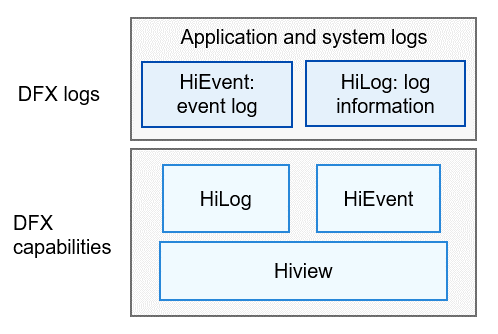

# DFX<a name="EN-US_TOPIC_0000001083007544"></a>

-   [Introduction](#section1347419114210)
-   [Architecture](#section342962219551)
-   [Directory Structure](#section62815498425)
-   [Repositories Involved](#section767551120815)

## Introduction<a name="section1347419114210"></a>

[Design for X](https://en.wikipedia.org/wiki/Design_for_X)  \(DFX\) refers to the software design that aims to improve the quality attribute in OpenHarmony. It mainly consists of two parts: design for reliability \(DFR\) and design for testability \(DFT\).

The DFX subsystem provides the following capabilities:

-   HiLog: Implements the logging capability.
-   HiEvent: Implements the event logging capability.

-   Hiview: Implements the logging task capability.

## Architecture<a name="section342962219551"></a>

**Figure  1**  Architecture of the DFX subsystem<a name="fig18347131919423"></a>  




## Directory Structure<a name="section62815498425"></a>

```
base/hiviewdfx        # DFX base repository, which stores compilation-related configurations
├── hiview_lite    # Hiview_lite module, which implements the logging task capability for the mini system
├── hilog_lite     # HiLog_lite module, which implements the logging capability for the mini and small systems
├── hievent_lite   # HiEvent_lite module, which implements the event logging capability for the mini system
```

## Repositories Involved<a name="section767551120815"></a>

DFX subsystem:

**hmf/hiviwdfx**

DFX modules:

hmf/hiviwdfx/hilog\_lite

hmf/hiviwdfx/hiview\_lite

hmf/hiviwdfx/hievent\_lite

