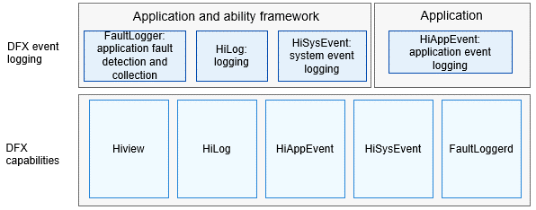

# DFX<a name="EN-US_TOPIC_0000001162014185"></a>

## Introduction<a name="section1347419114210"></a>

[Design for X](https://en.wikipedia.org/wiki/Design_for_X)  \(DFX\) refers to the software design that aims to improve the quality attribute in OpenHarmony. It mainly consists of two parts: design for reliability \(DFR\) and design for testability \(DFT\).

The DFX subsystem provides the following capabilities:

-   HiLog: Implements logging.

-   Hiview: Functions as the plug-in platform.
-   FaultLoggerd: Implements fault information collection and subscription.
-   HiAppEvent: Implements logging of application events.
-   HiSysEvent: Implements logging of system events.

## Architecture<a name="section342962219551"></a>

**Figure  1**  Architecture of the DFX subsystem<a name="fig18347131919423"></a>  




## Directory Structure<a name="section62815498425"></a>

```
base/hiviewdfx     # DFX base repository, which stores compilation-related configurations
├── hiview         # Hiview module, which implements the plug-in platform and event handler capabilities
├── hiview_lite    # Hiview_Lite module, which implements the logging task capability for the mini system
├── hilog          # HiLog module, which implements logging for the system
├── hilog_lite     # HiLog_Lite module, which implements logging for the mini and small systems
├── hievent_lite   # HiEvent_Lite module, which implements event logging for the mini system
├── hiappevent     # HiAppEvent module, which implements application event logging framework and APIs
├── hisysevent     # HiSysEvent module, which implements system event logging APIs and services
├── faultloggerd   # FaultLoggerd module, which implements collection of application fault logs
```

## Repositories Involved<a name="section767551120815"></a>

**DFX subsystem**

[hiviewdfx\_hiview](https://gitee.com/openharmony/hiviewdfx_hiview/blob/master/README.md)

[hiviewdfx\_hilog](https://gitee.com/openharmony/hiviewdfx_hilog/blob/master/README.md)

[hiviewdfx\_hiappevent](https://gitee.com/openharmony/hiviewdfx_hiappevent/blob/master/README.md)

[hiviewdfx\_hisysevent](https://gitee.com/openharmony/hiviewdfx_hisysevent/blob/master/README.md)

[hiviewdfx\_faultloggerd](https://gitee.com/openharmony/hiviewdfx_faultloggerd/blob/master/README.md)

[hiviewdfx\_hilog\_lite](https://gitee.com/openharmony/hiviewdfx_hilog_lite/blob/master/README.md)

[hiviewdfx\_hievent\_lite](https://gitee.com/openharmony/hiviewdfx_hievent_lite/blob/master/README.md)

[hiviewdfx\_hiview\_lite](https://gitee.com/openharmony/hiviewdfx_hiview_lite/blob/master/README.md)

