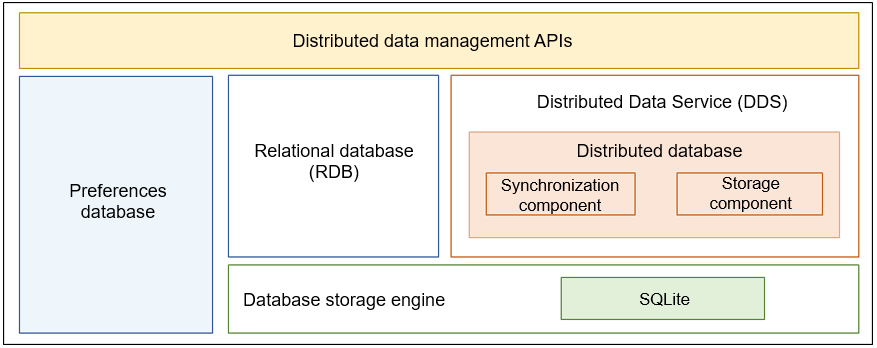

# Distributed Data Management<a name="EN-US_TOPIC_0000001096920663"></a>

## Introduction<a name="section11660541593"></a>

**About the Subsystem**

The Distributed Data Management subsystem can persistently store various structured data of a single device and also supports data synchronization and sharing across devices. In this regard, you can seamlessly integrate distributed application data among different devices, ensuring consistent user experience in the same application across these devices.

-   Local data management

    This module allows you to store and access structured data on a single device. It uses the SQLite engine to provide the relational database \(RDB\) and preferences database. With these databases, you can persistently store and access app data using different models.


-   Distributed data service

    This service can synchronize data across devices, so that users can access consistent data on different devices. DDS isolates data based on a triplet of the account, app, and database. DDS synchronizes data between trusted devices to provide the cross-device data access capability.


**Architecture of the Subsystem**

**Figure  1**  Architecture<a name="fig4460722185514"></a>  




## Directory Structure<a name="section161941989596"></a>

Level 1 and 2 directories of the distributed data management subsystem are as follows:

```
distributeddatamgr/         # Distributed data management
├── appdatamgr              # Local data management
└── distributeddatamgr      # Distributed Data Service

third_party/                # Open-source software
├── flatbuffers             # flatbuffers code
└── sqlite                  # SQLite code
```

## Usage<a name="section1312121216216"></a>

### Local Data Management<a name="section129654513264"></a>

-   Relational database \(RDB\)

    Some basic concepts are as follows:

    -   **RDB**

        A database created on the basis of relational models. The RDB stores data in rows and columns.

    -   **Result set**

        A set of query results used to access the data. You can access the required data in a result set in flexible modes.

    -   **SQLite database**

        A lightweight RDB in compliance with the atomicity, consistency, isolation, and durability \(ACID\) properties. It is an open-source database.


-   Preferences database

    Some basic concepts are as follows:

    -   **Key-value database**

        A database that stores data in key-value pairs. The  **key**  indicates keyword, and  **value**  indicates the corresponding value.

    -   **Non-relational database**

        A database not in compliance with the atomicity, consistency, isolation, and durability \(ACID\) database management properties of relational data transactions. Instead, the data in a non-relational database is independent and scalable.

    -   **Preference** **data**

        A type of data that is frequently accessed and used.


### Distributed Data Service<a name="section1961602912224"></a>

DDS provides apps with the capability to store data in the databases of different devices. It uses the KV data model.

-   **KV data model**

    KV is short for key-value. The KV database is a type of NoSQL database. Data in this type of database is organized, indexed, and stored in the form of key-value pairs.

    The KV data model is suitable for storing service data that does not involve too many data or service relationships. It provides better read and write performance than the SQL database. The KV data model is widely used in distributed scenarios because it handles conflict more easily in database version compatibility and data synchronization. The distributed database is based on the KV data model and provides KV-based access interfaces.


## Repositories Involved<a name="section1371113476307"></a>

Distributed Data Management subsystem

[distributeddatamgr\_appdatamgr](https://gitee.com/openharmony/distributeddatamgr_appdatamgr)

[distributeddatamgr\_distributeddatamgr](https://gitee.com/openharmony/distributeddatamgr_datamgr)

[third\_party\_sqlite](https://gitee.com/openharmony/third_party_sqlite)

[third\_party\_flatbuffers](https://gitee.com/openharmony/third_party_flatbuffers)

