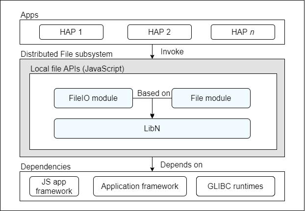

# Distributed File<a name="EN-US_TOPIC_0000001101541814"></a>

-   [Introduction](#section104mcpsimp)
    -   [Architecture](#section110mcpsimp)

-   [Directory Structure](#section113mcpsimp)
-   [Constraints](#section117mcpsimp)
-   [Usage](#section125mcpsimp)
    -   [Available APIs](#section127mcpsimp)
    -   [Usage Guidelines](#section149mcpsimp)

-   [Repositories Involved](#section178mcpsimp)

## Introduction<a name="section104mcpsimp"></a>

Currently, the Distributed File subsystem provides apps with JavaScript APIs for I/O capabilities, including APIs for managing files and directories, obtaining file information, reading and writing data streams of files, and receiving URIs rather than absolute paths.

### Architecture<a name="section110mcpsimp"></a>

Currently, the Distributed File subsystem provides only local JavaScript file APIs for apps through the FileIO and File modules. The Distributed File subsystem uses LibN to abstract APIs at the NAPI layer, providing basic capabilities such as the basic type system, memory management, and general programming models for the subsystem. This subsystem depends on the engine layer of the JS application development framework to provide the capability of converting JavaScript APIs into C++ code, depends on the application framework to provide app-related directories, and depends on the GLIBC runtimes to provide I/O capabilities.

**Figure  1**  Distributed File subsystem architecture<a name="fig174088216114"></a>  


## Directory Structure<a name="section113mcpsimp"></a>

```
foundation/distributeddatamgr/distributedfile
└── interfaces                  # APIs
    └── kits                    # APIs exposed externally
```

## Constraints<a name="section117mcpsimp"></a>

Constraints on local I/O APIs:

-   Only UTF-8/16 encoding is supported.
-   The URIs cannot include external storage directories.

## Usage<a name="section125mcpsimp"></a>

### Available APIs<a name="section127mcpsimp"></a>

Currently, the Distributed File subsystem provides APIs for accessing local files and directories. The following table describes the API types classified by function.

**Table  1**  API types

<a name="table99228171027"></a>
<table><thead align="left"><tr id="row2092221715211"><th class="cellrowborder" valign="top" width="15.02%" id="mcps1.2.5.1.1"><p id="p79225171524"><a name="p79225171524"></a><a name="p79225171524"></a>API Type</p>
</th>
<th class="cellrowborder" valign="top" width="32.25%" id="mcps1.2.5.1.2"><p id="p992271711216"><a name="p992271711216"></a><a name="p992271711216"></a>Function</p>
</th>
<th class="cellrowborder" valign="top" width="25.840000000000003%" id="mcps1.2.5.1.3"><p id="p29225175213"><a name="p29225175213"></a><a name="p29225175213"></a>Related Module</p>
</th>
<th class="cellrowborder" valign="top" width="26.889999999999997%" id="mcps1.2.5.1.4"><p id="p129221017720"><a name="p129221017720"></a><a name="p129221017720"></a>Example API (<em id="i15670628145315"><a name="i15670628145315"></a><a name="i15670628145315"></a>Class Name</em>.<em id="i6859230125316"><a name="i6859230125316"></a><a name="i6859230125316"></a>Method Name</em>)</p>
</th>
</tr>
</thead>
<tbody><tr id="row149231717327"><td class="cellrowborder" valign="top" width="15.02%" headers="mcps1.2.5.1.1 "><p id="p3923417629"><a name="p3923417629"></a><a name="p3923417629"></a>Basic file API</p>
</td>
<td class="cellrowborder" valign="top" width="32.25%" headers="mcps1.2.5.1.2 "><p id="p89236171124"><a name="p89236171124"></a><a name="p89236171124"></a>Creates, modifies, and accesses files, and changes file permissions based on the specified absolute paths or file descriptors.</p>
</td>
<td class="cellrowborder" valign="top" width="25.840000000000003%" headers="mcps1.2.5.1.3 "><p id="p22011844349"><a name="p22011844349"></a><a name="p22011844349"></a>@OHOS.distributedfile.fileio</p>
</td>
<td class="cellrowborder" valign="top" width="26.889999999999997%" headers="mcps1.2.5.1.4 "><p id="p1784383174320"><a name="p1784383174320"></a><a name="p1784383174320"></a>accessSync</p>
<p id="p184313310437"><a name="p184313310437"></a><a name="p184313310437"></a>chownSync</p>
<p id="p1684318315436"><a name="p1684318315436"></a><a name="p1684318315436"></a>chmodSync</p>
</td>
</tr>
<tr id="row1692320171825"><td class="cellrowborder" valign="top" width="15.02%" headers="mcps1.2.5.1.1 "><p id="p392391710219"><a name="p392391710219"></a><a name="p392391710219"></a>Basic directory API</p>
</td>
<td class="cellrowborder" valign="top" width="32.25%" headers="mcps1.2.5.1.2 "><p id="p109232176211"><a name="p109232176211"></a><a name="p109232176211"></a>Reads directories and determines file types based on the specified absolute paths.</p>
</td>
<td class="cellrowborder" valign="top" width="25.840000000000003%" headers="mcps1.2.5.1.3 "><p id="p271274219410"><a name="p271274219410"></a><a name="p271274219410"></a>@OHOS.distributedfile.fileio</p>
</td>
<td class="cellrowborder" valign="top" width="26.889999999999997%" headers="mcps1.2.5.1.4 "><p id="p29233177216"><a name="p29233177216"></a><a name="p29233177216"></a>Dir.openDirSync</p>
</td>
</tr>
<tr id="row14923171716217"><td class="cellrowborder" valign="top" width="15.02%" headers="mcps1.2.5.1.1 "><p id="p159234176215"><a name="p159234176215"></a><a name="p159234176215"></a>Basic statistical API</p>
</td>
<td class="cellrowborder" valign="top" width="32.25%" headers="mcps1.2.5.1.2 "><p id="p1992314179215"><a name="p1992314179215"></a><a name="p1992314179215"></a>Collects basic statistics including the file size, access permission, and modification time based on the specified absolute paths.</p>
</td>
<td class="cellrowborder" valign="top" width="25.840000000000003%" headers="mcps1.2.5.1.3 "><p id="p325774111413"><a name="p325774111413"></a><a name="p325774111413"></a>@OHOS.distributedfile.fileio</p>
</td>
<td class="cellrowborder" valign="top" width="26.889999999999997%" headers="mcps1.2.5.1.4 "><p id="p59231317420"><a name="p59231317420"></a><a name="p59231317420"></a>Stat.statSync</p>
</td>
</tr>
<tr id="row692319171228"><td class="cellrowborder" valign="top" width="15.02%" headers="mcps1.2.5.1.1 "><p id="p1592318171526"><a name="p1592318171526"></a><a name="p1592318171526"></a>Streaming file API</p>
</td>
<td class="cellrowborder" valign="top" width="32.25%" headers="mcps1.2.5.1.2 "><p id="p992311171421"><a name="p992311171421"></a><a name="p992311171421"></a>Reads and writes data streams of files based on the specified absolute paths or file descriptors.</p>
</td>
<td class="cellrowborder" valign="top" width="25.840000000000003%" headers="mcps1.2.5.1.3 "><p id="p1692321716217"><a name="p1692321716217"></a><a name="p1692321716217"></a>@OHOS.distributedfile.fileio</p>
</td>
<td class="cellrowborder" valign="top" width="26.889999999999997%" headers="mcps1.2.5.1.4 "><p id="p10923141711215"><a name="p10923141711215"></a><a name="p10923141711215"></a>Stream.createStreamSync</p>
<p id="p88031126184311"><a name="p88031126184311"></a><a name="p88031126184311"></a>Stream.fdopenStreamSync</p>
</td>
</tr>
<tr id="row82479241516"><td class="cellrowborder" valign="top" width="15.02%" headers="mcps1.2.5.1.1 "><p id="p12923111711216"><a name="p12923111711216"></a><a name="p12923111711216"></a>Sandbox file API</p>
</td>
<td class="cellrowborder" valign="top" width="32.25%" headers="mcps1.2.5.1.2 "><p id="p49237171020"><a name="p49237171020"></a><a name="p49237171020"></a>Provides a subset or a combination of the capabilities provided by the basic file, directory, and statistical APIs based on the specified URIs.</p>
</td>
<td class="cellrowborder" valign="top" width="25.840000000000003%" headers="mcps1.2.5.1.3 "><p id="p724852418510"><a name="p724852418510"></a><a name="p724852418510"></a>@system.file</p>
</td>
<td class="cellrowborder" valign="top" width="26.889999999999997%" headers="mcps1.2.5.1.4 "><p id="p0390135216324"><a name="p0390135216324"></a><a name="p0390135216324"></a>move</p>
<p id="p202016525456"><a name="p202016525456"></a><a name="p202016525456"></a>copy</p>
<p id="p8142558194520"><a name="p8142558194520"></a><a name="p8142558194520"></a>list</p>
</td>
</tr>
</tbody>
</table>

The URIs used in sandbox file APIs are classified into three types, as described in the following table.

**Table  2**  URI types

<a name="table947391523311"></a>
<table><thead align="left"><tr id="row84733151332"><th class="cellrowborder" valign="top" width="13.969999999999999%" id="mcps1.2.5.1.1"><p id="p32271219113313"><a name="p32271219113313"></a><a name="p32271219113313"></a>Directory Type</p>
</th>
<th class="cellrowborder" valign="top" width="16.41%" id="mcps1.2.5.1.2"><p id="p3227191993310"><a name="p3227191993310"></a><a name="p3227191993310"></a>Prefix</p>
</th>
<th class="cellrowborder" valign="top" width="22%" id="mcps1.2.5.1.3"><p id="p192277196333"><a name="p192277196333"></a><a name="p192277196333"></a>Access Visibility</p>
</th>
<th class="cellrowborder" valign="top" width="47.620000000000005%" id="mcps1.2.5.1.4"><p id="p18227719103313"><a name="p18227719103313"></a><a name="p18227719103313"></a>Description</p>
</th>
</tr>
</thead>
<tbody><tr id="row1474161514330"><td class="cellrowborder" valign="top" width="13.969999999999999%" headers="mcps1.2.5.1.1 "><p id="p9896152614335"><a name="p9896152614335"></a><a name="p9896152614335"></a>Temporary directory</p>
</td>
<td class="cellrowborder" valign="top" width="16.41%" headers="mcps1.2.5.1.2 "><p id="p389632610335"><a name="p389632610335"></a><a name="p389632610335"></a>internal://cache/</p>
</td>
<td class="cellrowborder" valign="top" width="22%" headers="mcps1.2.5.1.3 "><p id="p989610267332"><a name="p989610267332"></a><a name="p989610267332"></a>Current app only</p>
</td>
<td class="cellrowborder" valign="top" width="47.620000000000005%" headers="mcps1.2.5.1.4 "><p id="p16896726173311"><a name="p16896726173311"></a><a name="p16896726173311"></a>Readable and writable, and can be cleared at any time. This directory is usually used for temporary downloads or caches.</p>
</td>
</tr>
<tr id="row194741315193312"><td class="cellrowborder" valign="top" width="13.969999999999999%" headers="mcps1.2.5.1.1 "><p id="p12896142620339"><a name="p12896142620339"></a><a name="p12896142620339"></a>Private directory of an app</p>
</td>
<td class="cellrowborder" valign="top" width="16.41%" headers="mcps1.2.5.1.2 "><p id="p118969269332"><a name="p118969269332"></a><a name="p118969269332"></a>internal://app/</p>
</td>
<td class="cellrowborder" valign="top" width="22%" headers="mcps1.2.5.1.3 "><p id="p189612263333"><a name="p189612263333"></a><a name="p189612263333"></a>Current app only</p>
</td>
<td class="cellrowborder" valign="top" width="47.620000000000005%" headers="mcps1.2.5.1.4 "><p id="p1089682623314"><a name="p1089682623314"></a><a name="p1089682623314"></a>Deleted when the app is uninstalled.</p>
</td>
</tr>
<tr id="row204743152331"><td class="cellrowborder" valign="top" width="13.969999999999999%" headers="mcps1.2.5.1.1 "><p id="p3896152673319"><a name="p3896152673319"></a><a name="p3896152673319"></a>External storage</p>
</td>
<td class="cellrowborder" valign="top" width="16.41%" headers="mcps1.2.5.1.2 "><p id="p158961526113310"><a name="p158961526113310"></a><a name="p158961526113310"></a>internal://share/</p>
</td>
<td class="cellrowborder" valign="top" width="22%" headers="mcps1.2.5.1.3 "><p id="p16896326133310"><a name="p16896326133310"></a><a name="p16896326133310"></a>All apps</p>
</td>
<td class="cellrowborder" valign="top" width="47.620000000000005%" headers="mcps1.2.5.1.4 "><p id="p5897126113313"><a name="p5897126113313"></a><a name="p5897126113313"></a>Deleted when the app is uninstalled. Other apps with granted permissions can read and write files in this directory.</p>
</td>
</tr>
</tbody>
</table>

### Usage Guidelines<a name="section149mcpsimp"></a>

The I/O APIs provided by the Distributed File subsystem can be classified into the following types based on the programming model:

-   Synchronous programming model

    APIs whose names contain  **Sync**  are implemented as a synchronous model. When a synchronous API is called, the calling process waits until a value is returned.

    The following example opens a file stream in read-only mode, attempts to read the first 4096 bytes, converts them into a UTF-8-encoded string, and then closes the file stream:

    ```
    import fileio from '@OHOS.distributedfile.fileio';
    
    try {
        var ss = fileio.Stream.createStreamSync("tmp", "r")
        buf = new ArrayBuffer(4096)
        ss.readSync(buf)
        console.log(String.fromCharCode.apply(null, new Uint8Array(buf)))
        ss.closeSync()
    }
    catch (e) {
        console.log(e);
    }
    ```


-   Asynchronous programming model: Promise

    In the  **@OHOS.distributedfile.fileio**  module, the APIs whose names do not contain  **Sync**  and to which a callback is not passed as their input parameter are implemented as the Promise asynchronous model. The Promise asynchronous model is one of the OHOS standard asynchronous models. When an asynchronous API using the Promise model is called, the API returns a Promise object while executing the concerned task asynchronously. The Promise object represents the asynchronous operation result. When there is more than one result, the results are returned as properties of the Promise object.

    In the following example, a Promise chain is used to open a file stream in read-only mode, attempt to read the first 4096 bytes of the file, display the length of the content read, and then close the file:

    ```
    import fileio from '@OHOS.distributedfile.fileio';
    
    try {
        let openedStream
        fileio.Stream.createStream("test.txt", "r")
            .then(function (ss) {
                openedStream = ss;
                return ss.read(new ArrayBuffer(4096))
            })
            .then(function (res) {
                console.log(res.bytesRead);
                console.log(String.fromCharCode.apply(null, new Uint8Array(res.buffer)))
                return openedStream.close()
            })
            .then(function (undefined) {
                console.log("Stream is closed")
            })
            .catch(function (e) {
                console.log(e)
            })
    } catch (e) {
        console.log(e)
    }
    ```


-   Asynchronous programming model: Callback

    In the  **@OHOS.distributedfile.fileio**  module, the APIs whose names do not contain  **Sync**  and to which a callback is directly passed as their input parameter are implemented as the callback asynchronous model. The callback asynchronous model is also one of the OHOS standard asynchronous models. When an asynchronous API with a callback passed is called, the API executes the concerned task asynchronously and returns the execution result as the input parameters of the registered callback. The first parameter is of the  **undefined**  or  **Error**  type, indicating that the execution succeeds or fails, respectively.

    The following example creates a file stream asynchronously, reads the first 4096 bytes of the file asynchronously in the callback invoked when the file stream is created, and then closes the file asynchronously in the callback invoked when the file is read:

    ```
    import fileio from '@OHOS.distributedfile.fileio';
    
    try {
        fileio.Stream.createStream("./testdir/test_stream.txt", "r", function (err, ss) {
            if (!err) {
                ss.read(new ArrayBuffer(4096), {}, function (err, buf, readLen) {
                    if (!err) {
                        console.log('readLen: ' + readLen)
                        console.log('data: ' + String.fromCharCode.apply(null, new Uint8Array(buf)))
                    } else {
                        console.log('Cannot read from the stream ' + err)
                    }
                    ss.close(function (err) {
                        console.log(`Stream is ${err ? 'not' : ''}closed`)
                    });
                })
            } else {
                console.log('Cannot open the stream ' + err)
            }
        })
    } catch (e) {
        console.log(e)
    }
    ```


-   Asynchronous programming model: Legacy

    All APIs in the  **@system.file**  module are implemented as the legacy asynchronous model. When calling such an API, you need to implement three callbacks \(including  **success**,  **fail**, and  **complete**\) to be invoked when the execution is successful, fails, or is complete, respectively. If the input parameters are correct, the API calls the  **success**  or  **fail**  callback based on whether the asynchronous task is successful after the task execution is complete, and finally calls the  **complete**  callback.

    The following example asynchronously checks whether the file pointed to by the specified URI exists and provides three callbacks to print the check result:

    ```
    import file from '@system.file'
    
    file.access({
        uri: 'internal://app/test.txt',
        success: function() {
            console.log('call access success.');
        },
        fail: function(data, code) {
            console.error('call fail callback fail, code: ' + code + ', data: ' + data);
        },
        complete: function () {
            console.log('call access finally.');
        }
    });
    
    console.log("file access tested done")
    ```


## Repositories Involved<a name="section178mcpsimp"></a>

**Distributed File subsystem**

distributeddatamgr_distributedfile

