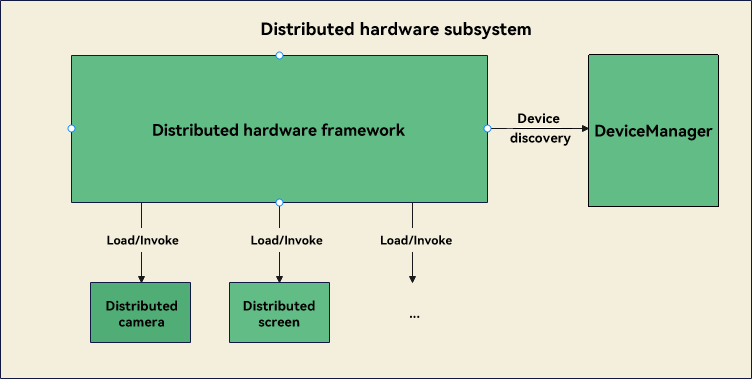

# Distributed Hardware

## Introduction

### **Distributed Hardware Subsystem**

Super Device allows multiple devices to collaborate with each other to provide optimal user experience.

The distributed hardware subsystem shares peripheral capabilities between devices in a Super Device. It manages the hardware information of each device in a virtual hardware resource pool and centrally shares and schedules the hardware capabilities across devices. The distributed hardware subsystem breaks device boundaries and redefines product forms and user experience through software. For example, you can display the content of your smartphone on a TV screen, and leverage the smartphone cameras to provide enhanced video recording capabilities for your PC.

The distributed hardware platform uses a hardware virtualization component to implement hardware resource pooling of all devices in a Super Device. Each device has a virtual hardware instance registered with the platform. The hardware virtualization component implements the interaction between the virtual hardware and physical hardware to complete the control over the hardware and data transmission. Hardware resource pooling implements hardware virtualization over the hardware device interface (HDI). Each service subsystem at the service layer can use distributed hardware like using local hardware.

### Architecture



## Directory Structure

```
foundation/distributedhardware
├──device_manager                     # Directory of DeviceManager.
├──distributed_hardware_fwk           # Directory of the distributed hardware framework.
├──distributed_camera                 # Directory of the distributed camera component. 
└──distributed_screen                 # Directory of the distributed screen component.
```

## Component Description

### DeviceManager

OpenHarmony DeviceManager provides authentication and networking capabilities for distributed devices and provides a set of APIs for detecting the online/offline device status, and  discovering and authenticating distributed devices. The DeviceManager implements trusted status management, online/offline status management, device discovery, and authentication management. The discovered and authenticated devices can form a Super Device. In the Super Device, hardware resources are automatically synchronized to all devices and uniformly managed by the distributed hardware subsystem.

### Distributed Hardware Framework

The distributed hardware framework provides information management capabilities for the distributed hardware subsystem. It implements unified hardware access, query, and enablement for the distributed hardware subsystem.

### Distributed Camera

Distributed camera implements collaboration of cameras of multiple devices that form a Super Device. The distributed camera component provides C++ interfaces for the distributed hardware framework, but not directly interacting with applications. Applications can call the APIs of the camera framework to use the distributed camera component to operate cameras of other devices, just like operating a local camera.

### Distributed Screen

The distributed screen provides a screen virtualization capability, which allows the screen of another authenticated device to be used as a display. In the distributed hardware subsystem, the distributed screen component implements system projection, screen mirroring, and screen splitting across the devices that form a Super Device.

## Repositories Involved

[distributedhardware\_device\_manager](https://gitee.com/openharmony/distributedhardware_device_manager)

[distributedhardware\_distributed\_hardware\_fwk](https://gitee.com/openharmony/distributedhardware_distributed_hardware_fwk)

[distributedhardware\_distributed\_camera](https://gitee.com/openharmony/distributedhardware_distributed_camera)

[distributedhardware\_distributed\_screen](https://gitee.com/openharmony/distributedhardware_distributed_screen)
