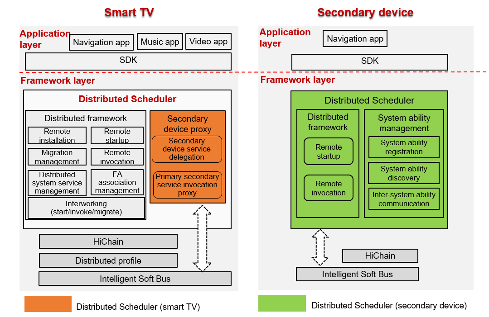

# Distributed Scheduler<a name="EN-US_TOPIC_0000001051983009"></a>

## Overview<a name="section11660541593"></a>

The Distributed Scheduler is used for cross-device component management. It allows the local device to access or control remote components, and enables application collaboration in distributed scenarios. The following figure shows the modules in the Distributed Scheduler.



## Directory Structure<a name="section1464106163817"></a>

The following table describes the directory structure of the Distributed Scheduler.

**Table 1**  Directory structure of the major source code

<a name="table43531856201716"></a>
<table><thead align="left"><tr id="row20416556201718"><th class="cellrowborder" valign="top" width="50%" id="mcps1.1.3.1.1"><p id="p10416456121716"><a name="p10416456121716"></a><a name="p10416456121716"></a>Directory</p>
</th>
<th class="cellrowborder" valign="top" width="50%" id="mcps1.1.3.1.2"><p id="p1841645631717"><a name="p1841645631717"></a><a name="p1841645631717"></a>Description</p>
</th>
</tr>
</thead>
<tbody><tr id="row64161056151718"><td class="cellrowborder" valign="top" width="50%" headers="mcps1.1.3.1.1 "><p id="p9416656181720"><a name="p9416656181720"></a><a name="p9416656181720"></a>dtbschedmgr_lite</p>
</td>
<td class="cellrowborder" valign="top" width="50%" headers="mcps1.1.3.1.2 "><p id="p541645611177"><a name="p541645611177"></a><a name="p541645611177"></a>Implementation of the Distributed Scheduler</p>
</td>
</tr>
<tr id="row104169564177"><td class="cellrowborder" valign="top" width="50%" headers="mcps1.1.3.1.1 "><p id="p17416125614179"><a name="p17416125614179"></a><a name="p17416125614179"></a>safwk_lite</p>
</td>
<td class="cellrowborder" valign="top" width="50%" headers="mcps1.1.3.1.2 "><p id="p04163569170"><a name="p04163569170"></a><a name="p04163569170"></a>Implementation of the foundation process</p>
</td>
</tr>
</tbody>
</table>

The source code directory structure of the Distributed Scheduler is as follows:

```
├── BUILD.gn
├── include
│  ├── distributed_schedule_service.h        # Header file for the open APIs provided by the Distributed Scheduler
│  ├── dmslite_check_remote_permission.h     # Header file for the permission management module of the Distributed Scheduler
│  ├── dmslite_famgr.h                       # Header file for the FA management module of the Distributed Scheduler
│  ├── dmslite_inner_common.h                # Internal common file for the Distributed Scheduler
│  ├── dmslite.h                             # Header file for the implementation of the Distributed Scheduler Service
│  ├── dmslite_log.h                         # Header file for the log module
│  ├── dmslite_msg_parser.h                  # Header file for the distributed message parsing module
│  ├── dmslite_tlv_common.h                  # Header file for the TLV data parsing module
│  └── dmslite_session.h                     # Header file for the inter-device communication module
├── readme.md
├── LICENSE
├── source
    ├── distributed_schedule_service.c
    ├── dmslite.c
    ├── dmslite_check_remote_permission.c
    ├── dmslite_famgr.c
    ├── dmslite_msg_parser.c
    ├── dmslite_tlv_common.c
    └── dmslite_session.c
```

## Constraints<a name="section1718733212019"></a>

**Language**: C or C++

**Networking environment**: The primary and secondary devices must be on the same LAN and can ping each other.

**Operating system**: OpenHarmony

**Limitations and constraints on remote startup**:

-   Only FAs can be started remotely. Remote startup is unavailable to abilities using the Service template.
-   Before the remote startup, ensure that the distributed networking between the primary and secondary devices is successful. Otherwise, the remote startup fails.

## Usage<a name="section10729231131110"></a>

-   **Compiling the Distributed Scheduler**

The code of the Distributed Scheduler is stored in the following directory:

```
foundation/distributedschedule/services/dtbschedmgr_lite
```

When compiling the code for a specific platform, you need to specify the target platform. The following code snippet uses code compilation for the Hi3516DV300 platform as an example:

```
python build.py ipcamera -p hi3516dv300_liteos_a
```

-   **Primary device development**  \(taking FA startup as an example\)

Create a  **Want**  instance to set the remote device ID, bundle name, and ability class name of the target FA and set the  **Want.FLAG\_ABILITYSLICE\_MULTI\_DEVICE**  flag to enable distributed startup.

```
import ohos.aafwk.ability.Ability;
import ohos.aafwk.content.Want;
import ohos.bundle.ElementName;

// Create a Want instance that will be passed to the startAbility method.
Want want = new Want();
ElementName name = new ElementName(remote_device_id, "com.huawei.remote_bundle_name", "remote_ability_name"); 
want.setElement(name); // Add information about the target FA for startup to the Want instance.
want.setFlags(Want.FLAG_ABILITYSLICE_MULTI_DEVICE); // Set the multi-device startup flag. If this flag is not set, remote FA startup will be unavailable.

// Start the remote FA on the secondary device.
startAbility(want); // Start the specified FA based on the want parameter. If the name and type of the want parameter are different from those used in the IDE, use the parameter name and type in the IDE.
```

-   **Prerequisites**

The target FA with the specified bundle name must have been installed on the secondary device.

-   **Execution**  \(taking FA startup as an example\)

Call the  **startAbility**  method on the primary device to start the target FA on the secondary device.

## Repositories Involved<a name="section176111311166"></a>

distributedschedule\_interfaces\_kits\_samgr\_lite

distributedschedule\_services\_dtbschedmgr\_lite

distributedschedule\_services\_safwk\_lite

