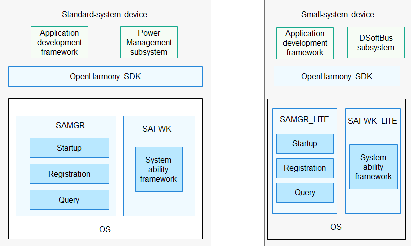

# Distributed Scheduler<a name="EN-US_TOPIC_0000001115719369"></a>

-   [Introduction](#section11660541593)
-   [Directory Structure](#section161941989596)
-   [Repositories Involved](#section1371113476307)

## Introduction<a name="section11660541593"></a>

The Distributed Scheduler in OpenHarmony provides functions related to system abilities \(also called system services\), including system ability startup, registration, and query.

**Figure  1**  Distributed Scheduler subsystem architecture<a name="fig4460722185514"></a>  




## Directory Structure<a name="section161941989596"></a>

```
/foundation/distributedschedule
├── dmsfwk                      # DMS framework (DMS is short for Distributed Manager Service, also called the Distributed Scheduler Service)
├── safwk                       # System ability framework
├── samgr                       # System ability manager
├── dms_fwk_lite                # Lightweight DMS framework
├── safwk_lite                  # Lightweight foundation process
├── samgr_lite                  # Lightweight system ability manager
```

## Repositories Involved<a name="section1371113476307"></a>

**Distributed Scheduler subsystem**

distributedschedule\_dms\_fwk

distributedschedule\_safwk

distributedschedule\_samgr

distributedschedule\_safwk\_lite

hdistributedschedule\_samgr\_lite

distributedschedule\_dms\_fwk\_lite

