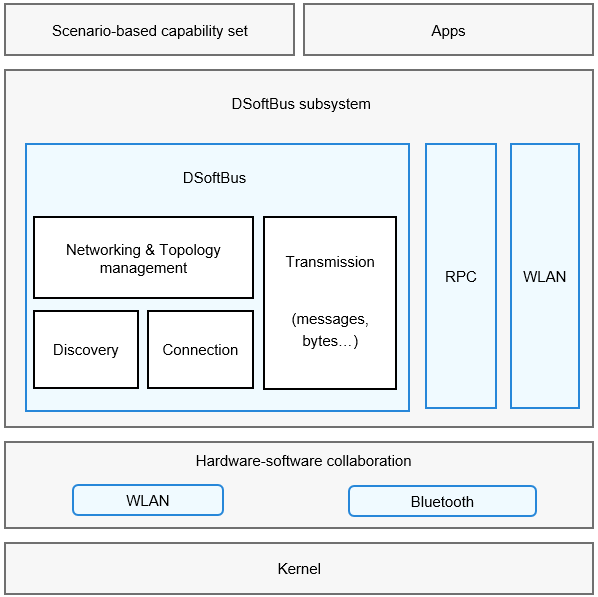

# DSoftBus

## Introduction

The DSoftBus subsystem provides the following communication capabilities for OpenHarmony:

- WLAN: basic WLAN functions, peer-to-peer (P2P) connection, and WLAN notification, enabling your application to communicate with other devices through a WLAN.

- Bluetooth: classic Bluetooth and Bluetooth Low Energy (BLE).

- DSoftBus: distributed communications between near-field devices, and device discovery, connection setup, networking, and data transmission capabilities regardless of communication modes.

- Remote procedure call (RPC): communications between processes on a device or across devices.


## Architecture

**Figure 1** DSoftBus architecture




## Directory Structure

The DSoftBus directory structure is as follows:

```
/foundation/communication
├── bluetooth       # Bluetooth code
├── dsoftbus        # DSoftBus code
├── ipc             # IPC code
└── wifi            # WLAN code
```

## Constraints

The devices must be in the same LAN.

## Usage

### RPC

In an RPC, the client process obtains the proxy of the process that provides the service (server). Through the proxy, the two processes communicate with each other.

1.  Implement the server capabilities.
2.  The client obtains a proxy of the server. This proxy provides the same capabilities as the server. To call a method of the server, the client only needs to call the same method of the proxy.
3.  The server processes the received request and returns the result to the proxy via the driver.
4.  The proxy returns the result to the client.

### DSoftBus

-   Networking

1.  The server starts and obtains the list of online devices.
2.  Register a listener for device status changes.
3.  Obtain the device ID, name, and type.
4.  Obtain detailed information about the device, such as the device type, networking type, and device capability.
5.  Delete the registered listener when the process exits.

-   Transmission

1.  Creates a socket instance based on information, such as the socket name and caller bundle name.
2.  The server starts listening for the socket, and the client binds the socket.
3.  Send data after the bind is successful.
4.  Close the socket when it is not used.

## Repositories Involved

**DSoftBus subsystem**

[communication\_bluetooth](https://gitee.com/openharmony/communication_bluetooth)

[communication\_dsoftbus](https://gitee.com/openharmony/communication_dsoftbus)

[communication\_ipc](https://gitee.com/openharmony/communication_ipc)

[communication\_wifi](https://gitee.com/openharmony/communication_wifi)
