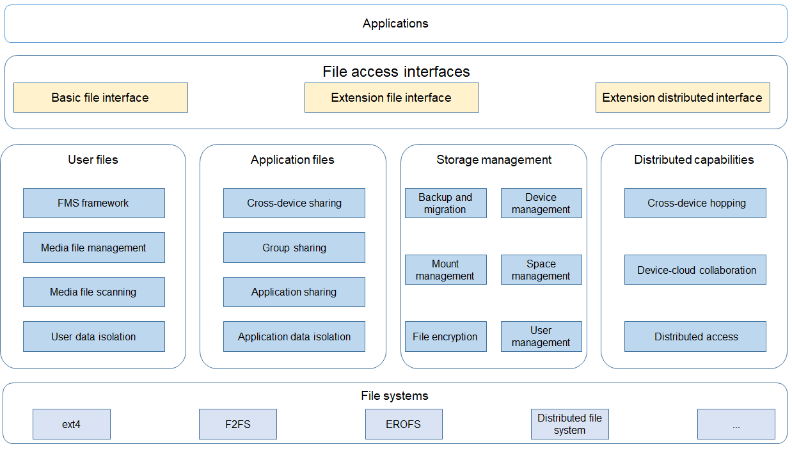

# File Management

## Introduction

The file management subsystem provides a complete file management solution for OpenHarmony. It provides secure and easy-to-use file access and comprehensive file management capabilities, including:

- A sandbox to ensure the least privilege as well as application data security
- Unified management of user files and streamlined user data access and storage to ensure user data security and purity
- Access framework to allow applications to access distributed file system files and cloud files as they access local files
- Sharing of user data and system files across applications and devices
- System storage management capabilities and basic file system capabilities

**Figure 1** Architecture of the file management subsystem

The file management subsystem provides the file access framework, file sharing framework, and storage management framework for applications.

| Module        | Description                                                    |
| ------------ | ------------------------------------------------------------ |
| File access interface| 1. Provides complete JavaScript APIs to implement basic file access capabilities. 2. Provides extension APIs for local and distributed files.|
| Storage management    | 1. Provides data backup and restore to support system and application data backup and cloning. 2. Provides space management capabilities such as application space clearing and statistics, and quota control. 3. Provides storage management capabilities such as mount operations, external card management, device management, and multi-user management.|
| User files    | 1.  Provides a sandbox to ensure user data security and purity. 2. Allows access to user data only through **mediaLibrary**. 3. Provides a unified file management framework.|
| Application files    | 1. Provides a sandbox to ensure the least privilege as well as application data security. 2. Supports file sharing between applications, across devices, and in groups.|
| Distributed capabilities  | 1. Provides basic cross-device access capabilities and supports distributed access using the same account and temporary access using different accounts. 2. Supports cross-device hopping, such as application hopping and distributed pasteboard.|
| Basic file system| 1. Supports local file systems such as ext4, Flash-Friendly File System (F2FS), Extensible File Allocation Table (exFAT), and New Technology File System (NTFS). 2. Supports network file systems such as the distributed file system and Network File System (NFS). 3. Provides tools related to file systems.|

## Repositories Involved

User file management

[filemanagement_user_file_service](https://gitee.com/openharmony/filemanagement_user_file_service)

Application file management

[filemanagement_app_file_service](https://gitee.com/openharmony/filemanagement_app_file_service)

File management APIs

[filemanagement_file_api](https://gitee.com/openharmony/filemanagement_file_api)

Storage management

[filemanagement_storage_service](https://gitee.com/openharmony/filemanagement_storage_service)

Distributed file management

 [filemanagement_dfs_service](https://gitee.com/openharmony/filemanagement_dfs_service)
