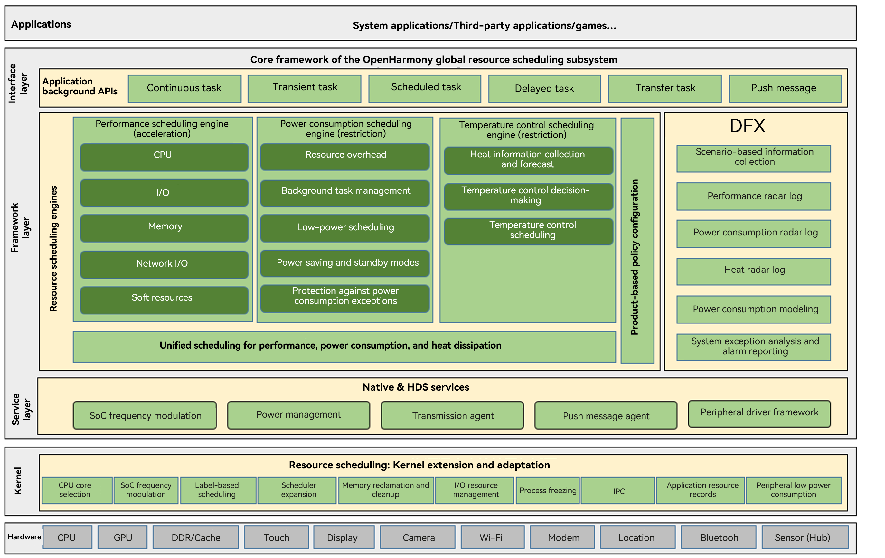

# Global Resource Scheduling


The global resource scheduling subsystem schedules and manages the CPU, memory, and storage resources across the system, including task grouping, priority management, and background task management. The global resource scheduling subsystem is responsible for keeping a balance between the foreground and the background: On the basis of ensuring smooth foreground operations, it strives to provide an environment where multiple tasks can run smoothly in the background. It is also responsible for keeping a balance between performance, power consumption, and heat. That is, the subsystem strives to maintain the timeliness of response to user operations, while minimizing power consumption and overheating.


## Overview

The global resource scheduling subsystem is mainly applicable to the standard system and is typically removed from the mini system. The following description applies only to the standard system.

The global resource scheduling subsystem schedules and manages CPU, memory, I/O, network, and soft resources from three dimensions: performance, power consumption, and heat dissipation. The soft resources include manageable software entities such as foreground and background tasks, messages, and queues. Below shows the modules of the global resource scheduling subsystem.



The global resource scheduling subsystem consists of four layers: interface layer, framework layer, service layer, and kernel layer. DFX covers all layers and domains of the entire system.

The layers are described as follows:

- Interface layer: provides scheduling API extension. Core APIs are mainly application background APIs. Based on the behavior logic of applications in the background, these APIs are classified into continuous tasks, transient tasks, scheduled tasks, delayed tasks, transmission tasks, and push messages.

- Framework layer: provides three core engines for resource scheduling:
  - Performance scheduling engine: ensures timely response to user operations and long-term smoothness. Its core functions provide timely supply in the CPU, memory, I/O, network, and soft resources, with resources weighted toward foreground applications and meeting the basic requirements of user-aware tasks running in the background.
  - Power consumption scheduling engine: provides methods for restricting the use of the five types of resources. It also provides core functions such as background task management, low-power scheduling of peripheral components, power saving and standby modes, and protection against power consumption exceptions.

  - Temperature control scheduling engine: provides long-term restriction policies for power-intensive resources based on the actual system heat and heat forecast. The temperature control scheduling engine differentiates the heat level and identifies the heat source, and controls the heat accordingly.

- Service layer: provides a unified interface for resource access and implements conflict mitigation measures for concurrent access. It includes SoC frequency modulation, power management, transmission agent, push message agent, and peripheral driver framework.

- Kernel layer: implements kernel extension and adaptation for resource scheduling and provides extension capabilities for user-mode scheduling.

- DFX: provides scenario-based information collection, performance, power consumption, and heat control event logs, power consumption modeling for peripheral components, system exception analysis, and alarm reporting.


## Directory Structure

```
foundation/resourceschedule/
├── background_task_mgr						# Background task management
├── device_usage_statistics					# Device usage statistics
├── frame_aware_sched						# Aware scheduling
├── memmgr									# Memory management
├── resource_schedule_service				# Global resource scheduling engine
└── work_scheduler							# Background scheduled task scheduling
```

## Constraints

Programming language version: C++ 11 or later


## Compilation and Building

For details, see the README and **test** directory of each repository.


## Repositories Involved

**Resource scheduling subsystem**

[resourceschedule_background_task_mgr](https://gitee.com/openharmony/resourceschedule_background_task_mgr)

[resourceschedule_device_usage_statistics](https://gitee.com/openharmony/resourceschedule_device_usage_statistics)

[resourceschedule_work_scheduler](https://gitee.com/openharmony/resourceschedule_work_scheduler)

[aafwk_standard](https://gitee.com/openharmony/aafwk_standard)

[windowmanager](https://gitee.com/openharmony/windowmanager)

[communication_ipc](https://gitee.com/openharmony/communication_ipc)

[powermgr_battery_manager](https://gitee.com/openharmony/powermgr_battery_manager)

[notification_ces_standard](https://gitee.com/openharmony/notification_ces_standard)

[hiviewdfx_hilog](https://gitee.com/openharmony/hiviewdfx_hilog) 
