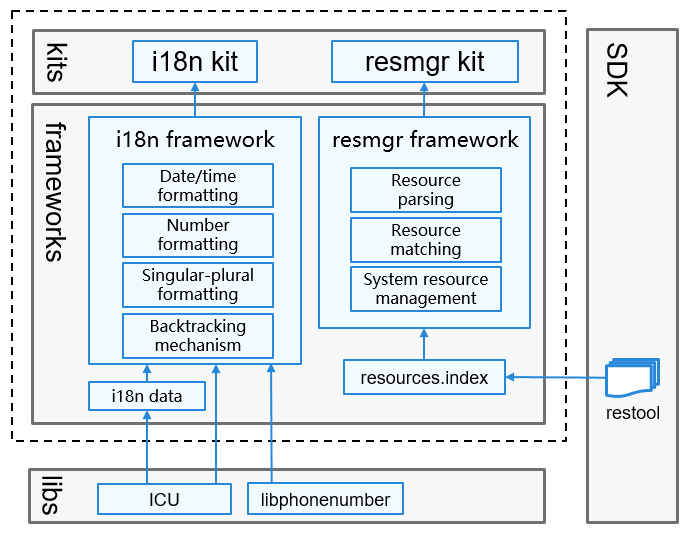

# Globalization<a name="EN-US_TOPIC_0000001115837954"></a>

## Introduction<a name="section11660541593"></a>

If OpenHarmony devices and applications need to be used globally, they must meet the requirements of users in different regions on languages and cultures. The Globalization subsystem provides the multi-language and multi-cultural capabilities for global use, including:

-   **Resource management**

    The subsystem loads, parses, and initializes system and application resources based on device types and system configurations, and provides APIs for obtaining resources such as character strings and media files.

-   **Internationalization \(i18n\)**

    The subsystem provides the bottom-layer resource backtracking capabilities, with a wide array of i18n APIs for implementing functions such as date/time formatting, number formatting, phone number formatting, and singular-plural formatting.


## Architecture<a name="section1558604311012"></a>

**Figure 1** Architecture of the globalization subsystem<a name="fig1687592425010"></a>




## Directory Structure<a name="section161941989596"></a>

The source code of the Globalization subsystem is stored in the  **/base/global**  directory.

The directory structure of the Globalization subsystem for the mini and small systems is as follows:

```
/base/global/
├── i18n_lite               # Code repository for the i18n framework
│   ├── frameworks          # Core code of the i18n framework
│   │   ├── i18n            # i18n module
│   │   │   ├── include     # Header files
│   │   │   ├── src         # Implementation code
│   │   │   └── test        # Test code
│   ├── interfaces          # APIs
│   │   ├── kits            # Application APIs
│   │   │   ├── i18n        # C/C++ i18n APIs
│   │   │   └── js          # C/C++ support for JavaScript APIs
├── resmgr_lite             # Code repository for the Resmgr framework
│   ├── frameworks          # Core code of the Resmgr framework
│   │   ├── resmgr          # Resource parsing code
│   │   │   ├── include     # Header files
│   │   │   └── src         # Implementation code
│   ├── interfaces          # APIs
│   │   └── innerkits       # APIs for internal subsystems
```

The directory structure of the Globalization subsystem for the standard system is as follows:

```
/base/global
├── i18n           # Code repository for the i18n framework
│   ├── frameworks          # Core code of the i18n framework
│   ├── interfaces          # APIs
│   │   ├── js              # JavaScript APIs
│   │   └── native          # Native APIs
├── resmgr_standard         # Code repository for the Resmgr module
│   ├── frameworks          # Core code
│   │   ├── resmgr          # Resource parsing code
│   │   │   ├── include     # Header files
│   │   │   ├── src         # Implementation code
│   │   │   └── test        # Test code
│   ├── interfaces          # APIs
│   │   ├── innerkits       # APIs for internal subsystems
│   │   └── js              # JavaScript APIs
```

## Repositories Involved<a name="section1371113476307"></a>

**Globalization subsystem**

[global\_i18n\_lite](https://gitee.com/openharmony/global_i18n_lite)

[global\_i18n](https://gitee.com/openharmony/global_i18n)

[global\_resmgr\_lite](https://gitee.com/openharmony/global_resmgr_lite)

[global\_resmgr\_standard](https://gitee.com/openharmony/global_resmgr_standard)

