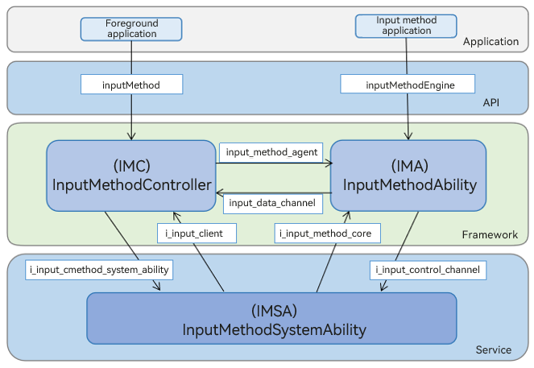

# Input Method Framework

## Introduction

The input method framework is responsible for establishing a communication channel between the application in which the edit box is located and the input method application, to ensure that the two can jointly provide text input, and also enables system applications to manage the input method application.

The input method framework has four modules:

1. Application

   Path: /base/inputmethod/imf/frameworks/native/inputmethod_controller

   Function: enables an application to request the use of and interaction with the input method application.

2. Input method application

   Path: /base/inputmethod/imf/frameworks/native/inputmethod_ability

   Function: provides an input method application implementation framework. Based on the framework, the input method application can be correctly started, and collaborates with the edit box application to complete text input.

3. Input method engine

   Path: /base/inputmethod/imf/services

   Function: responsible for establishing secure and reliable connections with the input method and providing features such as input method switching and query.

4. Input method JS API implementation

   Path: /base/inputmethod/imf/frameworks/js

   - JS API implementation provided for input method applications: /base/inputmethod/imf/frameworks/js/napi/inputmethodability

   - JS API implementation provided for the self-drawing components: /base/inputmethod/imf/frameworks/js/napi/inputmethodclient.

   Function: provides specific implementation for TS-related APIs.

## System Architecture

**Figure 1** Architecture




## Directory Structure

```
/base/inputmethod/imf
├── figures                                     # Architecture diagram
├── frameworks
│   └── js/napi                                 # Native APIs of the input method framework
│       └──inputmethod_extention_ability        # InputMethodExtentionAbility related APIs for input method applications
│       └──inputmethod_extention_context        # InputMethodExtentionContext related APIs for input method applications
│       └──inputmethodability                   # APIs provided for input method applications
│       └──inputmethodclient                    # APIs provided by the system applications and self-drawing components
│   └── native
│       └──inputmethod_ability                  # APIs provided for input method applications
│       └──inputmethod_controller               # APIs provided for the application
├── interfaces                                  # APIs provided by the components for external systems
│   └── inner_api                               # Inner APIs
├── profile                                     # Configuration files of system services and processes contained in the components
├── services                                    # Input method engine
├── test                                        # Tests
│   └── fuzztest                                # Fuzz test of APIs
│   └── unitest                                 # Unit test of APIs
│       └──cpp_test                             # CPP unit test of APIs
│       └──napi_test                            # JS unit test of APIs
```

## How to Use

* [InputMethodExtentionAbility](../application-dev/application-models/inputmethodextentionability.md)
* [@ohos.inputMethod (Input Method Framework)](../application-dev/reference/apis-ime-kit/js-apis-inputmethod.md)
* [@ohos.inputMethodEngine (Input Method Service)](../application-dev/reference/apis-ime-kit/js-apis-inputmethodengine.md)

## Repositories Involved

Input method framework

[inputmethod_imf](https://gitee.com/openharmony/inputmethod_imf)
