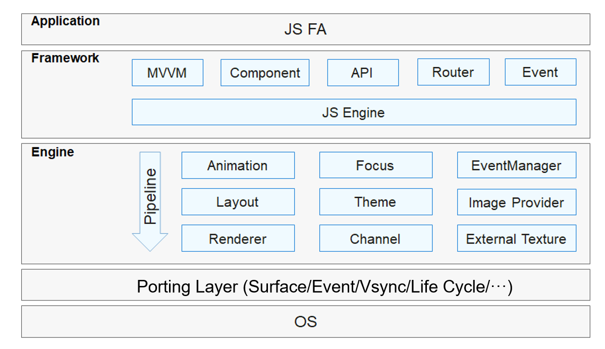

# JS UI Framework<a name="EN-US_TOPIC_0000001087318673"></a>

## Introduction<a name="section11660541593"></a>

The OpenHarmony JS UI framework provides basic, container, and canvas UI components and standard CSS animation capabilities. It supports the web-development-like programming paradigm.

-   **Web-development-like paradigm**

    The JS UI framework supports languages that are similar to those for web development, such as HTML and CSS. You can use them to describe the page layout and style, and use JavaScript \(conforming to the ECMAScript specification\) for page behavior. This paradigm allows you to avoid code for UI state switching. The view configuration information is intuitive.


**Figure  1**  JS UI framework<a name="fig15956152211427"></a>  




The JS UI framework consists of the application, framework, engine, and porting layers.

-   **Application**

    Contains applications with Feature Abilities \(FAs\) developed with the JS UI framework. The FA application in this document refers to the application with FAs developed using JavaScript.

-   **Framework**

    Parses UI pages and provides the Model-View-ViewModel \(MVVM\), page routing, custom components and more for front end development.

-   **Engine**

    Accomplishes animation parsing, Document Object Model \(DOM\) building, layout computing, rendering command–based building and drawing, and event management.

-   **Porting Layer**

    Abstracts the platform layer to provide interfaces for the interconnection with the OS. For example, interconnections of events, rendering pipelines, and lifecycles.


## Directory Structure<a name="section179173014915"></a>

The source code of the framework is stored in  **/foundation/ace**. The following shows the directory structure.

```
/foundation/ace
├── ace_engine                       # JS UI framework
├── ace_engine_lite                  # JS UI framework for the mini system and above
└── napi                             # JS APIs for extending the native development module
```

## Usage<a name="section1711605017917"></a>

-   JavaScript FA development directory

After a project is created, its  **js**  directory is displayed.

**Figure  2**  Development directory<a name="fig343917486112"></a>  


The  **i18n**  directory stores JSON files for various locales. A  **pages**  subfolder contains multiple pages and each consists of  **.hml**,  **.css**, and  **.js**  files.

-   **main \> js \> default \> i18n \> en-US.json**: defines the variables displayed on pages in English. Similarly,  **zh-CN.json**  defines the page content in Chinese.

    ```
    {
      "strings": {
        "hello": "Hello",
        "world": "World"
      }
    }
    ```

-   **main \> js \> default \> pages \> index \> index.hml**: describes the layout of the  **index**  page, components used on the page, and the hierarchy of these components. For example, there is a text component for displaying  **Hello World**.

    ```
    <div class ="container">
      <text class ="title">
        {{ $t('strings.hello') }} {{title}}
      </text>
    </div>
    ```

-   **main \> js \> default \> pages \> index \> index.css**: defines the style of the  **index**  page. For example, the following  **index.css**  code snippet describes how  **container**  and  **title**  will be displayed on the page:

    ```
    .container {
      flex-direction: column;
      justify-content: center;
      align-items: center;
    }
    .title {
      font-size: 100px;
    }
    ```

-   **main \> js \> default \> pages \> index \> index.js**: defines the service logic on the  **index**  page, such as data binding and event processing. In this example, the string  **World**  is assigned to  **title**.

    ```
    export default {
      data: {
        title: '',
      },
      onInit() {
        this.title = this.$t('strings.world');
      },
    }
    ```


## Repositories Involved<a name="section1599816111011"></a>

JS UI framework

[arkui\_ace\_engine](https://gitee.com/openharmony/arkui_ace_engine)

[arkui\_ace\_engine\_lite](https://gitee.com/openharmony/arkui_ace_engine_lite)

[ace\_napi](https://gitee.com/openharmony/ace_napi)

