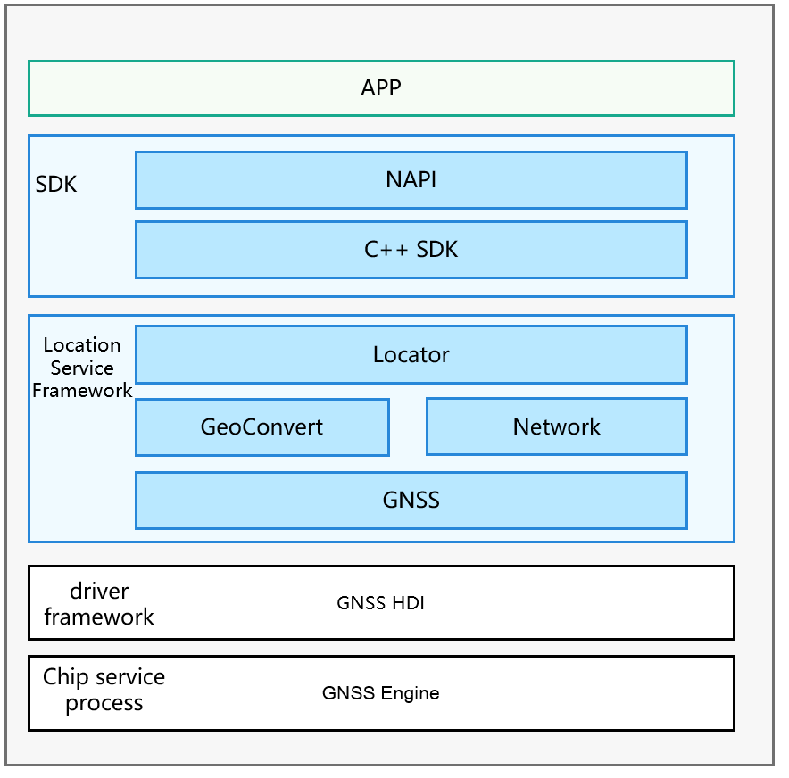

# Location

## Introduction

People take their mobile devices wherever they go. Mobile devices have become a necessity in people's daily routines, whether it be for looking at the weather forecast, browsing news, hailing a taxi, navigating, or recording data from a workout. All these activities are so much associated with the location services on mobile devices.

With the location awareness capability offered by OpenHarmony, mobile devices will be able to obtain real-time, accurate location data. Building location awareness into your application can also lead to a better contextual experience for application users.

Your application can call location-specific APIs to obtain the location information of a mobile device for offering location-based services such as drive navigation and motion track recording.

**Basic Concepts**

Location awareness helps determine where a mobile device locates. The system identifies the location of a mobile device with its coordinates, and uses location technologies such as Global Navigation Satellite System (GNSS) and network positioning (for example, base station positioning or WLAN/Bluetooth positioning) to provide diverse location-based services. These advanced location technologies make it possible to obtain the accurate location of the mobile device, regardless of whether it is indoors or outdoors.

-   **Coordinate**

    A coordinate describes a location on the earth using the longitude and latitude in reference to the World Geodetic Coordinate System 1984.

-   **GNSS positioning**

    GNSS positioning locates a mobile device by using the location algorithm offered by the device chip to compute the location information provided by the Global Navigation Satellite System, for example, GPS, GLONASS, BeiDou, and Galileo. Whichever positioning system will be used during the location process depends on a hardware capability of the device.

-   **Base station positioning**

    Base station positioning estimates the current location of a mobile device based on the location of the resident base station in reference to the neighboring base stations. This technology provides only a low accuracy and requires access to the cellular network.

-   **WLAN or Bluetooth positioning**

    WLAN or Bluetooth positioning estimates the current location of a mobile device based on the locations of WLANs and Bluetooth devices that can be discovered by the device. The location accuracy of this technology depends on the distribution of fixed WLAN access points (APs) and Bluetooth devices around the device. A high density of WLAN APs and Bluetooth devices can produce a more accurate location result than base station positioning. This technology also requires access to the network.

**Figure 1** Location subsystem architecture**<a name="fig4460722185514"></a>  



## Directory Structure<a name="section161941989596"></a>

```
/base/location               # Source code of the location subsystem
├── etc                   # Code for the service startup configuration
├── interfaces            # APIs
├── profile               # Code for service declaration
├── location_common       # Common code
├── location_locator      # Location service management code
├── location_gnss         # GNSS positioning service code
├── location_network      # Network positioning service code
├── location_passive      # Passive positioning service code
├── location_geocode      # Geocoding service code
├── test                  # Test code
├── utils                 # Common utility code
```

## Constraints<a name="section119744591305"></a>

Your application can use the location function only after the user has granted the permission and turned on the function. If the location function is off, the system will not provide the location service for any application.

Since the location information is considered sensitive, your application still needs to obtain the location access permission from the user even if the user has turned on the location function. The system will provide the location service for your application only after it has been granted the permission to access the device location information.

## Usage

### Available APIs<a name="section1551164914237"></a>

The following table describes APIs available for obtaining device location information.

**Table 1** APIs for obtaining device location information
| API| Description| 
| -------- | -------- |
| on(type: 'locationChange', request: LocationRequest, callback: Callback&lt;Location&gt;) : void | Registers a listener for location changes with a location request initiated.| 
| off(type: 'locationChange', callback?: Callback&lt;Location&gt;) : void | Unregisters the listener for location changes with the corresponding location request deleted.| 
| on(type: 'locationServiceState', callback: Callback&lt;boolean&gt;) : void | Registers a listener for location service status change events.| 
| off(type: 'locationServiceState', callback: Callback&lt;boolean&gt;) : void | Unregisters the listener for location service status change events.| 
| on(type: 'cachedGnssLocationsReporting', request: CachedGnssLocationsRequest, callback: Callback&lt;Array&lt;Location&gt;&gt;) : void; | Registers a listener for cached GNSS location reports.| 
| off(type: 'cachedGnssLocationsReporting', callback?: Callback&lt;Array&lt;Location&gt;&gt;) : void; | Unregisters the listener for cached GNSS location reports.| 
| on(type: 'gnssStatusChange', callback: Callback&lt;SatelliteStatusInfo&gt;) : void; | Registers a listener for satellite status change events.| 
| off(type: 'gnssStatusChange', callback?: Callback&lt;SatelliteStatusInfo&gt;) : void; | Unregisters the listener for satellite status change events.| 
| on(type: 'nmeaMessageChange', callback: Callback&lt;string&gt;) : void; | Registers a listener for GNSS NMEA message change events.| 
| off(type: 'nmeaMessageChange', callback?: Callback&lt;string&gt;) : void; | Unregisters the listener for GNSS NMEA message change events.| 
| on(type: 'fenceStatusChange', request: GeofenceRequest, want: WantAgent) : void; | Registers a listener for status change events of the specified geofence.| 
| off(type: 'fenceStatusChange', request: GeofenceRequest, want: WantAgent) : void; | Unregisters the listener for status change events of the specified geofence.| 
| getCurrentLocation(request: CurrentLocationRequest, callback: AsyncCallback&lt;Location&gt;) : void | Obtains the current location. This API uses an asynchronous callback to return the result. | 
| getCurrentLocation(request?: CurrentLocationRequest) : Promise&lt;Location&gt; | Obtains the current location. This API uses a promise to return the result. | 
| getLastLocation(callback: AsyncCallback&lt;Location&gt;) : void | Obtains the previous location. This API uses an asynchronous callback to return the result.| 
| getLastLocation() : Promise&lt;Location&gt; | Obtains the previous location. This API uses a promise to return the result. | 
| isLocationEnabled(callback: AsyncCallback&lt;boolean&gt;) : void | Checks whether the location service is enabled. This API uses an asynchronous callback to return the result.| 
| isLocationEnabled() : Promise&lt;boolean&gt; | Checks whether the location service is enabled. This API uses a promise to return the result.| 
| requestEnableLocation(callback: AsyncCallback&lt;boolean&gt;) : void | Requests to enable the location service. This API uses an asynchronous callback to return the result.| 
| requestEnableLocation() : Promise&lt;boolean&gt; | Requests to enable the location service. This API uses a promise to return the result.| 
| enableLocation(callback: AsyncCallback&lt;boolean&gt;) : void | Enables the location service. This API uses an asynchronous callback to return the result.| 
| enableLocation() : Promise&lt;boolean&gt; | Enables the location service. This API uses a promise to return the result.| 
| disableLocation(callback: AsyncCallback&lt;boolean&gt;) : void | Disables the location service. This API uses an asynchronous callback to return the result.| 
| disableLocation() : Promise&lt;boolean&gt; | Disables the location service. This API uses a promise to return the result.| 
| getCachedGnssLocationsSize(callback: AsyncCallback&lt;number&gt;) : void; | Obtains the number of cached GNSS locations. This API uses an asynchronous callback to return the result.| 
| getCachedGnssLocationsSize() : Promise&lt;number&gt;; | Obtains the number of cached GNSS locations. This API uses a promise to return the result.| 
| flushCachedGnssLocations(callback: AsyncCallback&lt;boolean&gt;) : void; | Obtains all cached GNSS locations and clears the GNSS cache queue. This API uses an asynchronous callback to return the result.| 
| flushCachedGnssLocations() : Promise&lt;boolean&gt;; | Obtains all cached GNSS locations and clears the GNSS cache queue. This API uses a promise to return the result.| 
| sendCommand(command: LocationCommand, callback: AsyncCallback&lt;boolean&gt;) : void; | Sends extended commands to the location subsystem. This API uses an asynchronous callback to return the result.| 
| sendCommand(command: LocationCommand) : Promise&lt;boolean&gt;; | Sends extended commands to the location subsystem. This API uses a promise to return the result.| 
| isLocationPrivacyConfirmed(type : LocationPrivacyType, callback: AsyncCallback&lt;boolean&gt;) : void; | Checks whether a user agrees with the privacy statement of the location service. This API uses an asynchronous callback to return the result.| 
| isLocationPrivacyConfirmed(type : LocationPrivacyType,) : Promise&lt;boolean&gt;; | Checks whether a user agrees with the privacy statement of the location service. This API uses a promise to return the result.| 
| setLocationPrivacyConfirmStatus(type : LocationPrivacyType, isConfirmed : boolean, callback: AsyncCallback&lt;boolean&gt;) : void; | Sets the user confirmation status for the privacy statement of the location service. This API uses an asynchronous callback to return the result.| 
| setLocationPrivacyConfirmStatus(type : LocationPrivacyType, isConfirmed : boolean) : Promise&lt;boolean&gt;; | Sets the user confirmation status for the privacy statement of the location service. This API uses a promise to return the result.| 


### How to Use<a name="section129654513264"></a>

**Obtaining the device location information:**

1. Before using basic location capabilities, check whether your application has been granted the permission to access the device location information. If not, your application needs to obtain the permission from the user.

   The system provides the following location permissions:
   - ohos.permission.LOCATION
   
   - ohos.permission.LOCATION_IN_BACKGROUND

   The **ohos.permission.LOCATION** permission is a must if your application needs to access the device location information.

   If your application needs to access the device location information when running on the background, it must be allowed to run on the background in the configuration file and also granted the **ohos.permission.LOCATION_IN_BACKGROUND** permission. In this way, the system continues to report device location information even when your application moves to the background.

   You can declare the required permission in your application's configuration file. For details, see [Access Control (Permission) Development](../application-dev/security/accesstoken-guidelines.md).

2. Import the **geolocation** module by which you can implement all APIs related to the basic location capabilities.
     
   ```
   import geolocation from '@ohos.geolocation';
   ```

3. Instantiate the **LocationRequest** object. This object provides APIs to notify the system of the location service type and the interval of reporting location information.

   **Method 1:**

   To better serve your needs for using APIs, the system has categorized APIs into different packages to match your common use cases of the location function. In this way, you can directly use the APIs specific to a certain use case, making application development much easier. The following table lists the use cases currently supported.

     
   ```
       export enum LocationRequestScenario {
            UNSET = 0x300,
            NAVIGATION,
            TRAJECTORY_TRACKING,
            CAR_HAILING,
            DAILY_LIFE_SERVICE,
            NO_POWER,
        }
   ```

     
     **Table 2** Common use cases of the location function
   
   | Use Case| Constant| Description| 
   | -------- | -------- | -------- |
   | Navigation| NAVIGATION | Applicable when your application needs to obtain the real-time location of a mobile device outdoors, such as navigation for driving or walking. In this scenario, the GNSS positioning technology is mainly used to ensure the location accuracy. However, due to its limitations, the technology may be unable to provide the location service when navigation is just started or when the user moves into a shielded environment such as indoors or a garage. To resolve this issue, the system uses the network positioning technology as an alternative to provide the location service for your application until the GNSS can provide stable location results. This helps achieve a smooth navigation experience for users.<br>By default, the system reports location results at a minimal interval of 1s. To adopt this use case, you must declare the **ohos.permission.LOCATION** permission and obtain users' authorization.| 
   | Trajectory tracking| TRAJECTORY_TRACKING | Applicable when your application needs to record user trajectories, for example, the track recording function of sports applications. In this scenario, the GNSS positioning technology is mainly used to ensure the location accuracy.<br>By default, the system reports location results at a minimal interval of 1s. To adopt this use case, you must declare the **ohos.permission.LOCATION** permission and obtain users' authorization.| 
   | Ride hailing| CAR_HAILING | Applicable when your application needs to obtain the current location of a user who is hailing a taxi.<br>By default, the system reports location results at a minimal interval of 1s. To adopt this use case, you must declare the **ohos.permission.LOCATION** permission and obtain users' authorization.| 
   | Life service| DAILY_LIFE_SERVICE | Applicable when your application only needs the approximate user location for recommendations and push notifications in scenarios such as when the user is browsing news, shopping online, and ordering food.<br>By default, the system reports location results at a minimal interval of 1s. To adopt this use case, you must declare the **ohos.permission.LOCATION** permission and obtain users' authorization.| 
   | Power efficiency| NO_POWER | Applicable when your application does not proactively start the location service for a higher battery efficiency. When responding to another application requesting the same location service, the system marks a copy of the location result to your application. In this way, your application will not consume extra power for obtaining the user location.<br>By default, the system reports location results at a minimal interval of 1s. To adopt this use case, you must declare the **ohos.permission.LOCATION** permission and obtain users' authorization.| 

     The following example instantiates the **RequestParam** object for navigation:
     
   ```
   var requestInfo = {'scenario': 0x301, 'timeInterval': 0, 'distanceInterval': 0, 'maxAccuracy': 0};
   ```

   **Method 2:**

   If the predefined use cases do not meet your needs, you can also use the basic location priority policies provided by the system.

     
   ```
       export enum LocationRequestPriority {
            UNSET = 0x200,
            ACCURACY,
            LOW_POWER,
            FIRST_FIX,
        }
   ```

     
     **Table 3** Location priority policies
   
   | Policy| Constant| Description| 
   | -------- | -------- | -------- |
   | Location accuracy priority| ACCURACY | This policy mainly uses the GNSS positioning technology. In an open area, the technology can achieve the meter-level location accuracy, depending on the hardware performance of the device. However, in a shielded environment, the location accuracy may significantly decrease.<br>To use this policy, you must declare the **ohos.permission.LOCATION** permission and obtain users' authorization.| 
   | Fast location priority| FAST_FIRST_FIX | This policy uses the GNSS positioning, base station positioning, WLAN positioning, and Bluetooth positioning technologies simultaneously to obtain the device location in both the indoor and outdoor scenarios. When all positioning technologies provide a location result, the system provides the most accurate location result for your application. This policy can lead to significant hardware resource consumption and power consumption.<br>To use this policy, you must declare the **ohos.permission.LOCATION** permission and obtain users' authorization.| 
   | Power efficiency priority| LOW_POWER | This policy mainly uses the base station positioning, WLAN positioning, and Bluetooth positioning technologies to obtain device location in both indoor and outdoor scenarios. The location accuracy depends on the distribution of surrounding base stations, visible WLANs, and Bluetooth devices and therefore may fluctuate greatly. This policy is recommended and can reduce power consumption when your application does not require high location accuracy or when base stations, visible WLANs, and Bluetooth devices are densely distributed.<br>To use this policy, you must declare at least the **ohos.permission.LOCATION** permission and obtain users' authorization.| 

     The following example instantiates the **RequestParam** object for the location accuracy priority policy:
     
   ```
   var requestInfo = {'priority': 0x201, 'timeInterval': 0, 'distanceInterval': 0, 'maxAccuracy': 0};
   ```

4. Instantiate the **Callback** object for the system to report location results.

   Your application needs to implement the callback defined by the system. When the system successfully obtains the real-time location of a device, it will report the location result to your application through the callback interface. Your application can implement the callback interface in such a way to complete your own service logic.
     
   ```
   var locationChange = (location) => {
       console.log('locationChanger: data: ' + JSON.stringify(location));
   };
   ```

5. Start device location.
     
   ```
   geolocation.on('locationChange', requestInfo, locationChange);
   ```

6. (Optional) Stop device location.
     
   ```
   geolocation.off('locationChange', locationChange);
   ```

     If your application does not need the real-time device location, it can use the last known device location cached in the system instead.
     
   ```
   geolocation.getLastLocation((data) => {
       console.log('getLastLocation: data: ' + JSON.stringify(data));
   });
   ```

   To call this method, your application needs to request the **ohos.permission.LOCATION** permission from the user.


**Converting the coordinates and geocoding information:**

> **NOTE**
> 
> The **GeoConvert** instance needs to access backend services to obtain information. Therefore, before performing the following steps, ensure that your device is connected to the network.

1. Import the **geolocation** module by which you can implement all APIs related to the geocoding and reverse geocoding conversion capabilities.
     
   ```
   import geolocation from '@ohos.geolocation';
   ```

2. Obtain the conversion result.

   - Call **getAddressesFromLocation** to convert coordinates into geographical location information.
        
      ```
      var reverseGeocodeRequest = {"latitude": 31.12, "longitude": 121.11, "maxItems": 1};
      geolocation.getAddressesFromLocation(reverseGeocodeRequest, (data) => {
          console.log('getAddressesFromLocation: ' + JSON.stringify(data));
      });
      ```

      Your application can obtain the **GeoAddress** list that matches the specified coordinates and then read location information from it. For details, see the *API Reference*.

   - Call **getAddressesFromLocationName** to convert geographic description into coordinates.
        
      ```
      var geocodeRequest = {"description": "No. xx, xx Road, Pudong District, Shanghai", "maxItems": 1};
      geolocation.getAddressesFromLocationName(geocodeRequest, (data) => {
          console.log('getAddressesFromLocationName: ' + JSON.stringify(data));
      });
      ```

      Your application can obtain the **GeoAddress** list that matches the specified location information and read coordinates from it. For details, see the *API Reference*.

      To improve the accuracy of location results, you can set the longitude and latitude ranges in **GeoCodeRequest**.


## Repositories Involved

Location subsystem

[base_location](https://gitee.com/openharmony/base_location/blob/master/README.en.md)
