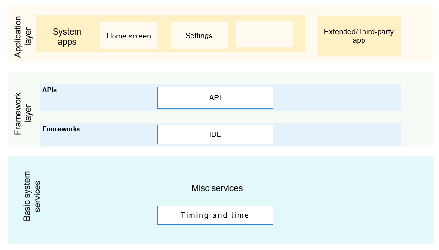

# Misc Services

## Introduction

The Misc services subsystem provides APIs for setting the system time.

**Figure 1**  Subsystem architecture


## Directory Structure

```
/base/miscservices
└── time                     # Time service module
```

## Repositories Involved

**Misc services subsystem**

[time_time_service](https://gitee.com/openharmony/time_time_service)
