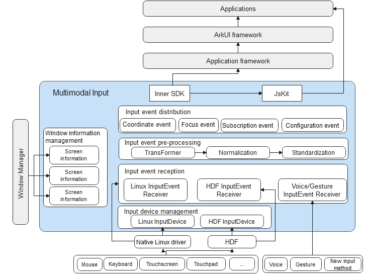

# Multimodal Input

## Description

OpenHarmony provides a Natural User Interface (NUI) for you to interact with your users. Unlike conventional categorization of input methods, OpenHarmony combines input methods of different dimensions into multimodal inputs, so you can easily arm your application with multi-dimensional, natural interaction features by using the application framework and system built-in UI components or APIs.

Specifically, the Multimodal Input subsystem receives input events from various input devices, such as the keyboard, mouse, touchscreen, and touchpad, via the Linux native driver and HDF driver. After that, it normalizes and standardizes the input events, and distributes the events to the Inner SDK. The Inner SDK distributes the events to the ArkUI framework, which then encapsulates the input events and passes them to applications. Alternatively, the Inner SDK can also directly distribute input events to applications through JsKit APIs.



## Contents

```
/foundation/multimodalinput/input
├── common                       # Common code
├── interfaces                   # External APIs
│   └── native                   # Native APIs
│       └── innerkits            # Native APIs provided for internal subsystems
├── service                      # Service framework code
├── sa_profile                   # Service startup configuration file
├── uinput                       # Input event injection module
```

## Usage

### Available APIs

Available APIs of the Multimodal Input subsystem are event injection ones, which are open only to system applications currently.

The **inputEventClient** class provides APIs for event injection.

**Table 1** Major APIs in inputEventClient

| Category|                      API                      |        Description       |
| :------: | :-----------------------------------------------: | :----------------: |
| Key injection| function injectEvent(keyEvent: KeyEvent): number; | Injects events.|

### How to Use

Currently, only the **BACK** key event can be injected.

When a system app needs to return to the previous directory, you can call the API to inject the **BACK** key event to Multimodal Input, which then transfers this event to the system app, thereby achieving the return effect. The example code is as follows:

```
// Import the required JavaScript API library.
import inputEventClient from '@ohos.multimodalInput.inputEventClient';

// Call the API for injecting events.
let keyEvent = {
    isPressed: true,        // Action type of the key event. true indicates that the key is being pressed down, and false indicates that the key is being released.
    keyCode: 2,             // Keycode for the key, for example, 2 for the BACK key.
    keyDownDuration: 0,     // Duration in which the current key is pressed down before it is released, in milliseconds.
    isIntercepted: false    // Whether to intercept key pressing events.
}
res = inputEventClient.injectEvent({KeyEvent: keyEvent});
```

> **NOTE**<br>New APIs must be downward compatible.

### Supported Devices

|    Device    | Touchscreen| Touchpad| Mouse| Keyboard|
| :---------: | :----: | :----: | :--: | :--: |
|   rk3568    |   Yes  |   Yes  |  Yes |  Yes |
| hi3516dv300 |   Yes  |   No  |  No |  No |

## Repositories Involved

**Multimodal Input Subsystem**

[multimodalinput_input](https://gitee.com/openharmony/multimodalinput_input)
