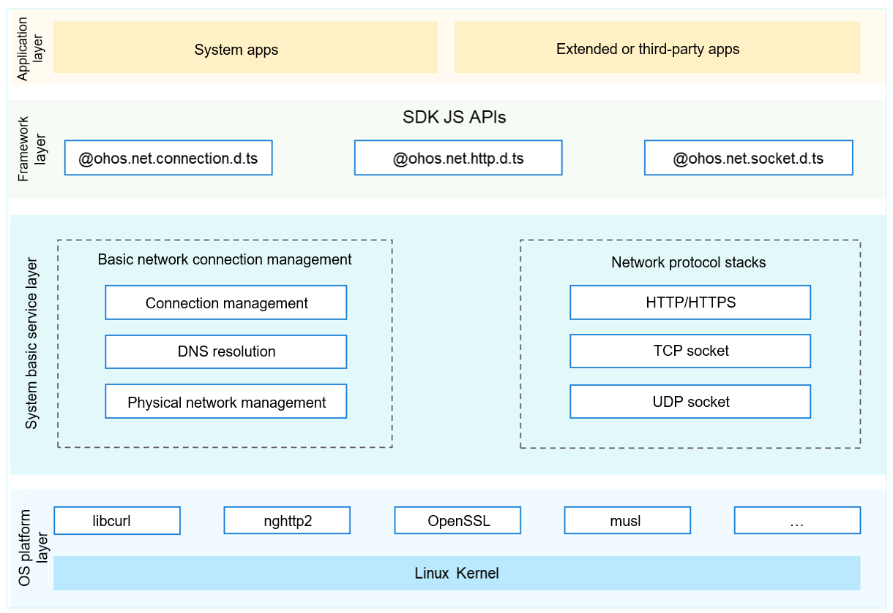

# Network Management


## Introduction

As a mandatory component for device networking, the network management subsystem implements unified connection management, traffic management, policy management, network sharing of different types of networks, and provides network protocol stack capabilities. An application can call APIs to obtain connection information of a data network, query and subscribe to connection status, network traffic data, and network policy, share the network, and transfer data using a network protocol stack.

The figure below shows the architecture of the network management subsystem. The network management subsystem consists of the following components:

-   Basic network management: provides basic network connection management and related JS and native APIs, including connection priority management, connection information query, connection status observation, DNS resolution, traffic management, networking policy management, and physical network management.
-   Extended network management: provides extended network management capabilities and related JS and native APIs, including Ethernet connection and hotspot sharing.
-   Network protocol stacks: provides basic network protocol stacks (such as HTTP, HTTPS, WebSocket, and TCP/UDP/TLS socket) and related JS APIs.

**Figure 1** Architecture of the network management subsystem



## Directory Structure

```
foundation/communication/
├── netmanager_base            # Basic network management
├── netmanager_ext             # Extended network management
└── netstack                   # Network protocol stacks
```

## Usage

### Observing Network Status Changes

1. Import the connection namespace from **@ohos.net.connection.d.ts**.

2. Call **createNetConnection()** to create a **NetConnection** object. You can specify the network type, capability, and timeout interval. If you do not specify parameters, the default values will be used. 

3. Call **conn.on()** to subscribe to the target event. You must pass in **type** and **callback**.

4. Call **conn.register()** to subscribe to network status changes of the specified network.

6. Call **conn.unregister()** to unsubscribe from the network status changes if required.

   ```
   // Import the connection namespace.
   import connection from '@ohos.net.connection'
   
   let netCap = {
       // Set the network type to cellular network.
       bearerTypes: [connection.NetBearType.BEARER_CELLULAR],
       // Set the network capability to Internet.
       networkCap: [connection.NetCap.NET_CAPABILITY_INTERNET],
   };
   let netSpec = {
       netCapabilities: netCap,
   };
   // Set the timeout interval to 10s.
   let timeout = 10 * 1000;
   // Create a NetConnection object.
   let conn = connection.createNetConnection(netSpec, timeout);
   // Subscribe to the netAvailable event. When the network is available, the callback will be invoked to report the event.
   conn.on('netAvailable', (data=> {
       console.log("net is available, netId is " + data.netId);
   }));
   // Register an observer for network status changes.
   conn.register((err, data) => {});
   // Unregister the observer for network status changes.
   conn.unregister((err, data) => {});
   ```

### Sharing a Network

1. Import the network sharing namespace from **@ohos.net.sharing**.

2. Set the network sharing type.

3. Start network sharing.

4. Stop network sharing.

```
// Import the network sharing namespace.
import sharing from '@ohos.net.sharing';
// Set the network sharing type.
this.sharingType = 0;   // The value 0 indicates Wi-Fi, 1 indicates USB, and 2 indicates Bluetooth.
// Start network sharing.
sharing.startSharing(this.sharingType,(err)=>{
    this.callBack(err);
})
// Stop network sharing.
sharing.stopSharing(this.sharingType,(err)=>{
    this.callBack(err);
})
```

### Initiating a Network Request

1. Import the HTTP namespace from **@ohos.net.http.d.ts**.

2. Call **createHttp()** to create an **HttpRequest** object.

3. Call **httpRequest.on()** to subscribe to an HTTP response header. This method returns a response earlier than the request. You can subscribe to HTTP response header events based on service requirements.

4. Call **httpRequest.request()** to initiate a network request. You need to pass in the URL and optional parameters of the HTTP request.

5. Parse the returned result based on service requirements.

6. Call **httpRequest.destroy()** to release resources after the request is processed.

```
// Import the HTTP namespace.
import http from '@ohos.net.http';

// Each httpRequest corresponds to an HttpRequestTask object and cannot be reused.
let httpRequest = http.createHttp();
// Subscribe to the HTTP response header, which is returned earlier than the response to httpRequest.
httpRequest.on('headersReceive', (data) => {
    console.info('header: ' + data.header);
});
httpRequest.request(
    // Set the URL for the httpRequest. You must specify the URL address, and set httpRequestOptions as required. You can specify the parameters for GET in extraData.
    "EXAMPLE_URL",
    {
        method: 'POST', // Optional. The default value is GET.
        // You can add header fields based on service requirements.
        header: {
            'Content-Type': 'application/json'
        },
        // This field is used to transfer data when the POST request is used.
        extraData: {
            "data": "data to send",
        },
        connectTimeout: 60000, // This parameter is optional. The default value is 60000, that is, 60s.
        readTimeout: 60000, // This parameter is optional. The default value is 60000, that is, 60s.
    },(err, data) => {
        if (!err) {
            // data.result carries the HTTP response. Parse the response based on service requirements.
            console.info('Result:' + data.result);
            console.info('code:' + data.responseCode);
            // data.header carries the HTTP response header. Parse the content based on service requirements.
            console.info('header:' + data.header);
            console.info('header:' + data.cookies);
        } else {
            console.info('error:' + err);
        }
        // Call destroy() to release resources after HttpRequest is complete.
        httpRequest.destroy();
    }
);
```

## Repositories Involved

**Network Management Subsystem**

[communication_netmanager_base](https://gitee.com/openharmony/communication_netmanager_base)

[communication_netmanager_ext](https://gitee.com/openharmony/communication_netmanager_ext)

[communication_netstack](https://gitee.com/openharmony/communication_netstack)