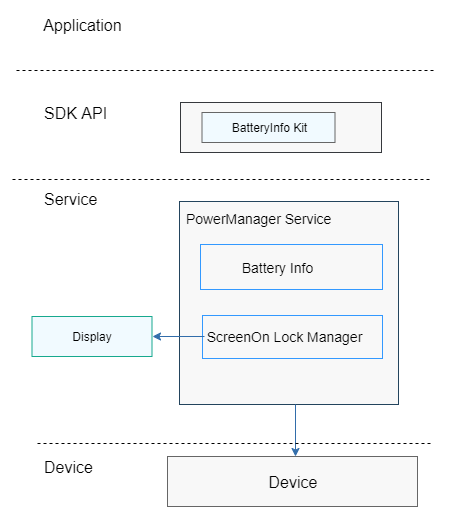

# Power Management<a name="EN-US_TOPIC_0000001083440980"></a>

-   [Introduction](#section11660541593)
-   [Directory Structure](#section19472752217)
-   [Repositories Involved](#section63151229062)

## Introduction<a name="section11660541593"></a>

The power management subsystem provides the following capabilities:

1.  Querying the battery level
2.  Keeping the device screen always on using a lock

**Figure  1**  power management subsystem architecture<a name="fig106301571239"></a>  




## Directory Structure<a name="section19472752217"></a>

```
base/powermgr/powermgr_lite
├── interfaces		    # APIs
│   └── kits
│       └── battery		# API for querying the battery level
└── services		    # Services
    ├── include
    └── source
```

## Repositories Involved<a name="section63151229062"></a>

[**powermgr_powermgr_lite**](https://gitee.com/openharmony/powermgr_powermgr_lite) 
