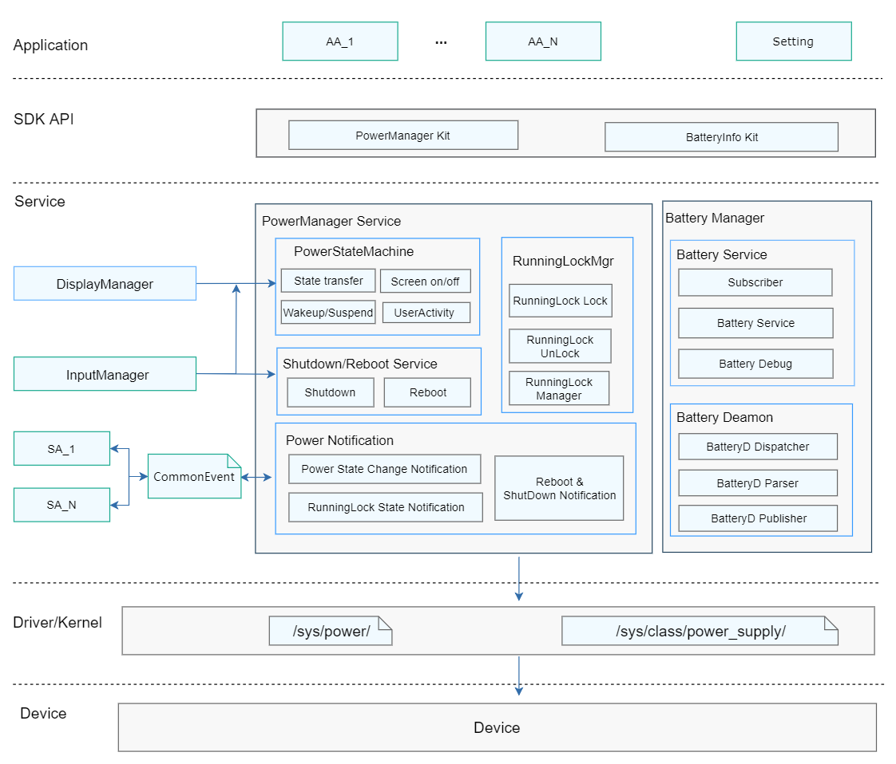

# Power Management<a name="EN-US_TOPIC_0000001121107655"></a>

## Introduction<a name="section11660541593"></a>

The power management subsystem provides the following functions:

1.  System restarting: restarts or shuts down the system.
2.  System power management: manages the system power status and running lock.
3.  Display-related power consumption adjustment: adjusts the backlight brightness based on the ambient light and turns off the screen based on the proximity light.
4.  Power saving: works in low power consumption mode without compromising main functions and performance.
5.  Battery management: supports charging and discharging, battery and charging status monitoring (including status updating and reporting), and charging upon power-off.
6.  Temperature control: restricts temperature rise through application, SoC, and peripheral control when the device temperature reaches the specified limit.
7.  Power consumption statistics: collects statistics on the power consumption of software, hardware, and a single application.
8.  Battery service for mini-, small-, and standard-system devices
9.  Power management service for mini-, small-, and standard-system devices

**Figure  1**  Power management subsystem architecture<a name="fig7607759319"></a>




## Directory Structure<a name="section19472752217"></a>

```
/base/powermgr
├── battery_lite			# Battery service for mini-, small-, and standard-system devices
├── battery_manager			# Battery service
├── battery_statistics		# Power consumption statistics service
├── display_manager			# Display energy efficiency management service
├── power_manager			# System power management service
├── powermgr_lite			# Power management service for mini-, small-, and standard-system devices
└── thermal_manager			# Temperature control and thermal management service
```

## Usage<a name="section19959125052315"></a>

As shown in the system architecture, the power management subsystem consists of seven modules. Some modules provide external APIs or public event notifications. You can use them based on your use cases. The functions of key modules are described as follows:

- Power Manager: provides APIs to request and release the running lock, enable the power saving mode, adjust the brightness, and restart or power off the device. It also provides public events for you to observe changes of the power saving mode and power-off status.
- Battery Manager: provides APIs to query battery information. It also provides public events for you to observer changes of the battery status and charging/discharging status.
- Thermal Manager: provides APIs to query the temperature rise status of a device. It also allows you to register callbacks and public events to listen for the temperature rise status of a device.
- Battery Statistics: provides power consumption statistics on hardware and software. It allows you to query the power consumption of hardware or applications.

## Repositories Involved<a name="section63151229062"></a>

**Power Management Subsystem**

[powermgr_power_manager](https://gitee.com/openharmony/powermgr_power_manager)

[powermgr_display_manager](https://gitee.com/openharmony/powermgr_display_manager)

[powermgr_battery_manager](https://gitee.com/openharmony/powermgr_battery_manager)

[powermgr_thermal_manager](https://gitee.com/openharmony/powermgr_thermal_manager)

[powermgr_battery_statistics](https://gitee.com/openharmony/powermgr_battery_statistics)

[powermgr_battery_lite](https://gitee.com/openharmony/powermgr_battery_lite)

[powermgr_powermgr_lite](https://gitee.com/openharmony/powermgr_powermgr_lite)
