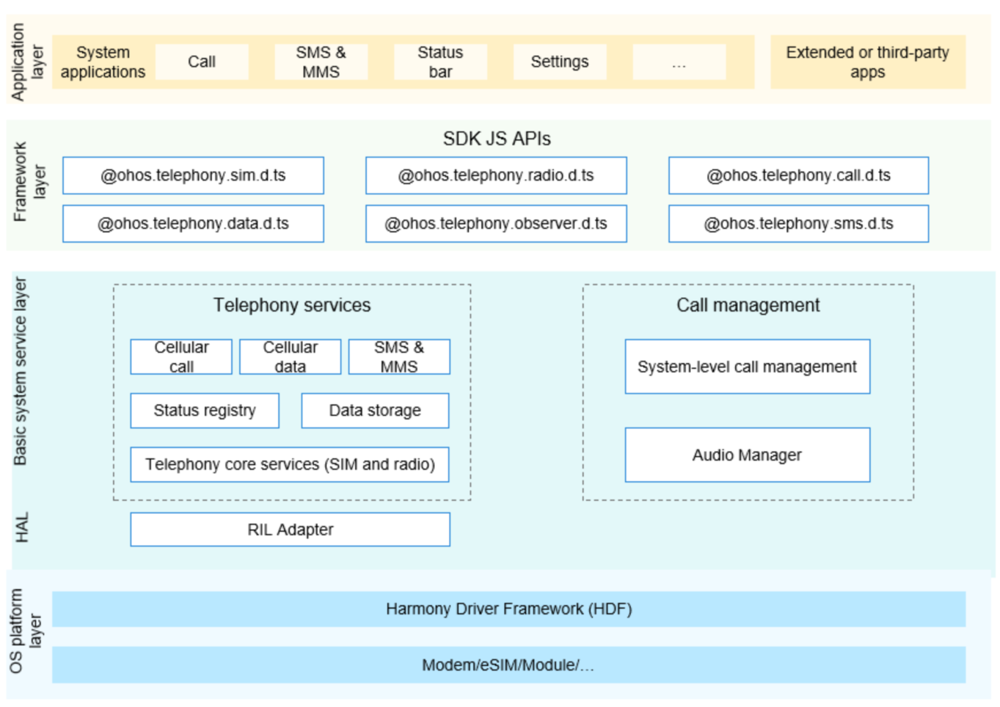

# Telephony <a name="EN-US_TOPIC_0000001162422291"></a>

-   [Introduction](#section104mcpsimp)
-   [Directory Structure](#section119mcpsimp)
-   [Constraints](#section123mcpsimp)
-   [Usage](#section128mcpsimp)
    -   [Obtaining the Current Cellular Network Signal Information](#section1458213210369)
    -   [Observing Changes to the Cellular Network Status](#section750135512369)

-   [Repositories Involved](#section152mcpsimp)

## Introduction<a name="section104mcpsimp"></a>

The Telephony subsystem provides APIs for obtaining information about the wireless cellular network and SIM card. Applications can call these APIs to obtain information such as the name of the currently registered network, network service status, signal strength, and SIM card information.

The Telephony subsystem consists of the following modules:

-   Telephony core service: initializes the Radio Interface Layer (RIL) Manager, SIM card module, and radio module.
-   Call Manager module: manages three types of calls – circuit switched \(CS\), IP multimedia subsystem \(IMS\), and over the top \(OTT\) calls. It is responsible for applying for the audio and video resources required for a call and resolving conflicts in a multi-channel call.
-   Cellular call module: implements basic calls over carrier networks.
-   Cellular data module: implements cellular data services over carrier networks.
-   SMS & MMS module: provides the capabilities of sending and receiving short message service \(SMS\) messages and encoding and decoding multimedia messaging service \(MMS\) messages.
-   State registry module: provides APIs to register and deregister an observer that listens for various callback events of the telephony subsystem. 
-   Data storage module: stores persistent data and provides **DataAbility** access APIs.
-   RIL Adapter module: implements adaptation of the modem communication interfaces.

**Figure 1** Architecture of the network management subsystem



## Directory Structure<a name="section119mcpsimp"></a>

```
base/telephony/
├── core_service            # Telephony core service
├── call_manager            # Call Manager module
├── cellular_call           # Cellular call module
├── cellular_data           # Cellular data module
├── sms_mms                 # SMS & MMS module
├── state_registry          # State registry module
├── data_storage            # Data storage module
└── ril_adapter             # RIL Adapter
```

## Constraints<a name="section123mcpsimp"></a>

1.  The open-source version currently provides the cellular call (CS call only), SMS & MMS, and cellular data services and supports the dual-SIM framework.
2.  The southbound HDI depends on the chip vendor. For details, see [Telephony Service Southbound Development Guide](../device-dev/subsystems/subsys-tel-overview.md).

## Usage<a name="section128mcpsimp"></a>

To learn more about the usage of each subsystem module, refer to the respective README. The following illustrates API usage by exemplifying how to obtain the current cellular network signal information and observe the cellular network status changes.

### Obtaining the Current Cellular Network Signal Information<a name="section1458213210369"></a>

1.  Import the **radio** namespace from **@ohos.telephony.radio.d.ts**.
2.  Call [getSignalInformation\(slotId: number\)](../application-dev/reference/apis-telephony-kit/js-apis-radio.md#radiogetsignalinformation7) in callback mode or call [getSignalInformation\(slotId: number\)](../application-dev/reference/apis-telephony-kit/js-apis-radio.md#radiogetsignalinformation7-1) in promise mode.
3.  Obtain the result from the **SignalInformation** array in the callback.
4.  Traverse the **SignalInformation** array to obtain the **signalLevel** (signal strength) for each **signalType** (radio access technology).

    ```
    // Import the http namespace.
    import radio from "@ohos.telephony.radio";
    
    // Set the value of slotId.
    let slotId = 0;
    
    // Call the API in callback mode.
    radio.getSignalInformation(slotId, (err, value) => {
      if (err) {
        // If the API call fails, err is not empty.
        console.error(`failed to getSignalInformation because ${err.message}`);
        return;
      }
      // If the API call is successful, err is empty.
      for (let i = 0; i < value.length; i++) {
        console.log(`success to getSignalInformation: type is ${value[i].signalType}, level is ${value[i].signalLevel}`);
      }
    });
    
    // Call the API in promise mode.
    let promise = radio.getSignalInformation(slotId);
    promise.then((value) => {
      // The API call is successful.
      for (let i = 0; i < value.length; i++) {
        console.log(`success to getSignalInformation: type is ${value[i].signalType}, level is ${value[i].signalLevel}`);
      }
    }).catch((err) => {
      // The API call fails.
      console.error(`failed to getSignalInformation because ${err.message}`);
    });
    ```


### Observing Cellular Network Status Changes<a name="section750135512369"></a>

**Adding an Observer**

1.  Import the **observer** namespace from **@ohos.telephony.observer.d.ts**.
2.  Call [on\(type:'networkStateChange'\)](../application-dev/reference/apis-telephony-kit/js-apis-observer.md#observeronnetworkstatechange-1) with **slotId** (optional) and **callback** specified.
3.  Register an **observer** instance for callback events of network status changes.

    ```
    // Import the http namespace.
    import observer from '@ohos.telephony.observer';
    
    // Registers an observer.
    observer.on('networkStateChange', {slotId: 0}, (value) => {
      console.log(`network state is ` + value);
    });
    ```


**Removing the Observer**

1.  Import the **observer** namespace from **@ohos.telephony.observer.d.ts**.
2.  Call [off\(type: 'networkStateChange'\)](../application-dev/reference/apis-telephony-kit/js-apis-observer.md#observeroffnetworkstatechange) with **callback** (optional) specified for a certain type of event.

    ```
    // Import the http namespace.
    import observer from '@ohos.telephony.observer';
    
    // Unregister the observer.
    observer.off('networkStateChange');
    ```


## Repositories Involved<a name="section152mcpsimp"></a>

**Telephony**

[telephony\_core\_service](https://gitee.com/openharmony/telephony_core_service/blob/master/README.md)

[telephony\_call\_manager](https://gitee.com/openharmony/telephony_call_manager/blob/master/README.md)

[telephony\_cellular\_call](https://gitee.com/openharmony/telephony_cellular_call/blob/master/README.md)

[telephony\_cellular\_data](https://gitee.com/openharmony/telephony_cellular_data/blob/master/README.md)

[telephony\_sms\_mms](https://gitee.com/openharmony/telephony_sms_mms/blob/master/README.md)

[telephony\_state\_registry](https://gitee.com/openharmony/telephony_state_registry/blob/master/README.md)

[telephony\_data\_storage](https://gitee.com/openharmony/telephony_data_storage/blob/master/README.md)

[telephony\_ril\_adapter](https://gitee.com/openharmony/telephony_ril_adapter/blob/master/README.md)
